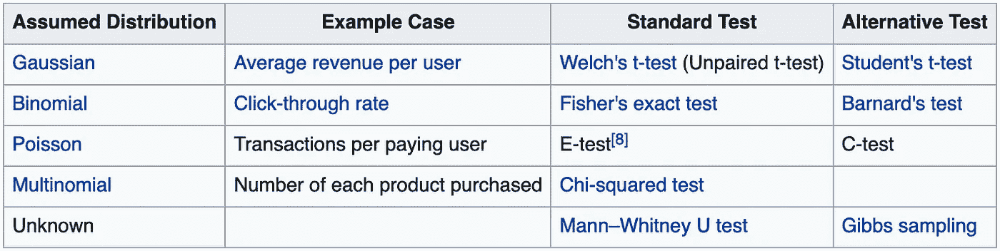
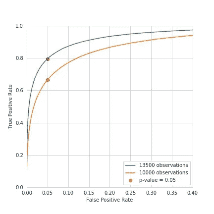
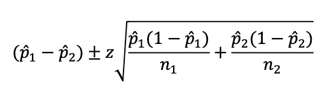
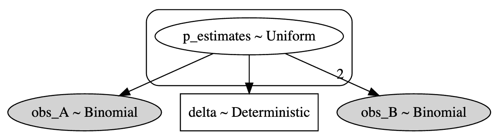
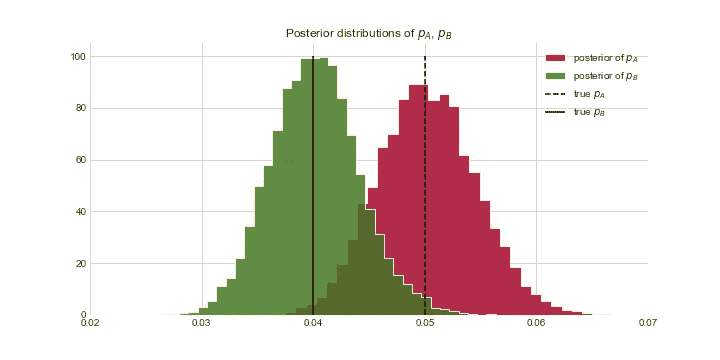
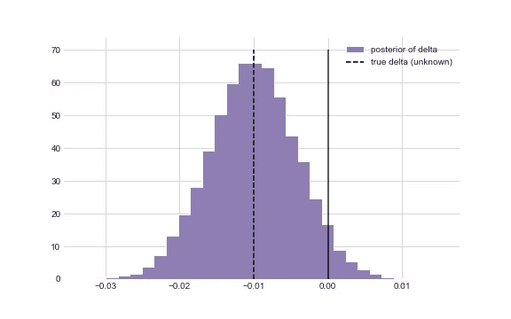
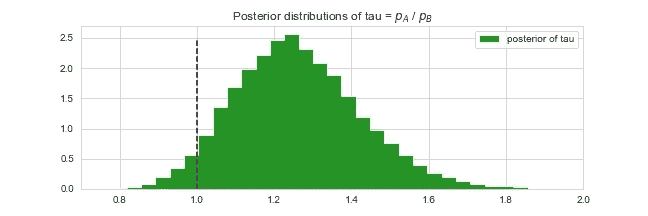

# 为什么你应该在你的离线 A/B 测试中使用贝叶斯方法

> 原文：<https://towardsdatascience.com/from-frequentism-to-bayesianism-going-deeper-part-2-offline-a-b-test-d3324f7a39bb?source=collection_archive---------15----------------------->

## [从频率主义到贝叶斯主义](https://towardsdatascience.com/tagged/frequentist-to-bayesian)

## 在假设检验方面，贝叶斯方法可以取代经典的统计方法。这里将使用非常具体的 web 分析案例来说明我们的演示。


由 [Carlos Muza](https://unsplash.com/@kmuza?utm_source=medium&utm_medium=referral) 在 [Unsplash](https://unsplash.com?utm_source=medium&utm_medium=referral) 上拍摄的照片

第一次介绍贝叶斯方法在经典统计学中的重要性可以在[这里](/from-frequentism-to-bayesianism-hypothesis-testing-a-simple-illustration-11213232e551)找到，还有一个更高级的应用[那里](/bayesian-hierarchical-modeling-or-more-reasons-why-automl-cannot-replace-data-scientists-yet-d01e7d571d3d)！

假设检验是统计学中的一个中心话题，它的应用范围很广，超出了数学的界限，扩展到了大多数科学领域。

**我们将强调常规统计频率方法的局限性，并提出一个相关的贝叶斯框架**来解决在零售或营销领域工作的数据科学家可能遇到的最常见的情况之一: **A/B 测试**。

# 问题陈述

> **A/B 测试**(也称为**桶测试**或**分批次测试**)是一个[随机实验](https://en.wikipedia.org/wiki/Randomized_experiment)，有两个变量，A 和 B。这是一种比较单个变量两个版本的方法，通常是通过测试受试者对变量 A 和变量 B 的反应，并确定两个变量中哪个更有效。[维基百科]

也许我们想测试我们网站的新设计、新功能，甚至是针对我们客户的新策略(邮件、RTB 等)。)，以衡量哪一个会带来最高的投资回报率。为了清楚起见，我们将考虑一个**广告商试图使用两个创意 A 和 B 中的一个来提高转换率**的情况:广告与用户的每次互动都可以被视为一个**伯努利试验**，正好有两种可能的结果，“转换”和“不转换”，这取决于用户是否在看到广告后购买了我们的产品。

可以考虑两种设计来进行该实验:

*   **离线**:实验运行，结束后才进行分析和决策。(这个故事中我们只考虑这个设计)
*   **在线**:分析和决策是在实验过程中做出的。

对于这个故事，只有离线的情况将被处理，因为在线的 A/B 测试问题需要完全不同的解决方案。

# 频率主义方法:p 值和 ROC 曲线

我们考虑为弱者运行测试的情况，向每个用户展示概率为 0.5 的创造性 A 或 B，并直接转换为未知概率 *p_A=0.04* 或 *p_B=0.05。*

第一个困难很快就出现了:**为了确定一个创意是否明显优于另一个创意，我们应该使用什么测试？下表总结了常见的测试，由我们选择最适合我们问题的测试。**



来源:[维基百科](https://en.wikipedia.org/wiki/A/B_testing)

在我们的案例中， [Fisher 精确检验](https://en.wikipedia.org/wiki/Fisher%27s_exact_test)和 [Barnard 检验](https://en.wikipedia.org/wiki/Barnard%27s_test)似乎是最相关的，因为我们关注的是从二项式分布中获得的转换率，尽管考虑到我们将在实验中获得的观察值数量，卡方检验也可以使用。

我们将使用 Fisher 检验，它具有属于精确检验类的特征，之所以这样叫是因为它的 **p 值可以精确计算**，用

*   H0:创意表现相当(p_A = p_B)
*   H1:一个创意比另一个表现得更好

良好实践希望我们确定测试的统计功效。它可以通过模拟来计算，给出我们的环境是如何具体设计的。我们的目标是 0.8，为了达到这个阈值，我们将校准我们将使用的观测值。为方便起见，我们将只考虑一个替代假设”(H1)“替代假设 *p_A=0.04* 或 *p_B=0.05* ”，这将使我们很容易计算出我们的检验的功效。



测试 13500 和 10000 次观察的 ROC 曲线

通常α= 0.05 是 p 值拒绝区域可接受的极限，换句话说，就是假阳性率。对于这个阈值，将需要至少 13500 次观察的平均值。

## 解释测试的结果

我们面临着和我们在这里[做的](/from-frequentism-to-bayesianism-hypothesis-testing-a-simple-illustration-11213232e551)相似的情况，问我们自己相似的问题。从我们的测试结果和 p 值中我们可以得出什么结论？

1.  我们有办法估计创意 A 优于创意 B 的概率吗？
2.  如果是这样，我们能估计它们之间的改进吗？

我不会再让你担心了。**这两个问题的答案都是否定的**。我们已经知道 p 值仅仅是在假设(H0)下观察结果的一种概率，至少是极端的。但这也凸显了 p 值最重要的局限性:

**p 值不是效应大小的量度！它没有给我们任何关于创造性的 A 比 B 表现好多少的信息，即使是在正面结果的情况下！**

为了提取关于效应大小的知识，常客可以使用另一个更强大的工具:置信区间。

# 置信区间。

> 置信区间表示未知参数的似是而非的值的范围，与真实参数在建议范围内的置信水平相关。

正因为如此，竞争情报给了我们更容易理解和丰富的洞察力，为我们提供了关于我们估计的概率和不确定性的知识。然而它们也有自己的缺点:

1.  我们需要选择不同的方法来定义这些区间，这取决于许多假设:[二项分布的置信区间](https://en.wikipedia.org/wiki/Binomial_proportion_confidence_interval#Normal_approximation_interval)。
2.  **p_A 和 p_B 值的置信区间不能直接转化为 p _ A 和 p_B 之间差值的置信区间！幸运的是，存在直接计算差值置信区间的方法，然而，我们需要从几十种方法中选择一种。**

例如，我们可以使用“最简单的”，即没有连续性校正的 **Wald 方法:**



**无连续性修正的沃尔德方法**

用𝑝̂对 *p_A* et *p_B* 的经验估计，z 对应于正态分布的α/2 百分位。因此，对于 95%的置信区间(即α=0.05)，相应的 z 值为 1.96。

数值应用将给出区间[0.0009；0.0171]以 0.009 为中心，没有像我们希望的那样与 0 重叠！

# 贝叶斯方法:简单之美

对于这一部分，我们将使用 python 的 PyMC3 库，这使我们可以轻松地构建贝叶斯非参数模型。

重要的是要记住，作为统计学家或数据科学家，我们的目标显然是构思准确和相关的结果，但同样重要的是，要生成可以被任何其他利益相关方(甚至是非科学家的利益相关方)共享和理解的 KPI，并且包含尽可能多的信息。贝叶斯方法给了我们这样做的工具，它允许我们精确地计算我们正在寻找的东西:**P _ A 和 p_B** 的后验分布，即 P(p_A|X)和 P(p_B|X)以及 P(p_A — p_B > 0| X)，即。**创意 A 比创意 b 产生更多转化的概率。**

这里，贝叶斯建模再次变得非常简单，因为我们已经用数学方法设计了环境，我们只需要用贝叶斯语言复制它。

先验选择的问题不可避免地出现了。我们将为 p_A 和 p_B 选择无信息的制服先验。

我们还可以计算贝叶斯网络的图形表示:



贝叶斯网络

就这么简单，我们的工作结束了！我们剩下的工作就是**通过网络运行 MCMC 算法来计算后验分布。**这些将给予我们比以前的方法更多的洞察力，因为现在我们可以通过从后验样本直接得到任何α水平的置信区间。



MCMC 抽样估计的 p_A，p_B 和 delta = p_A — p_B 的后验分布

*(重要的是要注意，δ不能从 p_A 和 p_B 的后半部分计算，因为 p_A 和 p_B 可能是相关的)*

## 结果

然后，我们可以简单地计算δ小于 0 的后验概率:

```
np.mean(delta_samples<0)
```

这里我们得到 0.956，这相当于创意 A 比创意 B 有 96%的可能性产生更多的转化！

但是我们可以更进一步。设想从设计 B 转移到设计 A 是昂贵，且已经确定只有至少 5%的性能改进才是有利可图的。我们有办法计算这个！只需在我们的网络中插入一个新的确定性变量 *Tau = p_A / p_B* 并对后验分布进行采样。

```
tau = pm.Deterministic(“tau”, p_estimates[0] / p_estimates[1])
```



从 MCMC 抽样估计的τ的后验分布

```
np.mean(tau_samples>1.05)
```

这次我们得到 0.91……不像我们通常希望的 95%那样具有决定性。如果我们需要更多的信心，我们只需要运行 A/B 测试更长时间。

# 结论

*   贝叶斯框架为 A/B 测试的经典方法提供了一个易于执行的**和易于阅读的**替代方案**，并允许我们通过简单地计算后验分布来测试任何假设**。
*   贝叶斯方法使我们能够在 A/B 测试的情况下实现更有效的**离线决策**，以及更有效的**在线决策**，这将在另一个故事中展示。

## 评论

对于 frequentist 方法，我们必须选择一个特定的测试和一个特定的方法来计算我们的置信区间，其他测试和区间计算会给出不同的值；就像不同的先验会给我们不同的后验一样。

# 更进一步

贝叶斯网络的应用很多，A/B 测试只是冰山一角。当它被证明是一个非常强大的工具时，它可以用于建模和机器学习，正如你可以在文章中读到的:

[](/bayesian-hierarchical-modeling-or-more-reasons-why-automl-cannot-replace-data-scientists-yet-d01e7d571d3d) [## 贝叶斯分层建模(或者“autoML 还不能取代数据科学家的更多原因”)

### 贝叶斯网络允许我们对协变量之间的实际关系进行建模，弥补所提供信息的不足…

towardsdatascience.com](/bayesian-hierarchical-modeling-or-more-reasons-why-automl-cannot-replace-data-scientists-yet-d01e7d571d3d) 

# 参考

*   卡梅隆.戴维森-皮隆。(2015)黑客的贝叶斯方法:概率编程和贝叶斯推理