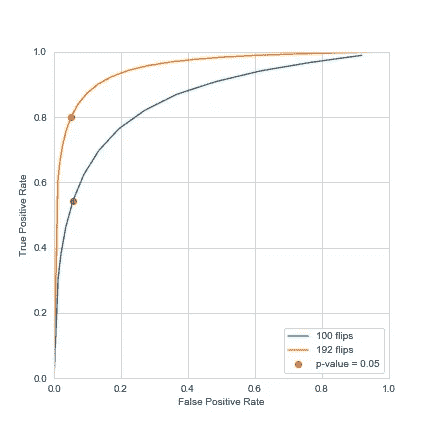
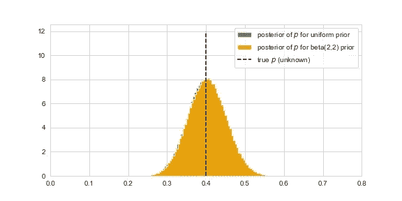
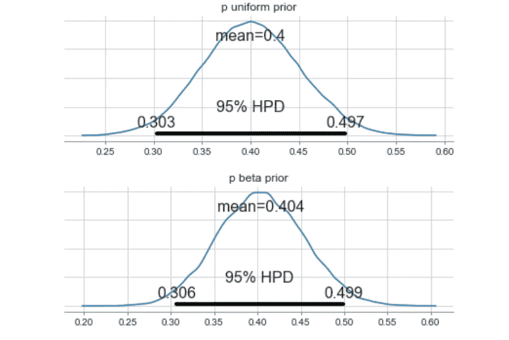

# 假设检验，贝叶斯框架优越性的简单说明

> 原文：<https://towardsdatascience.com/from-frequentism-to-bayesianism-hypothesis-testing-a-simple-illustration-11213232e551?source=collection_archive---------17----------------------->

## [从频率主义到贝叶斯主义](https://towardsdatascience.com/tagged/frequentist-to-bayesian)

## 当谈到假设检验时，贝叶斯方法可以取代经典的统计方法，我们将通过一个简单的例子来说明:不公平硬币。


由[维吉尔·卡亚萨](https://unsplash.com/@virgilcayasa?utm_source=medium&utm_medium=referral)在 [Unsplash](https://unsplash.com?utm_source=medium&utm_medium=referral) 上拍摄的照片

通常假设检验并不是我们谈论**贝叶斯主义**时首先想到的话题。目前的趋势确实是更多地将这种方法纳入机器学习模型，而不是审查老式的统计数据。

然而，越来越多的研究揭示了许多研究论文的失败程度，这些失败可以归因于对“初级”统计方法的误解/误用。鉴于这种现象的程度，很明显，这并不是科学家个人在这方面缺乏认真的结果，而是一种已经持续了相当长时间的全球系统性异常现象。鉴于此，似乎应该考虑更直观、更易于解释的方法。

**对什么是 p 值的误解是这种情况的根源，或者至少最能体现这一现实。**如今，当谈到机器学习时，大多数数据科学家都受过良好的教育，甚至连最基本的统计概念都受到了损害；假设检验就是其中之一。

我们现在将探索一个统计学家可能必须运行的最简单的测试之一，并从那里了解如何建立一个贝叶斯方法，它允许一个简单而直接的结论。

# 问题陈述

我们将考虑一个最简单的实验，为了不忽略我们想要用不必要的卷积来证明的观点:**抛硬币。**问题是这样定义的:

*   一枚硬币可以被翻转有限的次数。
*   我们的目标是找出这枚硬币是否公平。换句话说，我们想知道我们的假设(H0)“硬币是公平的”有多大可能是假的。

很简单，对吧？

# 实验设计:p 值和 ROC 曲线

实验的设计应该考虑到将用来回答我们问题的统计方法。学生 t 检验似乎是我们假设检验的一个明显的选择。我们将样本的平均值与数值 0.5 进行比较。

良好实践希望我们在设计研究时计算**统计功效**,以便估计适当的样本量，或者至少告诉我们样本量已经固定时研究的局限性(通常要求功效至少为 0.8)

> 二元[假设检验](https://en.wikipedia.org/wiki/Hypothesis_test)的**功效**是当特定的[替代假设](https://en.wikipedia.org/wiki/Alternative_hypothesis) (H1)为真时，检验拒绝[零假设](https://en.wikipedia.org/wiki/Null_hypothesis) (H0)的概率。

换句话说，测试的能力是当硬币实际上不公平时，在指定阈值下获得 p 值的概率。

为了方便起见，我们将只考虑另一个假设(H1)“硬币遵循参数 p = 0.4 的伯努利定律”，这将允许我们轻松地计算我们的测试的功效。



100°和 192°翻转的 ROC 曲线

看一下这个测试的 ROC 曲线将有助于我们理解发生了什么。对于给定的显著性水平α，我们可以通过分析或模拟得出真阳性率和假阳性率；或者换句话说，测试的统计功效和显著性水平本身。

通常α= 0.05 是可接受的极限，对于这个阈值，最少需要翻转 192 次才能达到我们的目标(因为当一个人想到娱乐活动时，翻转硬币不是第一个想到的事情，我们将限制自己翻转硬币 192 次！).

# 解释测试的结果

我们的问题来了。假设我们发现硬币是不公平的，p 值= 0.01，我们现在可以得出什么结论？

*   零假设为真的可能性有 1%吗？
*   我们 99%确定我们的硬币不公平吗？

这些都不是你可能已经得出的结论。事实上，在这一点上，没有办法给出我们的硬币不公平的概率…相当烦人，特别是考虑到我们最初的问题:我们的硬币有多大可能不公平？我们能得出的唯一结论是，如果硬币是公平的，我们只有 0.01 的概率观察到如此极端的结果。

事实上**贝叶斯定理**给了我们计算这个值的方法，但是我们需要更多的信息:**先验**。H0 =“硬币不公平”，H1=“硬币公平”，S =“测试成功，p 值< 0.05”，我们有:

> P(H0 | S)= P(H0)* P(H0)/(P(H0)* P(H0)+P(H1)* P(H1))

最初假设我们的硬币更可能是公平的，我们设置 *P(H1) = 0.9* 和 *P(H0) = 0.1。*于是我们有了

> p(H0 | S)= 0.8 * 0.1/(0.8 * 0.1+0.05 * 0.9)
> 
> P(H0 | S) = 0.64

所以即使我们的测试呈阳性，我们的硬币也只有 64%的机会不公平。与我们希望的 95%相差甚远…然而这个概率比简单的 p 值包含了更多的见解，幸运的是我们可以走得更远。这仅仅是进入贝叶斯世界的第一步，正如我们现在将要看到的，还有更多需要展开来改进我们的测试！

# 贝叶斯方法

*对于这一部分，我们将使用 python 的 PyMC3 库，这允许我们轻松地构建贝叶斯非参数模型。*

我们对一个不公平硬币(p = 0.4)的抽样建模，并计算得到的后验分布。虽然使用了非平凡的**马尔可夫链蒙特卡罗** ( **MCMC** ) **算法**，但其背后的思想仅仅是贝叶斯定理的应用。

既然我们已经理解了如何用贝叶斯术语来转置我们的常规假设检验，我们可以调整先验分布来反映我们对系统初始状态的真实信念:以 0.5 为中心的 beta 分布将强调这样一个事实，即我们认为如果硬币有偏差，它一定不会像 0 或 1 那样极端。

```
import pymc3 as pm
N = 192 #Sampling sizewith pm.Model() as model:
    p = pm.Uniform("p", 0, 1)
    observations = pm.Binomial("observations", N, 0.4)
    obs = pm.Binomial("obs", N, p, observed=observations)
    step = pm.Metropolis()
    start = pm.find_MAP()
    trace = pm.sample(100000, step=step, start=start)
    burned_trace=trace[1000:]

p_samples = burned_trace["p"]
```

*   我们也可以像许多贝叶斯主义者建议的那样，提供非信息性的前科。例如，我们可以假设 p 在[0；1].

```
p = pm.distributions.continuous.Beta("p", 2, 2)
```

在每种情况下，我们可以直接计算 p < 0.5 from the posterior distributions.



Posteriors densities after 192 flips

```
print(np.mean(p_samples<0.5))
```

We get respectively 0.98 and 0.97 with the uniform prior and the beta(2,2) prior, informing us of the degree of confidence we have that the coin we observe is actually fair or not.

## Going further

In his paper **贝叶斯估计取代 t 检验(最佳)的概率，** John Kruschke 建议查看他所谓的**最高密度区间**，它由包含 95%后验密度的最小区间组成，以便定义我们的检验标准。



192 次翻转后的最高密度区间

例如，在我们的例子中，我们想知道这些区间是否与我们针对 0.5 测试的值重叠，并且如果 0.5 不包括在这些区间中，则得出结论(H0)被拒绝。

用密度进行推理使我们能够利用我们所能接触到的所有信息。更好的是，它允许我们从数据中捕捉所有的细微差别，并得出明确的结论。

鉴于我们必须选择一个先验，有人可能会认为我们的分析是有偏见的。我不会在这里讨论频繁主义和贝叶斯主义之间的范式差异，而是简单地回忆一下，不选择先验往往等同于隐含地选择一个。

# 结论

*   贝叶斯框架提供了一个易于执行的**和易于阅读的**来替代经典的统计测试。
*   **后验密度**为我们提供了更便于理解和使用的数学概念，而 p 值等概念已经被无数次地证明具有误导性。
*   最终，**贝叶斯网络**的概念允许我们**设想更复杂的实验，并通过简单地考虑后验分布来测试任何假设**，就像我们观察 [**A/B 测试**](https://medium.com/@alain.tanguy/from-frequentism-to-bayesianism-going-deeper-part-2-offline-a-b-test-d3324f7a39bb) **的情况一样。**

# 参考

1.  T.V. Pereira 和 J.P.A. Ioannidis。"统计上有意义的临床试验荟萃分析可信度不高，效果夸大."*临床流行病学杂志* 64，第 10 期(2011):1060-1069。DOI:*10.1016/j . jclinepi . 2010 . 12 . 012*。
2.  约翰·克鲁施克。(2012)贝叶斯估计取代了 t 检验。*实验心理学杂志*综述。