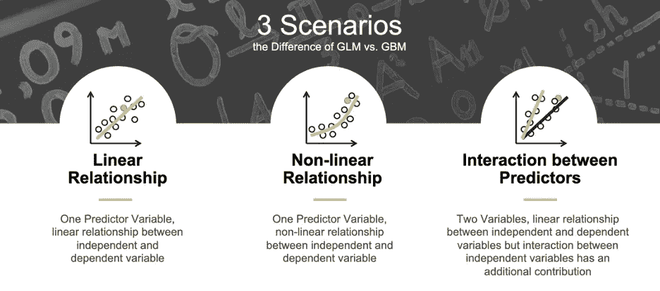
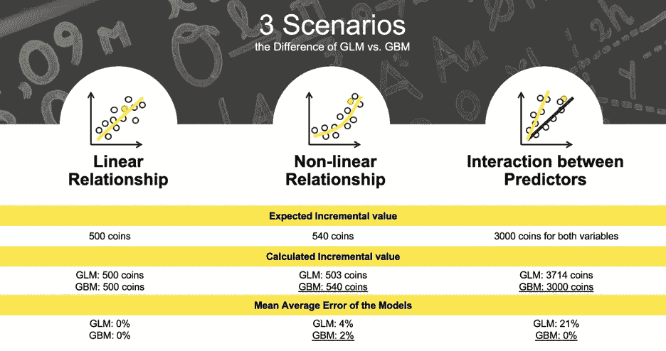

# 从 GLM 到 GBM

> 原文：<https://towardsdatascience.com/from-glm-to-gbm-5ff7dbdd7e2f?source=collection_archive---------38----------------------->

## *诺贝尔经济学奖如何给保险和贷款带来革命*

作者:迈克尔·普罗克什博士；帕特里克·霍尔

**简介**

保险和信贷借贷是高度监管的行业，几十年来一直严重依赖数学建模。为了给他们的模型提供可解释的结果，这两个行业的数据科学家和统计学家都非常依赖**广义线性模型(GLMs)** 。然而，这篇文章认为现在是时候过渡到更现代的方法了。具体来说，我们致力于使用一种新型的机器学习(ML)模型，梯度推进机器(GBM)的过渡。GBM 不仅是更复杂的风险评估工具，而且由于被称为 Shapley values **、**的诺贝尔奖得主突破，它们现在看起来和传统 glm 一样可以解释。对保单和信贷发行人来说，更细致的风险评估意味着更少的支出和冲销，但也意味着更广泛的客户群体可以参与主流保险和信贷市场。Shapley values 提供的**高级可解释性使您能够向客户、业务合作伙伴、模型验证团队和监管机构解释模型预测。简而言之，所有这些意味着更少的损失、更多的客户和管理法规要求！你感兴趣吗？向下滚动以了解更多信息。**

**GLMs:满足监管要求和业务需求**

在美国，许多联邦和州法规管理预测模型在保险和金融服务中的使用。例如，去年纽约金融服务部向人寿保险公司发出了一封指导函[以解决“非常规来源或类型的外部数据……包括算法和预测模型中的数据”的使用问题，声明保单定价必须**排除“种族、肤色、信仰、国籍、家庭暴力受害者身份、过去的合法旅行或任何形式的性取向，或任何其他受保护的类别”** **以避免歧视**。当然，人工智能监管不仅仅是美国现象，而是一个国际现象。至少加拿大、德国、荷兰、新加坡、英国和美国的政府已经提出或颁布了针对人工智能的法规。一般来说，这些现有的和提议的法规旨在确保预测建模过程**准确、受监控、无歧视、稳定、安全和透明**。](https://www.dfs.ny.gov/industry_guidance/circular_letters/cl2019_01)

众所周知，glm 是高度稳定和透明的模型。在大型保险和金融机构的“回归艺术家”手中，它们也可以非常准确。各机构花费了数年时间来优化 GLM 方法，并围绕 GLMs 建立文档、区分测试、监控和验证流程。因此，由于数学和面向过程的综合原因，GLMs 至今仍被广泛使用。然而，新的方法可以提供更准确、更灵活、更透明的方式来创建更高级的预测模型。

**Shapley values 和 GBM 相对于 GLM 的优势**

GLMs 已被证明对保险业和银行业具有**的巨大价值**。然而，**新算法在准确性甚至可解释性方面胜过线性模型。特别是，GBM 可以解决预测器和因变量之间的**非线性**以及预测器变量之间的**交互**，而无需大量手动调整。这就是为什么 GBM 通常比 glm 在样本外预测中显示出更高的准确性，从而导致重大的业务影响。(这将在这篇博文的第二部分演示。)**

GBM 的解释可以基于几种技术，如累积局部效应(ALE)图、个体条件期望(ICE)图、部分相关图、替代模型、变量重要性以及最近的 Shapley 值。**沙普利价值观以二战中的数学家、经济学家、密码破译者** [**劳埃德·沙普利**](https://en.wikipedia.org/wiki/Lloyd_Shapley)**【1923–2016】**命名。沙普利在 1953 年介绍了他的方法，并在 2012 年因其发明获得了诺贝尔经济学奖。

从 20 世纪 60 年代开始，Lloyd Shapley 使用合作博弈理论来研究不同的匹配方法。在一个**合作博弈**中，其中**收益必须归于做出不平等贡献的玩家**，而**沙普利值决定了收益的最公平分配**。例如，Shapley 值可用于确定当每个人分享他们的食物时，一个组中的每个成员在餐馆应该支付的费用。Shapley 值的理论基于四个公理原则，效率、对称性、对称性和可加性，这使得这种方法与其他解释技术相比是独一无二的——甚至是我们心爱的回归系数！此外，[研究](https://arxiv.org/pdf/1802.03888.pdf)表明，与其他解释相比，**与人类解释**有更强的重叠。

**GBM 与 GLM 的区别:情景分析**

信任一项新技术的第一步是，对比你习惯做的事情，看看它是如何工作的。博客这一部分的其余部分将针对 GBMs 和 Shapley 值与 GLMs 进行比较。沙普利值和 GLM 增量值计算之间最重要的区别之一是它们有不同的基线:

● **GBM 和 Shapley 值基线:**当所有输入变量的**贡献**等于 0 时，模型预测的**平均值。**

● **GLM 基线:**当所有输入变量的**值**等于 0 时，数据中已知结果的**平均值。**

因此，当预测变量的值等于 0 时，线性模型的基线(或截距)是平均预期结果，当 Shapley 值仅评估一个变量的影响时，它们总是包括所有的观察值和变量！这看起来不是更现实吗？现实世界中的什么事件是以完全独立的方式发生的？

让我们看一个[更详细的例子](https://github.com/h2oai/mli-resources/blob/master/shap_gbm_vs_glm/Impact_Experiment_GLM_SHAPLEY-GBM.ipynb)来看看一些更基本的区别。在汽车保险方面，当投保人不在夜间开车时，只有 20%的司机不开车，他们发生事故的可能性较低。在一个简单的示例建模场景中，Shapley 值显示了与普通驾驶员相比，该客户节省的成本。相比之下，GLMs 使用非驱动因素作为基线，并将额外的风险支付值添加到该基线。知道了差异，就可以对两种情况下的增量值进行精确的比较和计算。为了显示 GBMs 和 GLMs 在准确性和解释能力方面的更多差异，我们想在汽车保险示例的上下文中引入三个场景:线性场景、非线性场景、案例和交互场景(参见图 1)。

**图 1:** 展示 GBM 和 GLM 区别的三个场景。

假设数据集包含每个场景的 50 个观察值。在所有三个场景中，没有这个特征的支付，比如说在晚上开车，是 50 个硬币(见图 2)。在**线性关系场景中，** 10 个成员都是夜间司机，他们每个人都有额外损失 50 个硬币的风险。结果显示，两个模型都是 100%准确的，总共属性 500 个硬币(所有 10 个成员)。在线性情况下，两个模型都是准确的，并且将正确的硬币数量归因于特征。**第二种情况包括预测值和因变量之间的非线性关系**。我们现在也观察一个人晚上开车的频率。如果你一周只开一次车，你就造成了额外 50 个硬币(8 个顾客)的损失风险。如果每周开车两次或两次以上，就是 70 个币(2 个客户)。最终归属的硬币应该加起来是 540。然而，只有 GBM 显示 540 作为结果，误差为 2%，而 GLM 显示 4%的预测误差和 503 归因硬币作为结果。**最后一种情况包括变量夜间驾驶和大于 1 小时的通勤时间的相互作用**。每个变量都增加了 50 个硬币作为可能的损失，但加起来就是 200 个。结果应该是 3000 个硬币，但只有 GBM 显示正确的归属，预测误差为 0%。

**图 2:** 三个示例场景的 GBM 与 GLM 结果。

虽然我们只显示了不同预测变量的结果归因的总和，但通过 Shapley 值得出的每个客户的归因也可能比 GBM 与 GLM 的结果更准确。每个客户的属性将在第二部分进一步讨论。

**总结**

在这篇博文中，我们展示了 GLM 模型和 GBMs 模型都具有很高的准确性，能够在不太现实、线性和独立的情况下提供有效的解释和归因。一旦我们更深入地研究更复杂的情况，**GBM 在预测非线性和相互作用关系方面更加准确，并且它们还为每个变量的增量影响提供准确的结果**。这篇博文的第二部分将更深入地比较一个更现实的信用卡违约例子的不同模型和结果。与此同时，如果你想自己比较 GLMs、GBMs 和 Shapley 值，你可以免费检查并开源 [H2O-3](https://docs.h2o.ai/h2o/latest-stable/h2o-docs/downloading.html) (或 [XGBoost](https://github.com/dmlc/xgboost) ，或 [shap](https://github.com/slundberg/shap) ，或[尝试 H2O 无人驾驶 AI](https://www.h2o.ai/products/h2o-driverless-ai/) 。