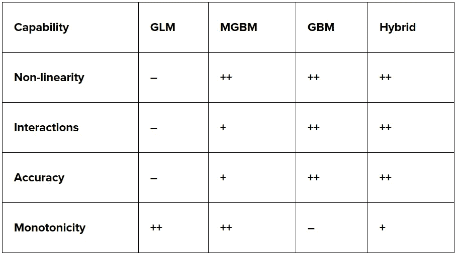
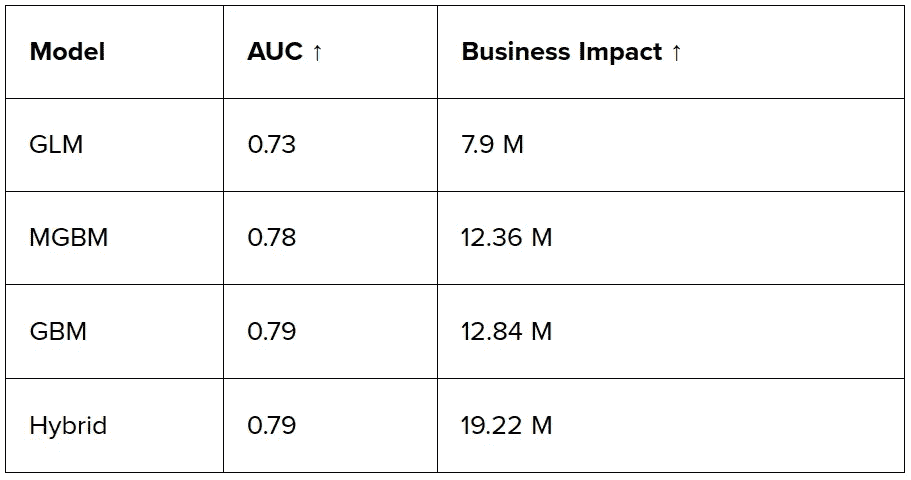
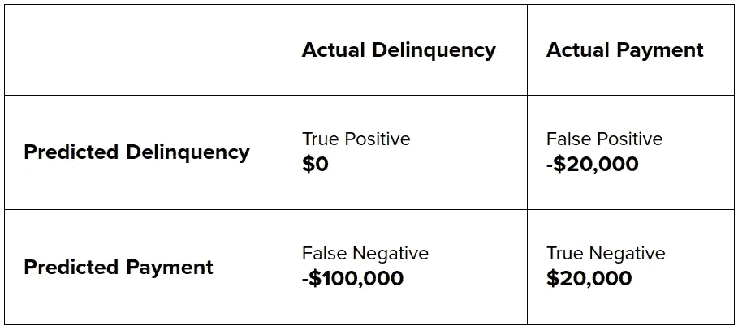
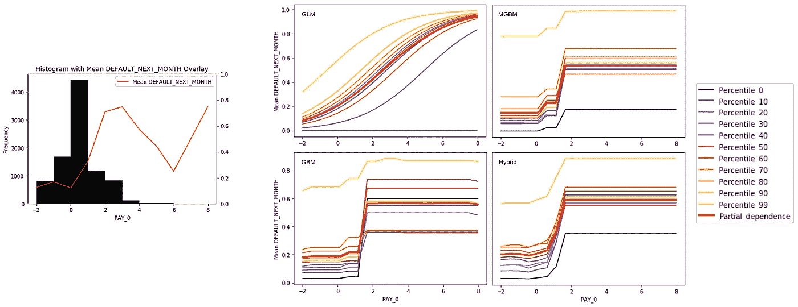
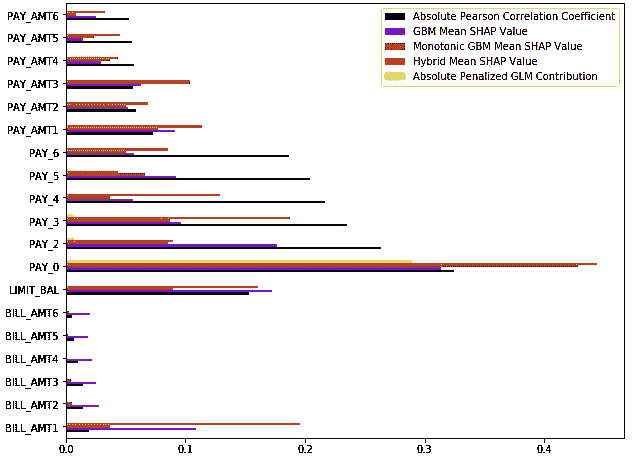
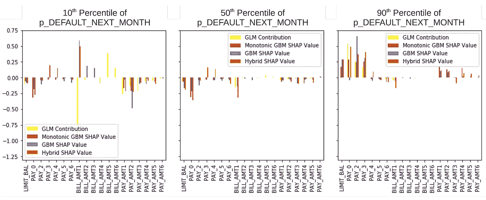

# 从 GLM 到 GBM(下)

> 原文：<https://towardsdatascience.com/from-glm-to-gbm-part-2-7045e3fd52a2?source=collection_archive---------30----------------------->

## 更好模型的商业价值

作者:帕特里克·霍尔和迈克尔·普罗克施博士

# TL；速度三角形定位法(dead reckoning)

*   这篇文章从技术上概述了从可信的广义线性模型(glm)向新型梯度推进机(GBM)的过渡，同时实际考虑了已知的风险、合规性要求和业务影响。
*   它带有[代码](https://nbviewer.jupyter.org/github/jphall663/interpretable_machine_learning_with_python/blob/master/glm_mgbm_gbm.ipynb)。
*   查看迈克尔·普罗克什的第一部分[帖子](/from-glm-to-gbm-5ff7dbdd7e2f)和 H2O.ai [帖子](https://www.h2o.ai/blog/from-glm-to-gbm-part-2/)。

# 介绍

在第 1 部分的[中，我们提出了利用机器学习(ML)实现更好的收入和管理监管要求。我们通过一个简单的保险例子，展示了梯度推进机(GBM )( ML 的一种)如何精确匹配，然后超越流行的广义线性模型(glm)的技术优点和商业价值。](/from-glm-to-gbm-5ff7dbdd7e2f)

本博客的第 2 部分使用了一个更现实、更详细的信用卡违约场景来展示单调性约束、Shapley 值和其他事后解释，以及判别测试如何使从业者能够在 GLM 和 GBM 模型之间进行直接比较。这种比较可以使从业者以循序渐进的方式建立从 GLM 到更复杂的 GBM 模型，同时保持模型的透明度和检验歧视的能力。在我们的信用用例中，我们表明 GBM 可以带来更好的准确性、更多的收入，并且 GBM 也可能满足模型文档、不利行动通知和区分测试要求。

一些银行家最近对贷款中的人工智能(AI)表示怀疑——这是正确的。(参见:[https://www . American banker . com/opinion/ai-models-could-fight-to-hand-the-market-down](https://www.americanbanker.com/opinion/ai-models-could-struggle-to-handle-the-market-downturn)或[https://www . American banker . com/opinion/don-let-ai-trigger-a-fair-lending-violation](https://www.americanbanker.com/opinion/dont-let-ai-trigger-a-fair-lending-violation)。)要明确的是，我们*不是*提倡脑残人工智能炒作。我们希望在这篇文章的第二部分提出一个明智的、可测试的、循序渐进的方法，从 GLM 过渡到 GBM。或许很明显，我们认为 GBMs 比 GLMs 更能模拟真实世界和信用风险。我们还认为 ML 可以在保持极高透明度的同时，防止算法歧视。

本文的第 1 部分已经表明，GBM 可能不仅是更准确的预测因子，而且当与 Shapley 值结合时，它们还可以更准确地解释和归因于预测因子的因果影响。在第 1 部分的基础上，我们现在想展示贷款从 GLM 到 GBM 的过渡所带来的潜在透明度和商业利益。为了完全透明(并有望再现)，我们使用了 [UCI 信用卡数据](https://archive.ics.uci.edu/ml/datasets/default+of+credit+card+clients)，它可以从 UCI 机器学习数据集库中免费获得，以及[开源 h2o-3 代码](https://nbviewer.jupyter.org/github/jphall663/interpretable_machine_learning_with_python/blob/master/glm_mgbm_gbm.ipynb)。信用卡数据集包含 30，000 名信用卡客户的人口统计特征信息以及支付和账单信息。要预测的因变量是付款拖欠。我们的用例将从技术和业务角度比较一个 GLM 和几个不同的 GBM。

# 机器学习可以推动商业影响

为了显示 GBM 相对于 GLM 的商业价值，我们训练了几种不同的算法(GLM、单调 GBM (MGBM)、GBM 和混合 GBM)。以下是这些模型的简短总结:

*   **GLM:** 弹力网罚物流 GLM。
*   最大 46 棵树。深度 3，所有变量单调约束。
*   GBM: 最多 44 棵树。深度 5，无单调约束。
*   **杂交:**最多 50 棵树。深度 14，学习了一些变量的单调约束。

正如您将在下面看到的，在我们的测试中，这些型号的预计收入有很大差异。为什么？这些模型对风险的判断不同。如果不进行人工调整，GLM 无法反映变量之间的非线性关系和相互作用。GBM 固有地模拟变量之间的非线性关系和相互作用。过去，GLMs 被认为是高度透明的，因此更适合用于商业目的。GBM 在过去被认为是黑箱。但是使用单调性约束可以赋予 GBM 与 glm 相同的内在可解释性，并且不会牺牲准确性。表 1 提供了不同测试模型及其功能的概述。

表 1:模型及其功能概述。“+”表示功能的存在。“-”表示没有能力。能力是相对于 GLM 来衡量的。

通过网格搜索选择所有模型，并使用验证 AUC 进行评估。结果见表 2。GLM 模型的 AUC 得分最低，为 0.73，而最好的 GBM 模型的 AUC 达到 0.79。太好了…但是这对企业来说意味着什么呢？

**表 2:模型模拟结果。箭头表示每次测量的改进方向。货币是新台币。**

为了评估每个模型的业务影响，我们做了一些基本假设，如表 3 所示。信用卡客户，我们准确地归类为拖欠客户，是中性的成本。一个准确分类的没有拖欠的客户将带来新台币 20，000 元的终身价值，一个错误分类为拖欠的客户将导致新台币 20，000 元的终身价值，而错误地向拖欠客户提供信贷将导致新台币 100，000 元的注销。

**表 3:用于估计表 2 中业务影响的假设。货币是新台币。**

基于这些假设，GLM 模式的结果显示最低收入为新台币 790 万元。影响最大的模式是混合 GBM，其业务价值为新台币 1922 万元，几乎是 GLM 模式的 2.5 倍！

这怎么可能呢？混合 GBM 模型在避免那些代价高昂的假阴性预测方面要好得多。这个简单的例子表明，从 GLM 到 GBM 模型的过渡可以显著增加业务价值和降低风险。现在，让我们从技术角度看一下如何比较 GLMs 和 GBMs，这样您就可以决定如何以及何时从 GLMs 过渡到 GBMs。

# 更好的模型，同样的透明度

事实上，GLMs 具有出色的可解释性。他们是如此可解释，因为他们的加法单调形式和他们的低程度的相互作用的变量。信不信由你，GBMs 也可以有极高的可解释性。通过单调性和交互约束的明智应用，GBM 用户现在可以将领域知识用于建模任务，增加可解释性，避免过度适应开发数据，并对何时使用何种模型做出明智的决定。(例如:[https://xgboost . readthe docs . io/en/latest/tutorials/monotonic . html](https://xgboost.readthedocs.io/en/latest/tutorials/monotonic.html)，[https://xgboost . readthe docs . io/en/latest/tutorials/feature _ interaction _ constraint . html](https://xgboost.readthedocs.io/en/latest/tutorials/feature_interaction_constraint.html)。)

## **单调性约束**

用户通常可以在 GBM 中指定与 GLMs 中相同的单调性变量。在图 1(右)**、**中，特征 PAY_0 的 GLM 模型化行为，或客户的最近还款状态，是单调增加的。随着 PAY_0 值变大，违约概率也变大。在图 1(右)中，MGBM 使用正单调约束来模拟相同的行为——就像 GLM 一样！随着 GBM 下的 PAY_0 增加，违约概率也增加。

不同的是 GLM 的函数形式和广义相对论的函数形式。在这种情况下，GLM 被限制为逻辑曲线，而 GBM 可以采取任意复杂的阶梯形式，也遵守用户提供的单调性约束。此外，图 1 显示了 GBM 和混合模型在没有单调性约束的情况下对 PAY_0 的表现。你觉得哪个看起来更真实？图 1(左)中 PAY_0 的直方图和均值行为可以帮助您确定哪个模型最符合数据。目标是匹配直方图加权的红色平均目标线。好消息是，无论您喜欢哪种功能形式，您现在都可以用一种反映业务领域知识的可解释的方式来使用它。

**图 1:PAY_0 的直方图，用红色表示目标的平均值，DEFAULT_NEXT_MONTH，用 PAY _ 0 表示(左)。每个模型的部分相关性和 ICE 估计行为(右)。通过左图中数据的频率衡量平均行为有助于衡量右边模型的拟合度。该图还允许对简单模型和更复杂的模型进行有意义的比较。**

## **事后解释**

我们如何能够看到 GBM 建模 PAY_0 的方式？通过所谓的部分依赖和个体条件期望(ICE)图[1]，[2]。在图 1(右)中，部分相关(红色)显示了模型的估计平均行为。图中的其他 ICE 曲线显示了某些个体在模型下的行为。通过结合这两种方法，我们得到了一个图表，显示了我们模型的整体和个体行为。部分依赖和 ICE 只是事后解释技术的一个例子，或者说，在对模型进行训练以更好地理解其工作原理之后，我们可以在模型上运行的过程。

沙普利值，一个诺贝尔奖获得者的博弈论技术，为 GBM 模型提供了额外的和关键的见解[3]。当应用于 GBM 等基于树的模型时，Shapley 值是一个高度精确的测量变量对模型预测的影响，无论是对整体还是对任何单个客户。这对于可解释性非常有帮助，因为它支持:

*   模型预测的整体业务驱动因素分析(图 2)。
*   对单个客户的预测描述，以及潜在的不利行动通知的生成(图 3)。
*   比较 GLM 系数和对 GBM Shapley 值的贡献(图 2 和图 3)。

**图 2:与 DEFAULT_NEXT_MONTH 的绝对 Pearson 相关性和每个模型的平均特征贡献。GLM 和 GBM 的贡献可以在对数优势空间中解释。该图允许对简单模型和更复杂的模型进行有意义的整体比较。**

正如图 1 显示了如何从 GLM 到不同的 GBM 处理 PAY_0 的变化，现在可以直接比较 GLM 和 GBM 的总体(图 2)和每个客户(图 3)的可变贡献。在图 2 中，我们可以看到每个模型如何从整体角度处理变量，并将简单模型(如皮尔逊相关、GLM)与更复杂的模型进行比较。在图 3 中，我们可以看到每个模型是如何对三个客户做出预测的。所有这些都可以直接比较 GLM 和 GBM 对变量的处理，因此您既可以充分记录 GBM，又可以满怀信心地做出向 GBM 过渡的决策！此外，图 3 中显示的每个客户的信息还可以提供不利行动通知所需的原始数据，这是信贷中一个重要的监管考虑因素。

**图 3:在 GLM 模型预测的选定百分位数，个体对预测的可变贡献。这种类型的分析允许对简单和复杂模型如何对待单个客户进行有意义的比较，并可能生成不利行动通知。**

模型诊断的另一个重要方面是辨别测试，在美国的一些联邦和地方法规下必须进行该测试。当然，如果发现某些类型的歧视，那么也必须予以纠正。在这种情况下，GLMs 的透明度通常是有帮助的。然而，上面概述的约束和事后解释步骤使得在 GBM 模型中发现和修复歧视比以前容易得多。此外，ML 中良好模型多样性的概念——其中单个数据集可以生成许多精确的候选模型——提供了许多解决歧视的选项，这些选项通常对于 GLMs 是不可用的。(参见:[https://www.youtube.com/watch?v=rToFuhI6Nlw](https://www.youtube.com/watch?v=rToFuhI6Nlw)。)

## 辨别测试

**表 4。测试模型的女性(受保护)对男性(对照)的区分措施。该表允许比较简单和更复杂的模型。**

在我们的信用卡示例中，使用具有长期法律和监管先例的措施来测试 GBM 的歧视性:负面影响比率(AIR)、边际效应(ME)和标准化平均差异(SMD)。这些结果见表 4。幸运的是，在男性和女性之间，我们的模特几乎没有歧视的迹象。然而，如果发现歧视，GBMs 实际上可能比 GLMs 提供更多的补救选择。

基本上，GBM 只是比 glm 有更多的旋钮可以转动，留下更多的回旋空间来找到一个准确和非歧视的模型。除了变量和超参数选择，研究人员还提出了潜在的兼容对抗方法来训练非歧视性 ML 模型[4]，GBM 现在为用户提供单调性和交互约束，可以帮助修复歧视性模型结果。同样，上面描述的事后解释技术也可以用来理解算法歧视的驱动因素，并验证它们从 GBM 模型中的移除。

# 机器学习和合规

许多政府机构已经暗示了未来可能的洗钱管制，或者在美国以外，已经开始实施这样的管制。值得注意的是，美国政府监管机构并没有说禁止洗钱。一般来说，他们说要确保你的 ML 是有记录的，可解释的，可管理的，可监控的，并且歧视性最小。可以说，第 2 部分中概述的步骤为使用 GBM 进行可解释性和区分性测试提供了蓝图，这反过来应该有助于模型文档的各个方面。此外，大多数大型金融机构已经为其传统预测模型建立了模型治理和监控流程。这些可能适用于 ML 模型。

当然，非监管者真的没有资格评论什么符合监管，什么不符合监管。所以，你可以自己看看一些美国政府机构在想什么:

*   [证券行业的人工智能(AI)](https://www.finra.org/sites/default/files/2020-06/ai-report-061020.pdf)
*   [证券市场人工智能入门](https://www.cftc.gov/media/2846/LabCFTC_PrimerArtificialIntelligence102119/download)
*   [美国行政管理和预算局人工智能应用监管指南草案](https://www.whitehouse.gov/wp-content/uploads/2020/01/Draft-OMB-Memo-on-Regulation-of-AI-1-7-19.pdf)
*   [使用人工智能和算法](https://www.ftc.gov/news-events/blogs/business-blog/2020/04/using-artificial-intelligence-algorithms)
*   [创新聚焦:在使用 AI/ML 模型时提供不利行动通知](https://www.consumerfinance.gov/about-us/blog/innovation-spotlight-providing-adverse-action-notices-when-using-ai-ml-models/)

# 机器学习的动力

在政府之外，一些金融服务组织已经声称在受监管的交易中使用机器学习，研究人员正在发布关于信用贷款应用的 GBM 和 Shapley 值。例如，2018 年，Equifax [宣布了](https://www.prnewswire.com/news-releases/new-patent-pending-technology-from-equifax-enables-configurable-ai-models-300701153.html)他们的神经决策系统，“一项正在申请专利的机器学习技术，用于合规的高级神经网络信用评分建模。”自 2018 年以来，富国银行还推出了几种用于模型验证的机器学习技术，包括 LIME-SUP [5]、可解释的神经网络[6]以及许多附加的模型调试[方法](https://ww2.amstat.org/meetings/jsm/2019/onlineprogram/AbstractDetails.cfm?abstractid=303053)。

2019 年，英格兰银行的 Bracke 等人发表了一个可解释的人工智能信用风险用例，其中包括 GBM 和 Shapley 值[7]。同年晚些时候，巴斯曼等人发表了一篇类似的文章，在《信用风险管理》杂志上介绍了一个 GBM 和 Shapley value 的例子。2020 年 3 月，Gill 等人发表了一份基于单调约束 GBM、可解释神经网络和 Shapley 值的抵押贷款工作流，该工作流仔细考虑了美国不利行动通知和反歧视要求[9]。

# 结论

现在看来，从可信的 glm 到更复杂的 GBM，可以采取谨慎的步骤。使用约束、事后解释和区分测试，可以将 GBM 与 glm 进行比较。这些技术也可以很好地符合不利行动通知、歧视和文件要求。幸运的话，GBMs 可以为消费者、保险公司和贷款人带来更好的财务结果。随着监管金融服务中机器学习的势头和宣传的增加，我们希望这篇文章的第 1 部分和第 2 部分将有助于那些寻求负责任地从 GLM 过渡到 GBM 的人。

# 参考

1.  Friedman、t . Hastie 和 r . TiB shirani(2001 年)。*统计学习的要素*(第 1 卷，№10)。纽约:统计学中的斯普林格系列。网址:【https://web.stanford.edu/~hastie/ElemStatLearn/ 。
2.  Goldstein，a .，Kapelner，a .，Bleich，j .，& Pitkin，E. (2015 年)。窥视黑箱内部:用个体条件期望图可视化统计学习。*计算与图形统计杂志*， *24* (1)，44–65。网址:[https://arxiv.org/pdf/1309.6392.pdf](https://arxiv.org/pdf/1309.6392.pdf)。
3.  Lundberg，S. M .，& Lee，S. I. (2017 年)。解释模型预测的统一方法。在*神经信息处理系统的进展*(第 4765–4774 页)。网址:[http://papers . nips . cc/paper/7062-a-unified-approach-to-interpretation-model-predictions . pdf](http://papers.nips.cc/paper/7062-a-unified-approach-to-interpreting-model-predictions.pdf)。
4.  张，B. H .，b .，& Mitchell，M. (2018 年 12 月)。用对抗性学习减轻不必要的偏见。在 2018 年 AAAI/ACM 关于人工智能、伦理和社会的会议录中(第 335-340 页)。网址:[https://arxiv.org/pdf/1801.07593.pdf](https://arxiv.org/pdf/1801.07593.pdf)。
5.  胡，l，陈，j，奈尔，V. N .，& Sudjianto，A. (2018)。基于监督分割(LIME-SUP)的局部可解释模型和效果。 *arXiv 预印本 arXiv:1806.00663* 。网址:[https://arxiv.org/pdf/1806.00663.pdf](https://arxiv.org/pdf/1806.00663.pdf)。
6.  Vaughan，j .，Sudjianto，a .，Brahimi，e .，Chen，j .，& Nair，V. N. (2018 年)。基于加性指数模型的可解释神经网络。arXiv 预印本 arXiv:1806.01933 。网址:[https://arxiv.org/pdf/1806.01933.pdf](https://arxiv.org/pdf/1806.01933.pdf)。
7.  布莱卡，p .，达塔，a .，荣格，c .，和森，S. (2019)。金融中的机器学习可解释性:违约风险分析的应用。网址:[https://www . bankofengland . co . uk/-/media/BOE/files/working-paper/2019/machine-learning-explability-in-finance-an-application-to-default-risk-analysis . pdf .](https://www.bankofengland.co.uk/-/media/boe/files/working-paper/2019/machine-learning-explainability-in-finance-an-application-to-default-risk-analysis.pdf)
8.  北卡罗来纳州巴斯曼、乔治迪奇、马里内利和帕彭布洛克(2019 年)。信用风险管理中的可解释人工智能。*信用风险管理(2019 年 12 月 18 日)*。网址:【https://papers.ssrn.com/sol3/papers.cfm?abstract_id=3506274 。
9.  北卡罗来纳州吉尔、北卡罗来纳州霍尔、堪萨斯州蒙哥马利和北卡罗来纳州施密特(2020 年)。一个负责任的机器学习工作流程，侧重于可解释的模型、事后解释和辨别测试。*信息*， *11* (3)，137。网址:[https://www.mdpi.com/2078-2489/11/3/137](https://www.mdpi.com/2078-2489/11/3/137)。