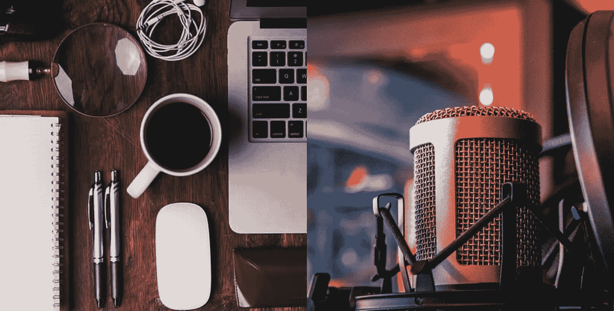

# 从谷歌日历到 Python 音频

> 原文：<https://towardsdatascience.com/from-google-calendar-to-audio-with-python-a34f0ce23a3c?source=collection_archive---------46----------------------->



照片由[伊恩·杜利](https://unsplash.com/@sadswim?utm_source=medium&utm_medium=referral)(左)和[托马斯·勒](https://unsplash.com/@thomasble?utm_source=medium&utm_medium=referral)(右)在 [Unsplash](https://unsplash.com?utm_source=medium&utm_medium=referral) 上拍摄

## 使用 python 构建日常任务阅读器

# 音频生产力

我们听音乐，我们听播客，YouTube 视频，甚至鸟儿啁啾。倾听是我们生活中很重要的一部分，然而，利用这种感觉来提高我们工作效率的工具似乎很少。

今天我想向你展示如何使用 python 来构建一个简单的任务阅读器，它可以大声背诵你的日常任务，并给你带来情绪上的提升。

# 从简单的文本到音频

有这么多令人惊叹的 python 库，这么多令人难以置信的框架，让我们的编程体验更加愉快。

就是其中的一个包。它使得将文本转换成音频成为一个简单的过程 ***。这是一个脱机工作的文本到语音转换库。***

这个工具打开了简单文本的可能性之门，因为它为我们的书面内容提供了另一个媒体层。简单的工具，如任务清单，个人咒语，甚至更复杂的。pdf 阅读器可以快速制作。

***作为一个例子，我们将使用这个库构建一个简单的任务阅读器*** 使用谷歌日历 API，额外的好处是阅读个人原则，让你在难以集中注意力的日子里保持正轨。

# 从谷歌日历到任务阅读器

基本管道将是:

*   使用日历 API 从 google calendar 获取任务。
*   选择当天的任务。
*   循环完成任务，并大声朗读出来。
*   在听完任务之后，用户将会听到一组预先定义好的咒语。

现在，让我们详细介绍一下这些步骤。

## 启用 Google 日历 API

*   登录您的谷歌账户，点击[这里的](https://developers.google.com/calendar/quickstart/python)，启用谷歌日历 API。
*   安装谷歌客户端库`pip install --upgrade google-api-python-client google-auth-httplib2 google-auth-oauthlib.`
*   从 [google calendar API 页面](https://developers.google.com/calendar/quickstart/python)中的 quickstart.py 复制示例代码，并将其放在一个文件夹中。

## 设置扬声器

*   安装`pyttsx3`库:`pip install pyttsx3.`
*   用 python 或 ipython 打开终端:`ipython`。
*   从`pyttsx3`开始测试扬声器。

```
import pyttsx3
text = "Hello World of Audio!"
speaker = pyttsx3.init()
speaker.say(text)
spaker.runAndWait()
```

你应该听清楚这个句子。

## 把所有的放在一起

现在我们已经有了所有的依赖项，让我们组装部件。

我们将修改来自 google API 页面的示例，以返回今天的任务列表。

现在，我们已经有了从 google 日历中获取任务的代码，我们将编写一个函数来获取任务列表并大声朗读出来:

厉害！我们就要完成了，我们要做的就是增加一个额外的选项来听一列您希望被提醒的关键原则:

我们首先编写一个名为`principles.txt`的文件，并将其添加到同一个文件夹中。然后，我们可以编写一个函数来从该文件中获取句子列表:

现在，我们要做的就是编写另一个简单的函数来播放原则列表:

就是这样！完整的代码可以在我的 [github](https://github.com/EnkrateiaLucca/Audio_Productivity_with_Python) 上找到。

# 音频作为生产力工具的潜力

我们应该总是寻求多种输入方式，而不是局限于那些更明显的方式，如视频或文本。我们可以用 python 或任何其他编程语言编写这些简单的音频工具，这表明了这种媒体作为一种方式来增强我们甚至不知道可能实现的日常工作的潜力。

如果您喜欢 Python 和 API 集成，请查看 Udemy 课程:

> 这是一个附属链接，如果你使用该课程，我会得到一小笔佣金，干杯！:)

*   [用 Flask 和 Python 休息 APIs】](http://seekoapp.io/61351994587e9800084bfbd2)

如果你喜欢这篇文章，别忘了给👏，在 [Twitter](https://twitter.com/LucasEnkrateia) 或 [LinkedIn](https://www.linkedin.com/feed/) 上与我联系。谢谢，下次再见！🤓