# 从谷歌表单到你的 Jupyter 笔记本

> 原文：<https://towardsdatascience.com/from-google-sheet-to-your-jupyter-notebook-ccdbf28fbf1b?source=collection_archive---------10----------------------->

## 如何将 google sheet 连接到笔记本


Jupyter Notebook 是数据科学家的强大工具。您可以用几行代码执行许多复杂的算法，并对大量数据进行分析。Jupyter 笔记本本身能够连接到一个数据库系统，其中的数据睡眠。尽管如此，如果我们谈论数据库，作为一名数据科学家，首先想到的往往是 SQL。

当然，如果我们谈论数据库，SQL 目前仍然是主要的东西，但是许多没有编程背景的人不会那么熟悉 SQL。特别是有经验的专业人士，他们希望进入编程数据科学领域，他们经常使用 google sheet 来放置他们的数据。

因此，我想向您展示如何将我们的 Jupyter 笔记本连接到我们的 Google Sheets。

# 资格证书

将 Jupyter Notebook 连接到 Google Sheets 并不麻烦；你可以稍微准备一下。幸运的是我们只需要做一次。

我们需要做的第一件事是从 [Google 开发者控制台](https://console.developers.google.com/project)获得一个合适的凭证。凭证要求我们访问谷歌表单。

在控制台中，点击**创建项目**。在那里，您会发现类似下图所示的屏幕。

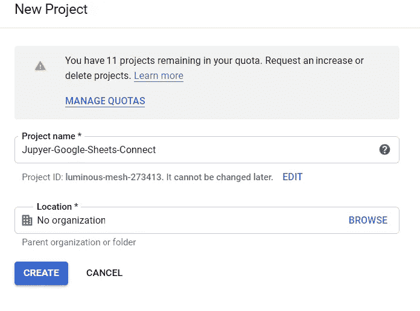

你给项目起什么名字并不重要，重要的是你创建了一个新的项目。为了连接到 Google Sheets，我们只需要这一个项目，所以至少要选择一个你能记住的名字。

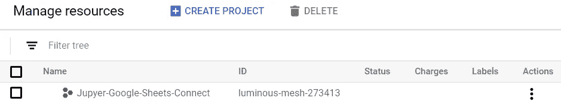

回到我们的控制台，看看项目是否已经创建。选择新创建的项目，点击左上角的汉堡菜单(Google APIs 符号旁边的那个)。在那里选择**API&服务**，然后选择**仪表板。**

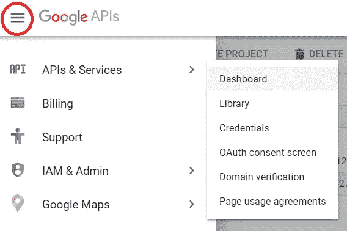

在仪表板上，选择**启用 API 和服务**按钮。


从那里我们将被带到 API 库。应该是下图这样的。

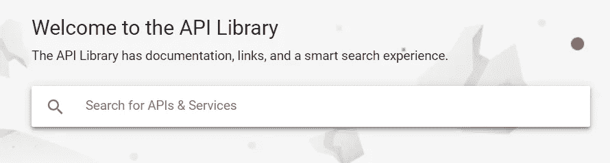

在搜索栏上，键入“Google Sheets”来查找 Google Sheets API。

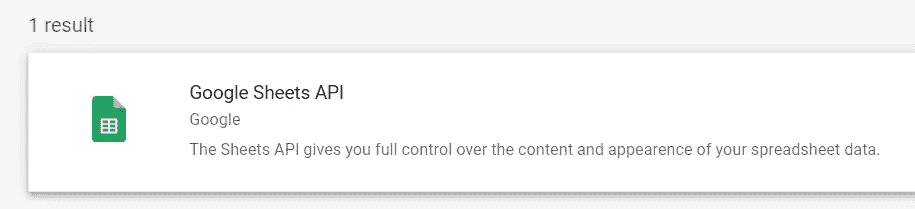

从那里点击 **Google Sheets API** 并启用该 API。

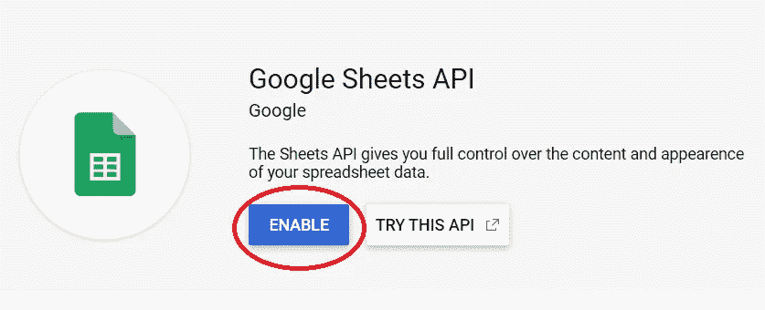

在这一步中，我们还启用了 Google Drive API，因此也可以搜索“Google Drive API”。

现在我们将被带到 Google Sheets API 仪表板。要使用这个 API，首先，我们需要创建凭证。

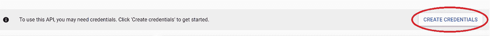

这里，另一个屏幕会提示我们创建凭据。选择 **Google Sheets API** 用于哪个 API，选择**其他 UI** 用于从哪里调用 API，选择**用户数据**用于访问什么数据。现在，单击“我需要什么凭据?”？按钮。步骤如下图所示。


如果是第一次创建凭证，系统会提示您创建 OAuth 同意屏幕。单击设置同意屏幕创建一个。


在这里，只需在应用程序名称中输入您喜欢的任何名称，然后单击 save。

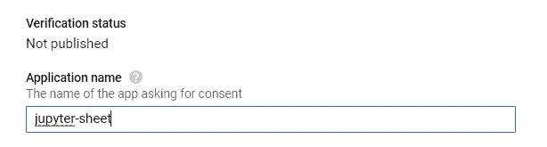

回到仪表板，现在点击**创建凭证**按钮并选择 **OAuth 客户端 ID** 。

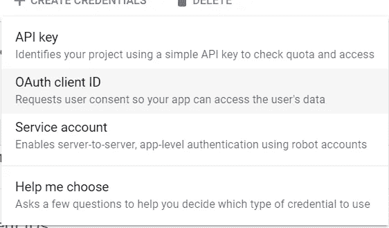

在这里，只需选择**其他**类型，然后键入您喜欢的任何名称。然后单击创建。

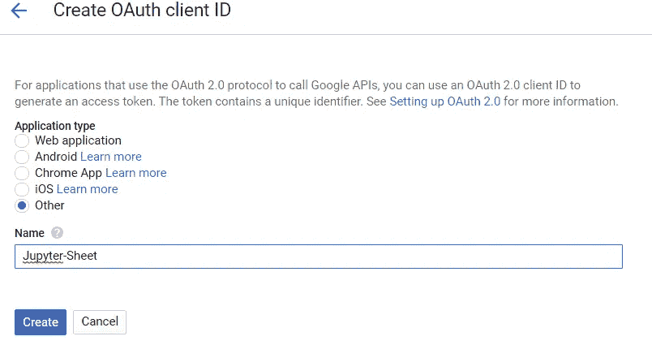

您将返回到仪表板。现在下载您新创建的 OAuth 客户端 ID，并将其放在您将使用 Jupyter 笔记本的文件夹中。

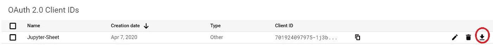

上面的这一步对于连接来说并不是必须的，但是我们这样做只是为了以防我们以后需要它。

我们还需要一样东西。现在回到创建凭证并点击**服务帐户**按钮。

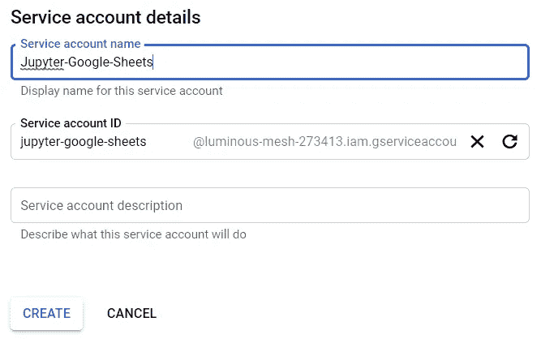

键入您喜欢的任何名称，然后点按“创建”按钮。在下一个屏幕中，选择角色作为**服务帐户用户**。

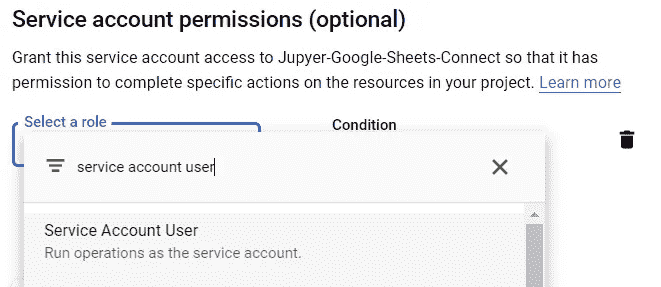

然后点击**创建密钥**按钮。


选择 JSON 密钥类型，然后单击创建。将文件保存在与您想要的笔记本相同的文件夹中。

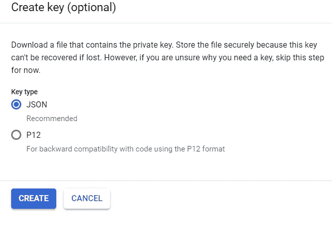

现在我们得到了所有我们需要的证书。这是一个漫长的步骤，但我们只需要做一次。

# 将 Google Sheets 连接到 Jupyter 笔记本

在开始之前，我们需要安装 3 个不同的 Python 模块。

```
pip install gspread oauth2client df2gspread
```

现在我们到了可以将纸张连接到 Jupyter 笔记本的部分。我将在下面的步骤中展示它。

1.  导入所有重要的模块

```
#Importing the module
import gspread
from df2gspread import df2gspread as d2g
from oauth2client.service_account import ServiceAccountCredentials
```

2.在 Google Sheet 中创建一个新的工作表。然后点击右上角的 share 按钮，在 google API 仪表板中输入来自服务帐户的电子邮件。这是为了确保工作表连接到我们的 Jupyter 笔记本。

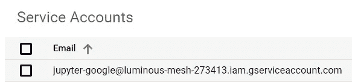

3.初始化所有重要的变量

```
#The scope is always look like this so we did not need to change anything
scope = [
   '[https://spreadsheets.google.com/feeds'](https://spreadsheets.google.com/feeds'),
         '[https://www.googleapis.com/auth/drive'](https://www.googleapis.com/auth/drive')]#Name of our Service Account Key
google_key_file = 'service_key.json'credentials = ServiceAccountCredentials.from_json_keyfile_name(google_key_file, scope)gc = gspread.authorize(credentials)
```

现在我们已经有了我们需要的所有重要连接。

# 将数据上传到 Google Sheet

首先，让我们尝试将 Jupyter Notebook 中的数据上传到 Google Sheet。

```
import seaborn as sns#I would use tips dataset as an example
tips = sns.load_dataset('tips')
```

这是我们的数据。

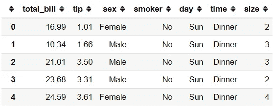

现在，当我们想要将数据上传到 google sheet 时，有一些事情需要注意。我们需要工作表 ID 和工作表名称。如何获取如下图所示。

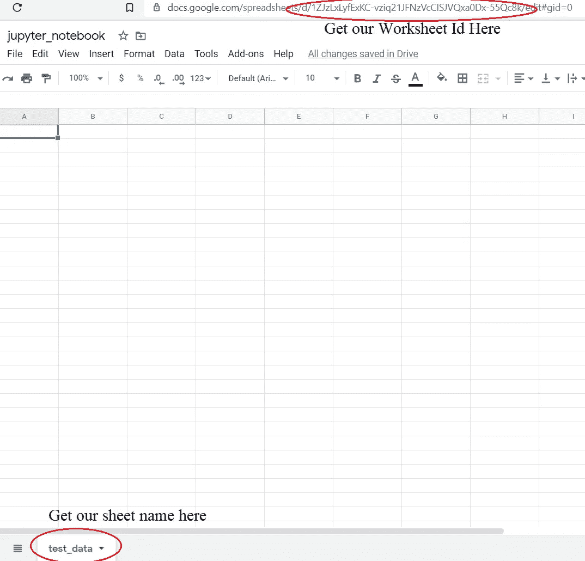

现在让我们将数据上传到这个空的 Google 工作表中。

```
#This is the Worksheet ID
spreadsheet_key = '1ZJzLxLyfExKC-vziq21JFNzVcCISJVQxa0Dx-55Qc8k'#This is the sheet name
wks_name = 'test_data'#We upload the tips data to our Google Sheet. Setting the row_names to False if you did not want the index to be included
d2g.upload(tips, spreadsheet_key, wks_name, credentials=credentials, row_names=False)
```

好了，现在我们在谷歌表单中有了我们的数据。


# 从谷歌工作表中提取数据

如果我们想提取数据，就像把数据上传到 google sheet 一样简单。我将在下面的代码中展示它。

```
#Opening the worksheet by using Worksheet ID
workbook = gc.open_by_key(spreadsheet_key)#Selecting which sheet to pulling the data
sheet = workbook.worksheet('test_data')#Pulling the data and transform it to the data frame
values = sheet.get_all_values()
pull_tips = pd.DataFrame(values[1:], columns = values[0])pull_tips
```

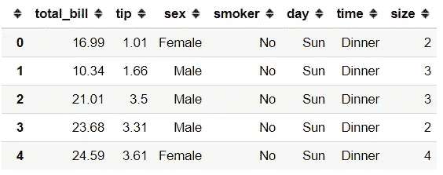

就是这样。我们已经从我们的 Jupyter 笔记本上连接了我们的 Google Sheet。

# **结论**

我已经向您展示了将我们的 Jupyter 笔记本连接到 Google Sheets 所需的步骤。我还展示了如何在 Google Sheets 中上传和提取数据。

希望有帮助！

# 如果您喜欢我的内容，并希望获得更多关于数据或数据科学家日常生活的深入知识，请考虑在此订阅我的[简讯。](https://cornellius.substack.com/welcome)

> 如果您没有订阅为中等会员，请考虑通过[我的介绍](https://cornelliusyudhawijaya.medium.com/membership)订阅。