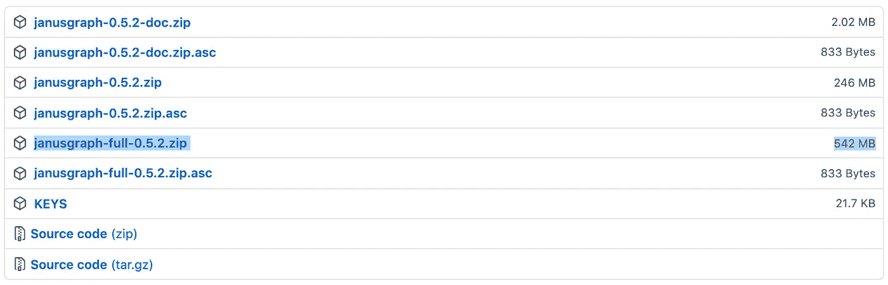
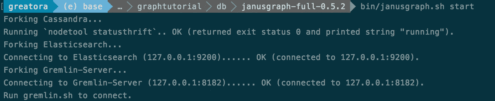
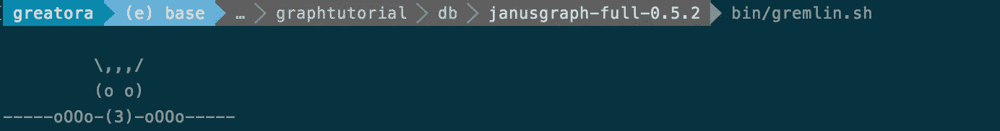

# 从图形数据库到图形嵌入

> 原文：<https://towardsdatascience.com/from-graph-db-to-graph-embedding-a2f2c38e7c6d?source=collection_archive---------40----------------------->

图片由 [TheAndrasBarta](https://pixabay.com/users/theandrasbarta-2004841/) ，[授权](https://pixabay.com/service/license/)。

## 7 个简单的步骤

所有的创新技术最终都会越过一个“膨胀预期的顶峰”，当所述技术得到大量营销资金的支持时，这种现象尤其如此，这些资金主要用于助长炒作和加剧公众预期。

机器学习的前景正在慢慢成熟，超越了它的“*我是一把锤子，一切都是钉子”的框架，诞生于过去十年左右市场营销热情的爆发。*

对于图形数据库也是如此；曾经被誉为每个企业圣诞节必备的热门新技术，它们已经达到了成为系统工程师剧本的一部分的快乐境界。

当它们*与*一起使用时，它们比传统的 RDBMS 提供了显著的优势，RDBMS 在过去的 40 多年里一直统治着数据库领域。简单地说，它们只是做 SQL 数据库做不到的某些事情(反过来也是如此)。

考虑到这一点，我们来找点乐子吧。

下面，我为安装图形数据库、获取数据集、创建图形的矢量嵌入表示以及可视化输出做了一个简单的入门指南。

在本教程中，我们将使用 Linux 基金会支持的图形数据库 [JanusGraph](https://janusgraph.org/) 。JanusGraph 被设计用来处理数十亿个顶点和边，但是为了本教程，我们将保持它的简洁。不过，我会给你一些建议，告诉你如何扩展你的解决方案。

在开始之前，让我们先解决一些潜在的问题。

1.  *为什么不直接用 NetworkX？*尽管 NetworkX 功能丰富，但它的可扩展性并不好。虽然下面的步骤显然不符合给定表格中的*，但它们代表了可能的基础。(例如，将 JanusGraph 部署到集群，并使用 Spark 运行以下所有操作)*
2.  *为什么是 JanusGraph 而不是另一个 db？有许多伟大的图形数据库可供选择。我在下面使用它是因为 JanusGraph 维护得很好，在 [Apache 2.0](https://en.wikipedia.org/wiki/Apache_License) 下获得许可，可伸缩，并且使用最接近通用图查询语言的东西:Gremlin。您还可以使用 gremlin-python 实现轻松地将 gremlin 嵌入到我们的 python 代码中。(虽然 Cypher 在 StackOverflow 上通过 Q &更受欢迎，但 Gremlin 得到了更多图形数据库的支持)。*
3.  *node 2 vec 的特性比定制的、手工构建的特性更有用吗？嗯，那要看情况。Node2Vec 允许我们轻松地将图形的拓扑表示编码成一系列实数，而不必繁琐地尝试手动创建它们。这节省了时间和精力，并且最终包含了比手工创建的图表更多的信息。*

我们将用来加载的数据将是 Kelvin Lawrence 的机场数据集。在这里可以找到他的数据[，在这里](https://github.com/krlawrence/graph/tree/master/sample-data)可以找到他关于 Gremlin(一种流行的图形查询语言)的(优秀)书籍。

## 步骤 1 —下载骏利图表

导航到 [JanusGraph 发布页面](https://github.com/JanusGraph/janusgraph/releases)并下载最新版本(在撰写本文时是 0.52-文件名*Janus graph-full-0 . 5 . 2 . zip*)

## 步骤 2-启动骏利图像服务器

下载后，将文件解压缩，并将光盘放入可执行文件和 shell 脚本所在的`bin/`目录。

要启动服务器(基本后端是 Cassandra、ElasticSearch 和 gremlin-server)，使用命令`./janusgraph.sh start`。您应该会看到以下输出:

## 步骤 3-将数据集加载到数据库中

有多种方法来序列化您的图形数据。下面，我将摄取一个`graphml`文件，但你也可以轻松地使用`graphson`或`csv`。

将以下内容保存到扩展名为`.groovy`的文件中。

所有对 JanusGraph 的远程访问都是通过 Gremlin 服务器进行的；我们可以通过首先进入 gremlin 控制台来访问/加载我们的数据。通过使用命令——仍然在 bin 目录中— `./gremlin.sh`来完成。您应该会看到以下输出:

进入 gremlin 控制台后，使用以下命令加载机场数据。根据数据集的大小，所需的时间会有所不同。

`:load path/to/file/load_airports.groovy`

您可以通过运行计数`g.V().count()`来验证它是否正常工作。尽管这对于大量数据来说会很慢——在这种情况下，设置一个顶点索引并从那里开始计数。

**扩展选项:**部署 JanusGraph 到集群，玩玩后端组件，批量加载，增加线程，增加工人等。关于这个主题的精彩文章，请点击[这里](https://www.experoinc.com/post/janusgraph-nuts-and-bolts-part-1-write-performance)。

## 步骤 4-创建随机漫步

word 2 vec——node 2 vec 的下游等价物——需要一组序列作为输入。我们可以使用随机漫步从我们的图中构造序列。简而言之，我们将使用节点，而不是单词，我们使用随机漫步，而不是句子。在这个过程中，我们将节点映射到实数。

让我们创建这些随机漫步。对于每个顶点，我们将创建 50 个深度为 6 的随机行走(根据需要进行调整，这只是一个演示)。下面的代码使用了`[gremlinpython](https://pypi.org/project/gremlinpython/)`实现，它可以无缝集成到我们的 Python 脚本中。

从 3619 个顶点中，我们提取了 181k 个随机游走。

注意，下面的查询实际上是随机漫步的一个不完美的表示，它将被提供给 Node2Vec。Node2Vec 指定了两个额外的超参数来控制顶点之间的转移概率，因此您可以控制您的行走是局部的(广度优先搜索)还是全局的(深度优先搜索)。

**扩展选项:**通过使用多处理库，您可以轻松地垂直扩展该解决方案。通过使用 PySpark 这样的 Spark 实现来查询 JanusGraph，您可以横向扩展这个解决方案。要提取顶点 id，最好是直接查询弹性索引，而不是尝试 g.V()查询，或者在加载数据时梳理出来。

## 步骤 5— Word2Vec/Node2Vec 嵌入

神奇的事情就发生在这里。让我们在随机行走的集合上训练一个 Word2Vec 模型，得到一个实数的输出。

输出`X`是矢量集，形状为 181,000 x 50。如果你要训练一个 ML 模型，这是你可能会用到的数据。

**缩放选项:**使用 [Word2Vec](https://spark.apache.org/docs/2.1.1/api/java/org/apache/spark/mllib/feature/Word2Vec.html) 的 Spark 实现。

## 步骤 6 —降维

想象 50 维几乎是不可能的。我们可以使用降维技术来提取数据集中包含的大量差异，并将其压缩到更少的维度。这个过程是有损耗的，但如果我们能够保留足够的信息，同时能够在低维(~2D)空间中查看数据的全局结构，这是很值得的。

虽然这里可以使用 PCA 或 TSNE，但我选择了 UMAP，因为它很好地保留了全局结构，而且速度很快。以下参数将需要调整。

这是一篇关于 UMAP 的好文章。

**缩放选项**:虽然我找不到 UMAP 的 Spark 实现，但你可以尝试使用 MLlib [PCA](https://spark.apache.org/docs/latest/mllib-dimensionality-reduction) 实现。

## 第七步——想象

让我们把 50 维数据简化成两个部分，并把它们可视化。对于悬停数据和颜色数据，屏幕外有一些多余的添加。如果有足够的兴趣，我会张贴整个笔记本供参考。

这是输出——试着将鼠标悬停在上面，摆弄数据。

Plotly 图可以直接嵌入介质？非常酷。

感谢您的阅读，祝您编码愉快！