# 从混乱到信息

> 原文：<https://towardsdatascience.com/from-hot-mess-to-information-d97419c2ffea?source=collection_archive---------64----------------------->

## 为机器学习准备数据

2016 年，CloudFlower 发布了他们的年度[数据科学报告](https://visit.figure-eight.com/data-science-report.html):试图阐明作为一名数据科学家意味着什么，这是一个最近才出现在普通词汇中的术语。从该报告中得出的一个关键见解是，数据科学家平均花费大约 80%的时间来收集、清理、争论或准备用于分析的数据。

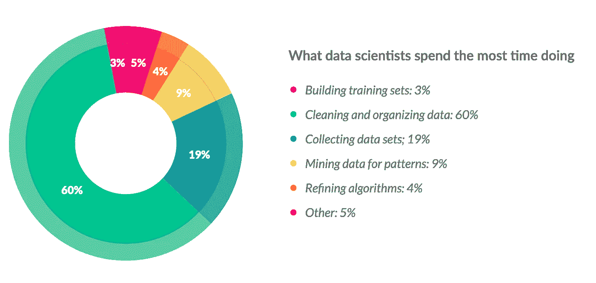

2016 数据科学报告，CloudFlower

接下来是一长串标题，大意是这是工作中最平凡的部分，基本上是浪费时间和生产力。

80/20 法则相当准确，但认为这会降低生产率或带走本可以更好地用于培训模型的精力和资源的观点是错误的

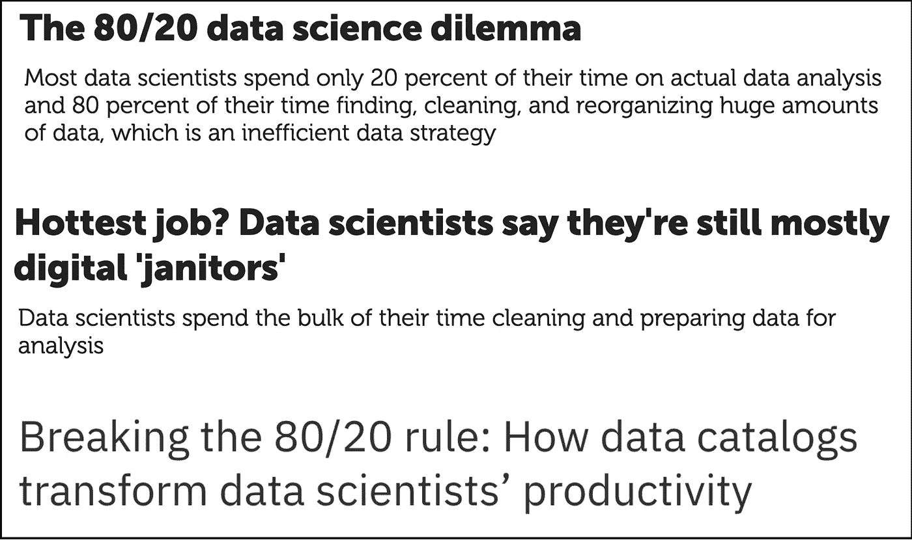

引起人们注意 80/20 法则的文章。

预处理包括许多步骤。其中一些可能看起来更琐碎，比如解决不一致，一些需要更深入的统计理论知识，比如缺失数据的插补，但它们都有一个共同点:它们都是决策点，答案在任何教科书或手册中都找不到，因为它们非常依赖于您试图解决的问题和您正在处理的特定数据集。

出于这个原因，预处理不是过程中的一个微不足道的步骤，它为项目增加了很多价值:当您通过不一致、异常值和缺失数据进行工作时，您会更好地理解手头的问题和可用于解决它的数据，这反过来会使最终构建模型更加容易。

本文描述了预处理过程中解决的一些问题，以及在每个步骤中做出的决策。

机器学习模型的好坏取决于它们接受训练的数据。这可以用*垃圾输入，垃圾输出*的概念来概括:如果你的训练集有噪音，有错误，或包含偏见，不管你的数学有多好，也不管你花多少时间优化你的参数，你的模型结果将不可避免地不准确。

## 什么是数据质量？

数据质量比算法的复杂性更能区分好模型和坏模型。但是质量数据是如何定义的呢？严格的定义并不存在，但我喜欢来自[维基百科页面](https://en.wikipedia.org/wiki/Data_quality)关于数据质量的一个定义:

> 使数据适合特定用途的完整性、符合性、一致性、及时性、复制性、完整性和准确性的状态。

用更一般的术语来说，质量数据是“适合使用”的数据，并且正确地代表了它所涉及的现实。

让我们看一个例子，看看我们在准备数据进行分析时可能会遇到什么样的问题，以及我们可以采取什么步骤来解决这些问题。

## 科技调查中的心理健康

由 [OSMI](https://osmihelp.org/) (开源精神疾病)每年进行的科技领域心理健康调查，衡量了科技工作场所对心理健康的态度，并调查了科技工作者心理健康障碍的频率。

在 2014 年的版本中，1259 名受访者回答了 25 个问题。这些问题中有几个允许自由输入，因此在将数据用于任何分析或将其输入模型之前，需要解决数据中存在的大量不一致和错误。

以下是一些不一致、异常值和缺失数据的例子。在[我的 Github](https://github.com/sereprz/mental-health-in-tech) 上有一个笔记本，上面有这个数据集的完整分析。

## 发现不一致

第一步是检查数据的不一致性。这是从无关数据到语法错误的任何东西。下面是一些例子的非详尽列表。

*   不相关的数据，例如不应该包含的行和列。
*   重复数据。
*   类型转换错误，例如，*数字*列被解释为*字符串。*
*   语法错误，例如类别名称的拼写错误。
*   非标准缺失值，例如*【不适用】**【空】**不适用*。

运行一些简单的描述性统计通常有助于发现这些和其他不一致之处。这个步骤有时被称为*剖析*。

在科技心理健康调查中，我们注意到的第一个奇怪现象是年龄分布。

```
df['Age'].describe()# count          1259.000
# mean       79428148.311
# std      2818299442.982
# min           -1726.000
# 25%              27.000
# 50%              31.000
# 75%              36.000
# max     99999999999.000
# Name: Age, dtype: float64
```

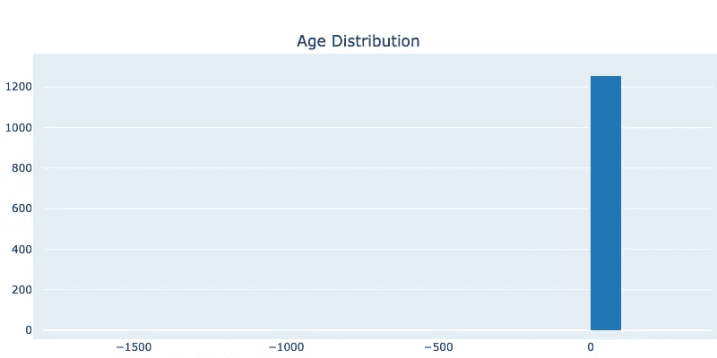

年龄分布的初始直方图

我们稍后将处理异常值，现在，我们将实施一个简单的业务规则——年龄应该在 14 到 100 之间——并且我们将认为该区间之外的所有值都是缺失的。

年龄直方图现在更有意义了。

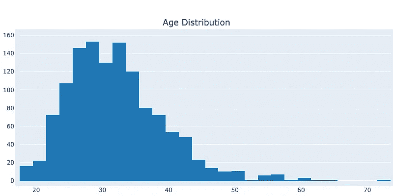

添加了受访者年龄必须在 14 到 100 岁之间的规则后的年龄分布直方图。

性别是问卷中另一个开放式的答案，所以这个专栏包括了很多很多拼写男性、女性和非二进制的方法。幸运的是，大多数都可以使用正则表达式和一些模糊匹配来纠正。

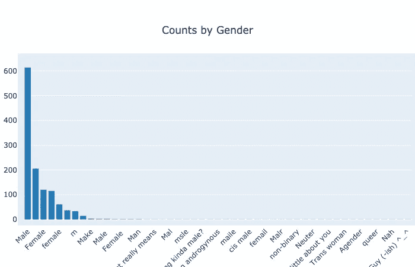

调查结果中性别(计数)的初步分布。

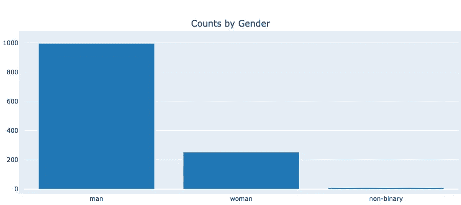

清理后的性别分布(计数)。

接下来，国家的分布似乎没有同样的问题(没有拼写错误)，但有一大群国家出现的频率非常低。这里不需要采取特别的行动，但是一个可能的选择是将分析限制在国家的一个子集——哪些国家将取决于我们正在寻找的答案的类型。这里的一个选择是将分析限于美国的数据。

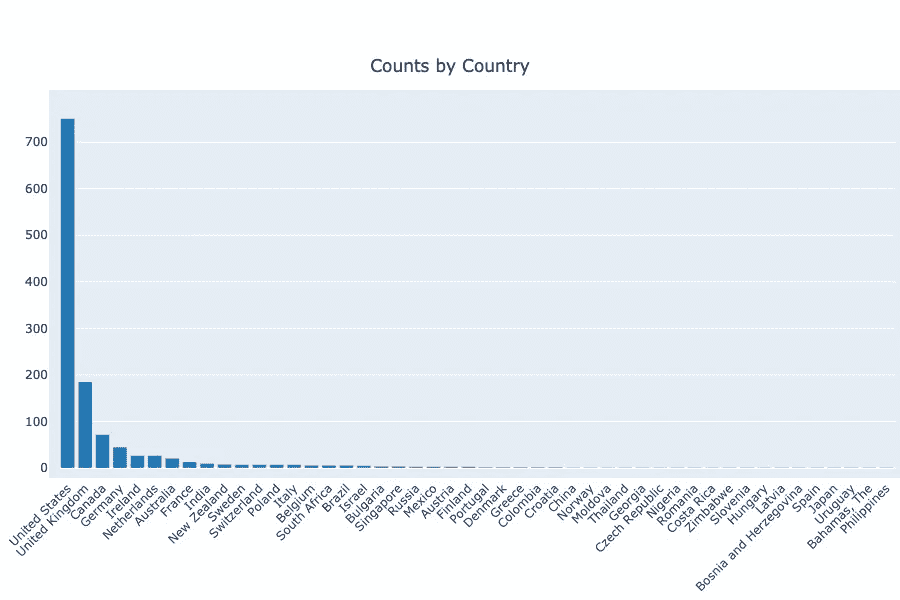

## 极端值

离群值也没有严格的定义。异常值是与其他观察值显著不同的数据点。这可能是由测量中的实际变化或误差引起的。

因为离群值没有单一的定义，每个项目定义离群值的方式决定了检测离群值的方法。一种常见的方法是 Tuckey ' s fence，也称为箱线图规则。该方法基于四分位数范围(IQR)，即*第一个四分位数 Q1* 和*第三个四分位数 Q3* 之间的差异:范围*【Q1-k *(IQR)，Q3+k *(IQR)】*之外的任何观察值都被标记为异常值。传统上， *k=1.5* 用于常规异常值，而 *k=3* 用于大异常值。

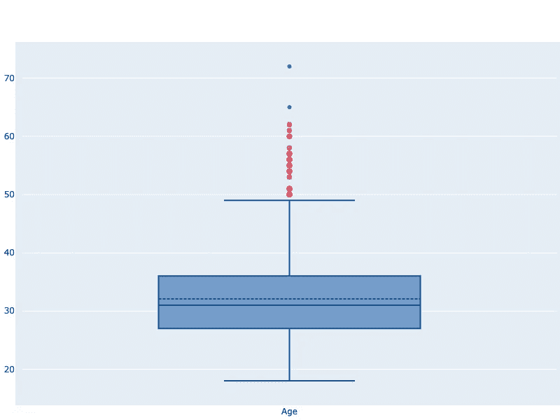

年龄箱线图。方框表示第一和第三四分位数之间的年龄分布，分别由方框的下侧和上侧表示。Q1 和 Q3 之间的实线代表中值，虚线代表平均值。红色和深蓝色点分别代表常规(k=1.5)和大(k=3)异常值。

由于一些模型(例如线性回归)对异常值的稳健性不如其他模型，因此在选择模型之前了解它们的存在是有好处的——虽然我们现在不需要采取行动，但我们会标记它们并进入下一步。

请注意，这种方法最适用于有点*正态分布*的数据，但不适合，例如，两边都有很大[偏斜](https://en.wikipedia.org/wiki/Skewness)的数据。

## 缺失数据

缺失数据是类型已知但值未知的数据点，例如调查中未回答的问题。大多数机器学习模型不处理丢失的数据，这意味着丢失的值必须被删除或替换。有 3 种主要机制会导致数据丢失，能够区分这三种机制非常重要，因为丢失数据背后的机制将决定如何处理它。

*   完全随机缺失(MCAR):导致特定值缺失的因素与可观察(或不可观察)变量无关。例如，*有些人不填写心理健康调查*暗示 MCAR——没有具体的原因会发生这种情况。
*   随机缺失(MAR):缺失数据背后有一种非随机的可观察机制。例如，*男性不太可能填写心理健康调查，因为他们是男性*暗示着 MAR:只要我们能观察到变量*性别*，我们就能解释缺失数据的非随机性，并建立无偏估计量。
*   不是随机失踪:失踪是由于一些不可见的因素。例如，*男性不太可能填写心理健康调查，因为他们的心理健康*暗示 MNAR。

那么如何看待缺失数据呢？在某些情况下，例如当一列有大量缺失值时，删除是一种有效的方法。然而，在大多数情况下，缺少的值会被替换为一些替代值。这个过程叫做*插补*。有许多可能的估算方法，有些比另一些更复杂。

*   **数值**插补:用单个值代替所有缺失的观察值，通常是平均值。
*   **从分布中随机选择**。
*   **热卡**插补:缺失值从数据集中的相似记录进行插补。
*   **KNN** 插补:确定最近的邻居，并使用他们值的集合来插补缺失的那个。

没有单一的规则来决定使用哪种方法，选择取决于多种因素的组合，如缺失数据的记录数量、我们正在处理的数据类型、特定的用例以及缺失的底层机制。要记住的一条重要规则是，插补不应改变数据的分布，因此比较插补前后的分布是一种好的做法，以确保我们没有注入任何偏差。

让我们看几个科技心理健康调查的例子。

自主创业的变量有一些缺失。对于其中的每一个，我们将从所有可能值的集合中随机选择一个值(*是/否*)，其概率与数据集中*是/否*的分布成比例。这确保了插补后的分布是相同的。

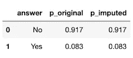

在(p_original)插补之前和(p_imputed)插补之后自营职业的概率。

在这个过程的第一阶段，我们发现年龄有一些超出范围的值，我们决定假设它们丢失，所以现在是时候估算它们了。对于这个变量，我们将使用一个更有趣的方法:KNN 插补。对于每个年龄缺失的受访者，我们会找到最相似的邻居，并用这些邻居的平均年龄来估算缺失值。

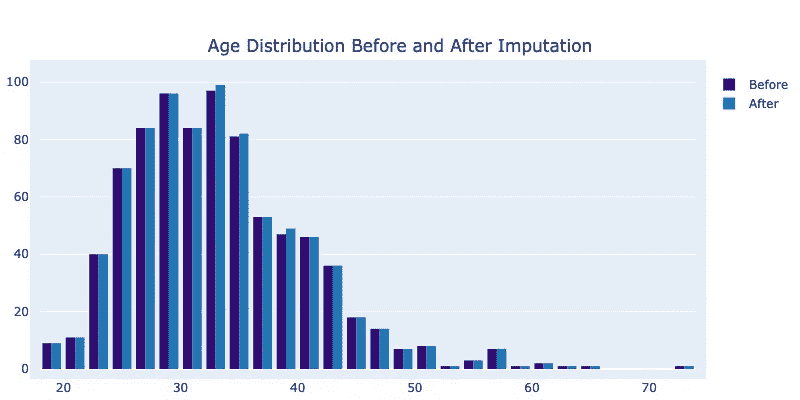

插补前后的年龄分布。

# 流程和最佳实践

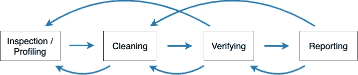

预处理不是一个线性过程。您可以在流程的任何给定点返回、编辑和重复所有步骤。

通常有 4 个主要步骤。

1.  **检查:**检测意外的、不正确的和不一致的数据(数据剖析和可视化)。
2.  **清除:**删除、纠正或估算不正确的数据。
3.  **验证:**现在数据正确吗？重新检查和测试以验证没有违反假设。
4.  **报告:**记录发现的不一致和错误，以及它们是如何解决的。

这些步骤在概念上是连续的，但过程远不是线性的！在任何给定的步骤中，您可能必须返回、编辑并重复所有步骤，这甚至可能发生在您将数据输入到模型中之后，因此重要的是，它们中的每一个都被很好地记录下来并可重复，并且没有任何东西是手动编辑的，无论多么简单，将来您会非常感激。

# 摘要

这不是一个完整的预处理指南，但它应该给出一个更清晰的过程是什么样子的前景。有许多决策要做，而解决方案并不总是直截了当的，这就产生了许多可能的故障点。花时间分析和准备数据将使您更好地理解手头的问题，同时确保输入预测模型的数据真正代表正在解决的问题。这一点尤为重要，因为越来越多的决策过程依赖于机器学习模型来做出公平的决策，因此这些模型必须根据可靠、一致和无偏见的数据进行训练。