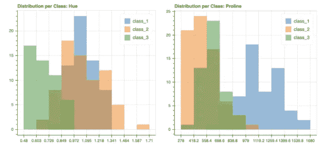
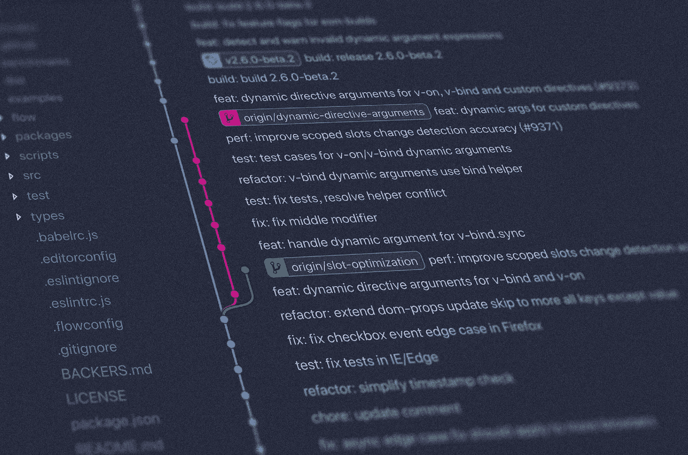
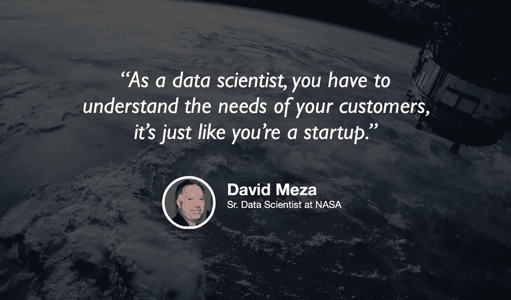

# 从创意到生产

> 原文：<https://towardsdatascience.com/from-idea-to-production-ba18e346c6d1?source=collection_archive---------71----------------------->

## [如何将一个数据科学项目从想法变为现实](/how-to-take-a-data-science-project-from-idea-to-production-8216a653011f)

由[凯特·玛丽·路易斯](https://medium.com/u/feb55b31bbd5?source=post_page-----ba18e346c6d1--------------------------------) — 16 分钟阅读

我面试过很多数据科学候选人，他们都是各种各样的角色。从初级数据科学家到雇佣我所在的数据科学团队的负责人。在我参加过的无数次面试中，有几个问题是我非常喜欢反复问的。

## [熊猫变漂亮了](/plotting-in-pandas-just-got-prettier-289d0e0fe5c0)

丽贝卡·维克里——5 分钟阅读

流行的 Python 数据分析库 Pandas 中的绘图功能一直是我制作超级快速图表的常用方法之一。然而，可用的观想总是相当基础的，并不特别漂亮。

## [重新思考数据科学的持续集成](/rethinking-continuous-integration-for-data-science-ebf0dfc61788)

爱德华多·布兰卡斯 — 29 分钟阅读

随着数据科学和机器学习得到更广泛的行业采用，从业者意识到部署数据产品会带来高昂的(往往是意想不到的)维护成本。

## 搭配:火烧考拉([第一部](/matching-koalas-on-fire-part-1-17691bb85c23)、[第二部](/matching-koalas-on-fire-part-2-71083b81b50b))

由 [Svitlana Midianko](https://medium.com/u/4f904fbe39bd?source=post_page-----ba18e346c6d1--------------------------------) 和 [Magali de Bruyn](https://medium.com/u/cbf0012f471c?source=post_page-----ba18e346c6d1--------------------------------) — 15 分钟读取

匹配是一种计算工具，用于提高因果推理的稳健性或可信度。为此，它将来自治疗组的数据点与来自对照组的数据点配对——基于它们在所选特征上的相似性。

## 美国宇航局的数据科学

杰瑞米·哈里斯和大卫·梅萨

机器学习不是火箭科学，除非你在 NASA 做。如果你碰巧在美国国家航空航天局做数据科学，你和我今天播客的嘉宾大卫·梅萨有共同之处。