# 从不平衡数据集到助推算法

> 原文：<https://towardsdatascience.com/from-imbalanced-dataset-to-boosting-algorithms-1-2-798cd6384ecc?source=collection_archive---------26----------------------->

## 艰难的教训，真正的秘诀

## 不平衡数据集完整工具包

在 [Unsplash](https://unsplash.com?utm_source=medium&utm_medium=referral) 上 [engin akyurt](https://unsplash.com/@enginakyurt?utm_source=medium&utm_medium=referral) 拍摄的照片

## 不平衡数据集出现问题有两种不同的情况。

第一类是当错误分类的成本对少数阶级来说比多数阶级高得多的时候。换句话说，我们模型的主要目标是最小化假阳性预测。一些例子是:检测信用卡欺诈，客户流失，检测一种罕见的致命疾病。为了更好地理解不同类型的错误预测如何转化为实际的业务成本，请查看我的帖子: [*为什么我们必须谈论第一类错误和第二类错误？*](/programming-journal-4-why-do-we-have-to-talk-about-type-1-error-and-type-2-error-41b3ae68bb96)

第二种是我们没有为少数群体收集足够的数据。我们的样品不够有代表性。换句话说，不平衡的数据集应该是平衡的。

在 python 中，我们的工具箱中有几个工具可以修复不平衡的数据集。然而，每个工具都是为解决不同类型的问题而构建的。

## 文章大纲:

1.  介绍所有工具:下采样，上采样，平滑，改变类权重
2.  用我上周完成的项目展示他们用树算法的表现。
3.  讨论我们应该何时使用每种工具
4.  解释与升压算法的联系和比较

## 工具概述

**下采样:**从多数类中随机选择一些点并删除。

**上采样:**从少数类中随机选择一个点，复制粘贴做一个新点。重复这个过程，直到你有和大多数班级一样多的样本。

**SMOTE:** 在少数类中创建更多的样本。然而，不是通过复制现有的数据点，而是通过在可能的范围内创建新的点。换句话说，它在现有数据的周围创建新的数据点**。请参见下图进行说明。(关于这个的一个很棒的视频: [SMOTE(合成少数过采样技术)](https://www.youtube.com/watch?v=U3X98xZ4_no&t=384s))**

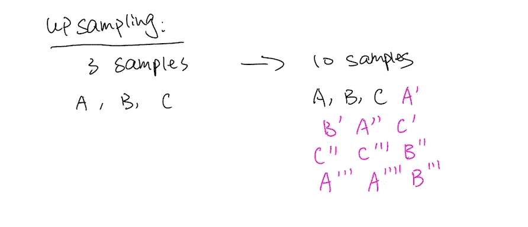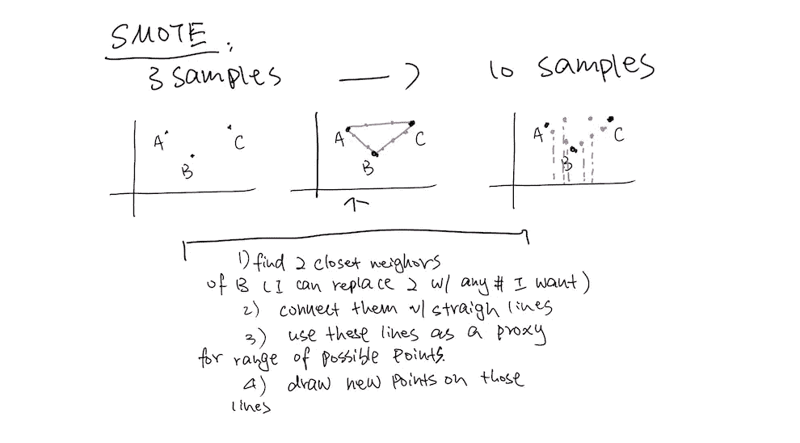

**调整等级权重**:有两种方法可以实现。一种是将决策树和随机森林中的参数 *class_weights* 改为*class _ weight =‘balanced’*。该算法将使用分层抽样来构建树，而不是默认设置:随机抽样。

第二种方法只适用于随机森林。您可以手动将权重分配给不同的类别。下面我就分享一下代码。通过给一个阶层分配较重的权重，我们将使用加权基尼系数。加权基尼系数将使我们用来制作树的所有变量对少数民族阶层更加敏感。例如，当我们计算我们的基尼系数时，能够更好地识别少数群体的变量将具有较低的杂质分数，因此，更有可能被选择来构建一个树。

## 性能概述

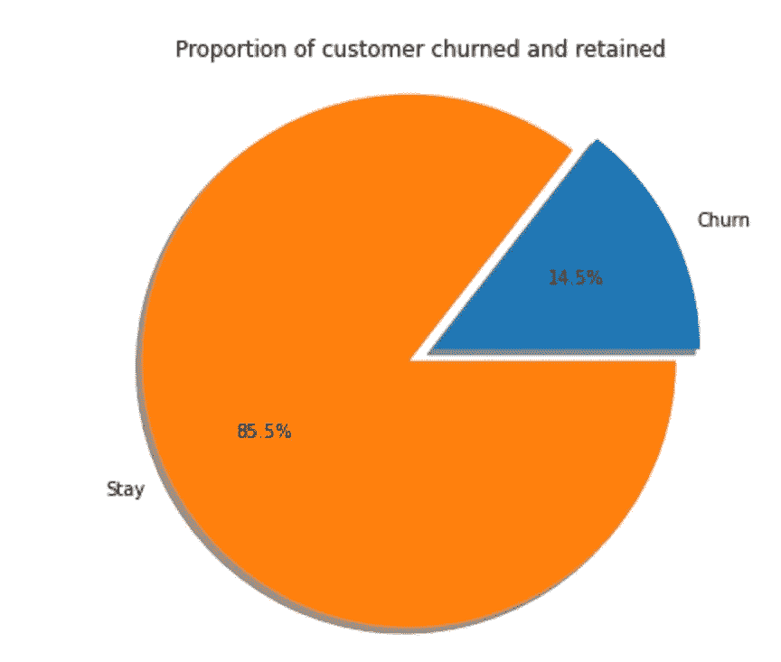

[我通过 Kaggle 进行的全面流失分析](https://www.kaggle.com/taliac/customer-churn-using-tree-models)

背景:数据集来自一家电信公司。它有 3333 个样本([原始数据集](https://www.kaggle.com/barun2104/telecom-churn)通过 Kaggle)。在这些样本中，85.5%来自“流失= 0”组，14.5%来自“流失= 1”组。目标是预测客户流失。我将展示 4 种树算法的性能——决策树、随机森林、梯度推进和 XG 推进。

**原始数据集的性能:**

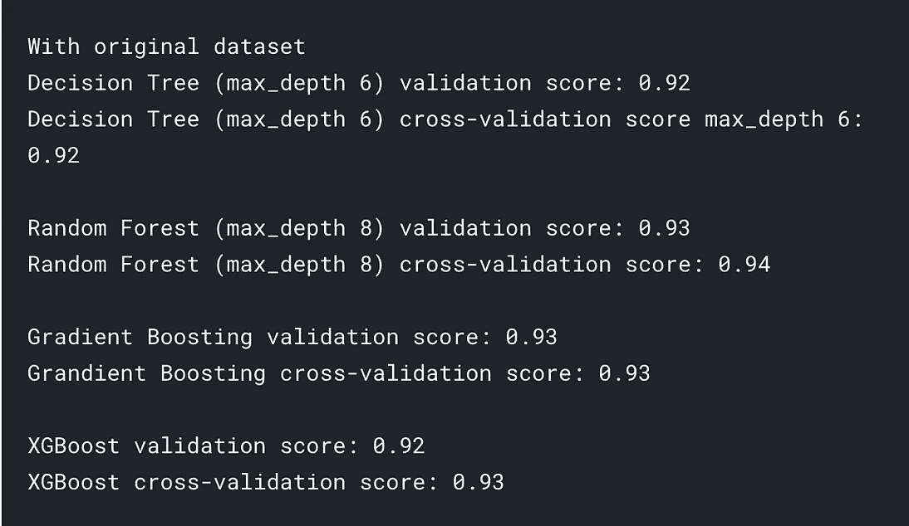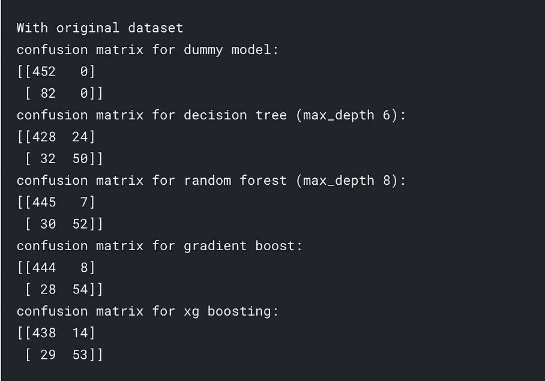

[全面分析](https://www.kaggle.com/taliac/different-resampling-methods-for-trees)

**下采样后的性能:**

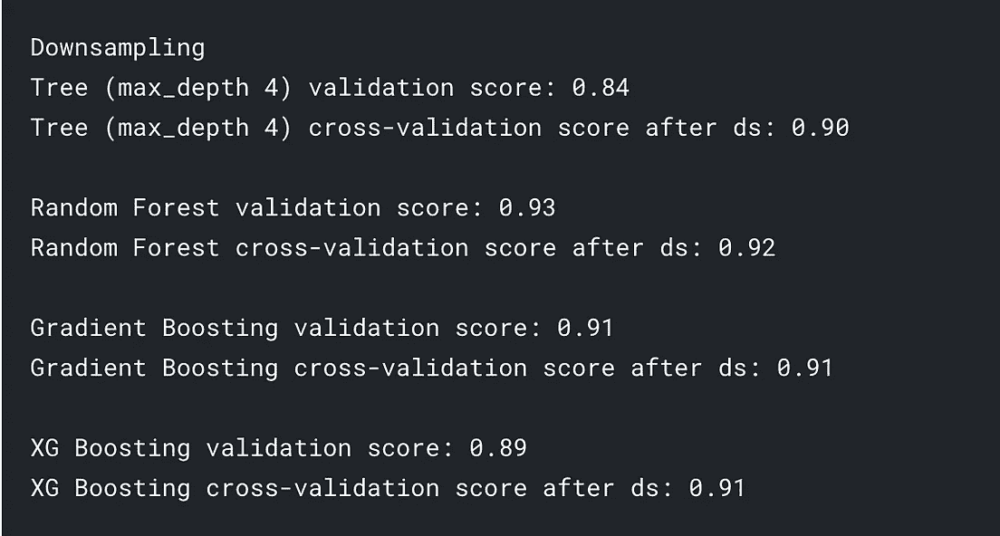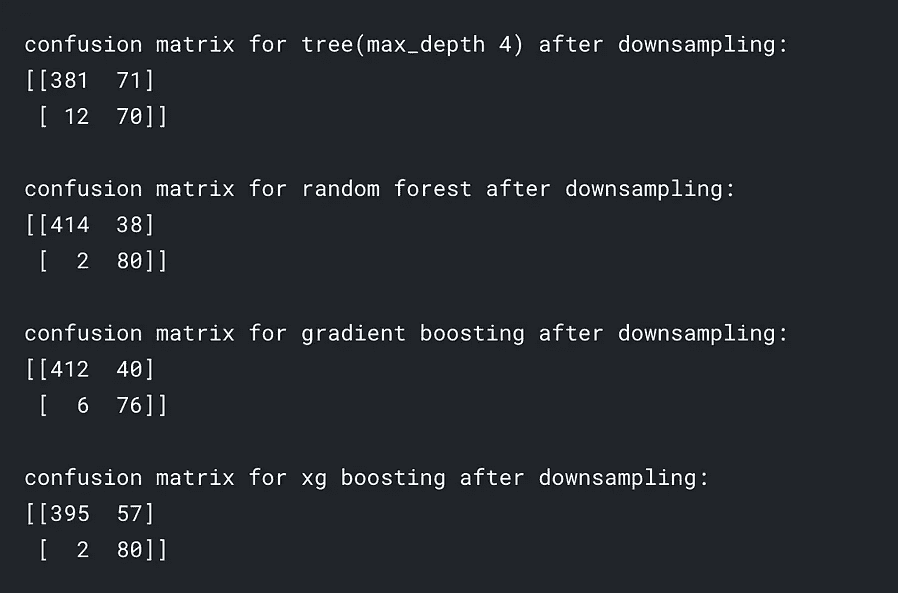

[全面分析](https://www.kaggle.com/taliac/different-resampling-methods-for-trees)

缩减采样代码

**上采样后的性能:**

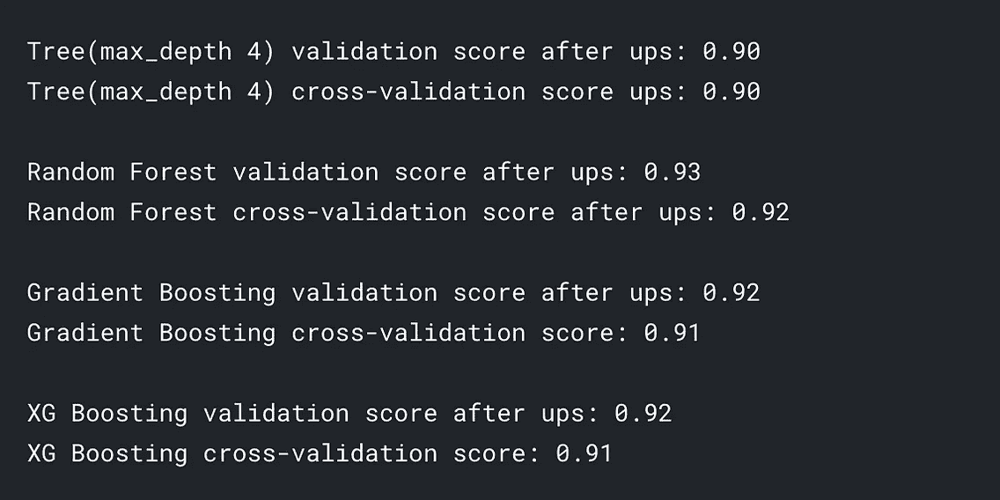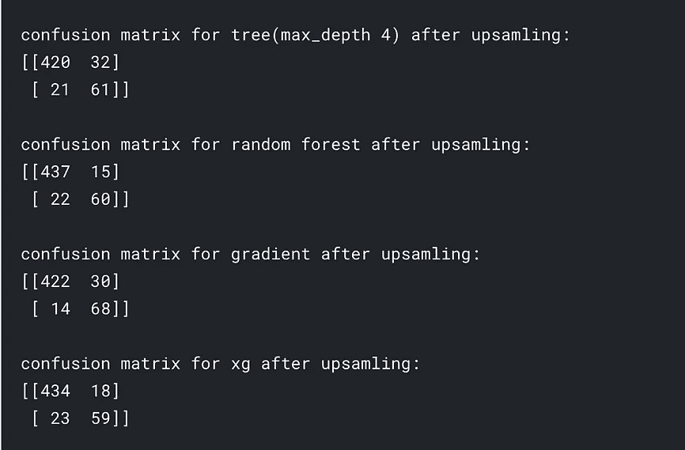

[全面分析](https://www.kaggle.com/taliac/different-resampling-methods-for-trees)

用于上采样的代码:

**击打后的表现:**

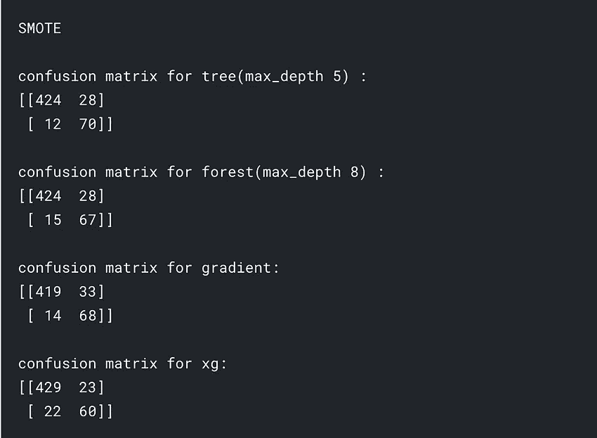

[全文分析](https://www.kaggle.com/taliac/different-resampling-methods-for-trees)

**RF 和决策树使用平衡类权重的性能:**

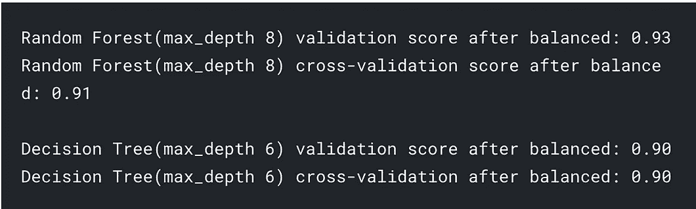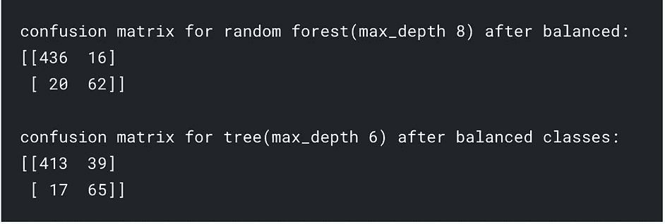

[全面分析](https://www.kaggle.com/taliac/different-resampling-methods-for-trees)

**手动调整权重后射频的性能**

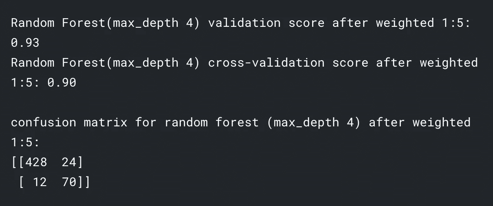

[全面分析](https://www.kaggle.com/taliac/different-resampling-methods-for-trees)

## 见解:

当谈到每种方法的优缺点时，许多文章都是这样说的:

**随机下采样:**遗漏一些有价值的信息。众所周知，样本越多越好，因为这让我们更接近现实。但是下采样减少了样本。

**随机上采样**:倾向于过度拟合少数群体的现有数据点，因为我们一直在复制现有数据点。

这个弊端其实从上面的分析就反映出来了。比较假阳性的数量，上采样的假阳性没有其他方法减少的多。

**SMOTE 和加权类:**通常被描述为“高级”方法，用来克服下采样和上采样的缺点。确实，SMOTE 找到了一种合理的方式来提供新数据，这是一种革命性的想法。加权类方法保留了所有的信息，这也是事实。

但是如果你是商业决策者，看着结果，你会选择哪种方法？

要回答这个问题:我们可以用数字来表示事物。我们就挑随机森林的表现来举例吧。假设在我们预见到客户会流失之后，我们能够挽救所有的客户。

*   缩减采样成本=失去 2 个客户+在 38 个客户身上浪费营销努力和金钱，因为我们认为我们会失去他们
*   上采样成本=失去 22 个客户+浪费 15 个客户。
*   SMOTE 成本=失去 17 个客户+浪费 27 个客户。
*   平衡级成本=失去 20 个客户，浪费 16 个客户。
*   加权成本=失去 12 个客户，浪费 24 个客户。

尽管成本会因行业而异，但我愿意说我会选择下采样。一是因为我失去的客户最少，这是我的首要目标。另一个原因是，既然这 38 位客户打算和我们住在一起，我想我们应该不会花太多精力或成本去“拯救”他们。

当然，这取决于我们的“储蓄”方法和样本量的大小。如果我们有一万个客户，考虑的可能就不一样了。

> **不管怎样，这里的关键观点是——没有更好或更坏的方法，我们需要始终牢记上下文。**

Gif via [GIPHY](https://media.giphy.com/media/TKpMzTvUcqlT8HGAyG/giphy.gif)

## 有一般的经验法则吗？

是的。我提到过不平衡的数据集成为问题的两个原因。第一类是假阳性数字对我们来说比整体准确性更重要。类型 2 在数据收集过程中有偏差。流失率问题是第一类问题。换句话说，这里的主要问题不是我的数据集有偏差，而是他们是天生的少数。在这种情况下，下采样和加权类最好地解决了我们的问题，因为它们扩大了少数类的声音。

如果我们面对的是 2 型问题，那么 SMOTE 应该比其他方法更好，因为它在少数类中引入了新的样本。它试图填补少数阶级的空白，缓解有偏见的人。

上采样和平衡类方法的工作方式相同，因此结果非常相似。它们并不特别适合任何一种类型。原因是在你不停地从少数数据集复制数据之后，不可能没有过拟合的问题。

萨汉德·巴巴里在 [Unsplash](https://unsplash.com?utm_source=medium&utm_medium=referral) 上的照片

## 有趣的技术见解:(随意跳过)

注意最大深度和假阳性的数量。在下采样中，如果我限制深度，我实际上会有更多的假阳性和更低的准确性。但是在手动调整类权重时，我减少的深度越多，我得到的假正数就越少。缺点是我会因为一个 0 的假阳性数字而牺牲整体的准确性。

这个细节真正展示了这两种方法之间的区别。当使用缩减采样时，我们仍然通过寻找最佳变量进行分割来构建树。它就像一个普通的随机森林。随机森林非常适合处理过度拟合。当我限制深度时，我可能真的会不适应。而且不可能有 0 假阳性，除非我们以后做一些正则化。

然而，在调整类权重的情况下，它像正则化一样工作。也就是说，我们需要小心选择重量。

## 增压连接

通过调整类权重，我们刚刚从 bagging 算法转移到伪 boosting 算法。

再看看数据。您是否注意到加权类的性能与 boosting 算法的性能非常相似？还有，你注意到别的了吗？梯度增强和 XG 增强这两种增强方法没有其他两种树方法波动大。他们的两类错误一开始也更平衡。这是为什么呢？

GIF via [GIPHY](https://media.giphy.com/media/CDJo4EgHwbaPS/giphy.gif)

bagging 和 boosting 算法的核心区别之一是，在 bagging 算法中，它遵循 1 树 1 票的规则。不管在什么情况下，没有一棵树高于另一棵树。对于助推来说，不等于。在最终决定上，有些人会比其他人更有发言权。不同的提升算法有不同的方式来决定一棵树在最终决策中有多少发言权。但原则是，声音是不平等的。因此，我说加权随机森林是伪提升算法。

## 为什么这只是伪 boosting 算法而不是 boosting 算法？

不同之处在于 boosting 算法改变样本的权重，而加权随机森林改变类的权重。如果以人为类比。一个加权随机森林说:每个投 A 的人都会被多算。一个增强算法说:谁更有资格，谁就能投更多的票。

棘手的部分是:我们如何证明谁比谁更有资格，权力大多少？这就是助推算法试图解决的问题。

## 那么为什么 boosting 算法波动更小呢？助推算法一瞥。

在助推算法的背景下，谁是“合格的人”？他们是产生更多正确结果的树，并且持续地产生正确结果。

如果树 X 总是比树 Y 产生更多正确的结果，那么树 X 比树 Y 更善于识别少数类(当存在不平衡的数据集时，所有的树都善于识别多数类)。增强算法放大这些声音。这就是为什么 boosting 算法一开始就比其他算法做得更好。

Boosting 算法通过反复测试不同树的准确性来确保性能的一致性。该算法在每次测试后调整树的功率，直到调整仅具有微小的波动。这是 boosting 和 bagging 算法之间的第二个主要区别(第一个是分配不同的权重)。在 bagging 算法中，树有许多期末考试，期末成绩是通过和失败的简单相加。在推进算法中，你有测验和期中考试。每次测验都会影响你的期末成绩。

因此，有了一个平衡的数据集，无论数据集的结构如何，产生更正确结果的树总是占主导地位。这就是为什么在我们实现 SMOTE 和上采样后，梯度增强的性能丝毫没有改变。

> 因此，第二个关键的见解是:当你不确定不平衡的主要原因是什么时，使用一个增强算法。你会少错一些。

好了，这是升压算法的一瞥。我正在写一篇文章来更详细地解释 boosting 算法。

GIF via [GIPHY](https://media.giphy.com/media/fnDY3C9MKukcER71r7/giphy.gif)

更多信息:

*   [成本敏感学习与阶层失衡问题](https://cling.csd.uwo.ca/papers/cost_sensitive.pdf)，x .凌，s .盛
*   [树木的不同重采样方法](https://www.kaggle.com/taliac/different-resampling-methods-for-trees/data?scriptVersionId=34283208#4.-Models-With-Resamplings)我在 Kaggle 上的原始重采样分析
*   [使用树模型的客户流失](https://www.kaggle.com/taliac/customer-churn-using-tree-models)我在 Kaggle 上的全面流失分析