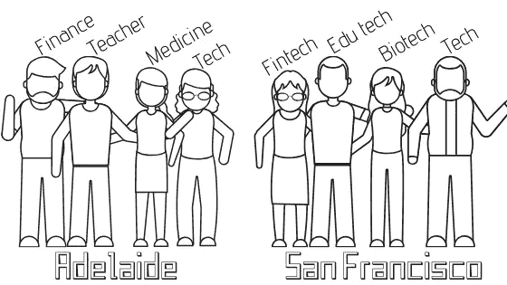

# 从隐形女人到派对生活

> 原文：<https://towardsdatascience.com/from-invisible-woman-to-life-of-the-party-75f8e412d386?source=collection_archive---------27----------------------->

## 硅谷的一份数据科学工作改变了人们对我价值的看法

我在阿德莱德的朋友有各种不同的职业，但在旧金山，我遇到的几乎所有人都是科技行业的。我制作了这张图片来说明不同之处。

当我第一次搬到硅谷时，是为了在一个世界领先的研究中心进行脑瘤研究。很有趣，对吧？似乎不在旧金山。

在澳大利亚，我的朋友们有着不同的背景和职业。我喜欢我们都有不同的观点。当你能听到别人的观点和经历与你不同时，谈话会变得有趣得多。我的朋友中有律师、教师、会计师、护士、美容师和许多不同的职业。

认识拥有这些不同专业知识的人不仅有帮助，还能让生活不会变得无聊。我不知道你怎么想，但是当我下班的时候，我不想在我和朋友在一起的时候谈论我的工作。那将是极其单调的。相反，我喜欢和朋友交谈，给我新的想法来处理事情。

我的工作只是我的一部分。

我需要我的友谊来培养我的整个自我，而不仅仅是我的职业部分。所以我喜欢和与我有共同价值观和兴趣，但又与我不同的人在一起。

当我完成博士学位时，我有一种变得狭隘的倾向。我的研究将永远在我脑海深处滴答作响。所以花时间和科学之外的人在一起让我的大脑得到喘息是很重要的。这让我不会太专注于自己的工作。

[https://gph.is/YZB09a](https://gph.is/YZB09a)

我坚信人们的工作可能很有趣，但它们很少是一个人最有趣的事情。我喜欢倾听人们的激情。例如，我在阿德莱德有一些朋友，他们喜欢骑越野自行车下坡、钩针编织、研究古埃及、芭蕾、肚皮舞、摇摆舞和在唱诗班表演。

搬到世界的另一边是很难的，我离开了我的朋友和家人去追求我的研究事业。我积极努力去认识新的人，结交新的朋友。然而，我发现我在高科技聚会上受到的接待并不热情。

社交聚会往往不是为了社交，而是为了获得优势。湾区是非常短暂的。人们倾向于去科技圣地做科技。每个人都想结交朋友，这使得结交真正的朋友变得更加困难。你知道那种你可以真正交谈的人。只是闲逛和喝杯茶，而不是计划令人兴奋的郊游。

当人们发现我不在科技行业工作时，他们似乎完全没有兴趣了解我。你有没有遇到过有人在你谈话时鬼鬼祟祟的？看到他们眼中的变化，从评估你的潜力到忽略你，再到扫视房间寻找另一个潜在客户，这给人留下了深刻的印象。

当我在旧金山的一家初创公司找到第一份数据科学工作后，一切都变了。我突然变成了一个很酷的孩子，人们想知道我的一切。令人不安的是，我的感知价值与我的职业联系如此紧密。

你想知道为什么科技有包容性问题吗？技术不重视不从事技术的人。

# 我的癌症研究

我的研究旨在帮助脑瘤患者，或者从一开始就阻止他们生长。旧金山以外的大多数人都觉得这很有趣。

让我给你高水平的音高。

近年来，癌症治疗越来越好。随着早期检测和这些新的治疗方法，越来越多的人从他们的原发性癌症中存活下来。今天，许多癌症死亡是由于癌症扩散到身体的其他部位。这些继发性癌症很难治疗。

乳腺癌经常扩散到大脑。血脑屏障应该阻止癌细胞从血液循环进入大脑，但出于某种原因，它没有。科学家们不知道为什么癌细胞可以通过。我的博士研究调查了癌细胞如何穿过血脑屏障进入大脑。有点意思，对吧？

在我的博士后论文中，我研究了大脑中正常细胞如何变成癌细胞。大脑中的大多数细胞都是高度特化的，因此不再分裂。一般来说，正是分裂最频繁的细胞获得了导致癌症的基因突变。干细胞是大脑中少数仍在分裂的细胞类型之一。我所在的实验室研究了神经干细胞是否是脑癌的起源细胞。

如果我们是正确的，这将意味着我们可能能够开发出一种早期干预或药物来预防脑瘤的形成。对于癌症来说，唯一比治疗更好的是预防。

在我搬到旧金山之前，我遇到的人都有兴趣更多地了解大脑是如何工作的，以及为什么癌症无法治愈。然而，当我住在硅谷时，这一切都变了。

# 成为隐形女人

我和我的男朋友搬到了旧金山，他在一家科技创业公司工作。我们参加了很多科技聚会和创业发布会。我参加这些聚会和联谊会的目的是认识新的人和交朋友。我不想在一个新的地方生活感到孤独。所以当我发现人们对认识我不感兴趣时，我很沮丧。

做一个科技行业的女性很难，做一个非科技行业的女性会让你隐形。

科技派对让人觉得排外，我不是其中一员，至少现在不是。在技术领域，你会在工作中交到朋友。他们只对为自己的创业公司建立关系网、筹集资金和招聘人才感兴趣。

当我的男朋友在这些活动中向人们介绍我时，他们最初会问我做了什么。当我告诉他们我的研究时，我得到了与我在澳大利亚得到的截然不同的反应。旧金山人似乎比澳大利亚人更痴迷于人们的工作。

他们的目光会变得呆滞，从我身边滑过，落到下一个人身上。或者他们会开始从我的肩膀上看还有谁在那里。有一次，一个家伙甚至滑稽地向后转，朝另一个方向走去，就像在一个训练队里一样。

在我看来，他们的行为相当粗鲁。他们甚至不能假装有礼貌。人们希望从他们遇到的人身上得到一些东西，如果我不能帮助他们，那么他们需要尽快离开。

有几个例外，但我基本上被忽略了。创业界的人似乎对我或我做的事情一点也不感兴趣。

似乎一旦他们意识到我没有直接的价值可以传授给他们萌芽中的创业企业，他们就想尽快离开。这些人是铁杆网络爱好者，他们很快就意识到认识我对他们没有任何好处。因此，他们不想浪费时间进行礼貌的闲聊。

这确实让我想知道旧金山是不是适合我的地方。这些人我根本不认识。所以如果他们不想跟我说话，我也能克服？但后来还是不断发生。

过了几个非常无聊的晚上后，我开始想，如果我没有一份技术工作，我是否会在硅谷交到朋友。我会尴尬地站在一群人中间听着，对谈话没什么贡献。

在大多数这些聚会上，我都感到很不自在。他们主要是 20 多岁或 30 多岁的白人男性。我是那里为数不多的女性之一，也是为数不多的不从事技术工作的人之一。

我还想知道，我收到的部分不热情的回应是否可能是因为那些经常被技术职业所吸引的人。我遇到的一些人可能在与非技术人员交谈时缺乏自信。也许他们不重视闲聊，并为与技术无关的交流而挣扎。

# 初创公司的数据科学家

住在旧金山时，我决定放弃癌症研究，转而从事数据科学。科技场景的诱惑对我来说太大了。如果你想更多地了解我是如何实现这一职业转变的，你可以在我之前的一些故事中找到细节，比如[‘我是如何在 6 个月内从零编码技能变成数据科学家的](/how-i-went-from-zero-coding-skills-to-data-scientist-in-6-months-c2207b65f2f3?source=friends_link&sk=89a5e171073c63d1eea389e80425a702)’。

更高的工资、更好的条件和更直接的影响的诱惑让我在硅谷的一家医疗保健初创公司找到了一份数据科学的工作。我开始着手分析大量医疗索赔数据，以帮助美国人做出更好的医疗决策。

因此，我进入了神圣的创业领域，不仅草更绿，而且有一个园丁为你照顾它。在科技行业工作完全改变了人们对我的看法。

# 我的新人气

我突然就红了。我在科技活动中遇到的人想向我推销他们的想法。有时希望我能把他们介绍给我认识的人。其他时候，他们希望我加入他们的团队。

他们问了我所在团队的情况，工作流程如何，我喜欢什么，不喜欢什么，以及许多后续问题。

从一个社会弃儿变成一个受欢迎的孩子是一种奇怪的感觉。即使人们真的在听我的每一句话，就像我要揭示生活的秘密一样，这感觉很空洞。我总能感觉到要求的到来，他们不可避免地想要一些东西，一些他们认为我可以带给他们努力的东西。

> 以这样一种方式行事，你对待人类，无论是对你自己还是对他人，总是同时作为一个目的，而不仅仅是一种手段。
> 
> -伊曼纽尔·康德

我当然有这样的印象，我更多的是“达到目的的手段”,而不是目的本身。我猜之前被忽视的经历让我变得愤世嫉俗，多疑。我觉得这些品质并不吸引我。所以我努力改变自己的态度，用新的眼光看待每一次新的互动。

我想，人们尽最大努力让自己的创业公司起步，并尽可能地建立联系，这并没有那么糟糕。如果他们在这个过程中没有让我觉得被评判，那就好了。我还认为，如果他们对别人和他们要说的话更感兴趣，他们会更成功地找到他们想要的东西。但这只是我的拙见。

# 我如何在旧金山交到真正的朋友

科技行业的某些部分可能非常排外，甚至当你身处其中时也是如此。我最初在旧金山结交的许多朋友都不是来自科技界。

我通过我的博士后和我的同事交了朋友。我发现的另一个认识人的有用途径是通过我的爱好。当我住在海湾地区的时候，我参加了很多马戏班。我尝试了空中飞人、空中丝绸、天琴座和杂技，所有这些都吸引了奇怪但精彩的人群。

最终，当我成为旧金山一家医疗保健初创公司的数据科学家后，我和许多同事成为了好朋友。有趣的是，这些技术人员有着广泛的外部兴趣。两个是作者，一个创建了技术杂志，一个曾经是僧侣，一个在瓶子摇滚乐队演奏，一个是合格的跳伞教练，一个是令人敬畏的吉他手，一个创造了惊人的光艺术装置。我可以继续说下去，但你应该明白。

所以最终我在科技行业找到了我的部落。我觉得这些朋友把我当成了一个完整的人，而不仅仅是技能和关系的集合。有一群我可以完全做我自己的人在一起是如此的不同。

在技术领域找到我的人也帮助我享受旧金山提供的所有冒险。我和我的同事们有机会去海湾航行，在电影放映前看阿拉米达的达人秀，参加瓶摇滚音乐节，我的朋友在那里，在奥克兰的 Yoshis 看我从未见过的古典吉他手，去 Taho 滑雪，参加 Hardly Strictly Bluegrass 等等。如果没有我在那里遇到的人，我永远也不会发现所有这些事情。

所以一旦我周围有了这些支持我的人，海湾地区就更像是我的第二个家了。

除了数据，我的另一个爱好是绘画。你可以在 www.katemarielewis.com 找到我的野生动物艺术

# 了解我是如何成为数据科学家的:

 [## 我如何在 6 个月内从零编码技能成为数据科学家

### 我用来自学数据科学的 4 个工具没有花一美元

towardsdatascience.com](/how-i-went-from-zero-coding-skills-to-data-scientist-in-6-months-c2207b65f2f3)  [## 让我获得第一份数据科学工作的面试策略

### 我是如何展示自己得到这份工作的

towardsdatascience.com](/interview-strategy-that-landed-me-my-first-data-science-job-bdd5e77bfb49)