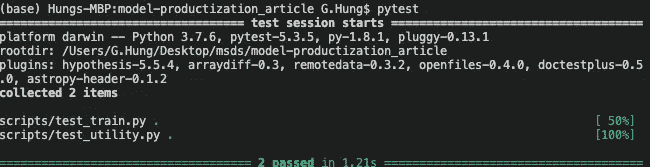

# 从朱庇特笔记本到剧本

> 原文：<https://towardsdatascience.com/from-jupyter-notebook-to-sc-582978d3c0c?source=collection_archive---------3----------------------->

## 不要玩玩具模型；准备好生产你的作品吧！

> 8 月 16 日:[从脚本到预测 API](/from-scripts-to-prediction-api-2372c95fb7c7)
> 
> 2 月 23 日:[从 cURL 到自动化工作流程](https://medium.com/@geoffreyhung/from-curl-to-automated-workflow-d79c7c108450)
> 
> 2022 年 1 月:[面向高级初学者的 Python](https://medium.com/@geoffreyhung/python-for-advanced-beginners-cd39b42ef10)

作为高级初学者，我们知道很多:EDA、ML 概念、模型架构等……我们可以写一个大的 Jupyter 笔记本，点击“重启并运行全部”,生成最先进的结果。好吧，接下来呢？别人如何使用/复制/扩展你的成果？

在本文中，我将向您展示我如何将 Jupyter 笔记本从葡萄酒数据集上的 Kaggle 转换为脚本，分享一些我们可以轻松适应并立即带来好处的工程实践。

对于它们中的每一个，都有更多的内容需要挖掘，但我们将只介绍基本的内容，展示其优势，并解释思考过程！目标是尽量减少工程师在和你说话时翻白眼的可能性。

# Jupyter 笔记本

Jupyter 笔记本是很好的探索和原型，但我们不能永远停留在那里。没有工程师(或没有人)愿意阅读你的代码并重写它。即使你足够幸运地拥有工程资源，它也只会减慢整个过程🙁

不知何故，我们需要调整工程实践，使其可重复、可自动化和可部署！第一步是将笔记本转换成脚本，这是本文的主题！

[>>>【GitHub 回购< < <](https://github.com/G-Hung/model-productization_article)

回购中[这部伟大笔记本](https://www.kaggle.com/vishalyo990/prediction-of-quality-of-wine)的所有功劳归原创者所有！

# 脚本:ipynb-->。巴拉圭

为什么要写剧本？为什么我们不能在交互式笔记本工作正常的时候使用它呢？让我提出一些场景来证明为什么在探索之外使用脚本是一个好主意！

1.  如果要并行运行 20 个大机型，会开 20 台笔记本吗？
2.  假设你愿意打开 20 台笔记本，你会如何配置超参数？去每个笔记本找相关单元格？
3.  假设你手动配置 20 台笔记本，你会如何分析结果？转到每个笔记本？
4.  假设您可以在前 3 步处理 20 台笔记本电脑，如果您有一个伟大的想法，但您需要用 200 组超参数进行实验，您愿意重复步骤 1-3 吗？
5.  假设您在原始笔记本中发现了一个错误，需要重新运行所有内容，您愿意重复步骤 1–3 吗？

如果你的回答都是肯定的，那么这篇文章不适合你，再见，祝你有美好的一天😊

我构建管道的方式是将它分解成 **etl.py** 、 **train.py** 和 **predict.py** 。每个脚本都有自己的职责，并尽量做到原子化，这样，只要职责明确，每个团队成员都可以开发它们。

**etl.py** :转换原始数据，做一些转换，在数据文件夹【train_test_split】下创建 train.csv 和 test.csv

**train.py** :使用 train.csv 中的数据，将模型导出到模型文件夹【model.fit(X，y)】

**predict.py** :使用 test.csv 中的数据和训练好的模型，导出预测，并对[model.predict(X，y)]求值


脚本关系，各自处理自己的部分

```
# File structure
.
├── README.md
├── __init__.py
├── autoformat.sh
├── data
│   ├── predict.csv
│   ├── test.csv
│   ├── train.csv
│   └── winequality.csv
├── log
│   ├── etl.log
│   ├── predict.log
│   └── train.log
├── model
│   └── model.pkl
├── notebook
│   └── prediction-of-quality-of-wine.ipynb
├── requirement.txt
└── scripts
    ├── config.yml
    ├── **etl.py**
    ├── **predict.py**
    ├── test_train.py
    ├── test_utility.py
    ├── **train.py**
    └── utility.py
```

如果我搞砸了什么，我不会试图找出原因[想象 Jupyter 中的状态突变，因为你随机运行细胞]，我只会再次运行脚本，看看。

```
# Run in command line, as simple as this :)$ python3 ./scripts/etl.py
$ python3 ./scripts/train.py
$ python3 ./scripts/predict.py
```

太好了，我们可以在命令行中加载和运行脚本了！但是正如我们在上面的场景中提到的那样[№2]，我们如何配置超参数呢？_?

# 配置文件作为输入:单击

原则是尽量不要接触代码，我已经创建了另一个 config.yml 来包含所有的配置，并通过[点击](https://click.palletsprojects.com/en/7.x/)来加载它们。这样，每一个新的模型都是另一个配置，这保证了可复制性，避免了手动修改代码和引入错误🙁 ].

```
# config.yml example, I only use this to configure the scripts
etl:
  raw_data_file: "data/winequality.csv"
  processed_path: "data"
  test_size: 0.2
  random_state: 42train:
  processed_train: "data/train.csv" 
  ensemble_model: "RandomForestClassifier"
  model_config: {n_estimators: 300}
  model_path: "model/model.pkl"predict:
  model_path: "model/model.pkl"
  processed_test: "data/test.csv"
  predicted_file: "data/predict.csv"
  export_result: True
```

在脚本中，我创建了一个实用函数来解析配置文件

```
def parse_config(config_file):
    with open(config_file, "rb") as f:
        config = yaml.safe_load(f)
    return config
```

然后，我们可以以可扩展的方式将配置加载到脚本中！

```
[@click](http://twitter.com/click).command()
[@click](http://twitter.com/click).argument("config_file", type=str, default=**"scripts/config.yml"**)
def etl(config_file):
    config = **parse_config**(config_file)
    raw_data_file = config["etl"]["raw_data_file"]
    processed_path = Path(config["etl"]["processed_path"]).......DO SOMETHING.......
```

如果我们有 20 个具有相似体系结构的模型，我们只需准备 20 种配置，仅此而已

# 不打印:记录

我们现在可以在命令行环境中组合脚本和配置了！我如何获得输出？在 Jupyter 世界中，我可以打印和查看，但这意味着我需要浏览一个很长很长的笔记本，如果我有很多模型怎么办？有什么具体的方法可以将输出收集到一个文件中吗？

放开打印，学习[日志](https://docs.python.org/3/howto/logging.html)！Python 中的日志模块顾名思义就是用 Python 做日志。我们可以定义和记录我们感兴趣的事情，例如，脚本的哪个阶段[用于调试]，指标的总结[用于评估]，我从模型预测和评估中提取了一段作为示例

这段代码将生成如下所示的日志

从本文中了解更多关于日志记录的信息！[https://www . machinelingplus . com/python/python-logging-guide/](https://www.machinelearningplus.com/python/python-logging-guide/)

**旁白:**

日志记录很好，但是如果我们有 100 个实验，我们将得到 100 个日志文件🙁即使是具体的，我们也不一定想一个一个看，有没有更好的方法来评价？以下是一些可能的解决方案:

*   还有一个脚本，利用 grep 或 regex，解析并提取关键信息[但是如果有人改变了格式或拼写怎么办！？]
*   又一个工具，checkout [MLFlow](https://mlflow.org/docs/latest/projects.html) 或者 [ModelDB](https://github.com/VertaAI/modeldb) ！[日志记录只是这两款产品的功能之一]

# 再现性问题:康达环境

哟，现在情况似乎不错！我可以推送至 GitHub，我的朋友/同事可以克隆并运行他们在**的**电脑😊

哦，等等……..他们的电脑……..如果我们使用不同的版本呢？之所以常见，是因为每个包都有很多版本，比如: [sklearn](https://scikit-learn.org/stable/whats_new.html) 。APIs 接口可能会随着时间而改变[并破坏代码🙁]，我们如何确保使用相同的软件包？

简答:康达 env，查看[马特的文章](/a-guide-to-conda-environments-bc6180fc533)

我在下面列出了一些有用的命令，刚好满足我们的需求

```
# In terminal# Create the environment
$ conda create — name YOU_CHANGE_THIS python=3.7 -y# Activate it
$ conda activate YOU_CHANGE_THIS# Install the needed package
$ pip install –r requirements.txt# # ## # ## # ## # ## # ## # ##
# # # Do your development # # #
# # ## # ## # ## # ## # ## # ### Deactivate and back to normal environment
$ conda deactivate# This will remove the environment, do it when you finish the project?
$ conda remove –name YOU_CHANGE_THIS –all
```

*在 requirements.txt 中，您应该始终指定版本！如果你不指定它，它会尝试下载最新的版本，但是你的最新版本可能不是我的最新版本，这样就失去了使用 Conda env 的意义

```
# this is what I have inside requirements.txt
pytest==5.3.5
pandas==1.0.1
Click==7.0
scikit-learn==0.22.1
black==19.10b0
isort==4.3.21
PyYAML==5.2
```

# 不要破坏你以前的代码:pytest

在软件/ ML 的世界里，变化是永恒的，无论何时我们工作，我们都会改变一些东西。但是我们如何确保新的变化不会破坏现有的变化(尤其是你几个月前写的变化)？

单元测试是有帮助的😊我们可以为每个功能编写测试用例，以确保它们具有预期的行为。单元测试不能证明程序的正确性，但是它们可以保护你列出的场景！

例如，下面的代码断言类型和输出维度是预期的。这看起来很傻也很简单，但是如果你的 load_data 函数变得更复杂，你会感激一些东西一直保护着你[特别是如果你想改变一些东西，不要问我是怎么知道的]！

要运行单元测试，只需在终端中运行 **pytest** ，您应该会看到如下输出



酷，我们可以在推 GitHub 之前运行 pytest，并尝试维护一个可行的程序！但是人类是不可靠的，如果我们在 push 之前忘记运行 pytest 并破解代码怎么办！？在这种情况下，我们该如何保护自己？

# 如果可能，不要依赖人类:持续集成

如果程序本身可以在我们推送/创建拉取请求时自动运行单元测试，那会怎么样？如果不能通过测试，它就可以停止合并！如果您听说过持续集成，这是特性的一部分！市场上流行的产品是 CircleCI / TravisCI / jenkins，但是我很懒，如果不需要，我不想做任何额外的配置工作，所以我们将使用相对较新的 GitHub 动作😊

在过去，我认为工程师是如此聪明，他们怎么能记住语法并自己想出这样的脚本(这已经很简单了)？不要这样想，大多数人只是像我一样复制和修改模板 GitHub Actions 中 CI workflows 下有一个名为 **Publish Python package** 的模板]


现在你看到了！脚本、包版本和 pytest 一起工作来确保包版本是正确的，程序是可行的！当我们增量开发时，他们会保护我们，如果代码破坏了单元测试，他们会说不。如果我们发现了一个 bug，我们可以把它作为另一个测试用例，以确保我们不会犯两次同样的错误！

你能以同样的信心在 Jupyter 笔记本上做同样的事情吗？

**代码风格问题:黑色，isort**

你听说过 [pep8](https://www.python.org/dev/peps/pep-0008/) 吗？这是写 Python 的风格惯例，有许多(好)点，但老实说，请不要在这方面测试我，我的大脑不能记住它们！

我记得在我的一堂课上，我的教授要求我们使用 [pycodestyle](https://pypi.org/project/pycodestyle/) 这是一种检查代码风格的工具，然后我得到了这些消息并逐一修复它们。例如:

```
$ pycodestyle --first optparse.py
optparse.py:69:11: E401 multiple imports on one line
optparse.py:77:1: E302 expected 2 blank lines, found 1
optparse.py:88:5: E301 expected 1 blank line, found 0
```

我认为这是一个很好的工具，但有点不完整，如果你能找到我的问题，为什么不帮我纠正一下，节省我的时间呢？

```
Simply run this and the script will do the rest!# If you get permission error, you can try
# chmod +rx autoformat.sh
$ ./autoformat.sh
```

# 结论

事情现在对**本地**有利！我可以把它们推送到 GitHub，我的朋友可以克隆并在他们的电脑上运行它

但是！我们知道重要的(不好的)信息通常以但是开头，例如:工作申请被拒🙁


但是如果我们想要生产这个模型呢？_?

问:首先，生产化意味着什么？

答:狭义的意思是模型消费，我给你输入，你给我返回输出[可能以 JSON 的形式]，例如:web 端点/ API。我们需要一台服务器[另一台计算机]来托管模型和端点，我不想用我的计算机 T11 来托管它，否则整个产品将依赖于我可怜的 Macbook**🙁**

我在上面**突出了**两个字，它们正是挑战

1.如何找到另一台计算机来托管模型？

简短的回答:要么买一台电脑，要么从云提供商那里租一台[例如:AWS，Azure，GCP]，然后我们就可以宣称我们了解云计算😊

2.如果另一台计算机不是 MacOS，我如何确保我的代码在那里工作？

简答:Docker

**总结一下，我们:**

```
a. start from a Jupyter Notebook
b. Code conversion [ipynb to .py]
c. Make the scripts configurable [Click]
d. Include logging [logging]
e. Make sure the local environment is the same [Conda env]
f. Include unit test and basic CI [pytest, GitHub Action]
g. Autoformat the script style [black, isort]
```

我希望带有注释的文件树结构可以向您展示代码的演变，不要被许多文件夹吓到，因为它们是一步一步开发的，如果您理解思维过程，它是非常简单的！

```
.
├── README.md
├── __init__.py
├── .github/workflows         [f]
├── autoformat.sh             [g]
├── data
│   ├── predict.csv           [b]
│   ├── test.csv              [b]
│   ├── train.csv             [b]
│   └── winequality.csv
├── log
│   ├── etl.log               [d]
│   ├── predict.log           [d]
│   └── train.log             [d]
├── model
│   └── model.pkl             [b]
├── notebook
│   └── prediction-of-quality-of-wine.ipynb [a]
├── requirement.txt           [e]
└── scripts
    ├── config.yml            [c]
    ├── etl.py                [b, c]
    ├── predict.py            [b, c]
    ├── test_train.py         [f]
    ├── test_utility.py       [f]
    ├── train.py              [b, c]
    └── utility.py
```

**我们提到但没有详细说明的东西:**

-> Databricks 的 MLFlow / VertaAI 的 ModelDB

**我们可以多讨论的事情:**

*   云中的模型部署[AWS]
*   集装箱化[码头工人]

现在我们已经建立了一个坚实的基础，这些脚本的形式，我们可以进一步重用它！想象一下，你如何用 Jupyter 笔记本做到这一点？

我理解当有人说你应该尝试 ABC / XYZ 时的感受，但他们没有解释为什么或如何从零开始发展，我希望这篇文章能有所贡献:)

如果这篇文章有用，可以留下一些评论

或者你可以开始我的[回购](https://github.com/G-Hung/model-productization_article)！

或者[我的 LinkedIn](https://www.linkedin.com/in/geoffreyhung/) 【欢迎但请留下几句话表明你不是僵尸】！

这些东西大部分都是我在实习@ [流形 AI](https://www.manifold.ai/manifold) 中学到的