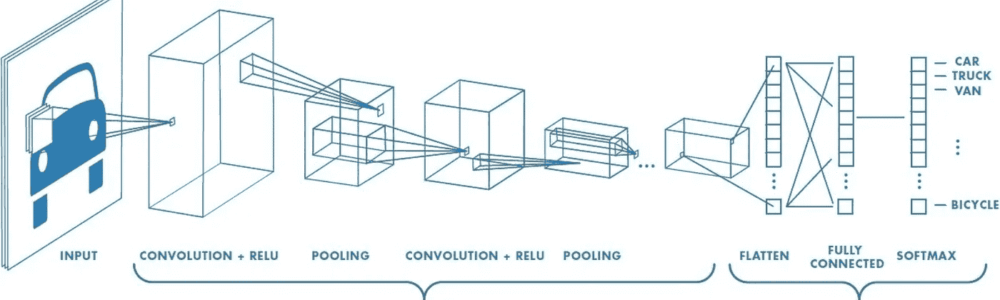
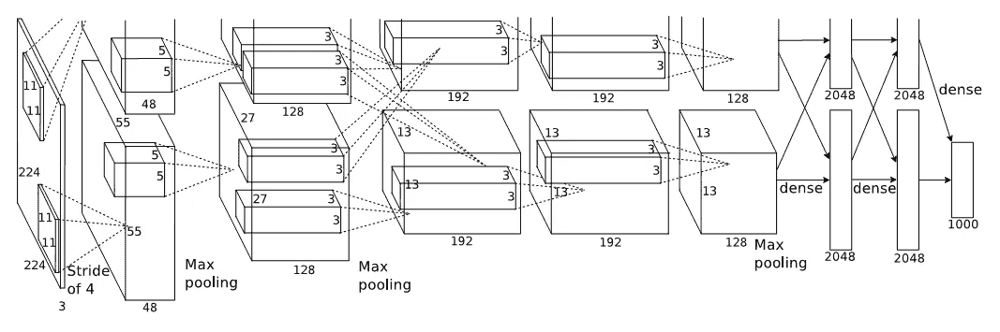
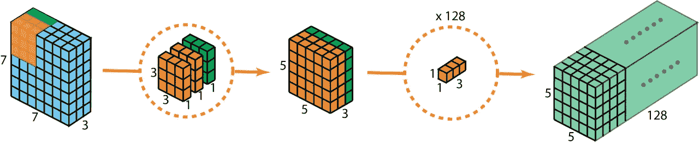

# 从 LeNet 到 efficient net:CNN 的演变

> 原文：<https://towardsdatascience.com/from-lenet-to-efficientnet-the-evolution-of-cnns-3a57eb34672f?source=collection_archive---------27----------------------->

一个易于跟随的旅程，通过主流 CNN 的变化和新奇

## 卷积神经网络:构建模块

卷积神经网络，或简称 CNN，是一种常用的*移位不变*方法，用于提取*‘可学习特征’*。CNN 在深度学习和神经网络的发展和普及中发挥了主要作用。我有一个单独的博客，讨论各种类型的卷积核及其优势。

 [## 卷积核的类型:简化

### 对迷人的 CNN 层的不同变化的直观介绍

towardsdatascience.com](/types-of-convolution-kernels-simplified-f040cb307c37) 

然而，这里我将关注完整的 CNN 架构，而不是关注单个内核。我们可能无法单独访问 CNN 历史上的每一个主要发展，但我将尝试带您了解一般 CNN 架构是如何随着时间的推移而演变的。**你需要对 CNN 有一些基本的了解。**

卷积神经网络:概述[ [来源](/a-comprehensive-guide-to-convolutional-neural-networks-the-eli5-way-3bd2b1164a53)

## 莱内特:一切开始的地方

LeNet 是第一个将反向传播用于实际应用的 CNN 架构，突然间深度学习不再只是一个理论。LeNet 用于手写数字识别，能够轻松胜过所有其他现有方法。LeNet 架构非常简单，只有由 5*5 卷积和 2*2 最大池组成的 5 层，但为更好、更复杂的模型铺平了道路。

LeNet 架构[1]

## AlexNet:越深越好

AlexNet 是第一批在 GPU 上实现的 CNN 模型之一，真正将当时日益增长的计算能力与深度学习联系起来。他们创建了一个更深入、更复杂的 CNN 模型，该模型具有各种大小的内核(如 11*11、5*5 和 3*3)，频道数量明显多于 LeNet。他们还开始使用 ReLU 激活代替 sigmoid 或 tanh，这有助于训练更好的模型。AlexNet 不仅赢得了 2012 年的 Imagenet 分类挑战赛，*还以突然让非神经模型几乎过时的优势击败了亚军。*

AlexNet 架构[2]

## 概念网:多尺度特征提取

在 CNN 的历史上，InceptionNet 是一个巨大的进步，它从多个方面解决了问题。首先，InceptionNet 比现有的模型更深入，参数更广泛。为了处理训练更深模型的问题，他们采用了在模型之间存在多个辅助分类器的想法，以防止梯度消失。然而，他们的主要主张之一是并行使用不同大小的内核，从而增加模型的宽度而不是深度。他们提出，这样的架构可以帮助他们同时提取更大和更小的特征。

InceptionNet v1 架构[5]

## VGG:3x 3 卷积的力量

虽然 CNN 模型之前的所有迭代都相信更大感受野的想法(例如，AlexNet 有 11*11 个卷积核)，但 VGG 提出了将所有这些分解为 3*3 个卷积的想法。根据 VGG 体系结构，堆叠在一起的多个 3×3 卷积能够复制更大的感受野，并且在它们之间存在更多的非线性(就激活函数而言)，它甚至可以比具有更大感受野的对应物表现得更好。他们甚至引入了 1*1 卷积，以进一步增加模型中的非线性。从那以后，VGG 模型变得非常有名，甚至在今天还被用于各种教程中向 CNN 的新成员介绍。

VGG-16 建筑[3]

## ResNet:处理消失渐变

简单堆叠多个 CNN 层来创建更深模型的总体趋势很快就停止了，原因是深度学习中一个非常常见的问题，称为*消失梯度*。更简单地说，在训练 CNN 时，梯度从最后一层开始，在到达初始层之前，需要穿过中间的每一层。这可能会导致渐变在某处完全消失，从而难以训练模型的初始层。ResNet 模型引入了剩余或快捷连接，为渐变创建了替代路径，以跳过中间层并直接到达初始层。这使得作者可以训练早期表现不佳的非常深入的模型。现在，在现代 CNN 架构中使用剩余连接已经成为一种常见的做法。

ResNet 架构[4]

## MobileNet & MobileNetV2:向边缘友好型发展

CNN 在这个阶段的总趋势是创建越来越大的模型以获得更好的性能。虽然 GPU 提供的计算能力的进步允许他们这样做，但一系列新的产品也在 ML 世界中引起了注意，称为边缘设备。边缘设备具有极大的内存和计算限制，但却为 GPU 无法应用的许多应用打开了大门。

为了创建更轻的 CNN 模型，使其能够与现有的最先进技术相媲美，MobileNet 应运而生。MobileNet 引入了可分卷积的概念(我在之前的[博客](/types-of-convolution-kernels-simplified-f040cb307c37)中详细讨论过)。更简单地说，它将 2D 卷积核分解为两个独立的卷积，深度卷积负责收集每个通道的空间信息，点卷积负责各个通道之间的交互。后来，MobileNetV2 也引入了剩余连接和架构中的其他调整，以进一步减小模型大小。

深度方向可分的 2D 卷积[ [来源](/types-of-convolution-kernels-simplified-f040cb307c37)

## 效率网:挤压和激励层

有了各种关注性能或计算效率的独特模型，EfficientNet 模型提出了这两个问题可以通过类似的架构来解决的想法。他们提出了一个通用的 CNN 框架结构和三个参数，即宽度、深度和分辨率。模型的宽度是指各层中存在的通道的数量，深度是指模型中的层数，分辨率是指模型的输入图像大小。他们声称，通过保持所有这些参数较小，可以创建一个有竞争力但计算效率高的 CNN 模型。另一方面，仅仅通过增加这些参数的值，就可以创建更注重精度的模型。

虽然挤压层和激发层早就提出来了，但他们是第一个将这个想法引入主流 CNN 的人。S&E 图层创建跨通道的交互，这些交互对于空间信息是不变的。这可以用来降低不太重要的渠道的影响。他们还引入了新提出的 Swish 激活，而不是 ReLU，这是性能提高的一个重要因素。EfficientNets 是目前在各种计算资源可用性类别下表现最好的分类模型。

挤压和激励网络[ [来源](/squeeze-and-excitation-networks-9ef5e71eacd7)

## 下一步是什么？

如今，CNN 模型在其图像分类性能以及跨各种其他问题陈述(如对象检测和分割)的迁移学习能力方面受到测试。这些问题中的一些被认为已经解决了。焦点正转向 CNN 模型，如沙漏架构，其中输出图像分辨率与输入相同。然而，即使在今天，我在这篇博客中介绍的主干直接用于各种深度学习任务，因此即使图像分类问题几乎得到解决，该领域的发展在未来仍将具有很大的重要性。

## 参考

*[1] LeCun，Yann 等，“基于梯度的学习在文档识别中的应用”IEEE 86.11 会议录(1998):2278–2324。
[2]克里热夫斯基、亚历克斯、伊利亚·苏茨基弗和杰弗里·e·辛顿。"使用深度卷积神经网络的图像网络分类."神经信息处理系统进展。2012.
[3]西蒙扬、卡伦和安德鲁·齐塞曼。“用于大规模图像识别的非常深的卷积网络。”arXiv 预印本 arXiv:1409.1556 (2014)。
[4]何，，等.“用于图像识别的深度残差学习”IEEE 计算机视觉和模式识别会议录。2016.
【5】塞格迪，克里斯蒂安，等着《用回旋深化》IEEE 计算机视觉和模式识别会议录。2015.
【6】Howard，Andrew G .等，《移动网络:用于移动视觉应用的高效卷积神经网络》arXiv 预印本 arXiv:1704.04861 (2017)。
[7]谭、明星、郭诉乐。"效率网:重新思考卷积神经网络的模型缩放."arXiv 预印本 arXiv:1905.11946 (2019)。*