# 从线性回归到岭回归，套索和弹性网

> 原文：<https://towardsdatascience.com/from-linear-regression-to-ridge-regression-the-lasso-and-the-elastic-net-4eaecaf5f7e6?source=collection_archive---------2----------------------->

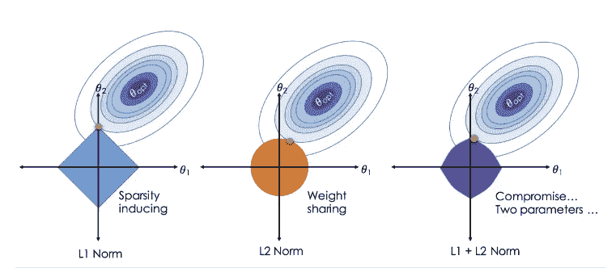

图 1:普通回归与套索回归、山脊回归和弹性网回归相比的图像。图片引用:邹，h .，&哈斯蒂，T. (2005)。通过弹性网的正则化和变量选择。

## 以及为什么您应该学习替代回归技术

# 简介:

普通最小二乘法((*)OLS(*)是最古老、最简单的回归算法之一。然而，现在有几个变种被发明出来，以解决使用常规最小二乘回归时遇到的一些弱点。

尽管是最古老的算法之一，线性模型仍然非常有用。事实上，它们往往能胜过花哨复杂的模型。当没有大量的观察值时，或者当输入可靠地预测响应时(低信噪比)，它们特别有用。

在本文中，我们将首先回顾使用线性回归的基本公式，讨论如何使用梯度下降法求解参数(权重)，然后介绍岭回归。然后我们将讨论套索，最后是弹性网。这篇文章也将属于我的从零开始构建机器学习算法系列(大部分)。到目前为止，我已经从头开始讨论了逻辑回归，从奇异值分解和遗传算法中导出主成分。

我们将使用来自 1989 年研究的真实世界癌症数据集来了解其他类型的回归、收缩以及为什么有时线性回归是不够的。

# 癌症数据:

这个[数据集](https://github.com/Robby955/CancerData/blob/master/prostate.txt)由 1989 年完成的一项真正的科学[研究的 97 个观察数据组成。](https://pubmed.ncbi.nlm.nih.gov/2468795/)数据包括 8 个预测因子，感兴趣的结果是 lpsa(对数前列腺特异性抗原)。

这个数据集在 [*统计学习的要素*](https://web.stanford.edu/~hastie/ElemStatLearn/) *中有所详细讨论。*

首先，我们加载将要使用的库，然后读入数据集。

下面是最初的一些观察结果:

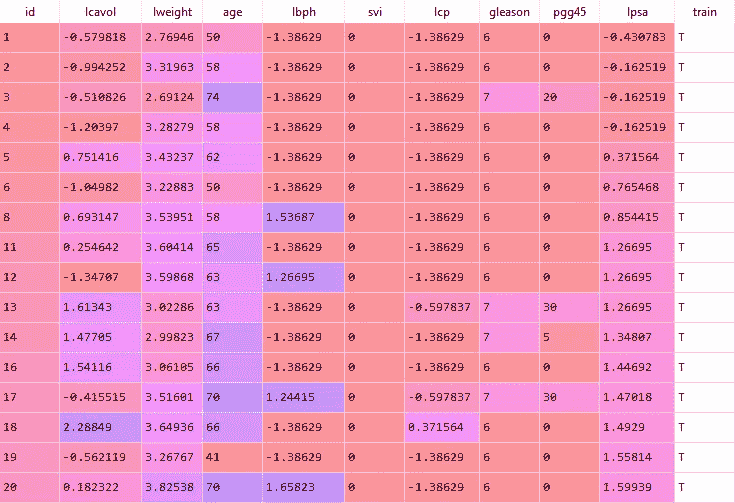

图 2:前列腺癌数据集的最初几个观察结果。预测因子包括 log cavol、log weight、age、lbph、sci、lcp、gleason、pgg45。我们还有一个指示器，告诉我们观察值是属于训练集还是测试集。图片来自作者。

在 97 个观察值中，67 个被指示为属于训练，而剩余的 30 个被保存用于在算法训练结束时进行测试。请注意，我们不需要“Id”列或“train”列，因此我们将其删除。在回归之前，我们还经常建议缩放和居中我们的列。

我们首先将 97 个观察结果分成初始训练集和测试集。初始训练集的大小为 67，剩余的 30 个观察值在测试集中。(x_train，y_train)和(x_test，y_test)。在本文的后面，我们将进一步把我们的训练集分解成一个训练/验证集。请注意，我们的模型将根据测试数据进行评估，因此我们在拟合模型时不使用任何测试数据。

# 回归设置:

首先，考虑一个简单的回归问题，有 **N** 个观察值(行)和 p 个预测值(列)，包括:

*   N x 1 个结果向量， **Y.**

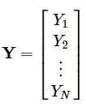

图 3:我们 N 次观察的结果向量。图来自作者。

*   观察值的 N x (p+1)矩阵， **X**

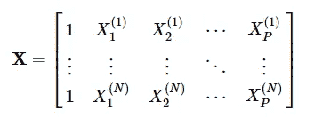

图 4:N 个观察值中的每一个都表示在一行中。考虑到截距或“偏差”项，我们还在每个观察值上加 1。图来自作者。

*   (p+1) x 1 个权重向量， **W** 。

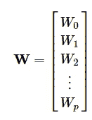

图 5:我们的权重向量，w。图来自作者。

为了获得我们的预测，我们将我们的权重 W 乘以我们的观测值 x。因此，残差或真实结果与我们的预测之间的差异可以用 N x 1 矩阵表示:

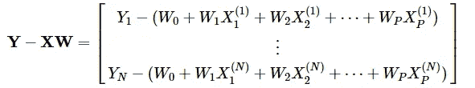

图 6:我们的预测减去我们的估计。请注意，估计值是通过将权重乘以我们的观察值获得的。我们的预测越接近真实值，该行就越接近零。图来自作者。

“完美”的情况是图 6 中的矩阵充满了零，因为这将代表对训练数据的完美拟合。但这种情况几乎从来没有发生过，这也可能是“过度拟合”模型的一种情况。

# **成本函数:**

为了确定一个模型有多好，我们需要一些“好”的定义。在线性回归中，这几乎总是均方误差(MSE)。这只是我们的估计和真实观察之间的误差平方和。

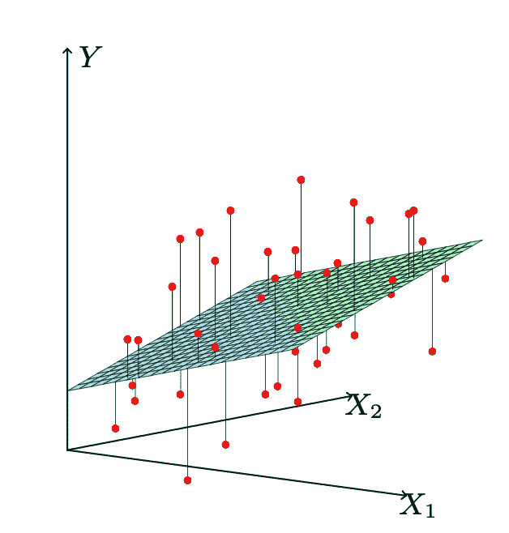

图 7:红点代表实际观察，表面代表我们在任一点(X1，X2)的预测。这些线条表示我们的预测与实际观测数据之间的距离。这些距离的平方和定义了我们的最小二乘成本。图片引用:该图片经许可使用，如图 3.1 所示，出现在《统计学习要素》第二版中。

通常，这在一个例子中被定义为损失函数。对于整个训练数据，我们使用成本函数，即每个训练示例的平均损失。

为了找到成本曲面的最小值，我们使用*梯度下降*，这涉及到对每个参数进行求导。

当只有两个参数时，成本表面实际上可以被可视化为等高线图。在更高维度中，我们不能直接看到表面，但是寻找最小值的过程是一样的。梯度下降依赖于*学习率*α，它控制我们采取的步长。

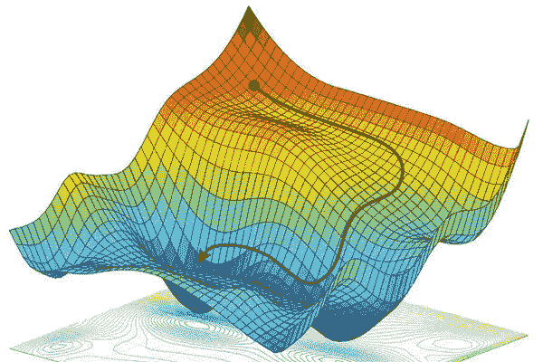

图 8:梯度下降就是采取步骤寻找损失面最小值的过程。图片引用:[https://www . research gate . net/figure/Non-convex-optimization-We-utilize-random-gradient-descent-to-find-a-local-optimum _ fig 1 _ 325142728](https://www.researchgate.net/figure/Non-convex-optimization-We-utilize-stochastic-gradient-descent-to-find-a-local-optimum_fig1_325142728)

对于每个时期或迭代，我们计算每个参数相对于成本函数的导数，并在方向(最陡)方向上迈出一步。这确保我们(最终)达到最小值。实际上，这并不简单，因为学习率可能太大或太小，导致陷入局部最优。

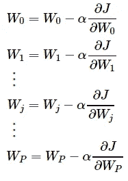

图 9:梯度下降。训练我们的重量(参数)的步骤。这包括通过减去成本函数相对于权重的导数，再乘以α(学习率)来更新每个权重。图来自作者。

现在是定义我们稍后将使用的一些助手函数的好时机:

# 线性回归:

线性回归是最简单的回归算法，于 1875 年首次被描述。“回归”这个名字来源于弗朗西斯·高尔顿注意到的*向平均值*回归的现象。这指的是这样一个事实，当非常高的父母或非常矮的父母的孩子通常仍然更高或更矮时，他们倾向于接近平均身高。这被称为“回归均值”。

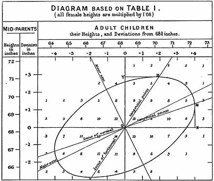

*图 10:高尔顿在遗传地位上回归平庸。图片引用:*[https://RSS . online library . Wiley . com/doi/full/10.1111/j . 1740-9713.2011 . 00509 . x](https://rss.onlinelibrary.wiley.com/doi/full/10.1111/j.1740-9713.2011.00509.x)

*最小二乘回归*的工作原理是简单地拟合一条线(或二维以上的超曲面)并计算从估计值到实际观察点的距离。最小二乘模型是最小化模型和观测数据之间的平方距离的模型。

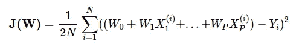

图 11:线性回归的成本函数。成本是单个损失函数的归一化总和。这和均方误差乘以一个标量是一样的(最后的结果是等价的)。图来自作者。

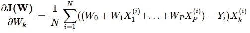

图 12:线性回归的成本函数的导数。图来自作者。

您可能会注意到，这可能会使我们的算法容易受到离群值的影响，其中一个孤立的观察值可能会极大地影响我们的估计。这是真的。换句话说，线性回归对异常值并不稳健。

另一个问题是，我们可能对训练数据拟合得太好了。假设我们有许多训练数据和许多预测器，有些具有共线性。我们可能会获得非常适合训练数据的线，但它可能不会在测试数据上表现得那么好。这就是替代线性回归方法的优势所在。因为我们在最小二乘法中考虑了所有的预测值，这使得它容易过度拟合，因为添加额外的预测值没有损失。

因为线性回归不需要我们调整任何超参数，所以我们可以使用训练数据集来拟合我们的模型。然后，我们在测试数据集上评估线性模型，并获得我们的均方误差。

# 从零开始渐变下降:

下面的代码从头开始实现梯度下降，我们提供了添加正则化参数的选项。默认情况下，“reg”设置为零，因此这将等同于与简单最小二乘法相关联的成本函数的梯度下降。当 reg 大于零时，算法将产生岭回归的结果。

由于我们现在使用自定义函数，我们需要向矩阵 x_train_scaled 添加一列 1，这将考虑截距项(将乘以权重 W0 的项)。我们还将对象转换成 numpy 数组，以便进行更简单的矩阵计算。

让我们来看看梯度下降是如何进行的:

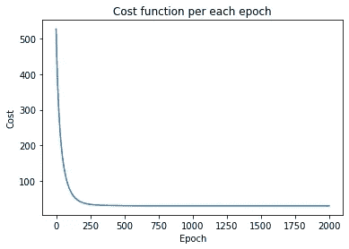

图 14:随着我们不断制造越来越好的砝码，成本下降得相当快。图来自作者。图来自作者。

现在让我们使用通过梯度下降获得的权重来对我们的测试数据进行预测。我们内置的 MSE 函数将使用*wllinear*来计算预测，并将返回测试 MSE。

使用梯度下降来获得我们的权重，我们在我们的测试数据上获得 0.547 的 MSE。

# 岭回归:

与最小二乘成本函数相比，岭回归使用增强的成本函数。岭回归引入了一个附加的“正则化”参数，而不是简单的平方和，该参数会对权重的大小产生不利影响。

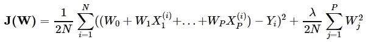

图 15:岭回归的成本函数。成本是单个损失函数的归一化总和。该成本函数通过正参数λ来惩罚权重。图来自作者。

幸运的是，这个成本函数的导数仍然很容易计算，因此我们仍然可以使用梯度下降。

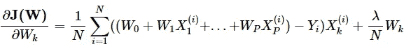

图 16:岭回归的成本函数的导数。图来自作者。

**快速事实:**

*   岭回归是**吉洪诺夫正则化**的特例
*   存在封闭形式的解，因为在矩阵上添加对角元素确保了它是可逆的。
*   允许可容忍的额外偏置量，以换取效率的大幅提高。
*   在神经网络中使用，这里称为*权重衰减*。
*   当您有太多预测值，或预测值之间有高度多重共线性时使用。
*   等效于 lambda 为 0 时的普通最小二乘。
*   又名 **L2** 正规化。
*   在应用岭之前，必须缩放预测值。

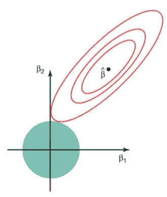

图 17:二维情况下 OLS 估计和岭回归估计的比较。请注意，在成本函数中正则化项的原点处，岭估计被限制在一个圆内。岭估计可视为线性回归系数等高线与 B1+B2≤λ定义的圆相交的点。图像引用:统计学习的要素，第 2 版。

因为我们在岭回归中有一个超参数 lambda，所以我们形成了一个额外的维持集，称为*验证集*。这与测试集是分开的，允许我们调整理想的超参数。

# 选择λ:

为了找到理想的λ，我们使用一系列可能的λ值来计算验证集的 MSE。函数 *getRidgeLambda* 在维持训练集上尝试一系列 Lambda 值，并在验证集上检查 MSE。它返回理想的参数 lambda，然后我们将使用它来拟合整个训练数据。

理想的λ是 8.8，因为它导致验证数据的最低 MSE。

使用交叉验证，我们获得了λ= 8.8 的理想“reg”参数，因此我们使用该参数通过梯度下降来获得我们的岭估计。

使用岭回归，我们在 0.511 的测试数据上得到甚至更好的 MSE。请注意，与最小二乘法估计的系数相比，我们的系数被“缩小”了。

# 套索回归:

套索回归或(*最小绝对收缩和选择算子’*)也适用于替代成本函数；

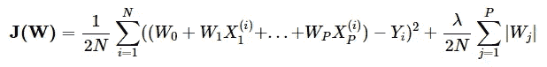

图 Lasso 回归的成本函数。我们仍然正则化，但使用 L1 正则化，而不是在山脊 L2。这个成本函数的导数没有封闭形式。图来自作者。

然而，成本函数的导数没有封闭形式(由于 **L1** 在权重上的损失),这意味着我们不能简单地应用梯度下降。Lasso 允许系数实际上被强制为零的可能性(见图 19)，**本质上使 Lasso 成为一种模型选择方法以及一种回归技术。**

**快速事实:**

*   被称为“诱导稀疏”的方法。
*   有时被称为*基础追踪。*

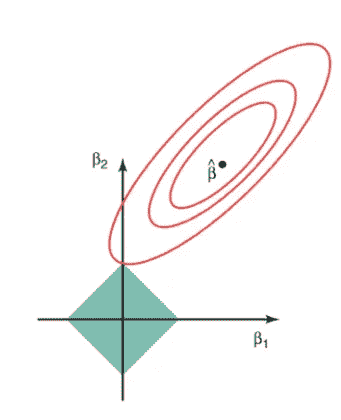

图 19:OLS 估计和 Lasso 回归估计的比较。请注意，Lasso 估计值被限制在成本函数中正则化项的原点处的一个框中。椭圆与边界框相交的点给出了套索估计。注意，在上面的例子中，我们在一个拐角处相交，这导致上面例子中的系数(B1)被设置为零。统计学习的要素，第二版。

由于我们不能应用梯度下降，我们使用 scikit-learn 的内置函数来计算理想的权重。然而，这仍然需要我们选择理想的收缩参数(就像我们对山脊所做的那样)。我们采用与岭回归中相同的方法来搜索验证数据上的理想正则化参数。

Lasso 在测试数据上提供了 0.482 的 MSE，甚至小于岭和线性回归！而且，Lasso 还将一些系数设置为零，完全排除在考虑范围之外。

# 弹性网:

最后，我们来到弹性网。

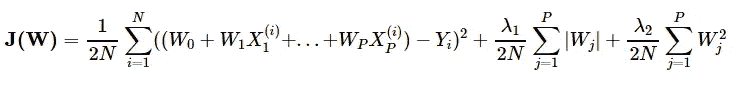

图 20:弹性网的成本函数。它包含了 L1 和 L2 的损失。图来自作者。

弹性网有两个参数，因此，我们需要搜索组合网格，而不是搜索单个理想参数。因此训练可能会有点慢。不是直接搜索λ1 和λ2，通常最好是搜索这两个参数之间的理想比率，以及λ1 和λ2 之和的α参数。

**快速事实:**

*   线形、脊形和套索都可以看作是弹性网的特例。
*   2014 年证明了弹性网可以化简为线性支持向量机。
*   损失函数是强凸的，因此存在唯一的最小值。

这个*弹性网*是套索的延伸，它结合了 **L1** 和 **L2** 的正规化。所以 L1 需要一辆 lambda1，L2 需要一辆 lambda2。类似于套索，导数没有封闭的形式，所以我们需要使用 python 的内置功能。我们还需要找到我们的两个参数之间的理想比率，以及作为λ1 和λ2 之和的附加α参数。

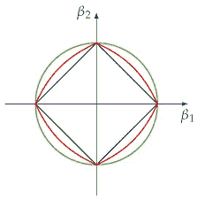

图 21:弹性网(红色)是脊回归(绿色)和套索(蓝色)的组合。图片引用:[https://www . research gate . net/figure/Visualization-of-the-elastic-net-regularity-red-combining-the-L2-norm-green-of _ fig 6 _ 330380054](https://www.researchgate.net/figure/Visualization-of-the-elastic-net-regularization-red-combining-the-L2-norm-green-of_fig6_330380054)

我们不会从头开始编码弹性网，scikit-learn 提供了它。

然而，我们执行交叉验证来选择两个参数，alpha 和 l1_ratio。一旦我们有了理想的参数，我们就使用选择的参数在完全训练上训练我们的算法。

哇！弹性网提供了比所有其他模型更小的 MSE (0.450)。

# 综合起来看:

最后，我们计算了最小二乘法、脊线法、套索法和弹性网格法的结果。我们已经获得了每种方法的权重，还获得了原始测试数据集的 MSE。我们可以在表格中总结这些方法的表现。

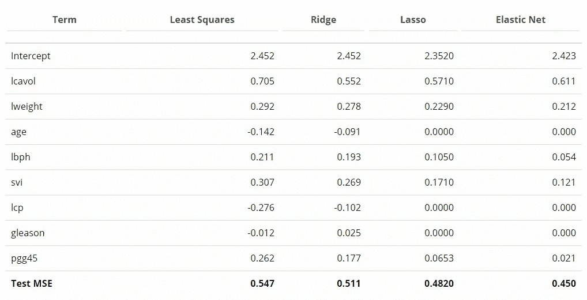

图 22:我们每个模型的最终比较。此表总结了测试集的最终估计系数和均方误差。图来自作者。

与所有其他模型相比，简单最小二乘法在我们的测试数据中表现最差。岭回归提供了与最小二乘法相似的结果，但它在测试数据上做得更好，并缩减了大多数参数。最终，Elastic Net 在测试数据集上提供了最好的 MSE，而且差距很大。弹性网去掉了 lcp，格里森，年龄，缩水了其他参数。拉索也去除了年龄、lcp 和格里森的考虑，但表现略差于弹性网。

# 总结:

了解基本的最小二乘回归仍然非常有用，但也应该考虑其他改进的方法。常规最小二乘法的一个问题是它没有考虑过拟合的可能性。岭回归通过缩小某些参数来解决这个问题。Lasso 更进一步，允许将某些系数直接强制为零，从模型中消除它们。最后，弹性网结合了套索和脊的优点。

在某些情况下，我们可以推导出最小二乘的精确解，只要λ> 0，我们总是可以推导出岭的解。选择 lambda 是困难的部分(你应该在训练数据集上使用交叉验证来选择理想的 lambda)。在本指南中，我们没有显示封闭形式的解决方案，因为最好从头开始了解解决方案是如何解决的，并且因为封闭形式的解决方案通常不存在于高维空间中。

感谢您的阅读，如果您有任何问题或意见，请发送给我！

**想了解更多？**

如果您喜欢这些主题，并想学习更高级的回归技术，请查看以下主题:

*   [拉斯(最小角度回归)。](http://statweb.stanford.edu/~tibs/ftp/lars.pdf)
*   [主成分回归](https://ncss-wpengine.netdna-ssl.com/wp-content/themes/ncss/pdf/Procedures/NCSS/Principal_Components_Regression.pdf)。
*   [偏最小二乘法。](https://personal.utdallas.edu/~herve/Abdi-PLS-pretty.pdf)

# 来源:

来自统计学习的*元素的图像被允许使用。[*“作者(Hastie)保留所有这些数字的版权。它们可以用在学术报告中。”*](https://web.stanford.edu/~hastie/ElemStatLearn/)*

GitHub 上的代码:

 [## Robby955/CancerData

### 此时您不能执行该操作。您已使用另一个标签页或窗口登录。您已在另一个选项卡中注销，或者…

github.com](https://github.com/Robby955/CancerData/blob/master/pythonRegression.py) 

[1]邹，h .，，哈斯蒂，T. (2005).通过弹性网的正则化和变量选择。皇家统计学会杂志:B 辑(统计方法学)。

[2]阿米尼，亚力山大&索莱马尼，艾娃&卡拉曼，塞尔塔克&鲁斯，达尼埃拉。(2018).[*用于端到端控制的空间不确定性采样*](https://www.researchgate.net/figure/Non-convex-optimization-We-utilize-stochastic-gradient-descent-to-find-a-local-optimum_fig1_325142728) *。神经信息处理系统。*

[3]斯塔梅、T. A .、卡巴林、J. N .、麦克尼尔、J. E .、约翰斯通、I. M .、弗赖哈、f .、雷德温、E. A .、杨(1989)。前列腺特异性抗原在前列腺癌诊断和治疗中的应用。二。根治性前列腺切除术治疗的患者。*《泌尿外科杂志》*， *141* (5)，1076–1083。[https://doi . org/10.1016/s 0022-5347(17)41175-x](https://doi.org/10.1016/s0022-5347(17)41175-x)

*【4】*哈斯蒂，t .【哈斯蒂，t .】蒂布希拉尼，r .&弗里德曼，J. H. *(2001)。统计学习的* ***要素*** *:数据挖掘、推断、预测。纽约:斯普林格。*

[5]霍尔，A. E .，&肯纳德，R. W. (1970 年)。岭回归:非正交问题的有偏估计。*技术指标*。

6 TiB shirani，R. (1996 年)。通过套索的回归收缩和选择。*英国皇家统计学会杂志:B 辑(方法论)*， *58* (1)，267–288。