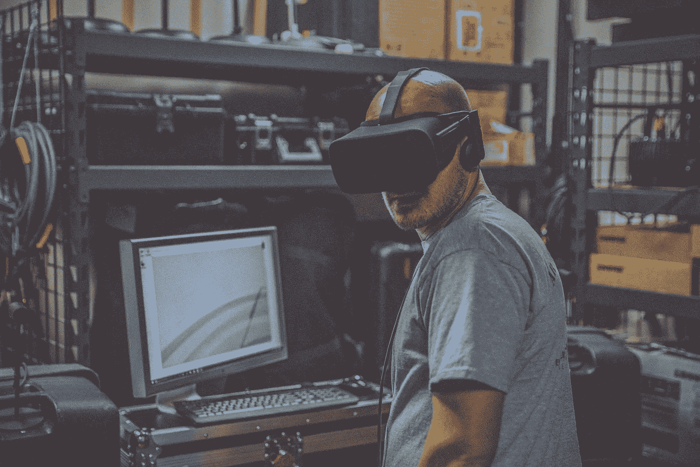
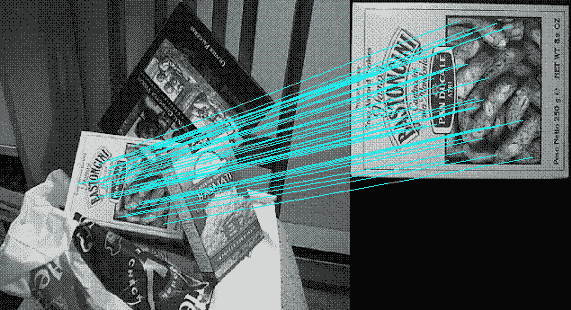
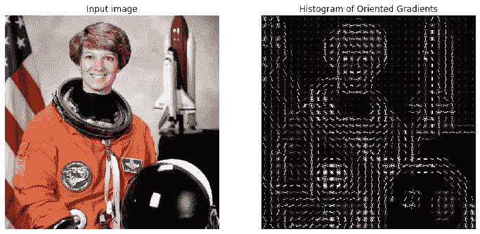
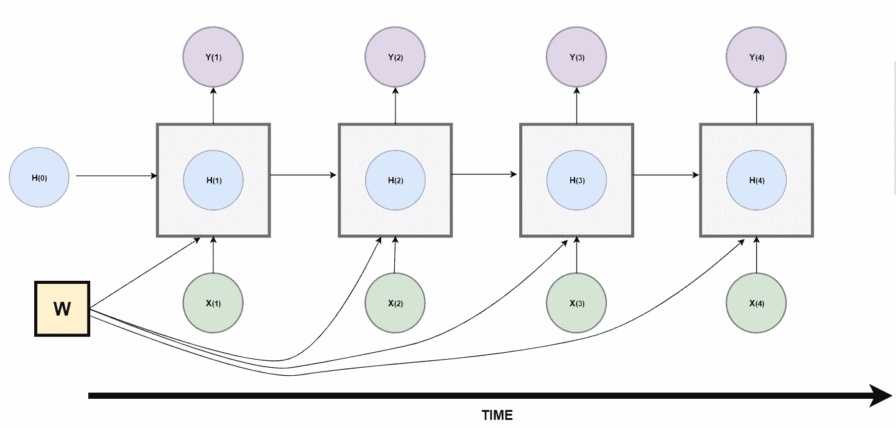
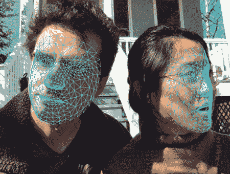
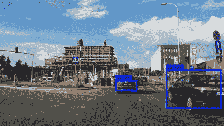

# 从机器学习到深度学习，这里有 15 个你一定会遇到的术语

> 原文：<https://towardsdatascience.com/from-machine-learning-to-deep-learning-here-are-15-terms-you-are-bound-to-come-across-5743389d803?source=collection_archive---------58----------------------->

## 说明

## 人工智能领域内值得学习的关键词…

埃迪·科普在 [Unsplash](/s/photos/technology?utm_source=unsplash&utm_medium=referral&utm_content=creditCopyText) 上的照片

# 介绍

人工智能作为一个领域包括各种子领域和实践，如计算机视觉、自然语言处理、语音识别、机器学习等。在这些提到的领域中有一些概念和术语，用于描述所设计的算法和技术的目的。

本文将介绍一些你在人工智能相关研究或媒体资源中最有可能遇到的常见概念、术语和关键词。本文提供的信息只是一个高层次的概述；每个术语都有为那些寻求获得更深入知识的人提供的资源。

# 尺度不变特征变换

这是一种用于生成图像关键点描述符(特征向量)的计算机视觉技术。生成的描述符包含关于诸如边、角和斑点的特征的信息。该描述符可用于检测不同比例和失真的图像中的对象。SIFT 被用在诸如对象识别、手势识别和跟踪的应用中。这里有一个介绍这项技术的原始研究论文的[链接](https://www.cs.ubc.ca/~lowe/papers/ijcv04.pdf)。SIFT 的关键在于它的检测特征对于任何仿射变换都是不变的，例如缩放、平移和旋转。

[筛选关键点](https://www.cs.ubc.ca/~lowe/keypoints/)

# 方向梯度直方图(HOG)

这是一种用于从图像中提取特征的技术。所提取的特征是从通过图像内的边缘和拐角提供的信息中导出的，更具体地说，是从图像内的对象中导出的。对这些技术的简单描述是，它识别图像内的边缘(梯度)、角和线的位置，并且还获得关于边缘方向的信息。HOG 描述符生成直方图，该直方图包含从图像中检测到的边缘分布信息和方向信息。这种技术可以在计算机视觉应用和图像处理中找到。这里有一个包含更多信息的[链接](https://www.learnopencv.com/histogram-of-oriented-gradients/)。

[猪在行动](https://iq.opengenus.org/object-detection-with-histogram-of-oriented-gradients-hog/)

# 主成分分析

**主成分分析(PCA):** 对特征丰富的数据集进行降维的算法。降维是通过将数据点从较高维度投影到较低平面来实现的，但仍然保持信息并使信息损失最小化。

[主成分分析在行动](https://www.r-bloggers.com/principal-component-analysis-in-r/)

# 神经类型转移

**神经风格转移(NST):** 利用深度卷积神经网络和算法从一幅图像中提取内容信息，从另一幅参考图像中提取风格信息的技术。在提取样式和内容之后，生成组合图像，其中所得图像的内容和样式源自不同的图像。

[神经风格转移](https://www.google.com/url?sa=i&url=https%3A%2F%2Fwww.tensorflow.org%2Ftutorials%2Fgenerative%2Fstyle_transfer&psig=AOvVaw1X0c34-xkGS_a2E0F1zk6U&ust=1592963050055000&source=images&cd=vfe&ved=0CA0QjhxqFwoTCIDJ3vznluoCFQAAAAAdAAAAABAD)

# 递归神经网络(RNN)和 LSTM

**递归神经网络(RNN)和 LSTM** :人工神经网络架构的一种变体，能够接受任意大小的输入，并产生任意大小的输出数据。RNN 神经网络结构学习时间关系。rnn 用于语音识别、图像字幕和自然语言处理等应用中。

Richmond Alake 的递归神经网络解码器阶段

下面是 Luis Serrano 解释 RNNs 基础知识的精彩视频:

# 人脸检测

**人脸检测**:实现能够自动识别和定位图像和视频中人脸的系统的术语。面部检测存在于与面部识别、摄影和动作捕捉相关联的应用中。

[面部检测](https://blog.tensorflow.org/2020/03/face-and-hand-tracking-in-browser-with-mediapipe-and-tensorflowjs.html)和面部特征跟踪

# 姿态估计

**姿势估计**:从提供的数字资产，如图像、视频或图像序列，推断身体主要关节位置的过程。姿态估计的形式存在于诸如动作识别、人类交互、虚拟现实和 3D 图形游戏的资产创建、机器人等应用中。

[通过张量流进行姿态估计](https://www.google.com/url?sa=i&url=https%3A%2F%2Fwww.tensorflow.org%2Flite%2Fmodels%2Fpose_estimation%2Foverview&psig=AOvVaw1FlOWKWjL11JjEAkeQdjLa&ust=1592963325451000&source=images&cd=vfe&ved=0CA0QjhxqFwoTCLjF2P7oluoCFQAAAAAdAAAAABAD)

# 物体识别

**物体识别:**识别与 a 类目标物体相关的过程。对象识别和检测是具有相似结果和实现方法的技术，尽管在各种系统和算法中识别过程先于检测步骤。

# 跟踪

**跟踪:**一种在一段时间内在一系列图像中识别、检测和跟踪感兴趣的物体的方法。在许多监控摄像机和交通监控设备中可以找到系统内跟踪的应用。

# 目标检测

**目标检测**:目标检测与计算机视觉相关联，描述了一种能够识别图像中期望的目标或身体的存在和位置的系统。请注意，要检测的对象可能出现一次或多次。

[Yolo 对象检测网络](https://gfycat.com/immaterialbareeasternglasslizard-tensorflow-all-tags-samsung-darknet)

# 最优化算法

**优化算法**:执行预定次数的算法，用于寻找问题的最优解；在数学术语中，这些“问题”被称为函数。

# 梯度下降

**梯度下降**:该优化算法用于寻找降低成本函数的值。这是通过梯度值的计算来完成的，该梯度值用于在找到成本函数的局部最小值的每一步选择值。梯度的负值用于寻找局部最小值。

[梯度下降的描述](https://commons.wikimedia.org/wiki/File:Gradient_descent.gif)

# 价值函数

**成本函数**:这是一种量化机器学习模型执行“有多好”的方法。量化是基于一组输入的输出(成本)，这些输入被称为参数值。参数值用于估计预测，而“成本”是预测值和实际值之间的差异。

# 全局极小值

**全局最小值**:这是位于成本函数整个域内的最小参数值。您可能会遇到局部最小值，它是指位于成本函数的设定范围内的最低参数值。

# 趋同；聚集

**收敛**:这描述了在机器学习环境中使用时，向最佳参数值或全局最小值移动的概念

# 我希望这篇文章对你有用。

要联系我或找到更多类似本文的内容，请执行以下操作:

1.  订阅我的 [**YouTube 频道**](https://www.youtube.com/channel/UCNNYpuGCrihz_YsEpZjo8TA) 视频内容即将上线 [**这里**](https://www.youtube.com/channel/UCNNYpuGCrihz_YsEpZjo8TA)
2.  跟着我上 [**中**](https://medium.com/@richmond.alake)
3.  通过 [**LinkedIn**](https://www.linkedin.com/in/richmondalake/) 联系我

 [## 为什么机器学习工程师(或数据科学家)不是这场秀的主角

### 但是我们仍然是成功的员工队伍中不可或缺的一部分

towardsdatascience.com](/why-machine-learning-engineers-or-data-scientists-are-not-the-stars-of-the-show-d91ec9c5256b)  [## 理解卷积神经网络中的局部感受野

### 想过为什么卷积神经网络中的所有神经元都没有连接起来吗？

towardsdatascience.com](/understand-local-receptive-fields-in-convolutional-neural-networks-f26d700be16c)