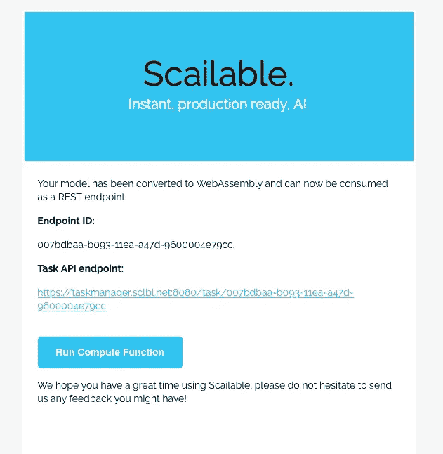

# 从模型拟合到生产只需几秒钟

> 原文：<https://towardsdatascience.com/from-model-fitting-to-production-in-seconds-8e6823d87f5d?source=collection_archive---------66----------------------->


## 我能写的关于有效部署 ML & AI 模型的最短的教程

将 ML 模型投入生产是一个挑战；超过 60%的型号[从未真正投入生产](https://info.algorithmia.com/hubfs/2019/Whitepapers/The-State-of-Enterprise-ML-2020/Algorithmia_2020_State_of_Enterprise_ML.pdf)。事实并非如此:只需几行代码就能有效地将模型投入生产。

# 模型拟合

由于拟合不是本教程的目的，我将只在标准的 [scikit-learn 乳腺癌数据](https://scikit-learn.org/stable/datasets/index.html#breast-cancer-dataset)上拟合一个 XGBoost 模型:

```
# Get the data:
from sklearn.datasets import load_breast_cancercancer = load_breast_cancer()X = cancer.data
y = cancer.target# And fit the model:
import xgboost as xgbxgb_model = xgb.XGBClassifier(objective="binary:logistic", random_state=42)
xgb_model.fit(X, y)
```

*(我忽略了模型检查和验证；让我们来关注部署)*

# 部署模型

现在我们有了合适的模型；让我们使用`[sclblpy](https://pypi.org/project/sclblpy/)` [包](https://pypi.org/project/sclblpy/)来部署它:

```
# Model deployment using the sclblpy package:
import sclblpy as sp# Example feature vector and docs (optional):
fv = X[0, :]  
docs = {}  
docs['name'] = "XGBoost breast cancer model"# The actual deployment: just one line...
sp.upload(xgb_model, fv, docs)
```

完成了。

# 使用部署的模型

运行上面的代码几秒钟后，我收到了以下电子邮件:



模型部署完成。

点击蓝色的大按钮，进入一个页面，我可以直接运行推论:


在网络上产生推论

虽然这很好，但是您可能希望创建一个更好的应用程序来使用部署的模型。只需复制粘贴项目所需的代码:


将已部署的模型简单地复制粘贴到软件项目中。

你走吧！

# 包裹

关于模型部署(以及如何高效地部署:上面的过程实际上将您的模型传输到 [WebAssembly](https://webassembly.org) 以使其高效和可移植)还有很多要说的，我不会说。

这是我能想到的最短的教程。

# 放弃

*值得注意的是我自己的参与:我是 Jheronimus 数据科学院* [*的数据科学教授，也是*](https://www.jads.nl)[*Scailable*](https://www.scailable.net)*的联合创始人之一。因此，毫无疑问，我对 Scailable 有既得利益；我有兴趣让它成长，这样我们就可以最终将人工智能投入生产并兑现它的承诺。这里表达的观点是我自己的。*