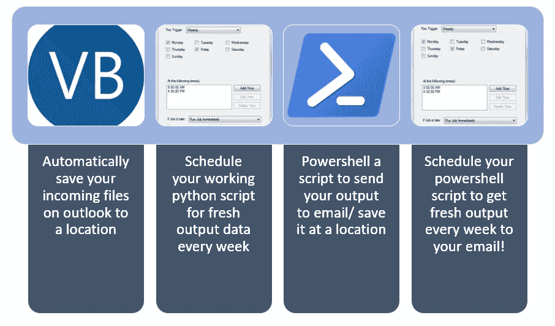

# 将工作减半的 Python 妙招:自动化执行

> 原文：<https://towardsdatascience.com/from-outlook-to-python-results-a-sweet-hack-to-cut-your-work-in-half-c2741a403f40?source=collection_archive---------22----------------------->

## 使用 VBA、Powershell 和任务调度程序自动执行脚本并通过电子邮件发送结果



作者图片，来自维基共享和 Flickr 的徽标

***摘要:*** *这篇文章讲述了如何调度你的常规 python 脚本。假设你*

1.  *将每天/每周/每月更新的 excel 报告放入共享网络或电子邮件*
2.  *启动并运行 python 脚本来处理您的报告，并以图像、工作表或其他数据形式提供见解。*
3.  *希望以固定的时间间隔长时间运行流程，但又非常担心必须手动运行。*

数据工程也有有趣的部分——比如编程和分析数据。然后是无聊的部分，比如定期使用已经写好的程序来获得最新的结果。显然，没有人想做后者。这里有一个快速解决方法，我用它来避免运行那些需要每天/每周/每月执行的脚本，以便更好地利用这些时间。

三个词—宏、批处理和调度。

1.  我使用一个**宏将**我收到的 excel 报告保存到一个位置。(我从一个执行分析并手动向我发送报告的地方获得它。不，这个没办法)。
2.  我设置了一个 **outlook 规则**,只在想要的文件夹上运行宏，并附带一些其他条件(发件人、主题等)。
3.  我**写一个批处理文件**(。bat)，单击它将在命令提示符下执行脚本。
4.  我使用 **Windows 任务调度器**调度 bat 文件，以与新 excel 报告到达的频率相同的频率执行脚本
5.  我写了一个 **PowerShell 脚本**,将最新的结果通过电子邮件发送给所有必要的接收者，然后我安排它在 bat 文件执行后马上运行。

## 步骤 1: Outlook 宏

1.  通过在 outlook 的选项窗格中激活 VBA 脚本，可以在 Outlook 中激活它。
2.  然后，您会看到一个开发人员工具按钮出现在 outlook 主页窗口的顶部。


3.转到“开发工具”选项卡，启动 Visual Basic 脚本。

4.在这里创建一个新模块，并编写代码脚本来保存传入的附件。

很简单。

在下面的示例中，报告名称始终是我收到的自动电子邮件的主题。所以我用这个标准来决定我的文件的文件名，并把它保存到一个文件夹中。

(我还确保保存它的日期，这样我就知道在执行我的脚本之前，目标文件夹总是有最新的文件。)

在收到的电子邮件中保存附件的 VBA 脚本:

```
Public Sub SaveRegularReports(MItem As Outlook.MailItem)
Dim oAttachment As Outlook.Attachment
Dim sSaveFolder As String
sSaveFolder = "/You/want/to/save/here/"
If MItem.Subject = "Quarterly_rep" Then
 savename = "QRep"
ElseIf MItem.Subject = "JustSomeRegRep" Then
 savename = "RegRep"
ElseIf MItem.Subject = "WeeklyReport" Then
 savename = "WeeklyUpdate"
End If
For Each oAttachment In MItem.Attachments
oAttachment.SaveAsFile sSaveFolder & savename & Format(MItem.ReceivedTime, "mmddyyyy") & ".xlsx"
Next
End Sub
```


原谅我的德语，但我相信你也能认出这些英语设置！

现在，我要做的就是决定这些规则适用于谁。因此，我转到规则，并设置我想要应用脚本的条件。

在我的例子中，我的条件是电子邮件总是来自一个特定的地址，其主题包含报告的名称。(为了安全起见，我将所有此类常规报告都移到了收件箱中的一个单独文件夹中)


在下一步中，作为一个动作，每当这个文件夹得到一个新手时，我就执行上面的脚本 SaveRegularReports。


> 瞧吧！不费吹灰之力就自动保存了我需要的一切！！

## 第二步。编写 bat 文件以在保存的 excel 表上执行 python 脚本

这也是小菜一碟。bat(或批处理)文件是一组命令，当您单击它时，命令提示符会执行这些命令。如果您曾经编写过 bash 命令或者使用过 windows 命令提示符 shell 脚本来“pip install”之类的，那么您应该知道我在说什么。

1.  打开一个文本文件，编写与下面类似的命令来执行 python 脚本，就像在命令提示符下一样。(我使用的是 anaconda，所以在执行 python 脚本之前，我首先激活了 Anaconda 提示符)。
2.  将该文件另存为 filename.bat

```
[@echo](http://twitter.com/echo) offcall C:\Users\myUSer\AppData\Local\anaconda\Scripts\activate.batC:\This\is\Where\Your\Script\Lives\Scriptchen.pypause
```

当我点击上面的 bat 文件(scriptchens_bat.bat)时，我的 python 脚本被执行。它使用步骤 1 中保存的 excel 报告。

## 第三步。任务-计划您的脚本执行

注意:我知道我每周都会收到报告，比如说周五上午 10 点。我将这个脚本设置为每周五 10:30 运行。

1.  从 Windows 中的搜索栏打开任务计划程序。转到创建基本任务。
2.  在出现的窗口中命名和描述后，转到触发器窗格并设置您的时间表。在这个例子中是星期五的 10:30。


现在是肉的部分。转到操作窗格。这里是您设置 bat 文件以便执行的地方。从“操作”中选择“启动程序”，在程序窗格中，给出您的。您在步骤 2 中编写的 bat 文件。


单击确定并确认。

> 瞧啊。现在，您每周都可以轻松地输出 Python 脚本了！

## 第四步。通过电子邮件发送结果

如果你对最新的结果感到满意，你可以就此打住。但是，如果您想更进一步，也想自动分发您的处理结果，请喝杯咖啡，通读最后一步。

我决定使用 powershell 将我的 outlook 结果通过电子邮件发送给其他同事。以下是方法:

1.  从 windows 搜索打开 PowerShell ISE。
2.  下面的脚本是我的案例的一个例子，它将结果分别用正文和主题行发送给所有收件人。你可以修改你的脚本来满足你的需要。

```
$OL = New-Object -ComObject outlook.applicationStart-Sleep 5$recipients = @(“recipient_one@company.de”,”recipient_two@company.de”,”recipient_three@company.de”)foreach ($recipient in $recipients){$mItem = $OL.CreateItem(“olMailItem”)$mItem.To = $recipient$mItem.Subject = “Automatic Email: Weekly Report”$mItem.Body = “This is an automated email sent using powershell. In case of any questions please contact Me. Dieses Dokument enthält… “$mItem.Attachments.Add(“\This\is\where\my\python\output\lives\file_to_email.xlsx”)$mItem.Send()}
```


自动发送电子邮件的 Powershell 脚本

## 第五步。设置任务计划程序，将您的结果通过电子邮件发送给收件人

与步骤 3 类似，现在您将安排 powershell 脚本在 python 脚本执行后每周执行一次。

1.  转到任务计划程序中的新任务
2.  命名并描述您的任务
3.  转到 trigger 并设置您的计划
4.  开始行动。在程序/脚本栏中，输入 PowerShell 应用程序的地址。它通常在这里:

```
C:\Windows\System32\WindowsPowerShell\v1.0\powershell.exe
```

在参数栏中，输入之前编写的. ps1 脚本的路径。

> 瞧啊。你不费吹灰之力就发了邮件！

总而言之，您自动化了整个事件链，从接收 excel 文件开始，将其保存到某个位置，用 python 处理它，然后用电子邮件发送结果。这是一个非常巧妙的方法，节省了我大量的工作时间。希望它也能帮助你！