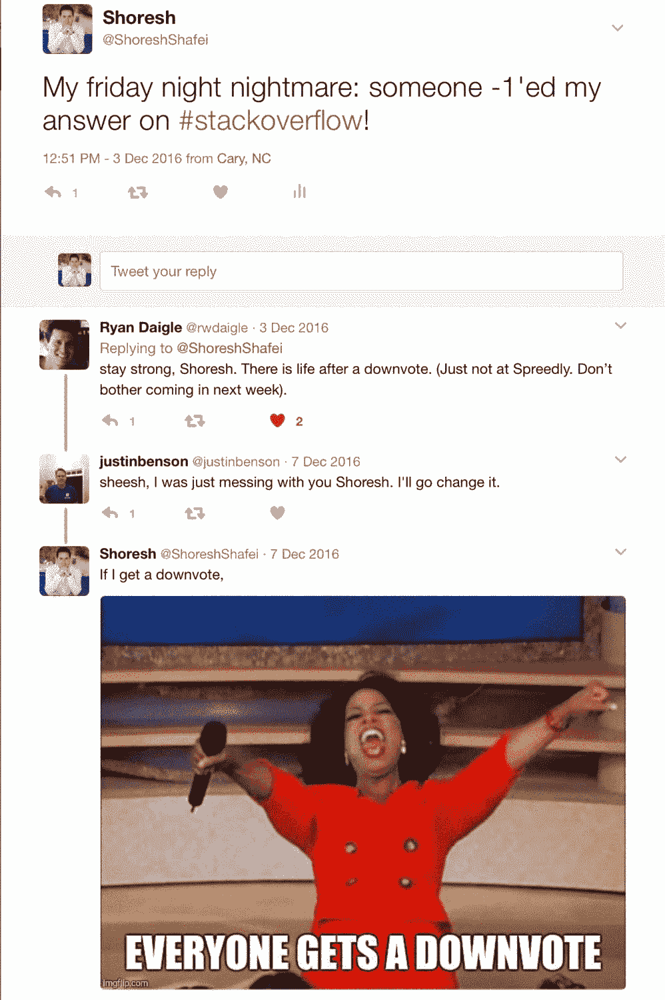

# 从物理到金融:我在工业界的第一年

> 原文：<https://towardsdatascience.com/from-physics-to-finance-my-first-year-in-industry-bac58044d474?source=collection_archive---------34----------------------->

照片由[克里斯蒂安·陈](https://unsplash.com/@christianchen?utm_source=medium&utm_medium=referral)在 [Unsplash](https://unsplash.com?utm_source=medium&utm_medium=referral)

*这是我大约 4 年前发表的文章的修订版。我很幸运地经历了一次激动人心的旅程，所以你们中许多人可能有的一个问题的答案是否定的！我从未后悔离开学术界的决定。*

许多研究生和博士后在工业界从事非研究性职业。这是其中一个人的故事。

2016 年 4 月 25 日下午 5 点，我离开了我在杜克大学的办公室，开始了新的不同的旅程，下周一上午 9 点。

在获得理论物理的两个硕士学位和一个博士学位，并在计算生物化学领域做了两年博士后，与各自领域备受尊敬的科学家合作，发表了 12 多篇同行评议论文并获得国际奖项后，寻求一个永久的学术职位似乎是合乎逻辑的下一步。

然而，在学习期间，我有幸参加了由美国光学学会和 SPIE 国际光学和光子学会等科学组织组织的专业发展活动，在那里我接触了行业领导者，了解了他们所面临的挑战。我探索得越多，就越发现自己对学术界之外的现实世界的问题和机遇着迷。

问题是，多年来，我在学术界一步一步地创造了成功的职业生涯，但我对外面的世界和适合理论物理学家的角色几乎一无所知；尽管如此，我相信没有多少职位可以利用我的量子力学或电动力学知识！

不幸的是，了解二阶光学非线性(在医学领域和电信领域有许多应用)或光裂酶修复光损伤的 DNA(使地球上的生命成为可能)并没有让许多招聘经理感到兴奋。事实上，我在这个过程中学到的第一课是

> 专注于我获得的技能，而不是我完成的项目。

技能，如解决问题，数值分析，编程，发表文章和演示。

几个月的阅读、学习、参加研讨会、打电话和咖啡聚会来探索不同的行业职位，将我引向了数据科学。我寻找新的职业道路是在这样一个时代，有史以来第一次，我们能够利用我们产生和储存的大量数据。这反过来又导致了对数学、统计和编程方面的熟练人才的大量需求，以便将原始数据转化为真知灼见。与此同时，任何行业都欣赏批判性思维、获得新技能的能力、有效的沟通和对新工作场所的快速适应，其中许多我以前都经历过。

对数据分析的需求正成为公司不可或缺的一部分，以至于数据科学候选人可以想象在任何领域的职业生涯，从医疗保健或航空领域的大型企业到金融或体育领域的初创公司。

就我而言，行业的选择并不是一个大问题。在我的学术生涯中，我意识到与合适的人一起工作比从事最令人兴奋的项目更有成就感。合适的人激励和挑战你，比起到达目的地，你更喜欢和他们一起旅行。正如保罗·格拉厄姆所说

> 重要的不是想法，而是拥有想法的人。好人可以修正坏想法，但好想法救不了坏人。

[更新:]将我过去的一些经验添加到这篇文章中，我再怎么强调和我们一起工作的人的重要性也不为过。简而言之，你最终将为你的经理和/或团队缺乏经验或远见付出代价。

我在当地的一次分析聚会上遇到了 Spreedly 的首席技术官。被他的热情和鼓励所打动，我递交了申请。后来，我会见了该公司的首席技术官和首席执行官，提交了工作样本，参加了现场面试，几周后，我疯狂地加入了他们，填补了他们的第一个数据科学职位。

在招聘过程中，我喜欢公司高管对我的角色的清晰看法，这在我做出决定时发挥了重要作用。我曾被其他公司面试过，这些公司不知道他们为什么需要一名数据科学家。

[Spreedly](https://www.spreedly.com/) 是一家成立 6 年的金融科技初创公司，通过存储和标记支付方法来促进在线支付，为商户简化 PCI-DSS(如果你接触金融数据，你必须遵守的规则)合规性，最重要的是，通过允许商户通过一个 API 与多个支付网关合作。因此，在 Spreedly，我可以访问交易、支付方式和支付网关的数据库。

作为创业公司的第一个数据科学雇员，与其他团队互动和学习的机会是无限的。我定期与工程师、业务开发、营销、客户成功和设计团队交流:这是一个了解其他领域、不同部门如何运作以及整体金融技术的独特机会。

以下是我一路走来学到的一些经验:

1.  不要害怕问:这可能是我疯狂加入后得到的最好的建议。问得越多，学得越快！
2.  机构知识:领域知识是数据科学家[维恩图](https://s3.amazonaws.com/aws.drewconway.com/viz/venn_diagram/data_science.html)的一部分。然而，我想强调的是机构知识:如果不了解公司如何运作，存储什么类型的数据，每个功能到底代表什么，以及商业模式如何随着时间的推移而演变，你的数据分析可能会有缺陷。
3.  耐心:这在数据基础设施可能还没有准备好的启动环境中变得更加重要。一个解决办法是考虑做几个项目，在一个项目上取得进展，同时等待合适的时机开始其他项目。
4.  商务人士是你最好的朋友！它们可以帮助您确定要用数据瞄准的重要问题。利用他们的商业智能更有效地工作，并获得关于数据解释的宝贵见解。在发布结果或向客户展示之前，一定要和他们讨论你的发现。
5.  重要与有趣:关注看似有趣的问题很容易，但它们与公司的使命或利益不一致，也不会让客户受益。因此，投资于真正重要的问题，而不是那些仅仅看起来有趣的问题，总是一个好主意。
6.  与数据驱动的人一起工作:数据科学仍然是一个新领域。因此，无论你的工作多么出色，无论你的发现多么令人兴奋，如果你不和那些欣赏数据的力量并愿意用它来做决策的人一起工作，你的努力就会白费。
7.  我提到过和一群很有幽默感的人一起工作真的很有趣吗？

各种[组织已经研究了从学术界到工业界的路径](http://www.nature.com/news/life-outside-the-lab-the-ones-who-got-away-1.15802)。根据 T4 的简历，只有 18%完成这一转变的年轻研究人员会回到学术界。我相信我是那 82%中的一员。

*更新(2020 年 12 月):*在我发表这篇帖子大约 4 年后，我仍然收到许多研究生和博士后的邮件和消息，他们正在谨慎地评估自己从学术界到工业界的退出路线。以下是我给这些人和其他考虑改变或职业转变的人的信息:只要你真诚对待你所做的事情，评估每一步，从过去吸取教训并用于未来，并且不害怕道路上的起起落落，你就会没事！去做吧，你会发现一种巨大的快乐。一定要让我知道你的故事…