# 从 PyTorch 到 py torch Lightning——一个温和的介绍

> 原文：<https://towardsdatascience.com/from-pytorch-to-pytorch-lightning-a-gentle-introduction-b371b7caaf09?source=collection_archive---------0----------------------->

这篇文章回答了如果你使用 PyTorch 为什么需要 Lightning 这个最常见的问题。

PyTorch 非常容易用来建立复杂的人工智能模型。但是一旦研究变得复杂，并且像多 GPU 训练、16 位精度和 TPU 训练这样的事情混合在一起，用户很可能会引入错误。

[PyTorch 闪电](https://github.com/williamFalcon/pytorch-lightning)正好解决了这个问题。Lightning 构建了 PyTorch 代码，因此它可以抽象训练的细节。这使得人工智能研究具有可扩展性，迭代速度快。

# PyTorch 闪电是为了谁？

PyTorch Lightning 是在 NYU 和费尔做博士研究时创造的

**PyTorch Lightning 是为从事人工智能研究的专业研究人员和博士生创造的**。

闪电诞生于我在 [NYU CILVR](https://wp.nyu.edu/cilvr/) 和[脸书 AI Research](https://ai.facebook.com/) 的博士 AI 研究。因此，该框架被设计成具有极强的可扩展性，同时使得最先进的人工智能研究技术(如 TPU 训练)变得微不足道。

现在[核心贡献者](https://pytorch-lightning.readthedocs.io/en/latest/BECOMING_A_CORE_CONTRIBUTOR.html)都在使用闪电推进人工智能的艺术状态，并继续添加新的酷功能。

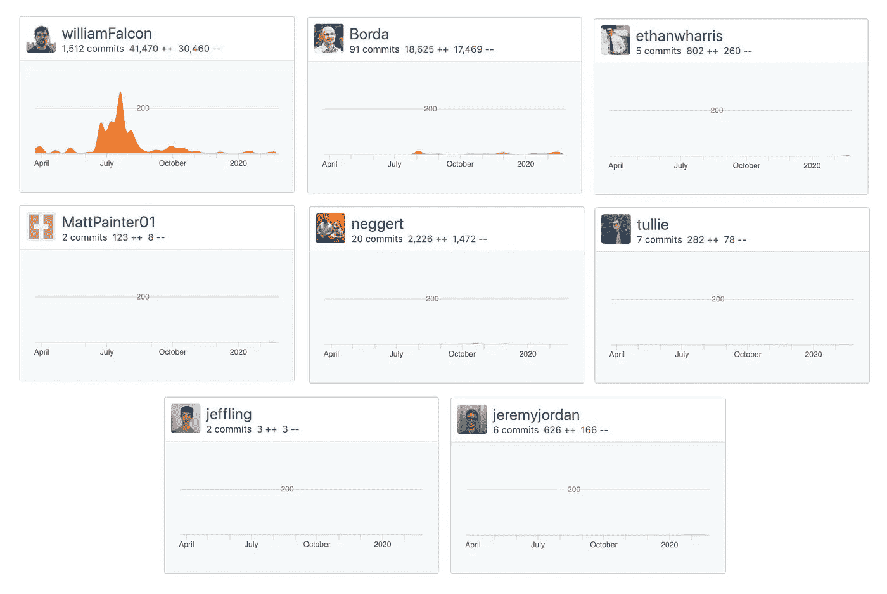

然而，简单的界面让**专业制作团队**和**新人**能够接触到 Pytorch 和 PyTorch Lightning 社区开发的最新技术。

Lightning counts 拥有超过 [320 名贡献者](https://github.com/PyTorchLightning/pytorch-lightning/graphs/contributors)，由 [11 名研究科学家](https://pytorch-lightning.readthedocs.io/en/latest/governance.html)，博士生和专业深度学习工程师组成的核心团队。

它是经过严格测试的

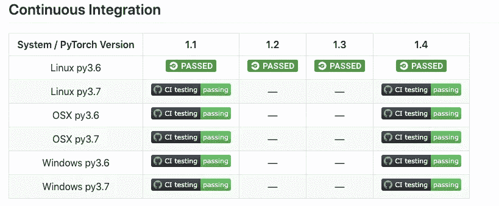

并且[彻底记录了](https://pytorch-lightning.readthedocs.io/en/latest/)

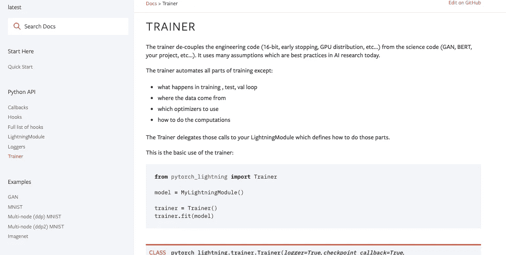

# 概述

本教程将带你构建一个简单的 MNIST 分类器，并排显示 PyTorch 和 PyTorch Lightning 代码。虽然 Lightning 可以构建任何任意复杂的系统，但我们使用 MNIST 来说明如何将 PyTorch 代码重构为 PyTorch Lightning。

[完整代码可在本 Colab 笔记本](https://colab.research.google.com/drive/1Mowb4NzWlRCxzAFjOIJqUmmk_wAT-XP3)上获得。

# 典型的人工智能研究项目

在一个研究项目中，我们通常希望确定以下关键组成部分:

*   模型
*   数据
*   损失
*   优化程序

# 模型

让我们设计一个 3 层全连接神经网络，它将 28x28 的图像作为输入，输出 10 个可能标签的概率分布。

首先，让我们在 PyTorch 中定义模型

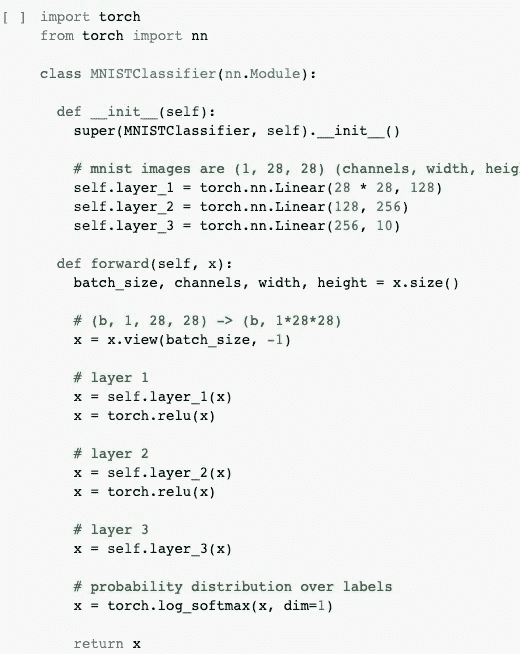

该模型定义了计算图形，将 MNIST 图像作为输入，并将其转换为数字 0-9 的 10 个类别的概率分布。

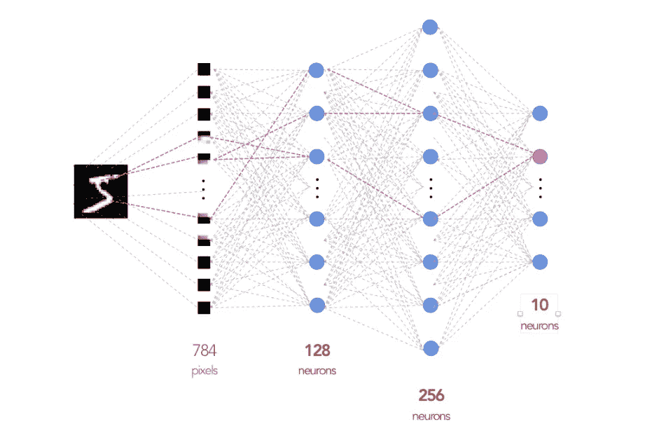

三层网络(插图作者:威廉·法尔孔)

为了将这个模型转换成 PyTorch Lightning，我们简单地替换掉 *nn。带 *pl 的模块*。照明模块*

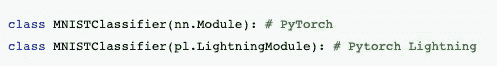

新的 PyTorch Lightning 类与 PyTorch 完全相同，除了 LightningModule 为研究代码提供了一个结构。

> 闪电为 PyTorch 代码提供了结构

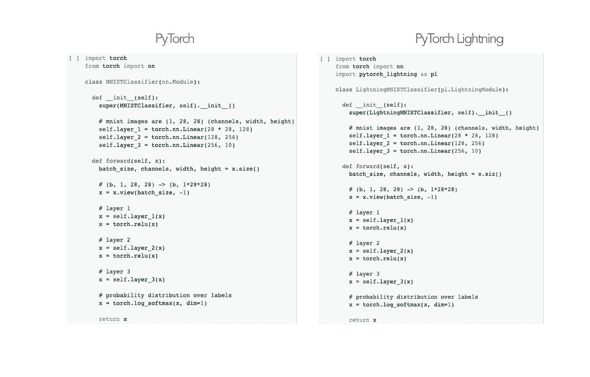

看到了吗？两者的代码完全一样！

这意味着你可以像使用 PyTorch 模块一样使用 LightningModule 模块，比如预测模块

**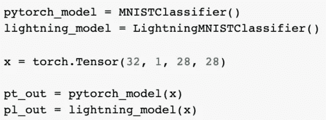**

**或者将其用作预训练模型**

**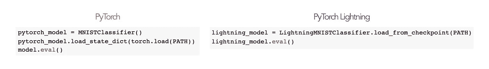**

# **数据**

**对于本教程，我们使用 MNIST。**

****

**来源:[维基百科](https://en.wikipedia.org/wiki/MNIST_database)**

**让我们生成 MNIST 的三个部分，培训、验证和测试部分。**

**同样，PyTorch 和 Lightning 中的代码是一样的。**

**数据集被添加到 Dataloader 中，data loader 处理数据集的加载、混排和批处理。**

**简而言之，数据准备有 4 个步骤:**

1.  **下载图像**
2.  **图像转换(这些非常主观)。**
3.  **生成训练、验证和测试数据集拆分。**
4.  **包装数据加载器中拆分的每个数据集**

**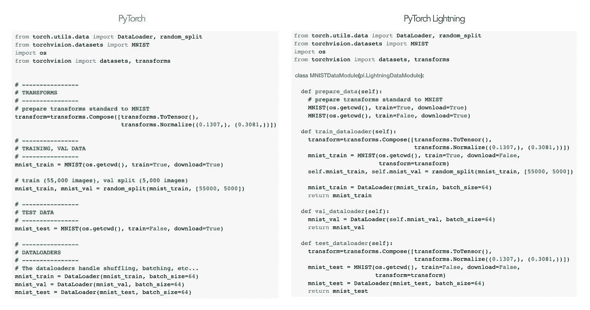**

**同样，除了我们将 PyTorch 代码组织成 4 个函数之外，代码完全相同:**

****准备 _ 数据****

**这个函数处理下载和任何数据处理。这个函数确保当您使用多个 GPU 时，您不会下载多个数据集或对数据应用双重操作。**

**这是因为每个 GPU 将执行相同的 PyTorch，从而导致重复。Lightning 中的所有代码确保关键部分仅从一个 GPU 中调用。**

****train_dataloader，val_dataloader，test_dataloader****

**其中每一个都负责返回适当的数据分割。Lightning 以这种方式构建它，以便非常清楚数据是如何被操纵的。如果你读过用 PyTorch 写的随机 github 代码，你几乎不可能看到他们是如何处理数据的。**

**Lightning 甚至允许多个数据加载器进行测试或验证。**

**这段代码被组织在我们称之为数据模块的地方。尽管这是 100%可选的，并且 lightning 可以直接使用数据加载器，但是一个[数据模块](https://pytorch-lightning.readthedocs.io/en/stable/datamodules.html)使您的数据可以重用并且易于共享。**

# **优化器**

**现在我们选择如何进行优化。我们将使用 Adam 代替 SGD，因为在大多数 DL 研究中，它是一个很好的缺省值。**

**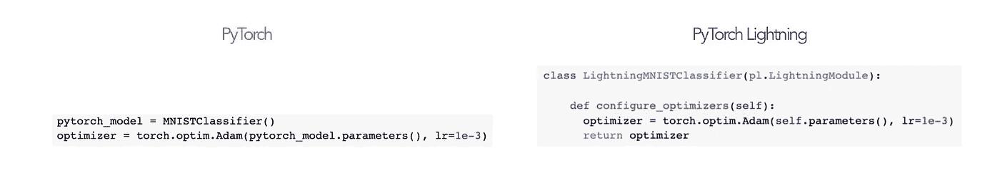**

**同样，这是**完全相同的**，除了它被组织到配置优化器功能中。**

**Lightning 是极其可扩展的**。**例如，如果你想使用多个优化器(比如:GAN)，你可以在这里同时返回两个。**

****

**您还会注意到，在 Lightning 中，我们传入了***self . parameters()****而不是模型，因为 LightningModule 是模型。***

# ***损失***

***对于 n 路分类，我们想要计算交叉熵损失。交叉熵与负对数似然度(log_softmax)相同，我们将使用负对数似然度。***

***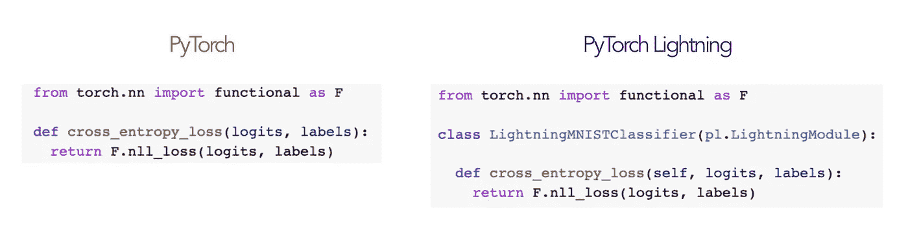***

***再次…代码完全相同！***

# ***训练和验证循环***

***我们收集了训练所需的所有关键材料:***

1.  ***模型(三层神经网络)***
2.  ***数据集(MNIST)***
3.  ***优化器***
4.  ***损失***

***现在，我们实施一套完整的训练程序，包括以下内容:***

*   ***迭代多个历元(一个历元是对数据集 **D** 的一次完整遍历)***

***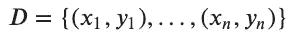***

***在数学方面***

***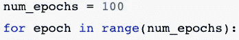***

***用代码***

*   ***每个历元以称为批次 **b** 的小块迭代数据集***

***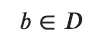***

***在数学方面***

******

***用代码***

*   ***我们向前传球***

***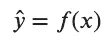***

***在数学方面***

***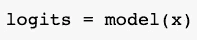***

***代码***

*   ***计算损失***

***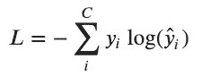***

***在数学方面***

***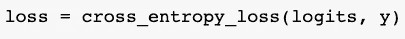***

***用代码***

*   ***执行反向传递以计算每个权重的所有梯度***

***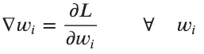***

***在数学方面***

***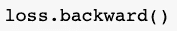***

***用代码***

*   ***将渐变应用于每个权重***

***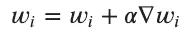***

***在数学方面***

***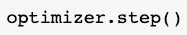***

***用代码***

***PyTorch 和 Lightning 中的伪代码都是这样的***

***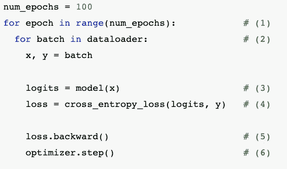***

***这就是闪电与众不同的地方。在 PyTorch 中，你自己编写 for 循环，这意味着你必须记住以正确的顺序调用正确的东西——这给 bug 留下了很大的空间。***

***即使你的模型很简单，但一旦你开始做更高级的事情，如使用多个 GPU、渐变裁剪、提前停止、检查点、TPU 训练、16 位精度等，它就不再简单了。你的代码复杂性将迅速爆炸。***

> ***即使你的模型很简单，一旦你开始做更高级的事情，它就不再简单了***

***下面是 PyTorch 和 Lightning 的验证和训练循环***

***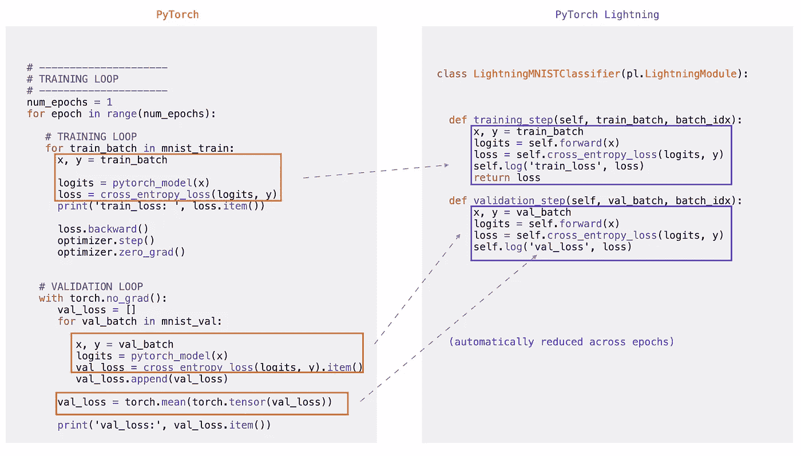***

***这就是闪电的妙处。它抽象了样板文件(不在盒子里的东西),但是**没有改变其他任何东西。这意味着你仍然在编写 PyTorch，除非你的代码已经被很好地结构化了。*****

***这增加了可读性，有助于再现性！***

# ***闪电教练***

***培训师就是我们如何抽象样板代码。***

***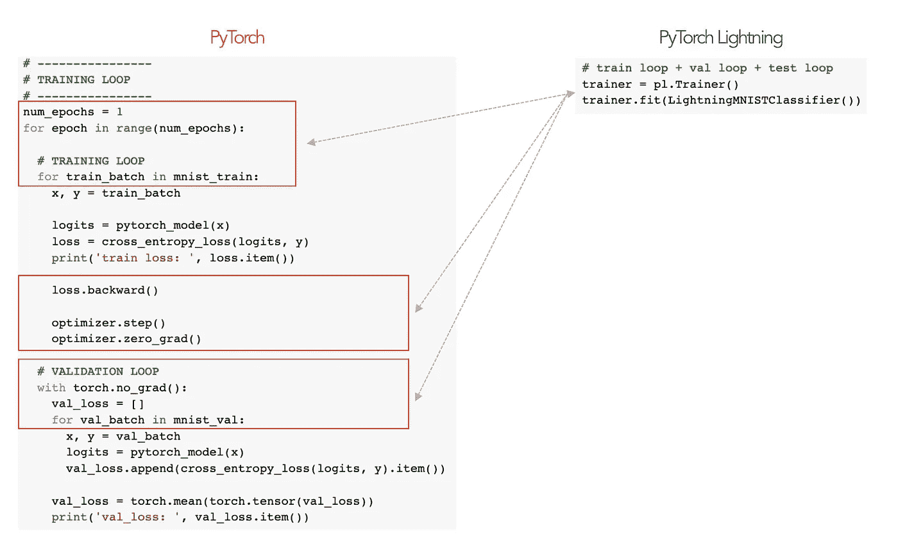***

***同样，这也是可能的，因为您所要做的就是将 PyTorch 代码组织成一个 lightning 模块***

# ***PyTorch 的完整训练循环***

***用 PyTorch 编写的完整 MNIST 示例如下:***

# ***闪电中的完整训练循环***

***lightning 版本完全相同，除了:***

*   ***核心成分已经由照明模块组织起来***
*   ***培训师已经提取了培训/验证循环代码***

***这个版本不使用数据模块，而是保持自由定义的数据加载器。***

***这是相同的代码，但是数据被分组到数据模块下，变得更加可重用。***

# ***突出***

***让我们指出几个要点***

1.  ***如果没有 Lightning，PyTorch 代码可以位于任意部分。有了闪电，这是结构化的。***
2.  ***这两者的代码完全相同，只是它是用 Lightning 构建的。(值得说两遍 lol)。***
3.  ***随着项目变得越来越复杂，你的代码不会，因为 Lightning 抽象出了大部分内容。***
4.  ***您保留了 PyTorch 的灵活性，因为您可以完全控制培训中的关键点。例如，您可以有一个任意复杂的 training_step，比如 seq2seq***

***5.在《闪电》中，你得到了一堆赠品，比如一个恶心的进度条***

***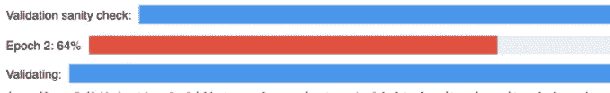***

***你还得到了一份漂亮的重量总结***

***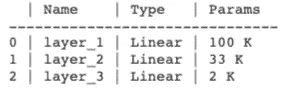***

***tensorboard 日志(没错！你什么都不用做就能得到这个)***

***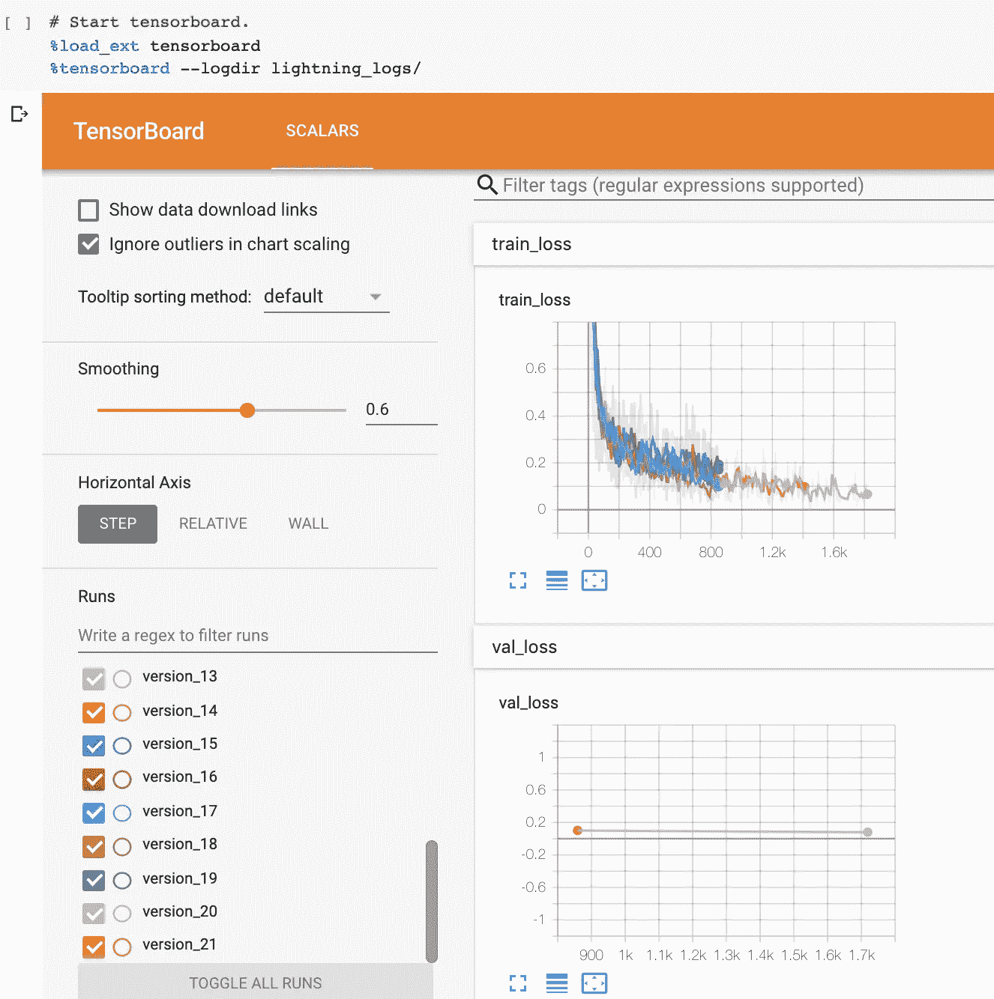***

***免费检查点和提前停止。***

***全部免费！***

# ***附加功能***

***但闪电最出名的是开箱即用的好东西，如 TPU 培训等…***

***在 Lightning 中，您可以在 CPU、GPU、多个 GPU 或 TPU 上训练您的模型，而无需更改 PyTorch 代码的任何一行。***

***也可以做 16 位精度训练***

***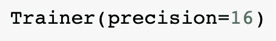***

***使用 [5 个其他替代物](https://pytorch-lightning.readthedocs.io/en/latest/experiment_logging.html)对张量板进行测井***

***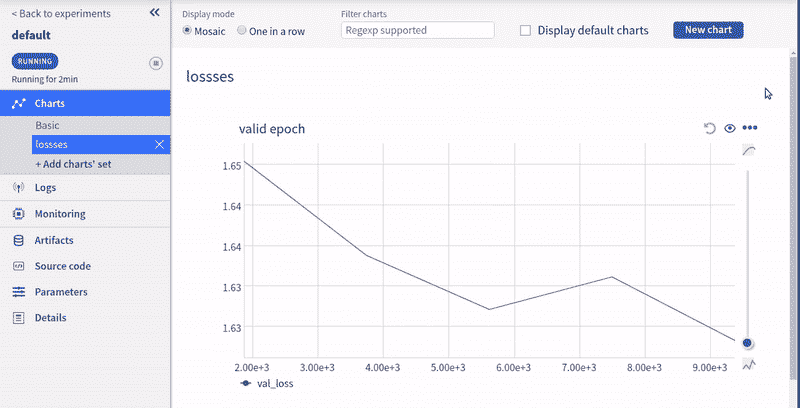***

***与海王星一起伐木。AI(鸣谢:Neptune.ai)***

***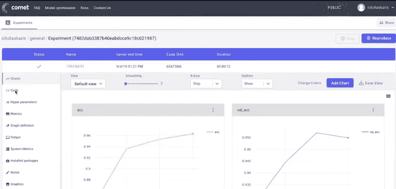***

***用 Comet.ml 记录日志***

***我们甚至有一个内置的分析器，可以告诉你训练中的瓶颈在哪里。***

***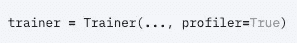***

***将此标志设置为 on 会产生以下输出***

***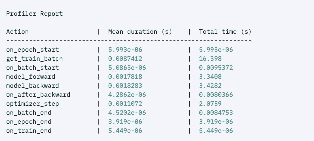***

***或者更高级的输出***

***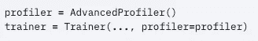******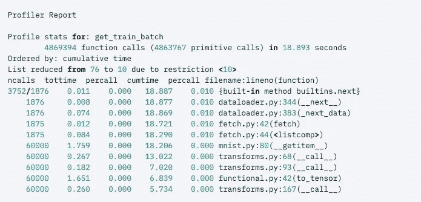***

***我们还可以[同时在多个 GPU](https://pytorch-lightning.readthedocs.io/en/latest/multi_gpu.html)上训练，而不需要你做任何工作(你仍然需要提交一个 SLURM 作业)***

***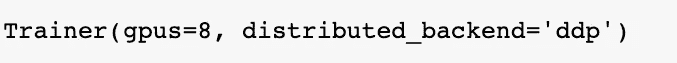***

***你可以在文档中读到它支持的大约 [40 个其他特性](https://pytorch-lightning.readthedocs.io/en/latest/trainer.html)。***

# ***带挂钩的可扩展性***

***你可能想知道 Lightning 是如何为你做这些事情的，而且还能让你完全控制一切？***

***与 keras 或其他高级框架不同，lightning 不隐藏任何必要的细节。但是如果你确实发现需要自己修改训练的每一个方面，那么你有两个主要的选择。***

***首先是通过覆盖钩子的可扩展性。下面是一个不完整的列表:***

*   ***[向前传球](https://pytorch-lightning.readthedocs.io/en/latest/lightning-module.html#pytorch_lightning.core.LightningModule.forward)***
*   ***偶数道次***
*   ***[应用优化器](https://pytorch-lightning.readthedocs.io/en/latest/lightning-module.html#pytorch_lightning.core.LightningModule.optimizer_step)***

***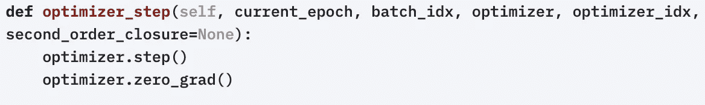***

*   ***[设置分布式培训](https://pytorch-lightning.readthedocs.io/en/latest/lightning-module.html#pytorch_lightning.core.LightningModule.init_ddp_connection)***

***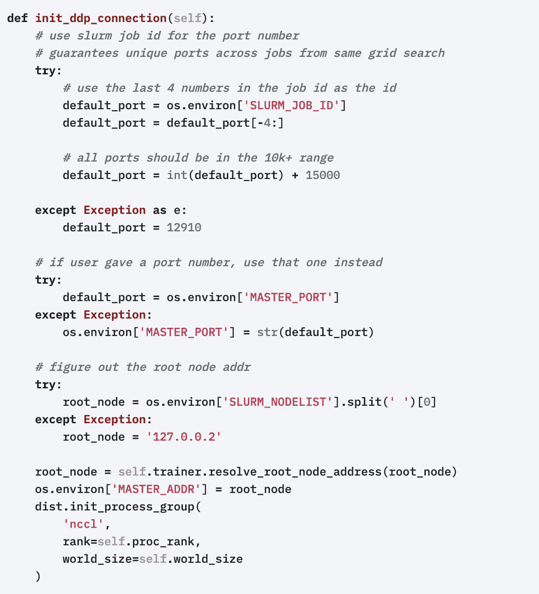***

*   ***[设置 16 位](https://pytorch-lightning.readthedocs.io/en/latest/lightning-module.html#pytorch_lightning.core.LightningModule.configure_apex)***

***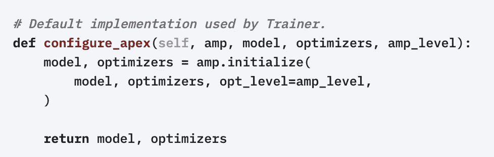***

*   ***[我们怎么做截断回道具](https://pytorch-lightning.readthedocs.io/en/latest/lightning-module.html#pytorch_lightning.core.LightningModule.tbptt_split_batch)***

***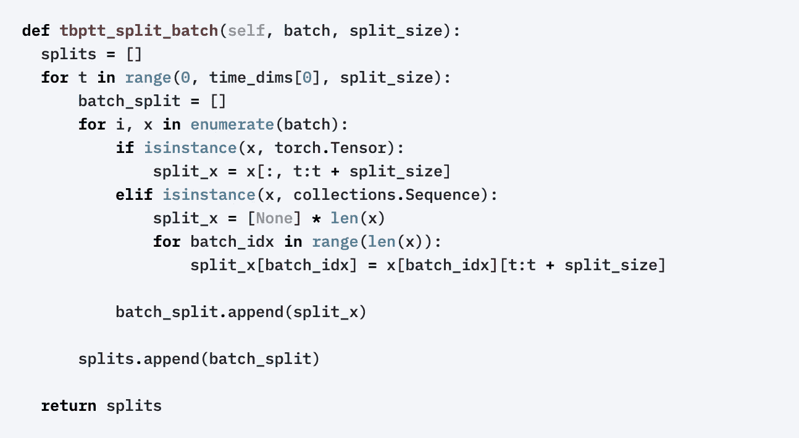***

*   ***…***
*   ***您需要配置的任何东西***

***这些覆盖发生在照明模块中***

******

# ***回调的可扩展性***

***回调是您希望在培训的各个部分执行的一段代码。在 Lightning 中，回调是为非必要的代码保留的，比如日志或者与研究代码无关的东西。这使得研究代码非常干净和有条理。***

***假设您想在培训的各个阶段打印或保存一些东西。这是回调的样子***

***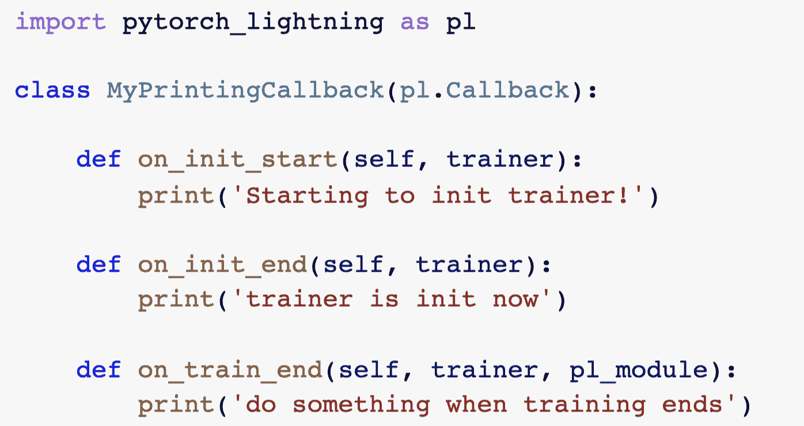***

***PyTorch 闪电回拨***

***现在你把它传递给训练者，这个代码会在任意时间被调用***

***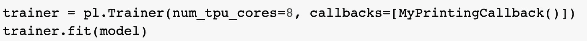***

***这种范式将您的研究代码组织成三个不同的类别***

1.  ***研究代码(LightningModule)(这就是科学)。***
2.  ***工程代码(培训师)***
3.  ***与研究无关的代码(回调)***

# ***如何开始***

***希望这份指南能准确地告诉你如何开始。最简单的开始方式是用[运行 colab 笔记本，这里是 MNIST 的例子](https://colab.research.google.com/drive/1F_RNcHzTfFuQf-LeKvSlud6x7jXYkG31#scrollTo=gjo55nA549pU)。***

***或者安装闪电***

***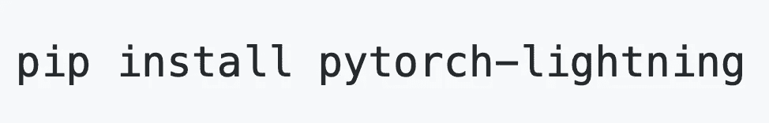***

***或者查看 Github 页面。***