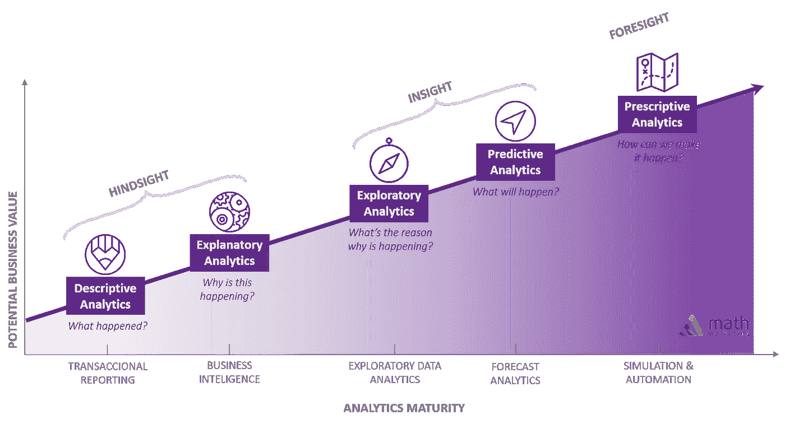
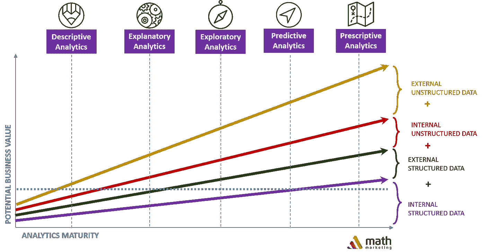

# 从报告到洞察:提高分析成熟度

> 原文：<https://towardsdatascience.com/from-report-to-insight-increasing-analytics-maturity-a32cb3a290c0?source=collection_archive---------29----------------------->

freepik 创作的背景照片—[www.freepik.com](http://www.freepik.com)

今天的公司面临着巨大的挑战:**如何从信息中提取价值，并在快速的** [**数据驱动的**](https://medium.com/deepmarket/data-driven-marketing-what-it-is-and-how-it-supports-smarter-decisions-5520ecda92b6) **环境中运营**。长期以来，良好的洞察力在商业中一直扮演着关键角色，高管们对此心知肚明。但是，这从来没有成为全公司沮丧的根源。简单来说，**想成为** [**数据驱动**](https://medium.com/deepmarket/data-driven-marketing-what-it-is-and-how-it-supports-smarter-decisions-5520ecda92b6) **和搞定**是有区别的。原因是数据和分析之间存在巨大的基础设施和技能差距。

> 一个组织的业务不是写报告，而是基于洞察力采取行动

当今的分析解决方案通常在简单和假设的场景中进行测试和呈现，无法反映日常交易和真实组织的细微差别。它错误地促使企业领导相信**将数据集插入工具很容易，而且会产生立竿见影的业务影响。事实并非如此，在任何可见的结果之前，数据都需要大量的提炼。**

成功实施数据驱动的文化有三个关键要素:

1.  领导者需要向数据和分析的新观点飞跃。**摆脱将孤立的数据、业务应用程序和分析应用程序基于数据仓库和业务智能系统的旧思维，主要用于企业报告**；
2.  团队需要开始将**数据作为决策和计划的原材料**；
3.  公司需要接受新的方法和工具，这将引导他们走向分析的成熟。

# **走向有洞察力的决策**

其中一个工具是**连续分析**。由 Gartner 推出，它代表了组织积极处理数据的不同阶段。这是一个非常有用的工具，有助于组织了解他们当前的情况，并为未来的发展做好规划。

基于我们在各种行业帮助众多公司的经验，我们在 [Math Marketing](http://bit.ly/3c7KdcL) 展示了如下分析连续体:

连续分析(通过数学营销)

**描述性分析:**允许公司确定以前期间发生的事情。它有助于管理人员衡量绩效和关键指标，并经常转化为报告和仪表板。它关注过去的绩效，并在检测到偏差时触发反应。

不幸的是，现在有一种趋势，要么报告法规和合规性要求的最低限度(如季度财务报告和税务报告)，要么生成大量报告，这些报告需要大量工作，很少及时相关，并且容易不作为。**尽管如此，一个好的描述性分析是一个宝贵的基础。**

**解释性分析:**通过关注为什么，**解释性分析旨在理解描述性分析报告的结果背后的原因**。它经常需要研究变量之间的相关性和回归。然而，它仍然只能提供一个向后的视野。它是关于理解关系以及为什么某些事情会发生而其他事情不会发生。好的解释模型可能会变成好的预测模型，但是[开始的目标是不同的](https://www.theanalysisfactor.com/differences-in-model-building-explanatory-and-predictive-models/)。

连续体的每个阶段都意味着技能和难度的显著增加。但是，从描述性分析到解释性分析的转变最为引人注目。法规、下架率和商业头脑可以产生可接受的报告，即使是无关紧要的报告。但是解释需要最低限度的统计知识。公司的墓地充满了仓促的结论和轶事般的关联。

**探索性分析:**使组织能够探索事件背后的原因和检测到的解释。它意味着拓宽对模式、趋势、异常值、意外结果的观察，并利用定量和可视化方法的混合来了解故事数据想要讲述的内容。 [**因果关系**](/why-correlation-does-not-imply-causation-5b99790df07e) 比相关性更进了一步。它说一个变量的值的任何变化都会引起另一个变量的值的变化。了解原因是预测的敲门砖。

**预测分析:**是预测可能发生的事情，估计影响和预测未来。它允许组织创建和探索不同的场景并提前计划。它需要对环境有深入的了解，并对数据有很强的控制能力。虽然工具集在这里发挥了作用，但主要部分是关于高级统计学/计量经济学和商业知识。

**规定性分析:**给定已经收集的深层知识，它为组织提供了一条通向特定目标的道路。它基本上回答了“应该做些什么来实现结果 X”这个问题。在这个阶段，人类的干预可能是最少的，并且有可能将决策委托给机器来实现业务目标。(例如:对冲基金交易算法)

在一家金融服务公司的营销部门的上下文中，描述性分析提供了关于上个月特定活动参与情况的信息。解释性分析研究了参与度和营销支出之间的关系。探索性分析探索受众群以发现可能的趋势。预测分析总结未来的营销活动参与情况，并告知管理层实现预期参与目标的最佳营销活动。

# **你的数据有多深**

分析深度(数学营销)

经常被忽视的一个方面是不同数据源所扮演的角色。即使没有提高分析的成熟度，也可以从扩展的数据源中产生价值。在某些情况下，具有大量数据源的描述性分析与基于内部信息的预测性分析一样有用。我们称之为**分析深度**，并认为属于以下类别之一:

**内部结构化数据:**公司在正常交易过程中收集的信息，如销售额和金额、客户联系信息或产品日志。它们是有意收集信息过程的结果。对于公司来说，这是最简单的，有时也是唯一的信息来源。

**外部结构化数据:**来自外部数据库的信息，可以公开获得，也可以来自数据提供商。它包括政府统计数据、客户报告或市场调查等。信息通常以表格形式或任何其他结构化形式提供，由组织来寻找与内部数据的相关性。它增加了公司可用的数据量。

**内部非结构化数据:**并非所有内部信息都可供消费。商业知识通常通过电子邮件、聊天室、论坛或维基等非正式工具传播。有些甚至可能在合同或产品手册等任何数字形式上都找不到。合并非结构化数据源是一项复杂工作。增加公司可用数据的种类

**外部非结构化数据:**包括来自社交媒体、社区博客和公司与客户或利益相关者互动的其他在线论坛的信息。考虑到如今创建的数据的共享量和速度，将其纳入决策流程是一项挑战。

分析深度有助于组织理解的是，通往分析成熟度的道路更多地依赖于流程评估、提出正确的问题以及使数据源多样化，而不是投资于新工具。

# **洞察力需要新的技能**

组织在分析上花费如此多的时间和精力的核心原因不应该只是为了获得最新的报告。虽然知道刚刚发生了什么是重要和有用的，但它只能提供事情执行得如何的细节，并在粘贴中给出财务表现的概述。然而，它常常不能提供任何关于明天应该做什么的洞察力。

许多公司在描述性分析和工具上花费了太多的时间和金钱。不幸的是，让管理层感到沮丧的是，在充分发挥其潜力之前，这些工具需要的比他们预期的更多。技能仍然是企业面临的最大挑战。**这些额外的能力通常需要具备额外的定量、内容和分析技能的新角色，可能是统计分析师或数据科学家。**

大多数组织未能进行文化或业务模式调整来真正利用信息。提出如何使用信息或分析的想法是很棒的。但是，如果组织没有准备好实际行动，那么它可能真的会变成一个时间之水。许多见解，但实际上并没有将它们与业务联系起来

# **最终想法**

组织每天在不同的层面做出数百个甚至数千个决策，这些决策具有不同程度的影响、复杂性、频率和用途。唯一不变的是变化，而分析代表了适应变化的一种方式。识别模式、预测结果并积极应对将是未来竞争的基础。

[数学营销](http://bit.ly/3c7KdcL)已经帮助各行各业的公司实施数据驱动流程。通过将统计能力、商业知识和高级工具相结合，我们帮助客户回答问题。一些最大的品牌与我们分享了他们的数据挑战，并相信我们的数据能够为日常运营和战略决策提供真知灼见。

如果您想了解我们的项目和方法，请通过[电子邮件](http://bit.ly/3c7KdcL)联系我们，或者直接通过 [Linkedin](https://www.linkedin.com/in/psmagalhaes/) 联系我们的任何团队经理。我们随时准备与您分享我们的见解，倾听您的经验。