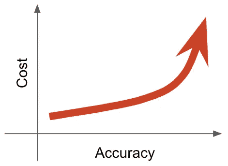
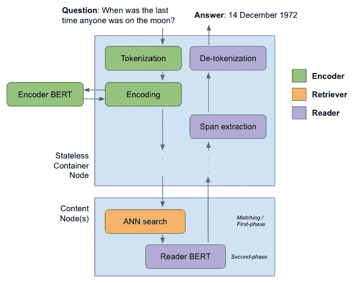
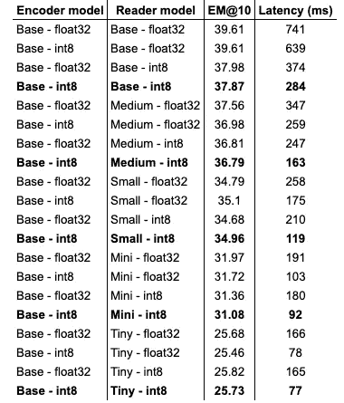
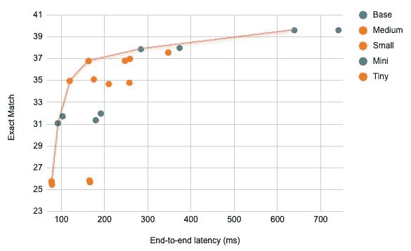
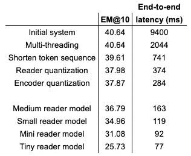

# 从研究到生产:扩展最先进的机器学习系统

> 原文：<https://towardsdatascience.com/from-research-to-production-scaling-a-state-of-the-art-machine-learning-system-6efad0141865?source=collection_archive---------29----------------------->

## [理解大数据](https://towardsdatascience.com/tagged/making-sense-of-big-data)

## **我们如何实施生产就绪的问答应用程序，并将响应时间减少了两个数量级以上。**

(图片由作者提供)

想象一下，你已经创建了一个机器学习系统，它在某些任务上超越了最先进的性能。您已经针对一系列目标进行了优化，如分类准确性、F1 分数或 AUC。现在您想从它创建一个 web 服务。其他目标，如向用户交付结果的时间或成本，变得更加重要。

这两组目标通常是冲突的。更精确的模型通常很大，评估起来计算量很大。为了在生产中使用这种模型，通常会引入各种优化，如降低模型的精度和复杂性。虽然有利于降低成本和能耗，但不幸的是，这会损害精度。

显然，如果准确性不重要，推断时间可以大大降低。同样，可以以高成本产生非常准确的响应。最终选择哪种解决方案介于这两个极端之间。选择最佳解决方案的一个有用的技巧是从准确性和成本方面列举它们。不受他人支配的解决方案集被称为[帕累托边界](https://en.wikipedia.org/wiki/Pareto_efficiency#Pareto_frontier)，它确定了准确性和成本之间的最佳权衡。

在[之前的一篇博文](/efficient-open-domain-question-answering-on-vespa-ai-72562121dcd8)中，我们介绍了一个服务系统，它重现了开放领域问答中最先进的准确性。我们基于脸书的[密集段落检索(DPR)](https://github.com/facebookresearch/DPR) ，这是一个基于 Python 的研究系统。我们使用 [Vespa.ai](https://vespa.ai) 构建了服务系统，这是一个开源的大数据服务引擎，由于其对快速相似性搜索和搜索和排名中的机器学习模型的原生支持，它非常适合这样的任务。结果是 web 服务接受一个问题并返回一个精确的答案。

虽然该系统重现了 DPR 的结果，因此具有出色的准确性指标，但从端到端延迟来看，响应时间最初很差。这篇文章将描述我们为使生产系统的性能达到可接受的水平所做的各种优化。

Vespa.ai 是为生产而构建的，因此有相当多的服务时间优化选项。我们将特别使用 Vespa.ai 的能力，通过每个查询使用多个工作线程来检索和排列文档，以达到显著的效果。然而，该应用程序的主要成本是评估两个 BERT 模型。我们想要回答的一个问题是，具有完全精度的较小模型是否优于具有量化参数的较大模型。我们将开发帕累托边界来评估各种优化的优点。

我们将从服务系统的概述开始，并确定系统的哪些部分最初推动了成本。关于实现的更多细节，我们可以参考本系列中[之前的博文](/efficient-open-domain-question-answering-on-vespa-ai-72562121dcd8)。

# 问题回答

该系统的任务是对以自然语言给出的问题产生文本回答。主要包括三个阶段:

*   编码器生成问题的表示向量。
*   检索器在 2100 万个索引段落中执行最近邻搜索。
*   读者找到最相关的段落，并摘录最后的答案。

下图说明了这一过程:

问答的编码器、检索器和阅读器(图片由作者提供)

编码器首先从问题中创建一个标记化的表示。这个令牌 id 向量作为输入被发送到编码器 BERT 模型。这最初是一个标准的基于 BERT 的模型，有 12 层，隐藏层大小为 768。最终的隐藏层状态被用作问题的表示向量。如上图所示，这主要发生在 Vespa 的无状态容器层。令牌和向量表示被向下传递(“分散”)到所有内容节点以执行查询。

在内容节点上，段落已经用它们自己的表示向量进行了索引。这些向量被构造成使得问题向量和段落向量之间的欧几里德距离指示相似性。这在 HNSW 算法中用于执行近似最近邻搜索。具有最小欧几里德距离的 10 个通道被发送到下一阶段。

同样在每个内容节点上执行的第二阶段排序阶段评估读者 BERT 模型。像编码器模型一样，这最初是具有 12 层和隐藏长度 768 的基于 BERT 的模型。来自查询和每个段落的表征被组合以形成模型输入。读者模型产生三个概率分数:相关性分数和答案在文章标记序列中的开始和结束索引。具有最佳相关性分数的段落被选为获胜者，并且其令牌表示被返回给无状态层。在这里，自定义代码使用起始和结束索引提取最佳跨度，对其进行去标记化，并返回结果文本答案。

现在，那是很多工作。以下是对问题“谁赢得了 2015 年环法自行车赛”的回答示例，其中检索了最相关的段落，并提取了正确答案“克里斯·弗鲁姆”:

来自 Vespa.ai 的回应(图片由作者提供)

为了测量性能，我们在一台机器上部署了该系统，该机器配有[英特尔至强金色 6240 处理器](https://ark.intel.com/content/www/us/en/ark/products/192443/intel-xeon-gold-6240-processor-24-75m-cache-2-60-ghz.html)，200 GB RAM 和固态硬盘。我们评估了超过 3610 个问题的系统，并记录了平均延迟和精确匹配分数。最初，系统获得 40.64 的精确匹配分数。在考虑优化性能之前，上述三个阶段花费的时间为:

*   编码模式:300 毫秒
*   近似最近邻搜索:13 毫秒
*   前 10 名读者排名:9085 毫秒

显然，9.4 秒的总端到端延迟对于服务来说是不可接受的。**接下来，我们将把它降低到 100 毫秒以下**

# 多线程检索排序

最初，最昂贵的步骤是阅读器阶段。默认情况下，Vespa 在一个线程上为一个查询进行所有排序。当计算成本较低时，这是最大化吞吐量的合理缺省值。在这种情况下，这意味着读者模型是针对前 10 篇文章中的每一篇依次进行评估的。这导致了很高的查询延迟。

然而，Vespa 可以选择每次搜索使用[多线程](https://docs.vespa.ai/documentation/reference/services-content.html#requestthreads)。设置此值会将平均端到端延迟降低到 2.04 秒，提高了 4 倍以上，而不会影响精确的匹配分数。

值得澄清的是，阅读器模型并不是批量评估的。这是由于 Vespa 的排名框架，其中排名表达式对单个段落和查询对进行评分。然而，对于 BERT 模型，这并不重要，因为[评估时间与批量](https://medium.com/microsoftazure/accelerate-your-nlp-pipelines-using-hugging-face-transformers-and-onnx-runtime-2443578f4333)成线性关系。一个原因是具有 3 维或更多维张量的张量乘法，因为这些乘法无论如何都要在几个硬件优化的矩阵-矩阵乘法上迭代。

一般来说，Vespa 有许多选项来调整性能，例如轻松地将工作负载分布在附加的内容节点上。虽然我们不在这里探讨，但请参阅 [Vespa 服务扩展指南](https://docs.vespa.ai/documentation/performance/sizing-search.html)了解更多信息。

# 令牌序列长度

BERT 模型的定义和最显著的特征之一是完全注意层。虽然这是语言理解方面的一个重大突破，但它对评估时间有一个不幸的 O(n)影响。

因此，输入到 BERT 模型的标记序列的长度显著影响推理时间。最初，编码器 BERT 模型的输入长度为 128。通过将其减少到 30，我们将推断时间从 300 毫秒减少到 125 毫秒，而不损失准确性。

同样，阅读器模型最初的输入长度为 380。通过将此值减少到 128，我们将平均延迟从 1.9 秒减少到 741 毫秒，这是一个显著的减少。然而，我们的准确率确实下降了，因为一些问题和段落的组合会导致令牌序列超过 128。这将精确的匹配分数降低到 39.61。

编码器和阅读器型号都支持动态长度输入，但 Vespa 目前仅支持固定长度输入。不过，这个问题将在不久的将来得到解决。总之，缩短编码器和阅读器模型的令牌输入长度会导致 3 倍的加速。

# 模型量化

神经网络模型通常使用单精度浮点数来训练。然而，对于生产中的推理，已经表明这种精度水平并不总是必要的。可以将参数转换成更小的整数表示，而不会显著降低精度。将参数从 32 位浮点转换为 8 位整数会将模型大小减少 75%。更重要的是，整数运算执行起来要快得多。支持 AVX512 矢量神经网络指令(VNNI)的现代 CPU 旨在加速 INT8 推理性能。此外，评估这种量化模型需要更少的功率。

量化阅读器模型使其大小从 435Mb 减少到 109Mb。系统的延迟平均下降到 374 毫秒。这对准确性有一点不幸的影响，精确匹配下降到 37.98。类似地，量化编码器模型导致类似的大小减少，并且系统评估时间下降到 284 毫秒，精确匹配分数下降到 37.87。

总之，阅读器和编码器模型的模型量化导致另一个 3 倍的加速。

# 微缩模型

到目前为止，编码器和读取器模型都是基于预训练的 BERT-base 模型，包含 12 层，隐藏维度大小为 768，因此大约有 1.1 亿个参数。这些都是相当大的模型，尤其是在时间有限的环境中使用时。然而，在论文[“博览群书的学生学得更好:论预训练紧凑模型的重要性”](https://arxiv.org/abs/1908.08962)中，作者表明较小的模型确实可以工作得很好。本文引用的“微缩”模型可以在[变形金刚模型库](https://huggingface.co/google/bert_uncased_L-12_H-768_A-12)中找到。

我们训练了新的读者模型，如 [DPR 知识库](https://github.com/facebookresearch/DPR#5-reader-training)中所述，基于以下预训练的 BERT 微型模型:

*   中号(8 层，512 隐藏尺寸)
*   小(4 层，512 隐藏尺寸)
*   迷你(4 层，256 隐藏尺寸)
*   微小(2 层，128 隐藏尺寸)

我们也对每个模型进行量化。下表给出了具有精确匹配分数和平均延迟的所有 20 个模型(5 个阅读器模型，有和没有量化，有和没有量化编码器模型)的完整概述:

各种模型类型的精确匹配分数与延迟

绘制这些结果:

精确匹配与延迟(图片由作者提供)

在上图中，红线代表帕累托前沿。沿着这条战线的点在上表中也用粗体标出。回想一下，这些点代表了精确匹配和延迟之间的最佳权衡，这意味着对于这条战线上的每个点，没有其他点在精确匹配和延迟方面更胜一筹。

这里可以看到的一个有趣的结果是，一般来说，量化模型以更高的精度支配其他模型。例如，中等量化模型比具有更高精度的小模型具有更好的精确匹配和延迟数。因此，在这种情况下，尽管量化会降低精度，但选择已量化的大模型比选择未量化的小模型更有利。

帕累托前沿将客观上的最佳解决方案可视化，而我们的主观偏好将引导我们找到最佳解决方案。以上测试是在一台[英特尔至强金牌 6240](https://ark.intel.com/content/www/us/en/ark/products/192443/intel-xeon-gold-6240-processor-24-75m-cache-2-60-ghz.html) 机器上运行的。更强大的处理器会降低整体延迟数字，但不会改变整体形状。选择的确切解决方案基于我们的延迟和硬件预算。例如，拥有大量资源并能够充分扩展的组织可以证明在这方面向右移动是正确的。规模经济可以降低硬件投资和能源消耗的成本，使服务变得可行。这样的解决方案对其他人来说可能遥不可及。

# 把这些放在一起

请参考[配套示例应用程序](https://github.com/vespa-engine/sample-apps/tree/master/dense-passage-retrieval-with-ann/)，了解更多关于如何自己运行该应用程序的详细信息和说明。

# 结论

总的来说，我们将一个性能不佳的研究应用提升到了适合生产的水平。从完整模型的 9.4 秒到微型模型的 70 毫秒，这代表了 130 倍的加速。不幸的是，为了达到这些水平，我们也注意到精确匹配的显著下降。最佳选择介于这两个极端之间。如果我们要将该应用程序投入生产，我们可以使用更强大的硬件来将延迟降低到 100 毫秒以下，并具有可接受的精确匹配指标。

有相当多的优化我们没有尝试，超出了本文的范围。例如， [FastFormers:用于自然语言理解的高效转换器模型](https://github.com/microsoft/fastformers)包括一些额外的优化，用于更高效的推理，如模型修剪。此外，新一代的 BERT 模型试图缓解与完全注意机制相关的性能问题。例如，[大鸟架构](https://arxiv.org/abs/2007.14062)看起来很有前途。

我们省略了训练微型编码器模型。从延迟的角度来看，在问题编码中使用微型 BERT 模型具有额外的好处，因为问题和段落的向量表示更短。因此，近似最近邻搜索将变得更加有效。然而，这可能会导致准确性的显著下降，并且花费在人工神经网络上的时间无论如何都不是延迟的重要驱动因素。

添加额外的内容节点将允许分配工作负载。这可能不会减少延迟，但会增加我们可以用阅读器模型评估的通道数。我们将在下一篇博客文章中回到这个话题。