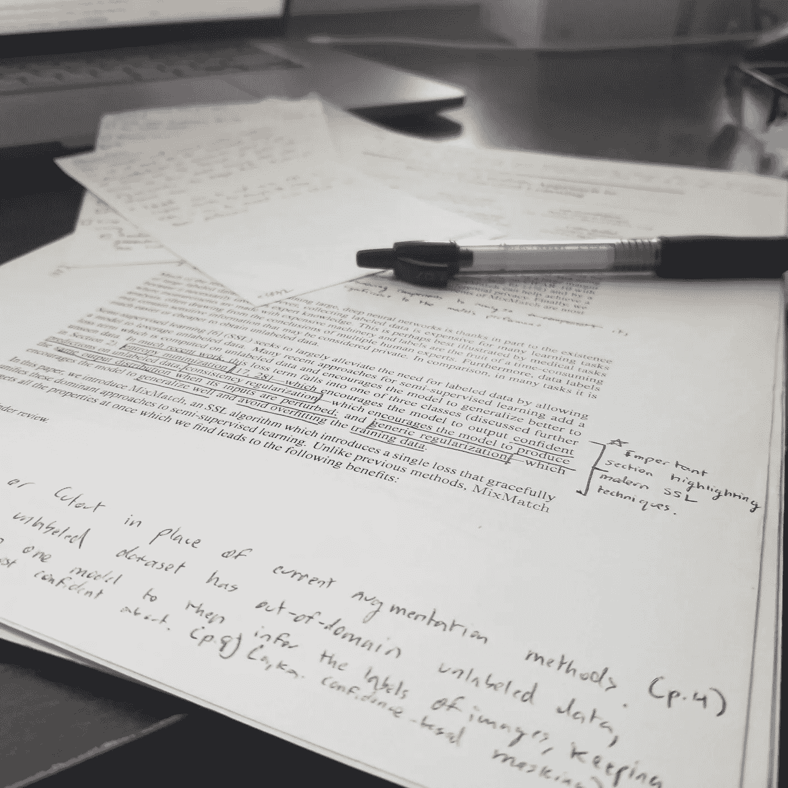
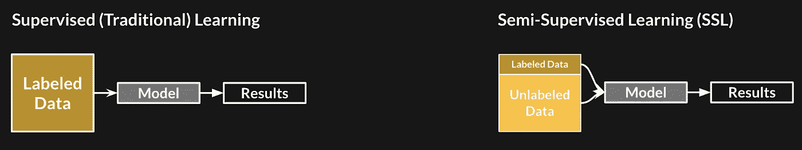
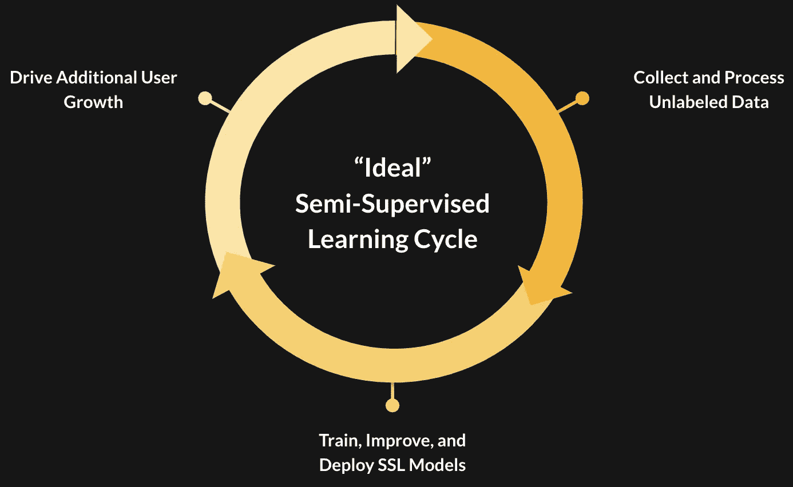
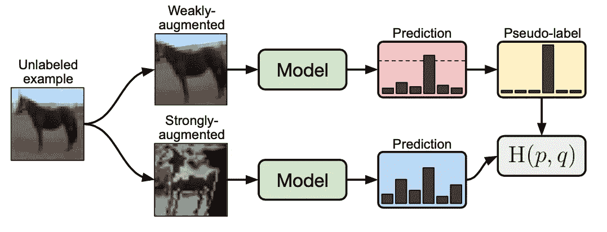
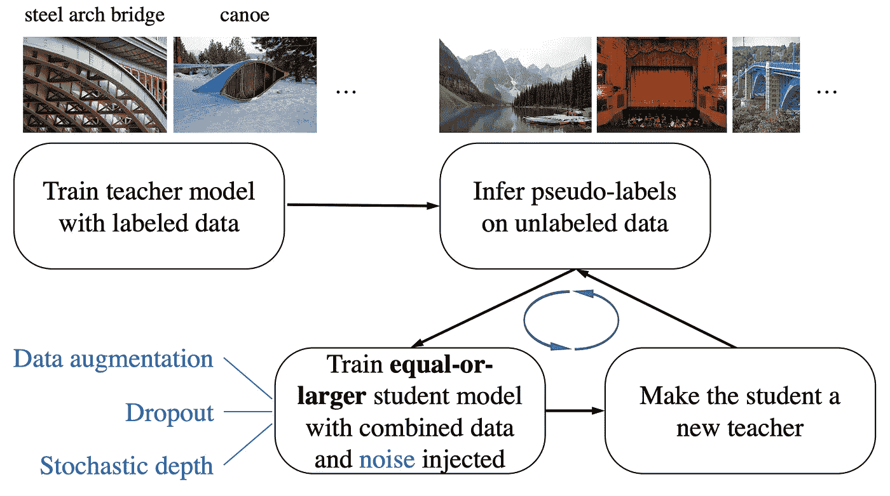
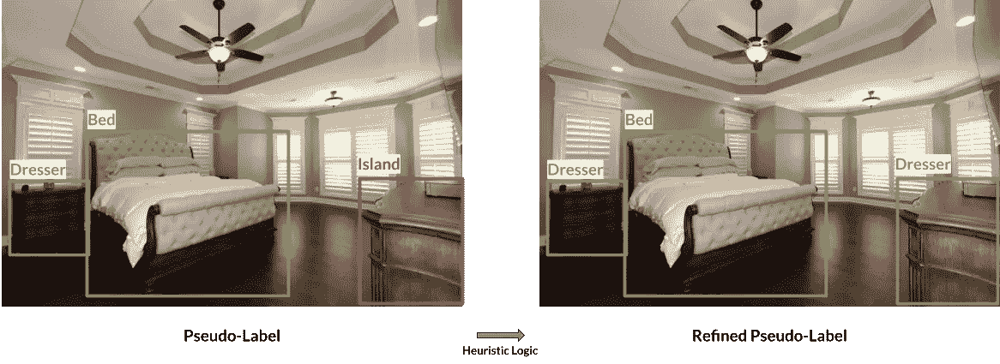
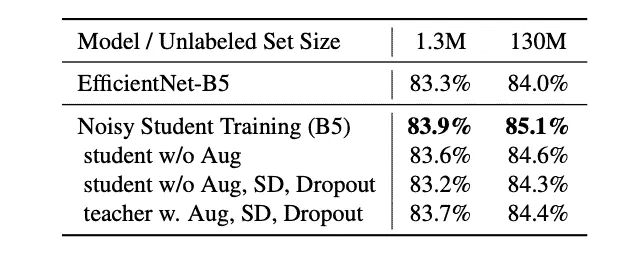
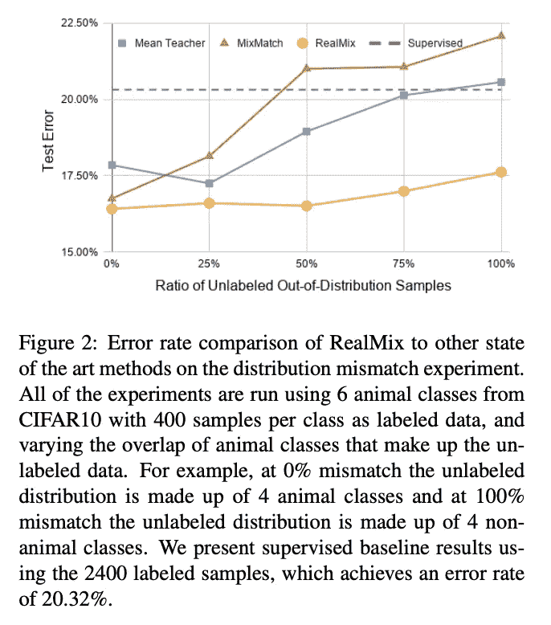
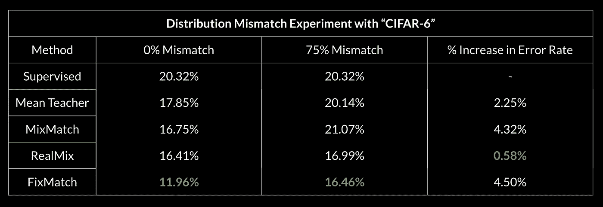

# 利用深度半监督学习从研究到生产

> 原文：<https://towardsdatascience.com/from-research-to-production-with-deep-semi-supervised-learning-7caaedc39093?source=collection_archive---------9----------------------->

## [理解大数据](https://towardsdatascience.com/tagged/making-sense-of-big-data)

## 分享经验，将研究带入现实世界。

我从 2019 年 6 月开始的一叠半监督学习论文，上面是我在该领域阅读的第一篇论文:mix match——我不建议为了很好地回忆你所阅读的内容而在所有东西下面划线。*(图片作者)*

T 今天大多数深度学习算法的成功很大程度上是几十年研究的结果，GPU 和数据的可用性越来越大。但并不是任何类型的数据——那种丰富、干净、标记为 的**。**

ImageNet、CIFAR10、SVHN 等数据集让研究人员和从业者在计算机视觉任务上取得了显著进展，对我们自己的实验非常有用。然而，对于许多寻求从这一进步中受益的应用程序(如医学)来说，最大的困难恰恰是数据必须是丰富的、干净的和有标签的。

**半监督学习(SSL)，**结合了监督和非监督学习的子领域，在过去几年中，在深度学习研究社区中变得越来越受欢迎。很有可能，至少在短期内，SSL 方法可以成为标签繁重的监督学习和数据高效建模的未来之间的桥梁。

在本帖中，我们将讨论何时应该考虑在您的生产环境中使用 SSL 方法，以及我们在 [Uizard](http://uizard.io) 使用它们来改进我们的对象检测模型时学到的经验。当然，我们会尽最大努力分享大图，但对我们自己保留一些魔法的细节。

> **我们希望通过展示 SSL 如何以及何时对我们起作用以及不起作用，并通过分享我们从研究到生产的旅程中所学到的技巧，我们可以激励您在工作中抓住 SSL 的机会，并释放您未标记数据的潜力。**

简而言之，这里有一些我们强调的教训:

*   **简单才是王道。**SSL 中从研究转化为生产的最成功的方法是那些最容易复制的方法。具体来说，我们将阐述“与吵闹的学生一起自我训练”([谢等人，2019](https://arxiv.org/pdf/1911.04252.pdf) )是如何为我们工作的。
*   使用启发式算法的伪标签精化可能非常有效。伪标签是 SSL 方法的一个受欢迎的组成部分，我们发现使用简单的试探法来改进未标签数据中的伪标签可以提高不同大小的未标签数据集的性能。
*   **半监督图像分类的进展很难转化为目标检测。**我们跟踪的 SSL 的大部分进展是测量图像分类的性能，并承诺在对象检测方面有类似的改进，但我们发现在实践中很难适当地调整它们。因此，在半监督目标检测领域需要更多的工作和研究。

# 什么是半监督学习(SSL)？

半监督学习与监督学习的区别的简单说明。*(图片作者)*

顾名思义，半监督学习(SSL)是指介于监督和非监督学习之间的一类算法，旨在使用标记和未标记数据来建模分布。

> SSL 的目标通常是比单独使用带标签的数据做得更好，能够模拟目标分布，就好像我们也可以访问所有未标记数据的标签一样。

这种算法并不是一个新的想法，尽管在过去的 18 个月中，深度半监督学习已经有了相当多的兴趣、进展和应用，我们将在下面讨论。

# 我什么时候适合在生产中使用 SSL？

如果您正在考虑使用 SSL 来解决某个问题，那一定是因为您的数据集很大，并且有许多未标记的数据点。你的数据集的一部分可能会被标记，当然标记的数据越多越好——但是希望**至少有**和标记的数据一样多的未标记的数据，或者更多的数量级。

如果您可用的大部分数据都是带标签的，或者未带标签的数据集来自与带标签的数据集显著不同的分布，那么 SSL 现在可能不太适合您的应用程序。对于后一种情况，请查看域自适应。

考虑到这一点，有两个主要的设置证明了在现实应用程序中研究 SSL 方法的合理性:

*   您正在处理一个**高价值问题**，对于该问题，仅标记的数据不足以产生足够的性能，但是**多几倍(10–100 倍以上)**未标记的数据是可用的和/或容易获得的。

在这种情况下，我们强调值得生产的性能的可能性较低——但是在给定一个数量级或更多的未标记数据以及足够的激励、时间和资源的情况下，为几乎没有标记数据的任务尝试 SSL 可能是有意义的。

*   你正在解决一个问题，对于这个问题，有标记的数据本身就足以产生足够的性能，但是你有一个未标记的样本集合，你想用 T2 进一步提高性能。

在这种情况下，您可能已经有了一个运行良好或几乎达到要求的模型，但是您希望继续提高性能，而不需要花费太多精力来标记新数据。因此，SSL 可以被视为改进建模的许多其他工具之一，如获得更清晰的标记数据集、训练更大的模型等。对于差错率相对降低 5–10%以上的性能关键型应用程序，以及可获得未标记数据的应用程序，SSL 尤其适用。

值得注意的是，特别是因为 Uizard 是一家拥有快速增长的 beta 用户群的初创公司， ***在持续/主动学习环境中使用的 SSL 也有可能创造出您在下面看到的循环。*** 未标记的数据用于在我们的平台中训练和部署改进的模型，这反过来驱动额外的用户，从而产生额外的未标记数据来从头开始该过程。

半监督学习(SSL)模型在生产环境中的生命周期，其中不断增长的用户群可以创建一个正反馈循环。(图片由作者提供)

# **研究的方法**

以下是我们在图像分类和对象检测方面尝试的一些方法，但 SSL 同样可以应用于其他领域，如 NLP ( [Liang 等人，2005](https://www-cs.stanford.edu/~pliang/papers/meng-thesis.pdf) )和音频/语音处理( [Tur 等人，2005](https://www.sciencedirect.com/science/article/abs/pii/S0167639304000962) )。

**图像分类**

*   MixMatch(贝特洛等人，2019)[ [pdf](https://arxiv.org/pdf/1905.02249.pdf) ][ [代码](https://github.com/google-research/mixmatch)
*   无监督数据增强(UDA)(谢等，2019)[[pdf](https://arxiv.org/pdf/1904.12848.pdf)][[code](https://github.com/google-research/uda)]
*   FixMatch (Sohn 等人，2020-A)[ [pdf](https://arxiv.org/pdf/2001.07685.pdf) ][ [代码](https://github.com/google-research/fixmatch) ]

**物体检测**

*   CSD (Jeong 等人，2020 年)[ [pdf](https://papers.nips.cc/paper/9259-consistency-based-semi-supervised-learning-for-object-detection.pdf) ][ [代码](https://github.com/soo89/CSD-SSD)
*   STAC (Sohn 等人，2020-B)[ [pdf](https://arxiv.org/pdf/2005.04757.pdf) ][ [代码](https://github.com/google-research/ssl_detection/)

**任务无关**

*   吵闹的学生(谢等，2019)[[pdf](https://arxiv.org/pdf/1911.04252.pdf)][[code](https://github.com/google-research/noisystudent)]

虽然我们不会详细讨论上面的每一种方法，但是下面关于半监督学习的博客非常棒，涵盖了上面列出的许多技术。

*   [计算机视觉中的半监督学习](https://amitness.com/2020/07/semi-supervised-learning/)，作者 Amit Chaudhary
*   [深度半监督学习](https://yassouali.github.io/ml-blog/deep-semi-supervised/)，作者亚辛·奥阿利
*   [Sebastian Ruder 的半监督学习的代理标签方法概述](https://ruder.io/semi-supervised/)

# 第一课:简单是王道。

在 2019 年 6 月我们对半监督学习方法的最初文献综述中，读到 MixMatch 和 UDA 在 SSL 方面取得了显著进展，特别是在标签数据极其有限的情况下，这令人着迷。我们能够相对轻松地在 CIFAR10 和 SVHN 上重现他们的结果，这让我们对他们将这些性能提升转化到我们的数据集的能力充满信心。

然而，我们这样做的体验并不理想，主要是因为——惊喜！—超参数调谐。论文中使用的数据集的许多开箱即用的超参数对我们数据集的性能变化更敏感。我们还注意到，我们的标记数据集在分布上与未标记数据集略有不同，这个问题通常会降低 SSL 技术的性能，并在 [Oliver et al .，2018](https://arxiv.org/pdf/1804.09170.pdf) 中提出，作为 SSL 需要克服的挑战，以用于“现实”设置(请参见本博客末尾的附录 A，了解我们对此的研究工作)。截至 2019 年 9 月，现有的最先进的 SSL 技术似乎不够简单或灵活，不足以让我们继续前进。

快进到 2020 年 6 月，已经发布了两个关于 SSL 的新作品，主要关注简单的实现——fix match 和嘈杂学生的自我训练。

FixMatch 中如何使用未标记图像的示意图。(图片来自 [Sohn 等人，2020](https://arxiv.org/pdf/2001.07685.pdf) )

**FixMatch** 是其前身 MixMatch 的一个更简单但更有效的版本，我们成功地在论文中提出的数据集上复制了他们的结果。这一次，我们能够在我们自己的图像分类数据集上看到良好的结果，性能对超参数的选择不太敏感，并且可调整的超参数更少。

有吵闹学生的自我训练图。(图片来自[谢等人 2019](https://arxiv.org/pdf/1911.04252.pdf) )

**嘈杂的学生**训练由一个迭代过程组成，在这个过程中，我们训练一个教师模型(可以访问标记数据的模型)，使用这个模型来推断未标记数据的输出，然后根据标记数据和伪标记数据重新训练一个新模型，称为学生。然后，我们可以重复这个循环，称为*自训练*，通过使用这个学生模型在未标记集合上推断新的伪标签。在 [Xie et al .，2019](https://arxiv.org/pdf/1911.04252.pdf) 中，他们展示了上述框架如何在使用 300M 未标记图像时提高 ImageNet 分类精度，并强调了各种类型噪声的添加(增强、丢失等。)作为几项消融研究成功的关键。

值得注意的是，嘈杂的学生方法是一个任务无关的框架，可以广泛应用于:图像分类，对象检测，情感分析等。 ***对我们来说，在我们尝试的所有技术中，嘈杂的学生方法是最成功的对象检测方法。*** 我们在第 3 课中讨论了为什么 FixMatch 的对象检测对应物(STAC)和其他方法可能对我们不起作用，但是我们坚信吵闹学生的**简单性和灵活性**与其他方法相比是我们看到生产模型改进的原因。

为什么很简单？*现有训练超参数和设置几乎没有变化。*以下是完整管道所需的内容:

1.  把我们现有的生产模式当成教师模式。
2.  与老师一起编写几个脚本来推断和提炼无标签数据上的伪标签(有关伪标签提炼的更多信息，请参见第 2 课)。
3.  用添加的噪声(增强等)训练“学生”模型。).
4.  按照嘈杂的学生图中所示的框架重复该过程。

其他注意事项和想法:

*   当**可用的未标记数据少于标记数据时，我们惊讶地看到用嘈杂学生方法实现的一些模型有所改进。**第二课将详细介绍这一点。不过一般来说，如[谢等，2019](https://arxiv.org/pdf/1911.04252.pdf) 所述，未标记的数据越多越好。
*   我们看到，使用普通的自我训练，我们的学生模型的性能有所改善，而没有实现[谢等人，2019](https://arxiv.org/pdf/1911.04252.pdf) 的一些部分，如辍学、随机深度或软伪标签。这些部分一旦被添加，可能会像在 ImageNet 上那样进一步提升我们的性能。
*   使用更大的学生模型的结果是混合的——对我们来说，这意味着在我们的检测模型中从 ResNet-50 到 ResNet-101 主干。

总的来说，当涉及到图像分类或物体检测时，**简单是王道。与 MixMatch 相比，FixMatch 明显更容易适应我们的自定义图像分类数据集，而 Noisy Student 只需要对我们现有的对象检测管道进行很小的更改，就可以看到性能的提高。**

# 第二课:**启发式伪标签提炼非常有效。**

伪标记，也称为自我训练，是 SSL 中的一种范式，早在 20 世纪 60 年代和 70 年代就出现了，并且由于其简单性而一直存在( [Scudder，1965](https://ieeexplore.ieee.org/document/1053799)；[麦克拉克伦，1975](https://www.tandfonline.com/doi/abs/10.1080/01621459.1975.10479874) 。深度 SSL 伪标记的引入( [Lee，2013](http://deeplearning.net/wp-content/uploads/2013/03/pseudo_label_final.pdf) )展示了用标记数据训练模型，使用该模型推断未标记数据上的标签(现在称为伪标签)，然后用标记和伪标记数据进行重新训练的想法是多么简单而强大。今天，许多 SSL 技术使用某种形式的伪标记，包括 FixMatch 和嘈杂学生的自我训练。

然而，这些伪标签经常会有噪声，并且需要某种形式的改进才能被使用。在 FixMatch 和 Noisy Student 中，这意味着将阈值(比如 0.7 或 0.9)应用于推断的伪标签，并且仅采用 softmax 置信度得分高于该阈值的那些预测。我们发现这是获得高质量伪标签的一种有用的启发式方法，但是**还发现对伪标签应用其他领域特定的启发式方法在嘈杂的学生设置中有很大帮助。**

我们在谈论什么样的启发法？例如，假设您正在为一家房地产公司构建一个对象检测分类器，该公司需要为家中的不同对象添加边框注释。您注意到(教师)模型的预测通常是好的，但是，分类器倾向于在未标记的集合上产生几个不正确的、高置信度的预测，即一些梳妆台实际上是厨房岛。

我们可以在嘈杂的学生训练中使用特定领域的启发式算法来改进伪标签，以提高半监督性能。(图片由作者提供)

这里有一些启发性的例子，我们可以从中选择来完善这个标签:

*   如果在同一个图像中预测了岛和床，请将岛标签转换为梳妆台。
*   如果梳妆台和岛预测在同一图像中，请将岛标签转换为梳妆台。
*   如果在同一个图像中预测了岛、床和梳妆台，请将岛标签转换为梳妆台。

以上哪种启发最有意义？这将取决于您的数据集和最常见的错误类型。如果模型在检测床方面做得很好，也许像第一个或第三个例子这样的启发式方法可能会有用，因为我们不希望床和厨房岛出现在同一张图像中。

> **特别是在对象检测中，当对象的位置和大小遵循您的应用领域中的特定规则时，您可以定义类似这样的试探法来优化嘈杂的伪标签，并帮助您的学生模型学习教师模型无法学习的更好的表示。**

我们能够在我们自己的有噪声的学生模型中实现更好的性能，使用启发式伪标签细化，在某些情况下，使用**,无标签数据比有标签数据少一个数量级。**我们还发现有趣的是，这一课听起来与[罗森伯格等人 2005 年](https://www.ri.cmu.edu/pub_files/pub4/rosenberg_charles_2005_1/rosenberg_charles_2005_1.pdf)发表的题为*对象检测模型的半监督自我训练*的论文中的观察结果惊人地相似:

> …独立于检测器定义的训练数据选择度量大大优于基于检测器生成的检测置信度的选择度量。

这是您所有数据和建模问题的解决方案吗？当然不是——但它说明了启发式仍然是深度(半监督)学习管道中有用的一部分。同样，这里应用的试探法是特定领域的，只有仔细研究您的数据和模型的偏差，才能揭示有用的伪标签细化。

# 第三课:**半监督图像分类的进展很难转化为目标检测。**

我们跟踪的 SSL 研究的大部分进展都是测量图像分类的性能，希望能够轻松地将技术应用于其他任务的类似改进，如对象检测。然而，在我们自己尝试将图像分类方法用于对象检测时，我们遇到了几个挑战，这导致我们坚持使用第 1 课中提到的最简单的半监督对象检测方法。以下是其中的一些挑战:

*   **在线与离线伪标签生成**

在许多用于图像分类的 SSL 技术(FixMatch、UDA 等)中。)，未标记数据的伪标记目标在训练期间*或**在线**被更新/计算。在**离线**中，学习培训分为多个阶段。首先用标记样本训练模型，然后用标记样本生成伪标签。然后可以用标记的和伪标记的样本训练新的模型。*

FixMatch 和 UDA 是 SSL 技术的示例，它们使用在线学习来通过阈值取得良好效果，仅允许预测高于某个阈值的未标记样本对训练信号有所贡献——在嘈杂的学生和 STAC(fix match 的对象检测变体)中，然而，伪标签是离线生成的。

虽然在线学习似乎是有利的——允许在稍后的训练步骤中纠正早期训练中的不良伪标签— **,但它使得训练在计算上更加昂贵，对于训练对象检测模型来说更是如此。**为什么？两件事:数据扩充和批量大小。关于数据扩充，让我们重温一下在第 1 课 FixMatch 中首次出现的图表。

FixMatch 中如何使用未标记图像的示意图。(图片来自 [Sohn 等人，2020](https://arxiv.org/pdf/2001.07685.pdf) )

我们看到，每个未标记的示例在训练期间都是“弱增强”和“强增强”的，并且需要将两个增强图像通过网络向前传递以计算损失。这种数据扩充是许多 SSL 方法的基础，并且尽管对于图像分类是可行的，但是对于大图像(512x512+)上的对象检测任务的处理训练时间扩充会显著减慢训练。

在批量大小方面，许多作品(MixMatch、UDA、FixMatch、Noisy Student)和我们自己的实验也强调，未标记的批量大小是标记的批量大小的几倍对于 SSL 方法的成功至关重要。对对象检测任务的这种要求与存储器中的大图像以及对无标签批次中的所有样本的必要扩充相结合，产生了极大的计算负担。*数据扩充和无标签批量大小这两个挑战是我们无法将像 FixMatch 这样的工作一对一转换为对象检测的最终原因。*

在与 STAC 的作者的讨论中，他们也注意到了半监督对象检测空间中在线学习带来的沉重资源开销。我们希望未来的工作将更深入地研究这个问题，并且在未来几年中取得的计算成果将使研究人员更容易进行这样的工作。

*   **用阶级平衡管理长尾**

SSL 研究中的许多基准数据集，如 CIFAR10、CIFAR100 和 STL-10，都使用类平衡标记的训练集。我们的数据集，像许多真实世界的数据集一样，是极其长尾的。类别平衡被认为是许多 SSL 方法的关键组成部分([谢等人，2019](https://arxiv.org/abs/1911.04252) ，[宋等人，2020](https://arxiv.org/pdf/1912.00594.pdf) )，在图像分类中，上采样和下采样技术是常见的做法。然而，在对象检测设置中，有效的类平衡技术并不简单。

如果类平衡对于 SSL 在实践中的成功至关重要，那么我们如何在半监督对象检测中实现类平衡呢？解决这个问题的未来研究肯定会受到欢迎。

# 其他提示

**迁移学习和自我培训是相加的**

正如在 [Zoph 等人关于 COCO 训练的 2020](https://arxiv.org/pdf/2006.06882.pdf) 中所发现的，执行从 COCO 到我们数据集的迁移学习，然后在嘈杂的学生环境中执行自我训练，所产生的结果比单独执行这两个步骤中的任何一个都要好。很可能任何应用于生产模型的迁移学习也可以应用于 SSL 模型，并带来同等或更多的好处。

**适当的数据扩充很重要**

由于数据扩充是现代 SSL 方法的主要组成部分，所以要确保这些扩充对您的领域有意义。例如，如果可用的增强集包括水平翻转，那么应该被训练来区分左箭头和右箭头的边界框的分类器显然会受到影响。

此外，在( [Sohn 等人，2020-B](https://arxiv.org/pdf/2005.04757.pdf) )和吵闹的学生([谢等人，2019](https://arxiv.org/pdf/1911.04252.pdf) )中，他们观察到，在自我训练中，对教师模型使用数据增强会导致下游学生模型较差。

(表 6 来自[谢等，2019](https://arxiv.org/pdf/1911.04252.pdf) )。在这项消融研究中，他们说明了具有增强功能的教师模型比没有增强功能的教师模型表现稍差(在 130 万张未标记图像上，84.4%对 85.1%)。

然而，我们发现嘈杂的学生和 STAC 在我们的数据集上的表现与增强的教师模型相等或略好于非增强的教师模型。虽然我们的结果对于我们自己的数据集来说可能是一个特例，但我们相信这表明了广泛实验的 ***重要性，以及对你在论文中读到的观点的所谓成功和失败感到好奇。*** 论文中显示的经验结果是一个很好的开端，但成功肯定是无法保证的，而且从理论角度来看，SSL 中仍有许多东西没有得到很好的理解。

# 离别赠言

半监督学习(SSL)在过去的一年中一直是我们工作的一个令人兴奋的领域，它在我们的生产模型中的最终结果向我们(希望你们所有人)表明，在某些情况下可以并且应该考虑 SSL。

特别是，对吵闹的学生进行自我训练对改进我们的目标检测模型是有效的。以下是我们在研究和生产深层 SSL 技术时学到的 3 个主要经验:

*   **简约为王。**
*   **启发式伪标签精化非常有效。**
*   **半监督图像分类的进展很难转化为目标检测。**

今天，许多深度学习工程仍然在为潜在的应用进行反复试验，我们希望你带着更多的先验知识离开，以推进半监督学习的工作。

> **作者 Varun Nair，杜克大学四年级本科生，前******深度学习研究实习生。****
> 
> **致谢:**
> 
> **非常感谢 **Javier Fuentes Alonso** 和 **Tony Beltramelli** 阅读了这篇文章的几份初稿，并在我在 Uizard 工作期间成为了令人惊叹的同事和导师。我还要感谢 Uizard 的整个团队，感谢他们支持我，为我创造了一个绝佳的工作环境，无论是面对面的还是远程的。如果你有兴趣了解更多关于 Uizard 的工作和职位空缺，请查看我们的网站。**
> 
> **也感谢北卡罗来纳大学/谷歌的**Colin raff El**博士对这篇文章的早期草稿提供了很好的见解和反馈，感谢谷歌的**Kihyuk Sohn**博士对我关于他的作品的问题的积极和开放的回答。**

# **附录**

****A —对非分布样本的稳健性****

**在我们过去的工作 RealMix ( [Nair et al .，2019](https://arxiv.org/pdf/1912.08766.pdf) )中，我们通过模仿 [Oliver et al .，2018](https://arxiv.org/pdf/1804.09170.pdf) 中首次建立的一个实验，研究了 SSL 网络中对分布外未标记样本的鲁棒性。**

****

**(图片由作者提供)原载于[奈尔等人，2019](https://arxiv.org/pdf/1912.08766.pdf) 。**

**我们最近在 75%的标签错配设置下对 FixMatch 进行了相同的鲁棒性实验，并在下面展示了这些结果。FixMatch 是一个更好的 SSL 应用程序，在标记和未标记的分布之间的不匹配率为 0%和 75%,但是，在这种情况下，它的性能与 MixMatch 一样差。有可能通过将 RealMix 中的元素与 FixMatch 结合起来，这种结合的技术可以克服这个问题。**

****

**在六类 CIFAR10 上进行 0%和 75%分布不匹配实验的错误率。(图片由作者提供)**