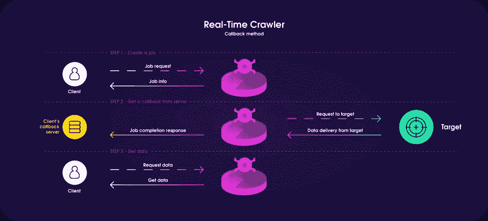
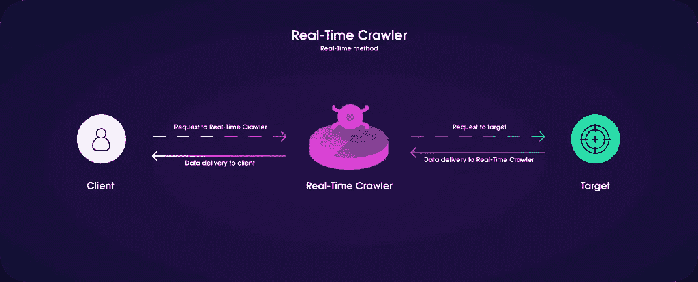

# 从资源管理到数据科学:构建实时爬虫

> 原文：<https://towardsdatascience.com/from-resource-management-to-data-science-building-real-time-crawler-dcbb4d413d7f?source=collection_archive---------54----------------------->

## 对构建和实现大规模网络爬虫感兴趣？从我们的错误、经验和建议中学习，这将有助于您创建一个强大的 web 数据采集工具。

马库斯·斯皮斯克在 [Unsplash](https://unsplash.com/photos/qjnAnF0jIGk) 上的照片

在 [Oxylabs](http://www.oxylabs.io) 我们几乎是偶然地创建了一个大规模的网络爬虫。正如人们偶然发现的任何开发项目一样，我们在这个过程中犯了很多错误，也吸取了很多教训。我们希望我们的故事能对任何对创建数据采集工具感兴趣的人有用。

我们一开始是代理提供商，为所有想要执行大规模数据收集项目的人提供服务。正如那些深入研究这个行业的人所熟知的那样，当代理被用来抓取搜索引擎结果和复杂的电子商务网站时，它们很容易被禁止。

我们注意到，一些用户比其他人有更好的成功率和代理寿命，即使是在抓取相同的目标时。随着时间的推移，获得了很多关于网络抓取的知识。反过来，我们试图通过分享任何相关信息来提供价值。就像我们现在希望的那样。

# 卑微的出身

不幸的是，即使是最好的指导方针也无法抵御防刮擦措施不断变化的性质以及对持续数据流的需求。代理最终还是被封锁了。更换它们会推高交易双方的成本。

代理受阻对双方来说都是痛苦的经历。由于被封锁的 IP 地址，公司需要减慢他们的数据采集操作，而我们需要不断地采购更多的代理。幸运的是，一个解决我们困境的方法以最意想不到的方式出现了:我们的一位数据分析师学习了 Python 的基础知识。

照片由 [Unsplash](https://unsplash.com/photos/cQgw-rqG-Lk) 上的[除以零](https://unsplash.com/@divide_by_zero)

不是这种类型的 Python。

# 构建原型

一位用户与电子商务网站进行了长期的斗争。不管他们是运气不好还是在爬虫的开发过程中出了什么差错，我们提供的代理似乎总是被屏蔽。在内部，开发我们自己的铲运机的想法已经流传了很长时间，但没有人坐下来真正开发它。直到我们的一位数据分析师决定亲自动手。

与任何对工具包有非常基本的理解但又充满热情的项目一样，它是一个烂摊子，由 Flask API、请求库和对古代蛇神的祈祷组成。当然，这是一个烂摊子，但它的工作。事实上，我们的原型做得相当好，尽管它确实有一些小问题，只是后来才变得明显。因此，在 2017 年的一个深夜，我们最新的解决方案诞生了，我们继续称之为实时爬虫。

# 规划和开发实践中的经验教训

不幸的是，虽然我们的解决方案有效，但最初为其开发实时爬虫的客户并没有接受我们的提议。但是我们确实有一个工作原型，它展示了很多希望。我们的想法是，我们可以进一步优化这个工具，以比以前更有效地从大型电子商务网站和搜索引擎获取数据。通过坚持我们随时间发展的最佳实践，我们可以充分利用每个 IP 地址并避免潜在的阻塞。如果我们不提供资源来购买产品，而是提供产品本身，会怎么样？希望没有人会再为棘手而复杂的数据采集过程而挣扎。

虽然我们的原型运行良好，但它仍然不适合广泛使用:一个单独的服务器托管整个过程，一次只能处理几个请求，最糟糕的是，获取的数据以 html 文件的形式存储在服务器文件系统上。当我们的工具最初被开发出来时，**我们并不关注长期的大规模实施，因为它是出于我们能够解决一个特定挑战的希望。**

我们意识到，如果我们承受任何压力，它都会在几秒钟内折断。但是希望就在那里，这就足够了。我们的高管和高级开发团队与我们的数据分析师坐下来，开始为未来制定计划。我们会用一个更好的计划重新开始。

# 亲爱的朋友们，再一次冲向缺口，再一次

于是，我们的实时爬虫开始了认真的开发。需要实现几个特性:

*   更好的请求和交付处理
*   排队系统
*   更好的服务器基础设施

幸运的是，最后两点并没有带来什么挑战。我们开发了队列系统，并通过使用 API 和 MySQL 将实时爬虫部署到许多不同的服务器上。当然，这些变化不是一夜之间发生的。虽然最初的实现相当快，但近 3 年的大部分时间都致力于消除细节和添加附加功能。

一个更好的请求和数据传递系统并不容易实现。然而，我们必须快速开发一个，因为用户在实现我们最初的构建时遇到了问题。

# 查询和交付:一场我们自己打的硬仗

我们开始时只有一种查询和检索数据的方法——回调。用户将发送一个有效载荷，详细说明他们对我们的服务器的请求，并能够在作业完成后检索所请求的数据。出于检索目的，将为每个有效负载分配一个唯一的作业 ID。此外，我们实现了回调 URL，我们将 ping(如果提供的话)它，以便平滑这个过程。

来源:Oxylabs 的设计团队

然而，回调有一个我们无法预测的问题:它很难实现用于测试目的。不足为奇的是，如果你的目标受众无法轻易测试你的工具，那么让别人相信你的工具对双方都有利是很难的。但我们希望以最高效的方式交付所需的数据。更重要的是，这个行业的大多数企业已经有了内部的网络爬行解决方案。为这些公司提供价值比我们预期的要困难得多。

我们的销售和营销团队不得不加倍努力工作。如果我们**稍微多关注一下我们周围的开发文化****——哪些语言、API、框架等被广泛使用**，就可以节省很多精力和时间。

# 可靠性与电子商务

我们知道我们将面临一个无止境的挑战——布局和反瓶颈变化。搜索最具挑战性和最受欢迎的搜索引擎和电子商务网站并不容易。这两家公司都不会永远使用相同的布局，也不愿意轻易放弃他们的数据。所有这一切意味着我们的大部分资源过去和现在都致力于了解反刮擦措施是如何实施的，以及我们可以为此做些什么。

仅仅通过提供我们通常的商业服务，我们就在数据采集行业获得了大量的经验和专业知识。强大的技术基础使我们能够预见某些挑战，并在它们出现之前实施解决方案。然而，有两个问题我们的经验无法解决:数据存储和易于实施。

# 处理数据存储问题

数据存储成为一个比预期更大的问题。我们犯的一个错误是只从一个方法开始——回调。回调似乎是一开始处理数据的好方法，因为理论上非常简单。不幸的是，被查询的数据必须放到某个地方，直到有人检索它。通常情况下，检索会被延迟。因此，这些数据必须存储*天*，直到有人来取走。

我们实施了一个 24 小时(通常，用户有更多的时间)的政策，因为它似乎是合理的。不可避免的是，24 小时以上存储大量数据会给任何存储基础架构带来很大压力。为此，我们决定通过创建缓存、优化数据库和简单地装备更好的硬件来消除冗余的数据查询。但这些解决方案只能到此为止。此外，电子商务数据具有时效性，24 小时前的数据可能已经过期。我们需要找到更好的方式让用户发送查询和接收数据。

将我们的重点转向提供更好的交付方法和更简单的方法来实现我们的工具给我们带来了巨大的成功。我们确信实时爬虫对双方都有利，但是我们需要一种方法来减少进入的障碍。

## 试用、易于实施和新的交付方法

试验问题从相同的初始开发过程中分支出来。如前所述，实现实时爬虫相当困难，这使得试验和测试非常痛苦。我们的解决方案之一是为我们的工具开发额外的方法。正如我们工具的包装上所说，实时是第二个被创造出来的方法。它的实现稍微容易一些，但是它依赖于一个开放的连接来不断地传递查询的数据。

来源:Oxylabs 的设计团队

实时给我们带来了两个好处——测试稍微容易一些，减少了对数据存储设备的压力。实时带来了一场革命，因为其他人无需重建整个基础设施就可以看到它的运行。但它仍然不够好，因为长期的实现仍然需要用户修改他们当前的爬行解决方案。需要另一种解决方案。

SuperAPI 是实时爬虫的最终形式。它允许用户实现我们的网络抓取解决方案，而不需要修改任何东西。他们会将我们的工具设置为他们自己的网络爬行工具中的代理服务器。其他一切都将正常工作，就好像它是通过其他方法实现的一样。最后，用户可以实现我们的解决方案，而不需要通过复杂的过程来改变已经为他们工作的东西。

现在有三种交付方式:

*   回收
*   实时
*   SuperAPI

他们每个人都有自己的优点和缺点。大多数用户仍然使用老式的回拨，因为它可靠且使用简单，尽管入门有点困难。我们后来开发了更多的交付方法，因为我们更加关注提供更好的测试机会。现在，提高稳定性将是我们的最新目标。

# 维持稳定

我们最后的挑战是保持稳定。每一种工具都会偶尔发生故障，而大多数其他流程都准备好处理它。在数据采集中，尤其是与电子商务相关的数据采集，过程中的故障可能是灾难性的。

数据获取的稳定性是网站和开发者之间不断的拉锯战。出于用户体验的原因，网站可能会更新其布局，这也是一种反对数据抓取的做法。每次布局变化都会中断数据采集过程，并且需要一些时间进行重新开发。

防刮算法改进更差。就像布局变化一样，它们会破坏任何工具，但是重新开发过程会困难得多。逆向工程将是必需的，这意味着没有一个令人敬畏的开发团队和一点点运气，回到正常工作秩序可能需要大量的时间和资源。不幸的是，没有允许任何人无限期保持稳定的长期解决方案，只有最佳实践。

随着时间的推移，我们已经学会了关于保持稳定的两件事。**首先，必须有一个专门的危机应对团队，每个人都准备好昼夜不停地工作，直到问题得到解决。每一个小时都很宝贵。第二，危机解决后，寻找数据采集过程中断的模式。根据你的预测打补丁*也许*你会避免以后出现类似的问题。**

# 最终确定概念

虽然我们一直在构建和改进我们的网络爬行解决方案，但随着时间的推移，主要概念保持不变。以下是我们的实时爬虫如何工作的基本概要:

1.  有效负载已发送到 API。
2.  记录作业并设置 ID。
3.  设置成队列系统。
4.  每个队列可以被许多不同的 RTC 实例/服务器使用。
5.  该作业由特定实例获取。
6.  设置并检查指纹(根据最初要求)。
7.  在作业启动之前，我们的[主]代理轮转程序会处理和分配合适的 IP。
8.  作业已启动，HTML 已下载。
9.  用过的 IP 会被送去冷却。
10.  如果作业失败，实时爬网程序将使用不同的设置重试，直到成功。
11.  数据被解析并为检索做好准备。

# 成功的步骤:数据收集的教训

我们的工具已经运行了一段时间了。从最初的粗陋到现在的天网般的机器霸主——实时爬虫，我们学到了很多东西:

*   创造工具，一只眼睛盯着未来，另一只眼睛看着市场。分析哪些语言、API、框架最受欢迎。它将为您节省大量的时间和成本。
*   构建行业领先的软件需要时间。这些年来，我们面临(现在依然如此)数百个挑战，有时我们认为实时爬虫可能没有我们最初想象的那么好。
*   想办法提供一个简单的测试环境。通常你必须说服商人，而不是开发商。
*   编写简单易懂的教程，并提供大量成功的例子。
*   确保您的工具是可扩展的，并且其功能不会在其他领域(如数据存储)引起问题。
*   数据存储将不可避免地成为一个问题。创建节省空间的流程—构建缓存、收购更多存储中心。
*   有一个专门的危机应对团队，因为故障是不可避免的。
*   分析每个分解。每一次危机至少都会为未来可能的崩溃提供线索。根据线索打补丁。

# 结局？

随着互联网格局的不断变化，大规模数据收集是一个永无止境的过程。我们仍在通过添加更多的目标，增加稳定性和适用性来改进我们的实时爬虫。我们最新的 fork，通用实时爬虫，仍然是一个萌芽项目，我们希望扩展到和它的前辈一样的高度。

我们花了很多年的时间和无数的错误来建立一个成功的大规模爬行工具。我们邀请所有人向我们学习。通过遵循我们在这一过程中学到的经验，您将使任何数据采集项目成本更低，耗时更少。