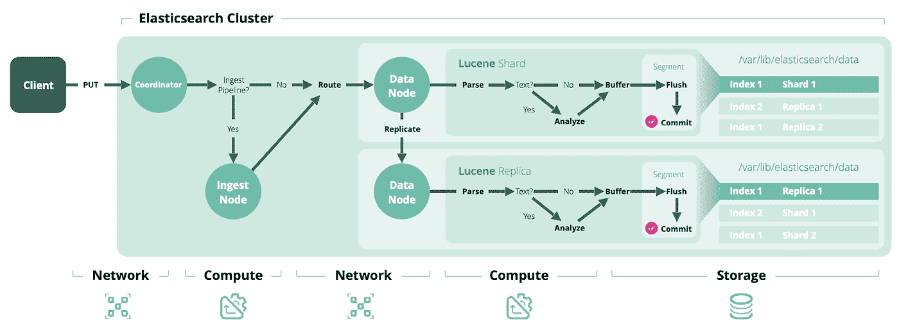
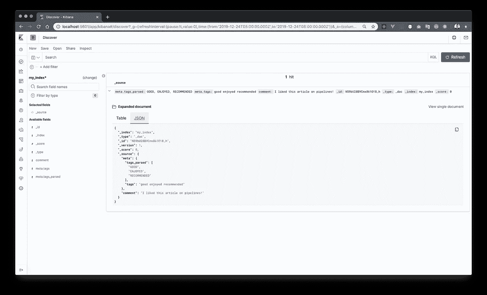
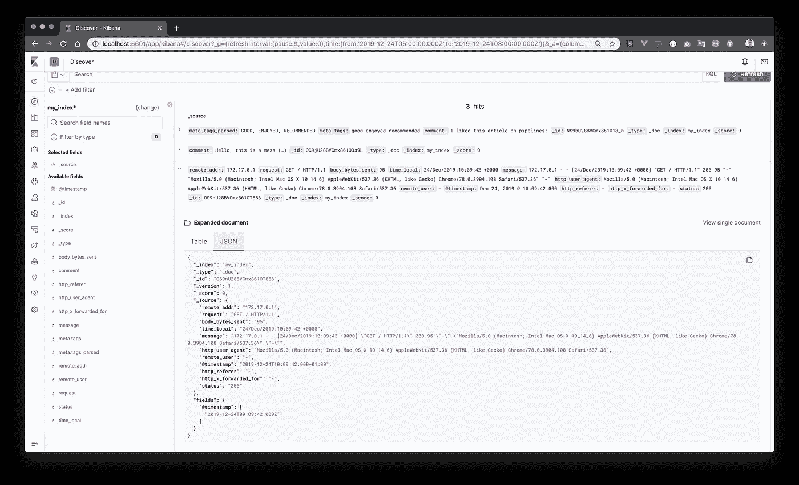
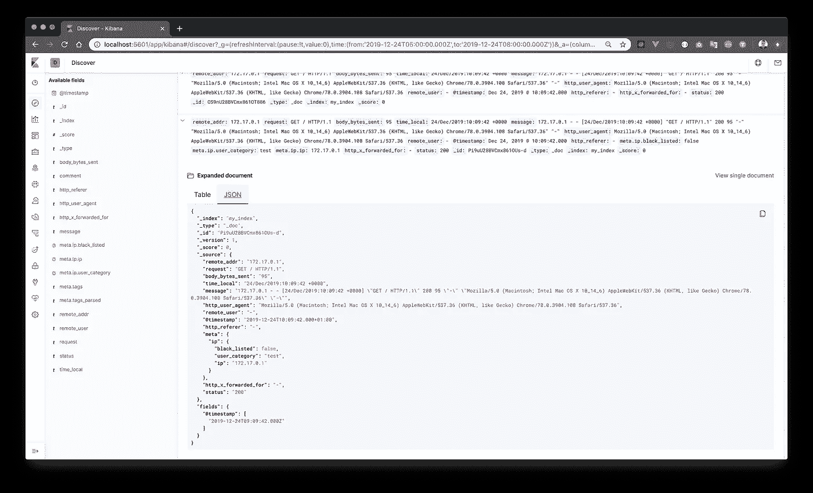

# 从零开始到搜索:处理数据(Elasticsearch 摄取管道)

> 原文：<https://towardsdatascience.com/from-scratch-to-search-playing-with-your-data-elasticsearch-ingest-pipelines-6d054bf5d866?source=collection_archive---------5----------------------->

## 一条管道来统治他们，一条管道来吸收他们，一条管道来转变他们，并在弹性搜索中绑定他们。


朱利安·维勒拉在 [Unsplash](https://unsplash.com?utm_source=medium&utm_medium=referral) 上拍摄的照片

# 介绍

在这篇文章中，我想快速浏览一下 Elasticsearch 提供的一个有趣的特性，我也倾向于在作为摄取管道的生产设置中使用它。此功能允许 [*在实际文档索引发生*之前预处理文档](https://www.elastic.co/guide/en/elasticsearch/reference/master/ingest.html) *。听起来很有趣，为什么…*

```
***Note: for an introductory hands-on overview of the Elasticsearch technology check out*** [***my previous article***](/from-scratch-to-search-setup-elasticsearch-under-4-minutes-load-a-csv-with-python-and-read-e31405d244f1)***.***
```

这在很多方面都很有用，但我认为有两个主要原因。首先，当你更多地处于(大)数据分析/处理方面时，你的优先事项(和任务)可能不会涉及源系统的主动变更。因此，您必须在原始数据到来时对其进行处理，并对其进行预处理以满足您的数据需求。第二，即使你打算改变生产者，你 A)可能不能直接控制所有的生产者(例如，由于一些组织方面的原因，例如，他们的遗留性质)和/或 B)仍然需要做好准备，改变可能需要相当长的时间(例如，想想你想要在你的共享日志库的新版本上升级数十/数百个微服务，等等)。).

对于这些情况，您可以调用来维护接收管道。

# 它是如何工作的

摄取管道是数据解析和转换领域的新玩家，长期以来一直被 Logstash 所占据。摄取管道实际上[不是 Logstash 的完全替代](https://www.elastic.co/blog/should-i-use-logstash-or-elasticsearch-ingest-nodes)。但是使用 Logstash 的考虑是，它不可避免地给你的架构带来了另一个 sw 组件，从而使它的操作更加复杂。摄取管道则不是这样，因为它们是由集群中的任何(或所有)常规 Elasticsearch [节点](https://www.elastic.co/guide/en/elasticsearch/reference/current/modules-node.html)直接执行的。该节点只需要是[摄取节点](https://www.elastic.co/guide/en/elasticsearch/reference/current/ingest.html)的类型(这是默认的)，这样当您想要开始使用它们时，甚至不需要修改配置。



在索引操作期间，在协调器节点接收到请求之后，在摄取节点上执行流水线。图片来源:[elastic.co](https://www.elastic.co/pdf/elasticsearch-sizing-and-capacity-planning.pdf)。

# 管道定义

一般来说，管道是通过一个简单的 [JSON 文档](https://www.elastic.co/guide/en/elasticsearch/reference/master/pipeline.html)定义的，该文档包含一个处理器阵列，它代表一组有序的步骤，这些步骤应用于所有传入的文档并在其上执行。实际的处理器有各种各样的风格，所以我强烈推荐您浏览一下文档中的列表来熟悉一下。

处理器有一些共同之处。这些是:

*   能够使用花括号模板`{{service-name}}`在定义中[访问/引用已处理文档的数据](https://www.elastic.co/guide/en/elasticsearch/reference/master/accessing-data-in-pipelines.html)
*   能够定义处理器的[条件执行](https://www.elastic.co/guide/en/elasticsearch/reference/master/ingest-conditionals.html)，如果*子句仅允许在检查条件后执行该步骤*
*   能够使用 *on_failure* 子句[处理处理器](https://www.elastic.co/guide/en/elasticsearch/reference/master/handling-failure-in-pipelines.html)的故障
*   可以通过*标记*子句进行标记，这对于错误跟踪等非常有用

稍后将详细介绍这些内容。

# 测试环境加速旋转

理论已经讲得够多了，让我们在本地机器上的 Docker 中构建一个简单的(单节点)集群，并尝试第一个管道定义。*注意:如果你需要更多关于 docker 部分的信息，可以在* [*我之前的文章*](/from-scratch-to-search-setup-elasticsearch-under-4-minutes-load-a-csv-with-python-and-read-e31405d244f1) *中找到。让我们也做一个 Kibana 的实例，以便有一个简单的 GUI 来查看。*

```
#!/bin/bashdocker network create elastic-networkdocker run --rm --detach --name elastic4pipelines -p 9200:9200 -v esdata01:/usr/share/elasticsearch/data --network elastic-network -e "node.name=elastic4pipelines" -e "discovery.type=single-node" -e "bootstrap.memory_lock=true" --ulimit memlock=-1:-1 -e ES_JAVA_OPTS="-Xms2g -Xmx2g" docker.elastic.co/elasticsearch/elasticsearch:7.5.1docker run --rm --detach --link elastic4pipelines:elasticsearch --name kibana4pipelines --network elastic-network -p 5601:5601 docker.elastic.co/kibana/kibana:7.5.1
```

当您运行上面的脚本并等待几分钟时，您的临时弹性堆栈应该开始运行并为我们的管道测试做好准备(Kibana 在 [http://localhost:5601/](http://localhost:5601/) 上运行)。

# 用管道处理文档

为了进行测试，我们将从小处着手，创建一个管道，它将:

*   用[分割处理器](https://www.elastic.co/guide/en/elasticsearch/reference/master/split-processor.html)按特定分隔符分割一个字段的值
*   在下一步中，使用 [Foreach 处理器](https://www.elastic.co/guide/en/elasticsearch/reference/master/foreach-processor.html)遍历新数组的所有值，并使用[大写处理器](https://www.elastic.co/guide/en/elasticsearch/reference/master/uppercase-processor.html)转换为大写字符

```
curl -XPUT localhost:9200/_ingest/pipeline/my_simple_pipeline \
-H "Content-Type: application/json" \
-d '{
    "processors": [
        {
            "split": {
                "field": "meta.tags",
                "separator": " ",
                "target_field": "meta.tags_parsed",
                "ignore_missing": true
            }
        },
        {
            "foreach": {
                "field": "meta.tags_parsed",
                "processor": {
                    "uppercase": {
                        "field": "_ingest._value"
                    }
                }
            }
        }
    ]
}'
```

现在，让我们创建一个索引，将该管道用作默认的接收管道。

```
curl -XPUT localhost:9200/my_index \
-H "Content-Type: application/json" \
-d '{
    "settings": {
        "index.default_pipeline": "my_simple_pipeline"
    }
}'
```

最后，让我们索引一个将由这个管道处理的虚拟文档。

```
curl -XPOST localhost:9200/my_index/_doc \
-H "Content-Type: application/json" \
-d '{
    "comment": "I liked this article on pipelines!",
    "meta": {
        "tags": "good enjoyed recommended"
    }
}'
```

现在我们可以看看基巴纳的文件。注意:不要忘记创建一个索引模式。我们可以看到适当的转换。



# 基于值的脚本和条件执行

不，让我们尝试两件事，为了更有效，让我们在一个处理器中同时使用这两件事:)

*   使用`if`子句的条件执行(对所有处理器都是可能的)
*   使用[脚本处理器](https://www.elastic.co/guide/en/elasticsearch/reference/master/script-processor.html)进行更复杂的处理(当预制处理器不够用时)

这两者都使用了一种简单的脚本语言(基于 Groovy)。阅读[无痛指南](https://www.elastic.co/guide/en/elasticsearch/painless/master/painless-guide.html)了解更多信息。然而重要的是:

*   可以通过`ctx`变量(所谓的[摄取处理器上下文](https://www.elastic.co/guide/en/elasticsearch/painless/master/painless-ingest-processor-context.html))在脚本中访问您处理过的文档
*   ctx 包含提取的 JSON 的映射结构(用方括号`ctx['my_field']`引用各个字段)
*   您可以修改 ctx 变量的值来添加、修改或删除文档的字段

简单的例子:如果 rest 对我们的目的没有用，我们可以用它只索引原始文本的一部分(子串)。所以只要更换管道…

```
curl -XPUT localhost:9200/_ingest/pipeline/my_simple_pipeline \
-H "Content-Type: application/json" \
-d '{
    "processors": [
        {
            "script": {
                "source": "ctx.comment = ctx.comment.substring(0,20) + '\'' (…)'\''",
                "if": "ctx.containsKey('\''comment'\'') && ctx['\''comment'\''].length() > 20"
            }
        }
    ]
}'
```

…并为新文档编制索引。

```
curl -XPOST localhost:9200/my_index/_doc \
-H "Content-Type: application/json" \
-d '{
    "comment": "Hello, this is a message which deserves a hair cut."
}'
```

# 提取结构化字段(解析默认 NGINX 日志行格式)

如果您正在处理以某种定义明确的格式构建的数据(但不是在单个字段中提取的)，您可以尝试使用[剖析处理器](https://www.elastic.co/guide/en/elasticsearch/reference/master/dissect-processor.html)。只需用带百分号`%{my_field}`的花括号描述提取的单个字段的模式。

我们可以使用这个处理器解析默认 NGINX 日志行格式(combined/main)之外的结构化字段，该格式具有以下结构。

```
log_format main '$remote_addr - $remote_user [$time_local] '
'"$request" $status $body_bytes_sent '
'"$http_referer" "$http_user_agent"';
```

有关 NGINX 日志的更多信息，请参见日志模块 [ngx_http_log_module](http://nginx.org/en/docs/http/ngx_http_log_module.html#log_format) 的文档。我们还可以使用[日期处理器](https://www.elastic.co/guide/en/elasticsearch/reference/master/date-processor.html)提取@timestamp，因为原始值默认为非标准格式。

让我们把它放在新管道里。

```
curl -X PUT [localhost:9200/_ingest/pipeline/nginx_pipeline](http://localhost:9200/_ingest/pipeline/my_simple_pipeline) \
  -H 'Content-Type: application/json' \
  -d '{
    "processors": [
        {
            "dissect": {
                "field": "message",
                "pattern" : "%{remote_addr} - %{remote_user} [%{time_local}] \"%{request}\" %{status} %{body_bytes_sent} \"%{http_referer}\" \"%{http_user_agent}\" \"%{http_x_forwarded_for}\""
            }
        },
        {
            "date": {
                "field": "time_local",
                "formats": [
                    "dd/MMM/yyyy:HH:mm:ss Z"
                ],
                "timezone": "Europe/Prague"
            }
        }
    ]
}'
```

现在，您可以在消息字段中发布一个日志行并提取它。注意，您可以用查询字符串中的新管道覆盖索引中的默认管道。

```
curl -X POST localhost:9200/my_index/_doc?pipeline=nginx_pipeline \
  -H 'Content-Type: application/json' \
  -d '{
    "message": "172.17.0.1 - - [24/Dec/2019:10:09:42 +0000] \"GET / HTTP/1.1\" 200 95 \"-\" \"Mozilla/5.0 (Macintosh; Intel Mac OS X 10_14_6) AppleWebKit/537.36 (KHTML, like Gecko) Chrome/78.0.3904.108 Safari/537.36\" \"-\""
}'
```

刷新您的索引模式，并在 Kibana 中查看一下。



如果你想尝试一下，只需启动 [nginx docker 容器](https://hub.docker.com/_/nginx)并在/var/log/nginx 中找到你的日志。

您可以对不同格式的内容使用类似的处理器，例如 [CSV 处理器](https://www.elastic.co/guide/en/elasticsearch/reference/master/csv-processor.html)(从 CSV 中提取字段)、 [KV 处理器](https://www.elastic.co/guide/en/elasticsearch/reference/master/kv-processor.html)(解析 key=value 对)或基于 regex 的 [Grok 处理器](https://www.elastic.co/guide/en/elasticsearch/reference/master/grok-processor.html)。

# 用另一个索引的值充实

我们要使用的最后一个东西是 [Enrich 处理器](https://www.elastic.co/guide/en/elasticsearch/reference/7.x/enrich-processor.html)，它可以用来自另一个索引的数据来丰富您的文档。酷吧！

在管道中使用它之前，有三个先决条件:

*   您需要有我们将从中获取浓缩数据的源索引
*   您需要定义一个丰富策略来定义源索引、匹配字段和附加字段
*   您需要`_execute`enrich 策略来为该策略创建一个 enrich 索引

让我们扩展前面的例子，使用已知 IP 地址的源索引(让我们忘记我们现在运行在 localhost 上的事实:)，我们将检查添加一些数据，看看 IP 是否不在潜在的黑名单上。

首先创建源索引和一个文档(注意:使用`refresh`查询参数来确保索引可以立即用于搜索):

```
curl -X POST localhost:9200/ip_source_index/_doc?refresh=wait_for \
  -H 'Content-Type: application/json' \
  -d '{
    "ip": "172.17.0.1",
    "black_listed": false,
    "user_category": "test"
}'
```

下一步将创建[充实政策](https://www.elastic.co/guide/en/elasticsearch/reference/master/enrich-policy-definition.html)。很简单——只需链接我们的源索引(我们在上面创建的),匹配 ip 字段并列出相关字段。

```
curl -X PUT localhost:9200/_enrich/policy/ip-policy \
  -H 'Content-Type: application/json' \
  -d '{
    "match": {
        "indices": "ip_source_index",
        "match_field": "ip",
        "enrich_fields": ["black_listed", "user_category"]
    }
}'
```

我们需要执行它来创建 enrich 索引。

```
curl -X POST [localhost:9200/_enrich/policy/ip-policy/_execute](http://localhost:9200/_enrich/policy/ip-policy/_execute)
```

现在我们终于可以将 [Enrich 处理器](https://www.elastic.co/guide/en/elasticsearch/reference/7.x/enrich-processor.html)添加到我们之前的 nginx 管道中了。我们需要引用 enrich 策略、我们将匹配的字段(我们在上一步中提取的 remote_addr)、enrich 数据的目标字段和 max_matches(要包含的最大匹配文档数)。将以下内容添加到处理器中…

```
{
    "enrich" : {
        "policy_name": "ip-policy",
        "field" : "remote_addr",
        "target_field": "meta.ip",
        "max_matches": "1"
    }
}
```

现在只需(重新)发布之前的文档(使用相同的 nginx 日志行)并提取日志内容，然后从我们的“ip info”索引中丰富日志内容。



不错！

# “生产”建议

最后，我想向您介绍摄取管道的其他概念和功能，当您想在实际场景中开始使用管道时，这些概念和功能与它们结合使用是非常有用的。

## 与索引模板一起使用

如果您旋转索引(在处理时间序列数据时，您可能应该这样做，大小在几十 GB 以上，等等。)如果您通过[索引生命周期管理](https://www.elastic.co/guide/en/elasticsearch/reference/master/index-lifecycle-management.html)(我倾向于这样做)实现了这些自动化，那么更值得推荐的是利用[索引模板](https://www.elastic.co/guide/en/elasticsearch/reference/master/indices-templates.html)。这些有助于将从索引模板创建的所有索引的配置(设置和映射)形式化。

从管道角度来看，您可以在设置中指定:

*   **index.default_pipeline** 如果请求中没有直接指定其他管道，则默认应用该管道(如果有，则默认被覆盖)。
*   **index.final_pipeline** 默认管道或请求管道之后每次运行的管道。

在包含它们之前，请确保您的管道存在，否则您的请求将会失败。

## 管道模拟

通过 [_simulate API](https://www.elastic.co/guide/en/elasticsearch/reference/master/simulate-pipeline-api.html) 来测试这些无疑是有用的(当你已经准备好管道并且需要执行一些改变的时候)。您可以在请求体中指定新的管道定义以及几个测试文档，并像处理这些文档一样获得结果。

```
POST /_ingest/pipeline/_simulate
{
    "pipeline": {
        "processors": [
            ...
        ]
    },
    "docs": [
        {
            "_index": "index",
            "_id": "id",
            "_source": {
                // your doc here
            }
        }
    ]
}
```

## 故障处理

确保您[处理流水线执行过程中发生的最终故障](https://www.elastic.co/guide/en/elasticsearch/reference/master/handling-failure-in-pipelines.html)。通过在特定处理器级别或作为一个整体的流水线级别定义`on_failure`块(由一些其他处理器组成)来实现。

将有问题的文档传递到不同的索引。

```
{
    "processors": [ … ],
    "on_failure": [
        {
            "set": {
                "field": "_index",
                "value": "failed-{{ _index }}"
            }
        }
    ]
}
```

## 空值的处理

对于需要条件执行的情况(即只有在字段存在的情况下),确保在引用的字段丢失或具有无效值时处理这些情况。你可以通过一些处理器提供的`ignore_missing`属性(转换、重命名、删除……)或者在`if`块中实现。

```
"if": "ctx.containsKey('foo') && ctx['foo'].containsKey('bar')"
```

## 重新索引

通常，当您发现接收管道时，您的现有索引中已经有大量数据。要让新的 shiny 管道处理这些数据，只需创建一个新的索引，并使用 [reindex API](https://www.elastic.co/guide/en/elasticsearch/reference/current/docs-reindex.html) 来复制数据。若要处理数据，请在索引设置或 reindex 请求正文中指定管道。

```
POST /_reindex
{
    "source": {
        "index": "source-index-*"
    },
    "dest": {
        "index": "destination-index",
        "pipeline": "my_pipeline"
    }
}
```

注意:用 ILM 重新索引[时要更加小心。](https://www.elastic.co/guide/en/elasticsearch/reference/current/ilm-reindexing-into-rollover.html)

# 好了

我们研究了接收管道的各种特性，并进行了测试。希望你喜欢这个介绍，你可以在你的场景中看到一些潜力。