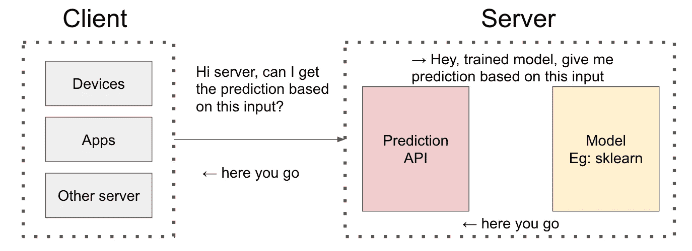
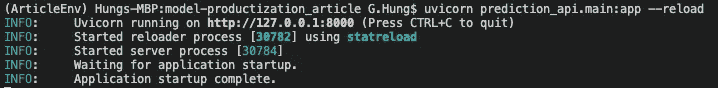
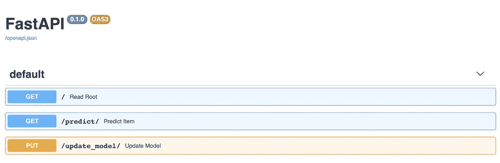
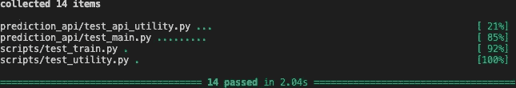
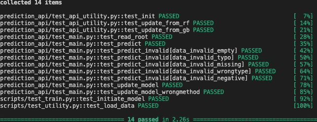

# 从脚本到预测 API

> 原文：<https://towardsdatascience.com/from-scripts-to-prediction-api-2372c95fb7c7?source=collection_archive---------32----------------------->

## submission.csv？不用了，谢谢！

这是我上一篇文章的延续:

[从 Jupyter 笔记本到脚本](/from-jupyter-notebook-to-sc-582978d3c0c)

上次我们讨论了如何将 Jupyter Notebook 转换成脚本，以及各种基本的工程实践，如 CI、单元测试、包环境、配置、日志记录等

即使是脚本形式，它仍然需要我们更改配置并运行脚本，这对于 Kaggle 比赛来说是可以的，因为你所需要的只是 **submission.csv** ，但是你可能不想全天候坐在计算机后面，每当用户向你发送预测请求时就点击运行🙁

在本文中，我们将讨论如何利用我们上次构建的模型，并使用 FastAPI 创建预测 API 来提供模型服务！

> 对于 ML/DL 的乡亲们，我们说的是 [FastAPI](https://fastapi.tiangolo.com/) ，不是 [fast.ai](https://www.fast.ai/) ！！！

# 背景:FastAPI

Python 生态系统中有很多针对 API 的框架，我最初的想法是用 Flask。但是我对 FastAPI 的简单和直观印象深刻，并且喜欢在这个迷你项目中尝试它！

“冰冻三尺，非一日之寒”，FastAPI 从 Django、Flask、APIStar 等之前的框架中学到了很多，我无法比创作者本人更好的解释[这篇文章](https://fastapi.tiangolo.com/history-design-future/)太棒了！

# 无聊但必要的设置

东西都在 [one repo](https://github.com/G-Hung/model-productization_article) 这大概不是一个好的做法，应该是真实用例中不同的 GitHub repo，可能我以后会*重构*【专业的说法“清理我以前的 sxxt”】！

*CS 的人总是说*单一责任原则*，而不是说“不要把不同功能的代码放在一起”，下次也许你可以说“我们应该遵循单一责任原则！”

首先，让我们用新的包更新 requirements.txt，正如我们上次提到的，我们应该指定**确切的版本**，这样其他人就可以复制这个作品了！

```
# for last article
pytest==6.0.1
pandas==1.0.1
Click==7.0
scikit-learn==0.22.1
black==19.10b0
isort==4.3.21
PyYAML==5.2# for FastAPI
fastapi==0.61.0
uvicorn==0.11.8
chardet==3.0.4
```

在这之后，我们需要在 conda env 中再次安装 requirements.txt 因为我们有了新的包]

```
*# You can skip the line below if you have created conda env*
conda create - name YOU_CHANGE_THIS python=3.7 -yconda activate YOU_CHANGE_THISpip install –r requirements.txt
```

# 游戏计划

让我们想想发生了什么，我们希望有 API 端点来做预测，具体来说，如果用户给 **us** 输入，我们需要使用模型来预测并返回预测。

我们没有让**us**【human】处理传入的请求，而是创建一个 API 服务器来等待请求、解析输入、进行预测并返回结果。API 只是与我们的计算机对话并请求服务的结构化方式[在这种情况下是预测]



高层正在发生什么

下面是伪代码:

```
*# Load trained model*
trained_model = load_model(model_path)*# Let's create a API that can receive user request*
api = CreateAPI()*# If user send us the request to `predict` endpoint*
when user sends request to `api`.`predict`:
    input = api[`predict`].get(input) # get input
    prediction = trained_model(input) # apply model
    return prediction                 # return prediction
```

这对快乐流有好处！但是我们应该*永远不要*相信用户，问问你自己，你会在日常生活中阅读用户手册吗？

例如，我们期望从用户那里得到{'a': 1，' b': 2，' c': 3}，但是我们可能得到:

*   顺序错误{'b': 2，' a': 1，' c': 3}，或
*   错误的键{'a': 1，' b': 2，' d': 3}，或者
*   缺少密钥{'a': 1，' b': 2}，或者
*   负值{'a': -1，' b': 2，' c': 3}，或
*   错误的类型{ ' a ':' HELLO WORLD '，' b': 2，' c': 3}，或者
*   等等等等

这对我们的 API 是致命的，因为我们的模型不知道如何对此做出响应。我们需要引入一些输入结构来保护我们！因此，我们应该更新我们的伪代码！

```
**# Define input schema
input_schema = {......}***# Load trained model*
trained_model = load_model(model_path)*# Let's create a API that can receive user request*
api = CreateAPI()*# If user send us the request to `predict` endpoint*
when user sends request to `api`.`predict`:
    input = api[`predict`].get(input) # get input **transformed_input = apply(input_schema, input)
    if not transformed_input.valid(): return Error**    prediction = trained_model(**transformed_input**) # apply model
    return prediction                 # return prediction
```

# 代码

我现在觉得不错！让我们用 FastAPI 一部分一部分地翻译它们吧！

**输入模式**

看起来有很多行，但事情是一样的，正如你所猜测的，我们定义了一个名为“Sample”的类，它将每个预测器定义为 *float* 和*大于[gt] zero！*

**负载模型**

然后我们加载训练好的模型，嗯嗯什么是‘预测器’？它只是一个用不同方法包装模型的定制类，因此我们可以调用一个方法，而不是在 API 服务器中实现逻辑

**创建一个 API 服务器**

然后我们使用 FastAPI 创建 API 伪代码几乎已经是代码了

**预测终点**

这看起来很复杂，但是非常简单

不是说*“当用户向‘API’发送请求时。‘predict’”*

我们说:*"嘿，app，如果有人发送"****GET****请求"为了`预测'，请运行函数 predict_item，我们期望输入遵循我们在`示例`中定义的模式"*

*predict_item* 所做的只是转换输入形状，馈送给训练好的模型并返回预测，简单的 Python 函数

> 如果你想了解更多关于 [HTTP 请求方法](https://developer.mozilla.org/en-US/docs/Web/HTTP/Methods)

但是你可能会问:哎！少了一行！！！输入验证在哪里？如果用户提供了错误的数据类型/键或者遗漏了一个字段，该怎么办？

嗯……还记得我们已经为输入模式定义了“Sample”类吗？快速 API **自动**根据模式为我们验证它，我们不需要关心这个！！！这为构建一个健壮的、经过良好测试的 API 节省了大量的脑力和代码！

# 尝试使用

```
# At project root, we can run this
# --reload is for development, API server autorefresh
# when you change the codeuvicorn prediction_api.main:app --reload
```

你应该能看到这些，API 服务器现在运行在“http://127.0.0.1:8000”上！



根据您的环境，有不同的方法来试验 API，您可以在 Python 中使用*请求，在命令行中使用*或 *cURL。* BTW 有一个好用的工具叫做[邮差](https://www.postman.com/)，试试吧，这是一个非常直观和人性化的 API 工具！

我们将在下面的例子中使用 Python 请求，你可以在[这本笔记本](https://github.com/G-Hung/model-productization_article/blob/master/notebook/prediction_API_test.ipynb)中看到它们【有时 Jupyter 是有帮助的😎]

> 下面的例子使用了一个有效的输入:耶！😍我们成功了！端点返回预测！！！

```
payload = {
    "fixed_acidity": 10.5,
    "volatile_acidity": 0.51,
    "citric_acid": 0.64,
    "residual_sugar": 2.4,
    "chlorides": 0.107,
    "free_sulfur_dioxide": 6.0,
    "total_sulfur_dioxide": 15.0,
    "density": 0.9973,
    "pH": 3.09,
    "sulphates": 0.66,
    "alcohol": 11.8,
}result = requests.get("[http://127.0.0.1:8000/predict](http://127.0.0.1:8000/predict)", data = json.dumps(payload))print(result.json())**Output**
{'prediction': 1, 'utc_ts': 1597537570, 'model': 'RandomForestClassifier'}
```

> 下面的例子遗漏了一个字段，FastAPI 帮助我们根据我们定义的模式来处理它，除了模式类，我什么也没写

```
payload = {
    "volatile_acidity": 0.51,
    "citric_acid": 0.64,
    "residual_sugar": 2.4,
    "chlorides": 0.107,
    "free_sulfur_dioxide": 6.0,
    "total_sulfur_dioxide": 15.0,
    "density": 0.9973,
    "pH": 3.09,
    "sulphates": 0.66,
    "alcohol": 11.8,
}result = requests.get("[http://127.0.0.1:8000/predict](http://127.0.0.1:8000/predict)", data = json.dumps(payload))print(result.json())**Output**
{'detail': [{'loc': ['body', 'fixed_acidity'], 'msg': 'field required', 'type': 'value_error.missing'}]}
```

只是为了好玩，我还实现了一个 *update_model* PUT API 来交换模型，例如，最初我们使用随机森林，我将其更新为渐变 Boosting☺️

```
result = requests.put("[http://127.0.0.1:8000/update_model](http://127.0.0.1:8000/update_model)")print(result.json())**Output**
{'old_model': 'RandomForestClassifier', 'new_model': 'GradientBoostingClassifier', 'utc_ts': 1597537156}
```

# 自动生成的文档

其中一个很酷的 FastAPI 特性是 auto-document，只需进入[http://127 . 0 . 0 . 1:8000/docs #/](http://127.0.0.1:8000/docs#/)即可获得开箱即用的交互式强大 API 文档！如此直观，我不需要细说



# 重访 pytest

我再怎么强调单元测试的重要性也不为过，它验证了函数正在做我们期望它们做的事情，这样你就不会不小心弄坏东西了！

但是，如果我试图涵盖每一个测试，这将是太无聊和冗长。我打算在这里分享一些我会无脑测试的领域&一些[可能有用的]文章。然后我会讲一个叫参数化单元测试的 pytest 特性，以及 pytest 中的一些测试选项。激励自己学习单元测试最简单的方法就是尝试重构你之前的代码，越大越好！

**单元测试**

每当你发现编写/理解单元测试有困难时，你可能需要首先回顾你的代码结构。以下是我会不假思索考虑的 4 个方面:

1.  输入数据:dimension [eg: df.shape]，type [eg: str]，值域[eg: -/0/+]
2.  输出数据:dimension [eg: df.shape]，type [eg: str]，取值范围[eg: -/0/+]
3.  比较:输出和预期结果
4.  我调试后，防止它再次发生

例如，我非常关注下面的输出维度、类型和值范围。这似乎很简单，但如果你修改任何输出格式，它会提醒你什么是预期的格式！

FYR 的一些文章:

[数据科学家的单元测试](/unit-testing-for-data-scientists-dc5e0cd397fb)

[如何单元测试机器学习代码](https://medium.com/@keeper6928/how-to-unit-test-machine-learning-code-57cf6fd81765)【深度学习】

**参数化单元测试**

假设您有 100 个模拟数据[用 D_i，i: 1 标注..100]并且你想为它们中的每一个运行相同的单元测试，你会怎么做呢？

> *蛮力大法*

```
def test_d1():
    assert some_operation(D_1)def test_d2():
    assert some_operation(D_2)def test_d3():
    assert some_operation(D_3)......def test_d100():
    assert some_operation(D_100)
```

但是如果你需要修改“some_operation ”,你需要修改 100 次 LOL……虽然你可以把它作为一个实用函数，但这使得测试很难阅读，而且非常冗长

> *更好的方法也许是 for-loop？*

```
def test_d():
    for D in [D_1, D_2, D_3, ..., D_100]:
        assert some_operation(D)
```

但是你不能确切地知道哪些测试失败了，因为这 100 个测试都在一个测试中

> *pytest 为我们提供了一个名为* ***参数化*** 的特性

```
[@pytest](http://twitter.com/pytest).mark.parametrize("test_object", [D_1, D_2, ..., D_100])
def test_d(test_object):
    assert some_operation(test_object)
```

**常见 pytest 选项**

> **pytest 文件夹**

上次我们提到我们可以在命令行中运行`**pytest**', pytest 会在文件夹下找到所有的**测试。但是有时我们可能不想在开发过程中运行所有的单元测试[也许一些测试花费了很长时间，但是与您当前的任务无关]**

在这种情况下，你可以简单地运行 **pytest 文件夹**，例如:` pytest。/scripts '或' pytest。演示中的/prediction_api '

> **并行 pytest**

有时你的测试用例太重，并行运行可能是个好主意！您可以安装 **pytest-xdist** 并在您的命令中用 py.test 替换 pytest，例如:py.test -n 4

> **pytest -v**

这是个人喜好，我更喜欢冗长的输出，看到绿色通过✅开始我的一天



pytest



pytest -v

> 您可以从以下材料中了解更多信息:
> 
> [https://docs.pytest.org/en/stable/](https://docs.pytest.org/en/stable/)
> 
> [https://www.guru99.com/pytest-tutorial.html#5](https://www.guru99.com/pytest-tutorial.html#5)

## 最后，我希望你能和我一样喜欢这个 1 分钟的 Youtube 视频😆

# 结论

Yooo✋:我们已经创建了一个使用我们模型的预测 API，用户现在可以发送请求并获得预测，而无需人工参与，这过度简化了现实[吞吐量、延迟、模型管理、身份验证、AB 测试等]，但这就是我们的想法！

至少如果你的原型达到了这个水平，工程师们会更乐意接手，从而加快整个过程，你可以向他们展示你知道一些东西😈

最后，我们:

```
a. Update conda env [requirements.txt]
b. Brainstorm pseudocode and convert to code [FastAPI, uvicorn]
c. Utilize API [cURL, requests, Postman]
d. Talk about Auto-generated documents by FastAPI
e. Some pytest techniques [parallel, parameterized, -v]
```

下面的文件树显示了开发步骤

```
.
├── notebook
│   ├── prediction-of-quality-of-wine.ipynb
│   └── prediction_API_test.ipynb           [c] <-consume API
├── prediction_api
│   ├── __init__.py
│   ├── api_utility.py                      [b] <-wrap up methods
│   ├── main.py                             [b] <-modify demo
│   ├── mock_data.py                        [e] <-Unit test
│   ├── test_api_utility.py                 [e] <-Unit test
│   └── test_main.py                        [e] <-Unit test
├── requirements.txt                        [a] <-FastAPI doc
.
.
.
```

**但是**(还是那句话，坏消息通常以 BUT 开头)它们还在我的**本地**电脑上。

尽管我们不需要坐在后面点击 Run，但是用户请求不能到达 API 端点。即使他们这样做了，这也意味着我不能关闭我的 Macbook，这意味着如果有许多传入的预测请求，我就不能扩展😱！！！

正如我们在上一篇文章中提到的，逃离这个地狱的方法是，要么购买另一台计算机，要么从 AWS 等云提供商那里租用服务器

但是首先，我们还需要确保代码在那里工作正常！怎么会？

简答:Docker

**旁白:**

虽然我没有尝试过，但有一家名为 [Cortex](https://docs.cortex.dev/) 的初创公司专注于开源机器学习 API 框架，他们[也在幕后使用 FastAPI](/why-we-switched-from-flask-to-fastapi-for-production-machine-learning-765aab9b3679) ！

到现在，你应该能理解他们的教程了，简而言之，他们在幕后解决了滚动更新、DL 模型推理、与 AWS 集成、自动缩放等许多生产层面的问题……这些都是 *DevOps* 关心的问题？或者用一个更好的术语: *MLOps*

但是从用户的角度来看，他们使用声明性的 yml 部署 APIs 类似于我们在上一篇文章中配置模型的方式]，有一个预测器类[类似于我们的预测器类]，trainer . py[类似于上一篇文章中的 train.py

编写代码相对容易，但是为代码写一篇文章却很难，如果你觉得这篇文章有用，你可以留下一些评论

或者你可以开始我的[回购](https://github.com/G-Hung/model-productization_article)！

或者[我的 LinkedIn](https://www.linkedin.com/in/geoffreyhung/) 【欢迎但请留话表示你不是僵尸】！