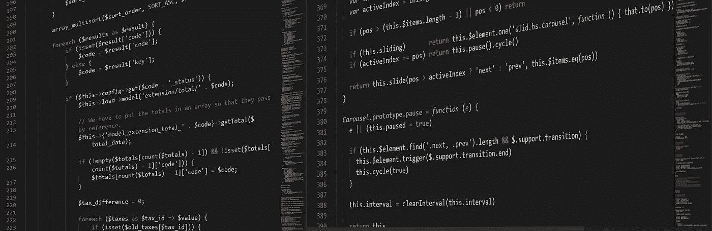
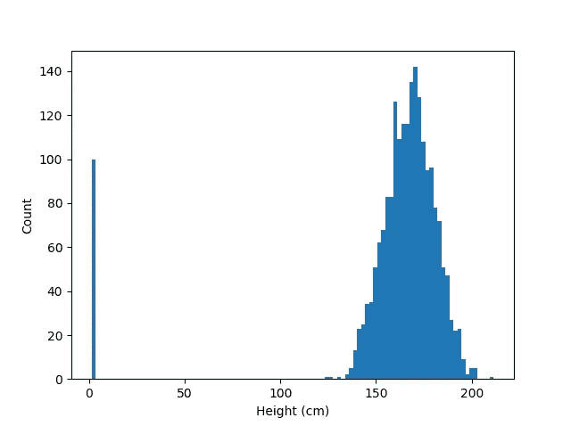

# 从 sklearn 导入*

> 原文：<https://towardsdatascience.com/from-sklearn-import-478c711dafa1?source=collection_archive---------1----------------------->

## 以及其他暴露你是假数据科学家的证据



像大多数报道“黑客”的新闻媒体一样，虚假数据科学家乐于使用他们在网上找到的任何随机代码(图片来源: [Picography](https://picography.co/javascript-code/)

最近，似乎每个人和他们的狗都在推销自己是数据科学家——你很难责怪他们，因为“数据科学家”被评为本世纪最性感的工作，并且拿着高薪。尽管如此，我们还是会责怪他们，因为许多装腔作势的人在公司间招摇撞骗，尽管他们几乎没有实践经验，甚至更没有理论基础。在我采访和与当前和未来的数据科学家合作的经历中，我发现了一些区分装腔作势的文章和真实文章的线索。我无意贬低自学成才和有抱负的数据科学家——事实上，我认为这个领域特别适合热情的自学者——但我*肯定*想贬低那种参加一门在线课程，然后自称专家的人，尽管对该领域的基本**理论**一无所知(或不感兴趣)。我整理了这份清单，这样，如果你是一名招聘经理，不知道你在数据科学家身上寻找什么，你可以过滤掉渣渣，如果你是一名有抱负的数据科学家，并且其中任何一条引起了你的共鸣，你可以在自己变成装腔作势者之前解决它们。以下是数据科学的三大领域*失言*和具体的例子，它们会让你的简历被扔进垃圾箱。

# 1.你不用费心去探索数据

数据探索是任何机器学习项目的第一步。如果你不花时间去熟悉你的数据，并充分了解它的特性和怪癖，你将会浪费大量的时间，在得到一个可用的产品之前，错误地选择决策树——如果你真的成功了的话。

## a)您没有可视化您的数据

探索性数据可视化是启动任何数据相关项目的最佳方式。如果你正在应用机器学习，很可能你正在处理大量的高维数据；仔细阅读 Excel 中的. csv 文件或运行`df.describe()`并不是适当的数据可视化的合适替代方法。Francis Anscombe 在他著名的四重奏中阐述了数据可视化的重要性:


安斯科姆的四重奏(来源:[维基共享资源](https://commons.wikimedia.org/wiki/File:Anscombe%27s_quartet_3.svg))

每个面板**中的数据集都具有基本相同的汇总统计数据**:*x*和 *y* 均值、 *x* 和 *y* 样本方差、相关系数、R 平方值和最佳拟合线都(几乎)相同。如果您不可视化您的数据并依赖汇总统计数据，您可能会认为这四个数据集具有相同的分布，但粗略一看就会发现显然不是这样。

数据可视化允许您识别数据中的趋势、工件、异常值和分布；如果你跳过这一步，你也可以蒙着眼睛完成项目的其余部分。

## b)您没有清理您的数据

数据是杂乱的:数值输入错误；转换出错；传感器瘫痪了。在你浪费时间在一个没有前途的项目上之前解决这些问题是很重要的，在将你的模型推向生产之前解决这些问题是非常关键的。记住:**垃圾入垃圾出**。

有很多好的方法来识别数据中的问题，但没有好的方法来识别所有问题。数据可视化是很好的第一步(我提到过这个吗？)，虽然这可能是一个繁琐的手动过程，但它的回报是很多倍的。其他方法包括自动异常检测和条件汇总统计。

例如，考虑人类身高的直方图:



成人身高直方图

用这些数据训练一个模型无疑会导致糟糕的结果。但是，通过检查数据，我们发现这 100 个“异常值”实际上是以米而不是厘米为单位输入身高的。这可以通过将这些值乘以 100 来校正。适当地清理数据不仅可以防止模型被错误的数据训练，而且，在这种情况下，让我们挽救 100 个数据点，否则它们可能会被丢弃。如果您没有适当地清理您的数据，最好的情况是将钱留在桌子上，最坏的情况是构建一个有缺陷的模型。

## c)您不必为功能选择和工程设计费心

神经网络的一个很酷的事情是，你可以经常把你所有的原始数据扔给它，它会学习你的目标函数的一些近似值。不好意思，错别字，我指的是*其中的* ***最坏的*** *事情*。当然，这很方便，但是效率低而且脆弱。最糟糕的是，这使得初学数据的科学家依赖深度学习，而通常情况下，更传统的机器学习方法可能更合适，这让他们慢慢陷入困境。进行功能选择和工程设计没有“正确”的方法，但有几个关键的结果值得努力:

*   **降维**:数据越多并不总是越好。通常，您希望在拟合模型之前减少特征的数量。这通常涉及删除不相关和冗余的数据，或将多个相关字段合并成一个字段。
*   **数据格式化**:电脑是哑巴。你需要把你的数据转换成你的模型容易理解的格式:神经网络喜欢-1 到 1 之间的数字；分类数据应该是一次性编码的；有序数据(可能)不应该表示为单个浮点字段；对指数分布数据进行对数变换可能是有益的。简单地说，在数据格式化中有许多依赖于模型的细微差别。
*   **创建特定领域的特性:**从数据中创建自己的特性通常很有成效。如果您有计数数据，您可能希望将其转换为相关的二进制阈值字段，如"≥100" vs " < 100 "，或" is 0" vs "is not 0 "。如果您有连续的数据 *x* 和 *z* ，您可能希望在您的特征集中包含字段 *x* 、 *xz* 和 *z* 以及 *x* 和 *z* 。这是一个高度依赖于问题的实践，但是如果做得好，可以极大地提高某些类型模型的性能。

大多数外行人认为机器学习就是从原始数据中神奇地产生结果的黑盒；请不要助长这种误解。

# 2:您没有选择合适的型号

机器学习是一个有着丰富历史的广阔领域，在那段历史的大部分时间里，它被称为“统计学习”。随着 Scikit-Learn 和 TensorFlow 等易于使用的开源机器学习工具的出现，结合我们现在收集的海量数据和无处不在的快速计算机，使用不同的 ML 模型类型进行实验从未如此简单。然而，这并不是一个巧合，取消 ML 从业者*实际上理解*不同模型类型如何工作的要求导致许多 ML 从业者*不理解*不同模型类型如何工作。

## a)你什么都试了

有抱负的数据科学家的 github repos 上散落着 Kaggle 项目和在线课程作业，看起来像这样:

```
from sklearn import *
for m in [SGDClassifier, LogisticRegression, KNeighborsClassifier,  
             KMeans, KNeighborsClassifier, RandomForestClassifier]:
    m.overfit(X_train, y_train)
```

这是一个明显的信号，表明你不明白自己在做什么，而且这么多在线课程推荐这种做法，这是一个该死的耻辱。这是浪费时间，并且容易导致选择不合适的模型类型，因为它们碰巧在验证数据上工作良好(您记得持有验证集，对吗？*对吗？*)。应该根据底层数据和应用程序的需求来选择所使用的模型类型，并且应该对数据进行设计以匹配所选择的模型。选择模型类型是数据科学过程中的一个重要部分，在几个合适的模型之间进行直接比较可能是有保证的，但盲目地应用每一种工具来寻找“最佳数字”是一个主要的危险信号。特别是，这掩盖了一个潜在的问题，即…

## b)你实际上并不了解不同的模型类型是如何工作的

如果您的输入是“车龄”和“行驶公里数”，为什么 KNN 分类器可能不太好用？应用线性回归预测全球人口增长有什么问题？为什么我的随机森林分类器不能在我的数据集上使用 1000 类一热编码变量？如果你回答不了那些问题，没关系！有很多很好的资源可以学习这些技术是如何工作的；在你申请这个领域的工作之前，一定要阅读并理解它们*。*

这里更大的问题不是人们不知道不同的 ML 模型是如何工作的，而是他们不关心并且对底层的数学不感兴趣。如果你喜欢机器学习但不喜欢数学，那你不是真的喜欢机器学习；*你看上什么你就看上什么* ***觉得*** *那就是*。如果你不关心学习模型是如何工作的，或者是否适合数据，那么当它们不可避免地出错时，你就没有希望解决它们。当…时，问题只会加剧

## c)你不知道你想要的是准确性还是可解释性，也不知道为什么你必须做出选择

所有模型类型都有其优点和缺点。机器学习中的一个重要权衡是准确性和可解释性之间的权衡。你可以有一个预测能力很差但很容易理解并能有效解释过程的模型，你可以有一个非常准确但其内部运作是个谜的黑匣子，或者你可以在中间的某个地方着陆。

您选择哪种类型的模型应该根据这两个特征中哪一个对您的应用更重要来决定。如果目的是对数据建模并获得可操作的见解，那么一个可解释的模型，如决策树或线性回归，是显而易见的选择。如果应用程序是生产级别的预测，如图像注释，那么可解释性就不如准确性，随机森林或神经网络可能更合适。

以我的经验来看，不理解这种权衡的数据科学家，以及不考虑为什么可解释性很重要而一味追求准确性的人，都不是你想要的那种训练模型。

# 3:你没有使用有效的度量和控制

尽管构成了 50%的单词和 64%的字母，但数据科学的“科学”部分经常被忽略。对于 poser 数据科学家来说，盲目地在真空中应用单一指标作为他们的模型评估并不罕见。不知情的利益相关者很容易被像“90%的准确率”这样的大胆断言所震惊，这些断言在技术上是正确的，但是对于手头的任务来说却是非常不合适的。

## a)您没有建立基线模型

我有一个胰腺癌测试，准确率超过 99%。不可思议吧。嗯，这是真的，你可以点击[这个链接](https://upload.wikimedia.org/wikipedia/commons/3/31/ProhibitionSign2.svg)自己试试。

如果你看到一个红色圆圈，中间有一条线穿过，你的测试结果是阴性。如果你看到一个绿色的对勾，你在撒谎。关键是，99%的人没有胰腺癌(实际上，更多，但为了这个例子，让我们假设是 99%)，所以我的愚蠢的小“测试”在 99%的时候是准确的。因此，如果准确性是我们所关心的，任何用于诊断胰腺癌的机器学习模型都应该至少像这个无信息的基线模型一样执行**。如果你刚从大学聘用的能人声称他开发了一个准确率高达 95%的工具，将这些结果与基线模型进行比较，确保他的模型比随机模型表现得更好。**

## b)您使用了错误的度量标准

继续上面的诊断示例，确保使用正确的度量标准很重要。对于癌症诊断，准确性实际上是一个糟糕的指标；如果降低准确度意味着灵敏度的提高，那么降低准确度通常是更好的选择。假阳性的代价是什么？病人的压力，以及浪费的时间和资源。假阴性的代价是什么？死亡。理解你的模型在现实世界中的含义，并理解这些含义如何支配指标选择，可以清楚地将真正的数据科学家与他们的脚本小子相似者区分开来。

## 你搞砸了训练/测试

这是一个大问题，而且太普遍了。正确测试模型对于数据科学过程来说是绝对必要的。这可能会在很多方面出错:不理解验证和测试数据之间的差异，在拆分之前执行数据扩充，不堵塞数据泄漏，完全忽略数据拆分……除了如果您不知道或不关心如何创建一个合适的维持集，您的所有工作都是浪费时间。

# …将张量流作为 tf 导入

这些只是少数放弃游戏的告诉。有了足够的经验，他们很容易被发现，但如果你刚刚开始在这个领域工作，你可能很难区分世界上的 Siraj Ravals 和 Andrew Ngs。现在，我并不是说要把这个领域留给有抱负的数据科学家；如果你觉得被以上任何一个例子攻击，我很高兴听到它，因为*这意味着你关心把事情做好*。继续学习，继续攀登，这样你也可以被人山人海的装腔作势者无休止地折磨。