# 从流数据到新冠肺炎 Twitter 分析:使用 AWS Lambda、Kinesis Firehose 和 Elasticsearch

> 原文：<https://towardsdatascience.com/from-streaming-data-to-covid-19-twitter-analysis-using-aws-lambda-kinesis-firehose-and-b71b71279335?source=collection_archive---------14----------------------->

## 释放 AWS 和 Elasticsearch 的力量

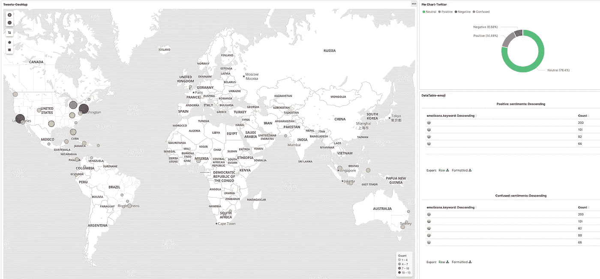

分析实时推文的仪表板。

# 介绍

在我之前的博文 [*从流数据到新冠肺炎 Twitter 分析:使用 Spark 和 AWS Kinesis*](/playing-with-data-gracefully-1-a-near-real-time-data-pipeline-using-spark-structured-streaming-409dc1b4aa3a) 中，我涵盖了用 Spark 和 AWS Kinesis 构建的数据管道。在这篇文章中，我将采用另一种方式来达到同样的目的。

在之前的工作经历中接触过 AWS Lambda 和 Elasticsearch。Lambda 的无服务器、事件触发特性以及与其他 AWS 工具的丰富连接给我留下了深刻的印象。Elasticsearch 向我展示了系统生成的杂乱日志是如何被整齐地处理的，并且在 Kibana 上是可见的。受到这篇文章的启发: [*用 AWS*](https://aws.amazon.com/blogs/big-data/building-a-near-real-time-discovery-platform-with-aws/) 构建一个接近实时的发现平台，我复制了数据管道并将其应用于 Twitter 上的新冠肺炎分析。为了尊重原创作品的版权，我不会将这个帖子货币化。

与 [*参考文章*](https://aws.amazon.com/blogs/big-data/building-a-near-real-time-discovery-platform-with-aws/) 相比，我新增内容如下:

*   进行代码更改以与依赖项的最新版本保持一致。
*   提供更多关于人们容易遇到的问题的细节，而这些问题在*参考文章*中没有涉及。
*   遇到 Lambda 和 Elasticsearch 相关错误时如何调试？

数据管道遵循接近实时流的时尚，从消化实时 Twitter 数据到可视化。组装拼图的大部分碎片来自 AWS 家族: **AWS Kinesis Firehose** 、 **AWS S3 水桶**、 **AWS Lambda** 、**亚马逊弹性搜索服务**。架构是这样的:

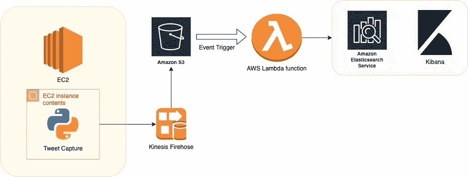

数据管道的体系结构。

本文作为参考文章的补充指南，将讨论分为以下步骤:

*   IAM 设置
*   创建亚马逊弹性搜索服务集群
*   配置 AWS Kinesis 消防软管和 S3
*   创建 AWS Lambda 函数
*   代码打包和更改
*   Kibana 可视化和 Twitter 分析

Lambda 函数和 [Twitter 捕获程序](https://github.com/joking-clock/twitter-capture-python)的代码已经上传到我的公共回购中。

# IAM 设置

在构建数据管道之前，您需要有一个 AWS 帐户和 Twitter API 密钥以及访问令牌，这在参考文章的*的先决条件中也有提及。除此之外，IAM 角色非常重要，必须正确设置。需要两个角色:*

*   Kinesis Firehose 需要一个 IAM 角色，并被授予传送流数据的权限，这将在 Kinesis 和 S3 桶一节中讨论。
*   AWS Lambda 需要权限来访问 S3 事件触发器、添加 CloudWatch 日志以及与 Amazon Elasticserch 服务进行交互。

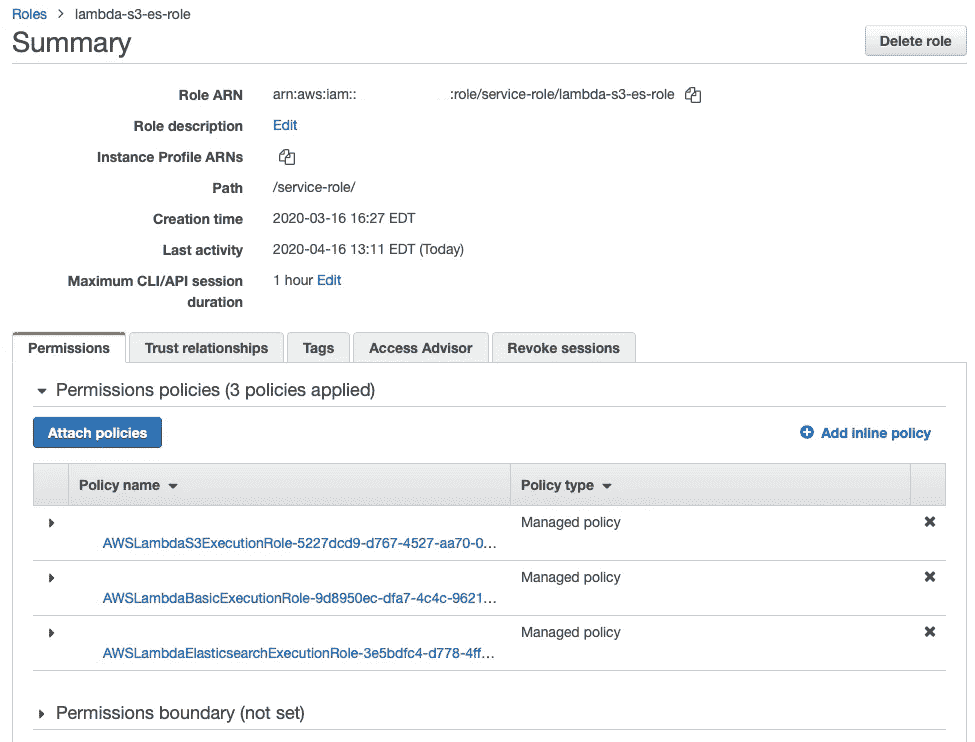

lambda 函数的 IAM 角色 lambda-s3-es-role。

如上图所示，我给 Lambda 执行角色 *lambda-s3-es-role* 附加了三个策略。如果您不确定如何配置策略，我将这些策略附在 [repo](https://github.com/joking-clock/twitter-analysis-bigdata/tree/master/aws_lambda_elasticsearch/Lambda_policies) 中以供参考。

# 创建亚马逊弹性搜索服务集群

我假设读者已经按照参考文章*中的步骤在 [Amazon ES 主页](https://console.aws.amazon.com/es/home)创建了一个 Amazon ES 域。对于自由层用户，他们可以选择 t2.micro 或 t2.small 等实例类型，并免费获得 750 小时的 Amazon ES 使用时间。创建 ES 域时需要注意几点:*

*   无需设置“专用主节点”。
*   作为演示项目，我在“网络配置”中选择公共接入。

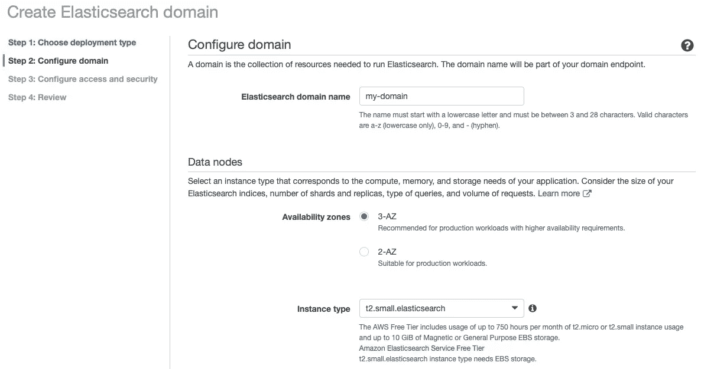

事情是这样的。在配置"访问策略"时，选择"客户访问策略"，需要添加以下策略:

1.  选择“ARN”，允许 lambda 执行角色 *lambda-s3-es-role* 访问 es 服务。

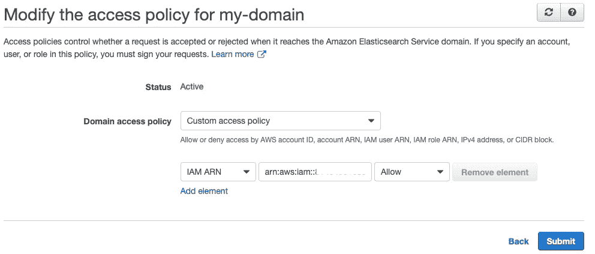

我在这里留下一个疑问:**设置是否正确？我们稍后会测试它。**

# 配置 AWS Kinesis 消防软管和 S3

与*参考文章*不同，我选择在 [Kinesis 消防水龙带流控制台](https://console.aws.amazon.com/firehose/home)创建一个 Kinesis 消防水龙带。步骤很简单:

*   填写消防水带流的名称
*   来源:直接投资或其他来源
*   目的地:一个 S3 桶，用于存储数据文件(实际上是推文)。在这里，您可以选择一个您已经创建的 S3 桶或创建一个新的飞行。
*   权限。

正如在 **IAM 部分**中提到的，一个 Firehose 流需要 IAM 角色来包含所有必要的权限。单击“新建或选择”，并选择“创建新的 IAM 角色”，或使用现有的角色。默认策略将被附加，并应满足需要。

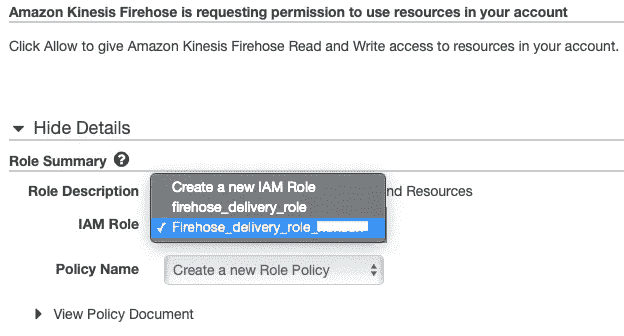

Kinesis Data Firehose Stream (KDF)和 Kinesis Data Stream (KDS)有时可能会让人混淆。KDF 在传输流数据时有额外的功能。在传递到目的地的过程中，源数据可以通过 Lambda 函数进行转换。我的另一个[帖子](/playing-with-data-gracefully-1-a-near-real-time-data-pipeline-using-spark-structured-streaming-409dc1b4aa3a)涵盖了 KDF 的用法。

# 创建 AWS Lambda 函数

AWS Lambda 在这个管道中起着核心作用。我们将创建一个 Lambda 函数来完成以下工作:

*   一旦在目标 S3 桶中创建了新的数据文件，Lambda 函数就会被触发。
*   数据将使用指定的结构进行解析，这与文档的映射一致。
*   数据将被加载到 ES 集群中。

一下子实现这样一个 Lambda 函数很难。将繁琐的过程分成更小的步骤，我首先需要正确设置 Lambda 环境。

在 [AWS Lambda 主页](https://console.aws.amazon.com/lambda/home)创建功能:

*   选择 Python 3.7 运行时。
*   选择 *lambda-s3-es-role* 作为执行角色*。*
*   将内存保持在 128 MB，并将超时设置为 2 分钟。
*   为 S3 添加一个触发器。如果任何新文件进入 S3 桶，Lambda 函数将接收事件并被调用。


为 Lambda 函数创建一个 S3 触发器，注意前缀“debug”用于调试，可以根据需要替换。

现在，我们可以测试 Lambda 函数是否能对 S3 事件做出反应。使用示例代码和配置好的处理程序，我们将一个文件放入 S3 桶 *twitter-stream-sink。*

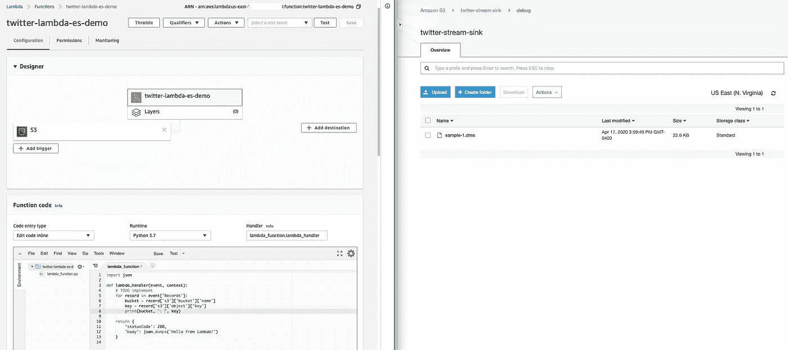

创建一个 Lambda 函数，并将一个测试文件放入 S3 桶中。请注意，处理程序名称应该与函数代码中的入口函数相匹配。

在 Lambda function 面板的“Monitoring”选项卡上，有一个点出现在指标图上。单击“查看 CloudWatch 中的日志”，我们得到了这次调用的 *CloudWatch* 日志，该日志打印了我们刚刚放入的源 S3 桶和文件名。

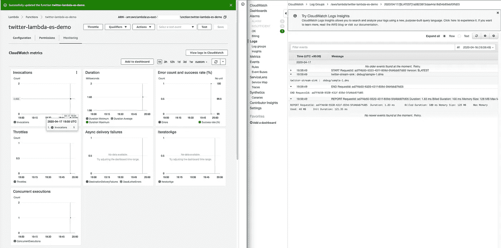

左侧窗口显示了度量图中的一个点，表示对 Lambda 函数的调用。右侧窗口显示了 CloudWatch 日志的详细信息。

# 代码打包和更改

*参考文章*是几年前发表的，所以项目代码需要更新。

项目代码可以从 [repo](https://github.com/joking-clock/twitter-analysis-bigdata/tree/master/aws_lambda_elasticsearch/code_base) 下载。代码目录包含 4 个 python 文件: *config.py* ， *myhandle.py* ， *tweet_utils.py* ， *twitter_to_es.py* 。要将必要的库添加到项目文件夹中，只需键入命令:

```
pip install library_name -t .
```

导入到项目目录所需的库如下:

```
requests
requests_aws4auth
elasticsearch
textblob=0.15
```

Lambda 函数接受 zip 格式的代码包。将代码目录与库打包需要以下命令:

```
zip -r ../your_package_name.zip * -x "*.git*"
```

关于 Lambda 部署包的教程可以在 [AWS Lambda 文档](https://docs.aws.amazon.com/lambda/latest/dg/python-package.html)中找到。

现在让我们看一下每个 python 文件:

## myhandle.py

*   充当 Lambda 函数的入口点。
*   解析事件信息，获取 JSON 格式的 S3 文件内容。

## twitter_to_es.py

*   向 es 集群添加索引和映射。
*   采用 [bulk](https://elasticsearch-py.readthedocs.io/en/master/helpers.html) 方式将解析后的数据加载到 ES 集群中。
*   授权发送到 ES 集群的请求。

## tweet_utils.py

*   充当助手模块。
*   将推文解析到结构化字典中。
*   使用 TextBlob 分析推特上的情绪。

## 配置. py

*   充当共享配置。

与*参考文章*中的[原代码](https://github.com/amazon-archives/aws-big-data-blog/tree/master/aws-blog-firehose-lambda-elasticsearch-near-real-time-discovery-platform)相比，我做了一些代码改动:

1.  将额外的库添加到包 requests_aws4auth，requests 中。

2.将源代码从 Python 2 移植到 Python 3。

3.修复错误，因为 Elasticsearch 及其 Python 客户端库与以前的版本不兼容。

为了将源代码从 Python 2 移植到 3，我们可以使用库`2to3`。

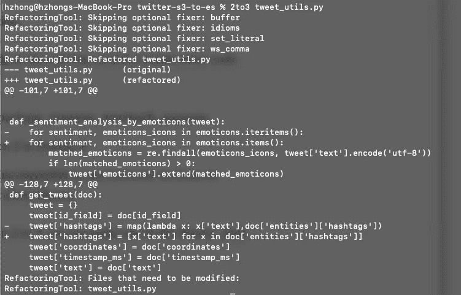

使用 *2to3 命令将 Python 2 代码移植到 Python 3 的例子。*

不兼容问题已修复:

*   自 Elasticsearch 7.0.0 发布以来，[映射类型被移除](https://www.elastic.co/guide/en/elasticsearch/reference/current/removal-of-types.html)。
*   Elasticsearch 的 [Python 客户端](https://elasticsearch-py.readthedocs.io/en/master/)也经历了以前版本的变化，特别是 *bulk* 方法的使用。

为了熟悉 Elasticsearch 的 Python 客户端，你可以打开一个 *Jupiter 笔记本*来测试与 ES 集群的连接。

研究完代码后，我们需要打包代码。为了测试 Lambda 函数，我们将一个捕获的 twitter 文件放入 S3 桶，并查看 tweets 是否被正确解析并加载到 e S 集群中。

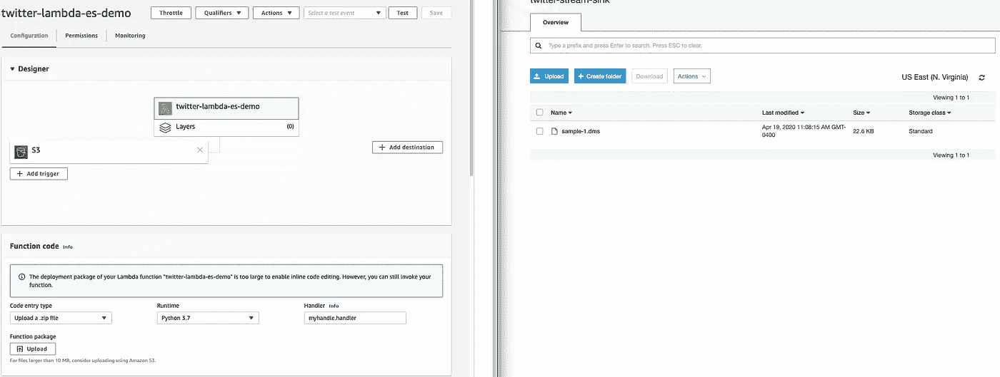

左边的窗口显示了 Lambda 函数的面板，右边的窗口显示了将带有 tweets 的样本数据文件放入 S3。

如果数据成功加载到 ES 集群中，我们可以使用 Kibana 的“Discover”功能来检查它。

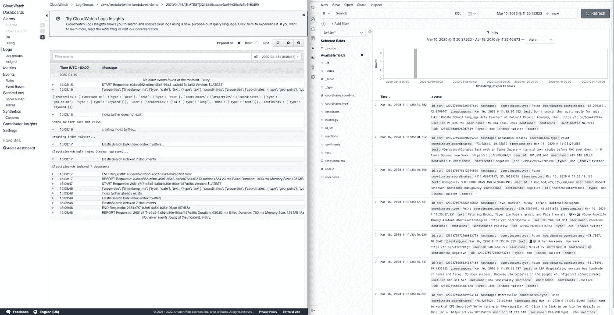

左侧窗口显示调用 Lambda 函数期间的跟踪日志，右侧窗口显示加载到 es 中的 tweets。

除了 Lambda 函数上的代码变化，我使用一个运行在 AWS EC2 实例上的 Python 程序来捕获 tweets，可以在这里找到。*参考文章*包含一个 [node.js 程序](https://github.com/amazon-archives/aws-big-data-blog/tree/master/aws-blog-firehose-lambda-elasticsearch-near-real-time-discovery-platform/firehose-twitter-streaming-nodejs)来捕捉推文，它们都做同样的工作。

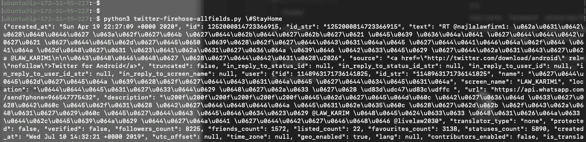

运行 Python tweet 捕获程序

这里要注意一点。当我实现管道并尝试将数据加载到 ES 集群时，我在 Lambda 调用和 Kibana 上遇到了身份验证错误:

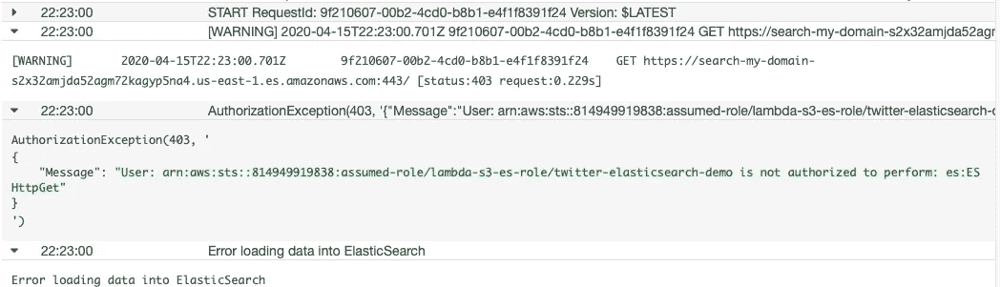

当我将一个数据文件放入 S3 桶时，Lambda 函数报告了这样一个错误。

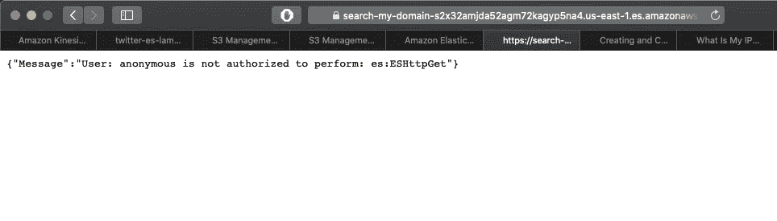

当我在设置了 ES 集群后试图访问 Kibana 时。

为了找出原因，我们需要去指定 Amazon ES 的[身份和访问管理](https://docs.aws.amazon.com/elasticsearch-service/latest/developerguide/es-ac.html)的页面。

> 基于 IP 的策略的主要吸引力在于，它们允许对 Amazon ES 域的未签名请求，这允许您使用像 [curl](https://curl.haxx.se/) 和 [Kibana](https://docs.aws.amazon.com/elasticsearch-service/latest/developerguide/es-kibana.html#es-managedomains-kibana) 这样的客户端，或者通过代理服务器访问域。

*所有对 Amazon ES 配置 API 的请求都必须签名*。在上面的错误中，即使添加了 Lambda 执行角色，请求还是未签名并被拒绝，尤其是 HTTP 请求。为了解决这个问题，我们可以添加基于 IP 的策略，或者使用 [AWS SDK 或请求](https://docs.aws.amazon.com/elasticsearch-service/latest/developerguide/es-request-signing.html#es-request-signing-python)添加标志。因此，我们需要将基于 IP 的策略添加到 ES 访问策略中:

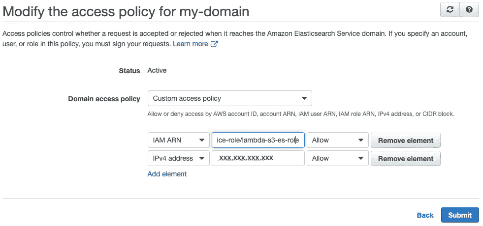

# Kibana 可视化和 Twitter 分析

一旦我们开始运行 twitter 捕获程序，大量的推文将被传入 S3，Lambda 函数将处理数据文件。反映数据的最佳方式是通过 Elasticsearch 中提供的可视化工具 *Kibana* 。

加载到 Elasticsearch 中的所有数据都需要分配索引，因此 Kibana 可以使用*索引模式*来检索数据。在 *twitter_to_es.py* 中，推文用“twitter”做索引。现在我们可以创建一个索引模式“twitter*”，并开始在 Kibana 中发现数据。


创建索引模式“twitter*”，以匹配所有以“twitter”开头的索引。

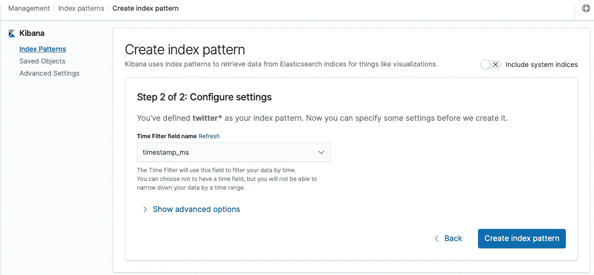

当我们在 tweet_utils.py 中添加映射时，会指定“timestamp_ms”字段。

创建索引模式后，我们可以通过选择左侧栏上的“Discover”按钮来浏览数据，数据可以按时间序列显示。

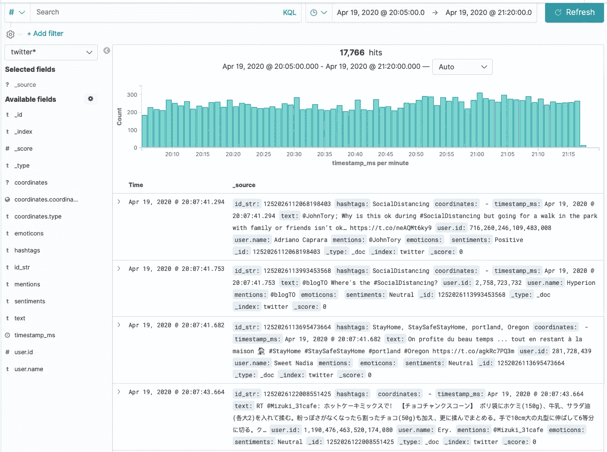

在这篇文章中，我选择了标签“ **#StayHome** ”和“**# social distance**”来挖掘 Twitter。像参考文章*一样，我创建了一个仪表板来可视化推文。仪表板中有三种可视化效果:*

*   一张坐标地图，展示推文的地理分布，仅当推文包含位置信息时有效。
*   一个饼图，展示用户发送推文时的情绪受欢迎程度，包括积极、中性和消极三种情绪。
*   一个数据表，统计每个情绪中包含的表情符号，只列出前 5 个表情符号。

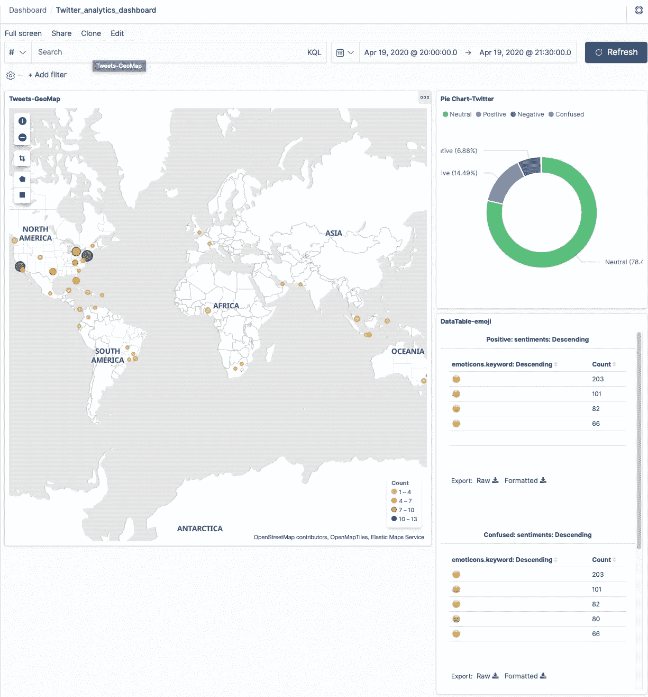

在基巴纳创建的仪表板。

# 结论

AWS Lambda 和 Elasticsearch 是非常强大的技术，这篇文章可能只是展示了应用场景中的一个案例。除了实时数据处理，Lambda 还可以与 ETL(提取、转换、加载)和应用后端集成。Elasticsearch 在日志记录/日志分析和全文搜索方面已经建立了声誉。

我希望你在阅读和摆弄大数据技术时能够找到乐趣。这就是大数据让我着迷的地方。

***编者注:*** [*走向数据科学*](http://towardsdatascience.com/) *是一份以数据科学和机器学习研究为主的中型刊物。我们不是健康专家或流行病学家，本文的观点不应被解释为专业建议。想了解更多关于疫情冠状病毒的信息，可以点击* [*这里*](https://www.who.int/emergencies/diseases/novel-coronavirus-2019/situation-reports) *。*