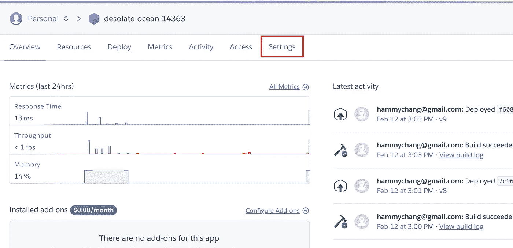
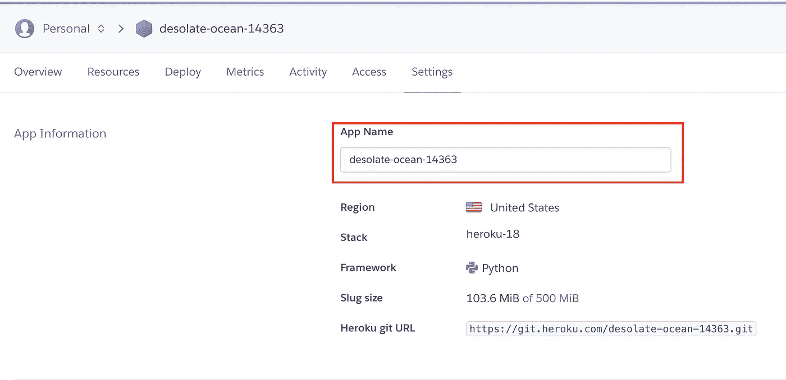

# 从细流到赫罗库

> 原文：<https://towardsdatascience.com/from-streamlit-to-heroku-62a655b7319?source=collection_archive---------16----------------------->


[马特·霍华德](https://unsplash.com/@thematthoward?utm_source=unsplash&utm_medium=referral&utm_content=creditCopyText)在 [Unsplash](https://unsplash.com/s/photos/journey?utm_source=unsplash&utm_medium=referral&utm_content=creditCopyText) 上拍照

## 如何主持你的项目的简单指南？

## *注意*这个指南是针对 Heroku 上的主机的，如果你想在 AWS 实例上主机，请查看我的朋友 Marco 的 Streamlit to AWS 指南[这里！](/creating-a-website-to-host-your-python-web-application-f06f694a87e8)

大家好，本周我将一步一步地介绍如何将您的 streamlit 项目从笔记本电脑转移到在线服务器上。对于这个例子，我将使用我的 Yelp 评论应用程序来指导您。

我们开始吧，好吗？假设我们已经在本地安装并运行了我们的 streamlit 应用程序，但是我们希望在我们的家庭环境之外安装它。在你的 Jupyter 笔记本上应该是这样的:


现在，如你所知，为了让你的 Streamlit 应用程序启动并运行，你必须把它放到一个. py 文件中，以便 Streamlit 在本地运行它，Heroku 也是如此。因此，我们将点击“文件”和“下载为..”一个 python 文件。

# 为 Heroku 做准备

Heroku 为开发者提供了一个在云上运行和操作平台的平台。它不仅提供托管服务，还为你的应用程序提供了一个易于构建的虚拟环境。因此，我们需要给 Heroku 准备一堆指令来启动和运行它。

对我来说，开始时最好的事情是把我的前端和项目的其他部分分开，因为我们要做一些翻找和创建文件的工作，我不想让这些文件混淆。首先，Heroku 需要一些文件来给它必要的指令，以使虚拟环境运行起来。下面是我的文件树的样子，列出了必要的文件:


## Procfile

现在，app.py 就是您在。py 格式。下一个文件， *Procfile* 是一个声明启动时要运行什么命令的文件。它没有特殊的扩展名，只是简单地命名为 Procfile。要创建它，只需打开 Jupyter 笔记本上的应用程序，点击右上角的“新建”按钮，然后选择“文本文件”


这将创建一个没有特殊附件的空白文档。打开它，输入以下代码:

```
web: sh setup.sh && streamlit run app.py
```

您会注意到代码的后半部分包含运行我们的应用程序的 streamlit 命令。

## requirements.txt

现在，我们将对 *requirements.txt 做同样的事情。Requirements.txt* 向 Heroku 提供了关于库的说明，这是我们运行应用程序所需要的。这实质上是定义您在设置虚拟环境时需要的东西。在我的 *requirements.txt，*我正在输入以下内容:

```
streamlit==0.49.0
numpy==1.17.3
```

通过这种方式，我让 Heroku 知道这个应用程序需要这个版本的 Streamlit 和那个版本的 Numpy。这并不是说 Heroku 手头没有它，但这允许我修正我想要的版本，而不必担心一些新的更新会破坏我的代码。

## setup.sh

*编辑:来自* [*的反馈 Samudrala Sai kiran mayee*](https://medium.com/@samudralasaikiranmayee?source=follow_footer--------------------------follow_footer-)*表示 setup.sh 全部小写以避免问题很重要。*

转到 *setup.sh* ，我们将按照创建上两个文件的相同方式创建文件，在 Jupyter Notebook 中创建一个新的 txt 文件。顺便说一下，不要忘记用适当的扩展名来重命名您的文件。与 *requirements.txt* 一样，s *etup.sh* 有助于为我们的 streamlit 应用程序的运行创建必要的环境。我们将在 s *etup.sh* 中输入以下命令:

```
mkdir -p ~/.streamlit/echo “\
[general]\n\
email = \”[your-email@domain.com](mailto:your-email@domain.com)\”\n\
“ > ~/.streamlit/credentials.tomlecho “\
[server]\n\
headless = true\n\
enableCORS=false\n\
port = $PORT\n\
“ > ~/.streamlit/config.toml
```

如果你愿意，可以把电子邮件改成你自己的。如果没有，不要担心，它仍然会运行良好。

# 与 Heroku 互动

现在我们已经安排好了所有的事情，是时候准备和 Heroku 接触了。有一个 git 方法，但是我更喜欢使用 Heroku 的 CLI(命令行界面),因为它可以减少混乱。你可以在这里安装 Heroku 的 CLI [。注意，你还需要在你的电脑上安装某种形式的 Github。Heroku 与 Github 携手合作，我还没有看到一个部署选项在某种程度上不需要 Git。我个人用 Github 桌面。](https://devcenter.heroku.com/articles/getting-started-with-python#set-up)

## 登录 Heroku

Heroku 的 CLI 允许您从家庭终端直接与 Heroku 交互。打开终端，用 CD 找到你的应用程序的根目录。在那里，输入以下命令:

```
$ heroku login
```

这将触发一个新的网络浏览器，您可以在其中输入 Heroku 的登录信息。输入您的登录信息并点击登录，当网站通知您已登录时，您就可以关闭浏览器了。

## 创建一个 Heroku 实例

接下来，我们通过键入以下命令指示 Heroku 创建一个 Heroku 实例:

```
$ heroku create
```

Heroku 会自动运行并给你的应用分配一个随机的名字，我们稍后会更改它的名字。

## 将你的文件载入 Heroku

接下来，我们将把所有文件传送到 heroku 实例中。因为 heroku 使用 Git，所以这个过程应该很熟悉:

```
$ git push heroku master
```

现在请记住，我们仍然应该在你的应用程序的前端根目录，所以它会把所有的东西都转移到 Heroku。记住这一点很重要，因为稍后我们将讨论在您做出更改时更新 Heroku 上的应用程序。

## 运行您的应用

最后，我们将启动并运行我们的应用程序。输入以下内容:

```
$ heroku ps:scale web=1
$ heroku open
```

第一个命令告诉 Heroku 启动一个 dyno (Heroku 对虚拟机实例的术语)。PS 是 Heroku 影响 dynos 的许多命令的前缀。 *Scale web=1* 告诉 Heroku 加速 1 dyno，根据你的服务器流量，你可以告诉它加速更多。这整个命令基本上启动了你的应用程序。

最后一个命令将弹出你选择的浏览器，并把你带到应用程序。您会注意到网址是自动生成的实例名加上 heroku。


## 更改应用程序的名称

要改变这一点，我们必须去我们的 heroku 仪表板。在你的浏览器中，进入 Heroku.com。前往您的仪表盘，点击您的应用程序。


你现在应该在你的应用程序的“概述”页面。点击设置。



“设置”是一个非常明显的工作页面，您应该可以在这里看到更改应用程序名称的选项:



# 更新您的 Git 远程路径

请记住，更改名称将要求您在进行任何更新之前更新 git remotes。这里的[给出了这样做的指示](https://devcenter.heroku.com/articles/renaming-apps#updating-git-remotes)。

最后，在我们结束之前，如果您已经在本地更新了您的应用程序，并且想要更新您的应用程序，您需要做的就是单击“部署”


向下滚动 deploy 页面，您会看到一些有用的 git 命令，帮助您根据需要克隆或更新 heroku 实例。


这就对了。您的应用程序应该已经启动并运行，希望用户已经准备好了！我希望这个指南对你有所帮助。还有许多其他有用的 streamlit 到 Heroku 指南，但更多的例子总是更好。祝你好运，并享受构建应用的乐趣！