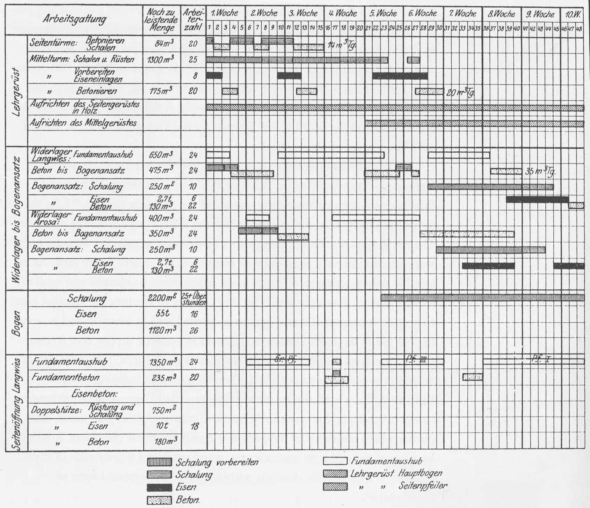
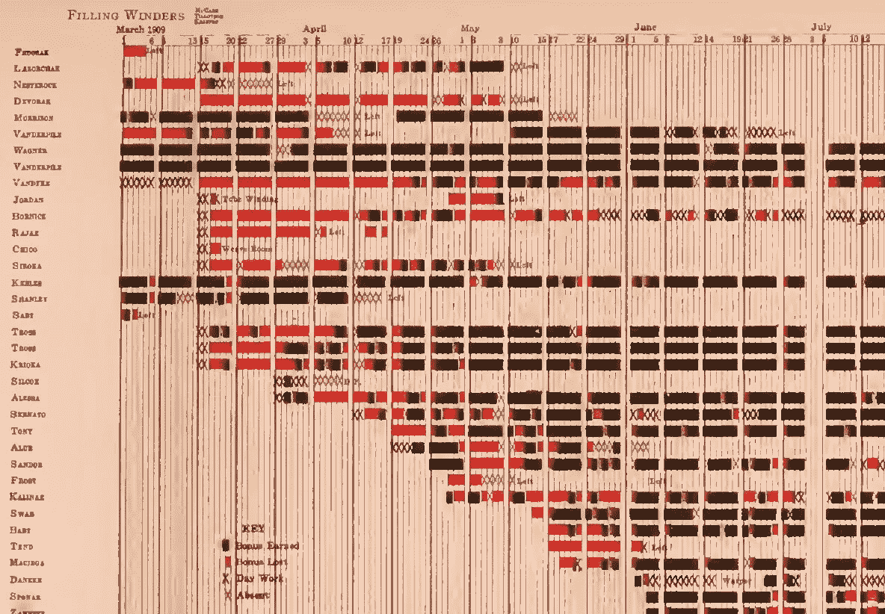
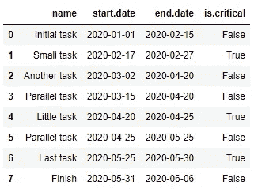
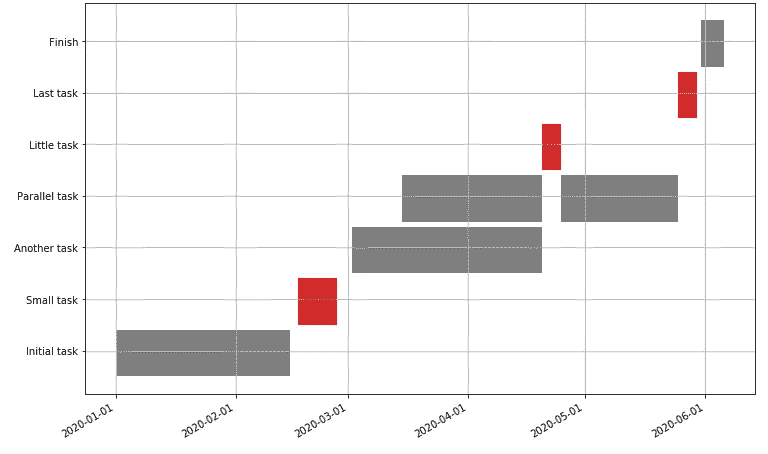
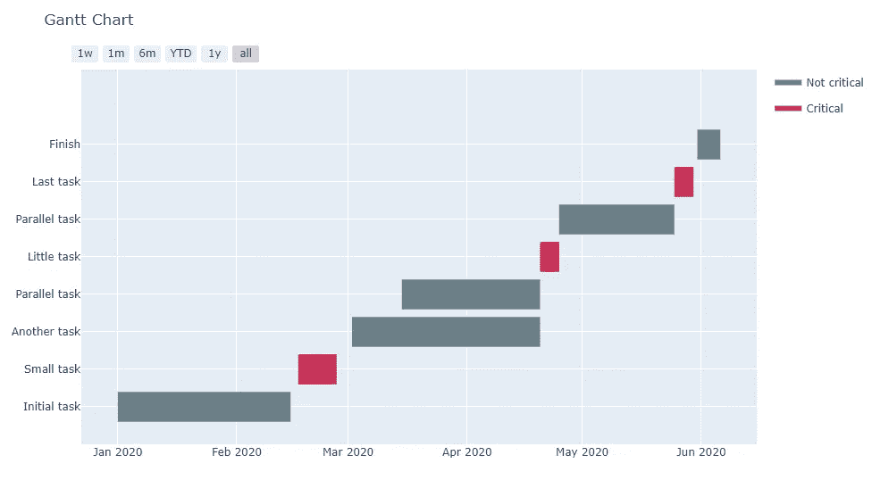
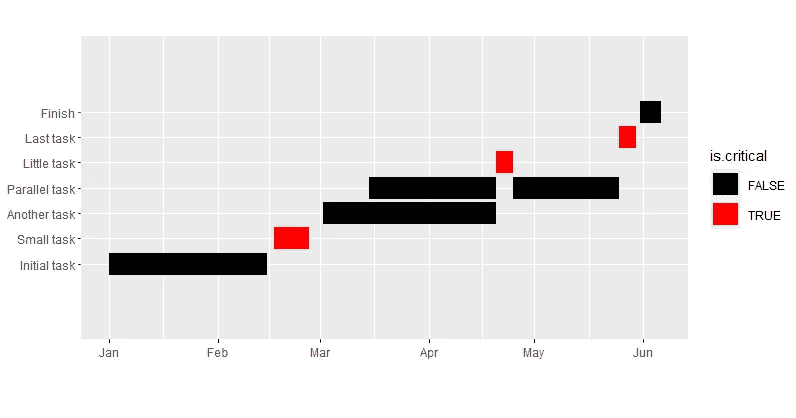
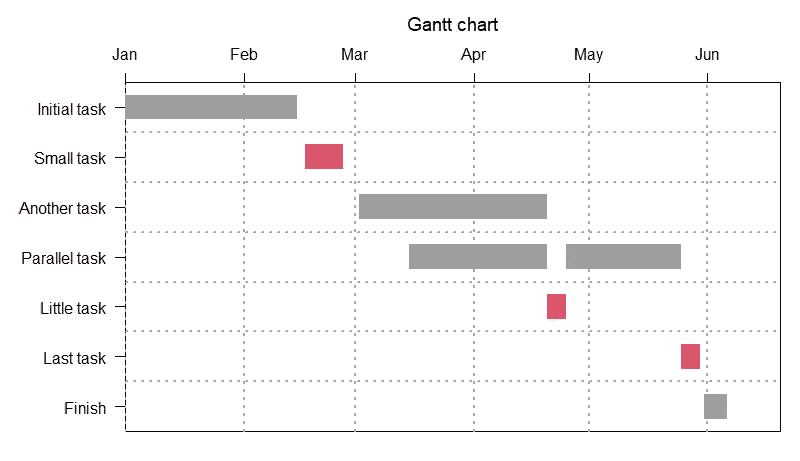
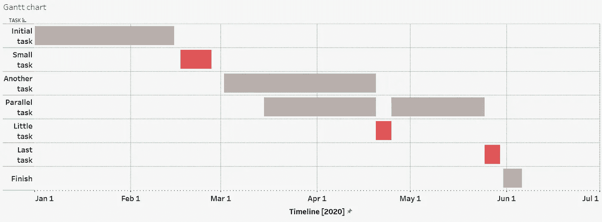

# 从桥梁到任务规划:用 Python、R 和 Tableau 构建 Gannt 图表

> 原文：<https://towardsdatascience.com/from-the-bridge-to-tasks-planning-build-gannt-chart-in-python-r-and-tableau-7256fb7615f8?source=collection_archive---------18----------------------->

## 史诗图表

## 使用基本的 DataViz 工具创建项目进度可视化

前一段时间我有一个想法，有很多关于条形图，直方图，散点图，折线图和其他有效但非常简单和普通的数据可视化工具的信息。我甚至可以假设，对于每个数据科学家或 DataViz 专家来说，如何构建这些通用图表的知识必须被视为基本和必须的。但是有各种各样的情节和想象。它们不太常见，更具体，但肯定应该在你的清单中。更重要的是，你还必须熟悉一些现代工具来制作这样的图表。这就是我如何想出“史诗图表”系列的想法，你现在看到的是它的第一期。

桥梁施工(1912)甘特图示例，Schürch，1916。参考自[《亨利·甘特工作回顾》(2012)](https://www.mosaicprojects.com.au/PDF_Papers/P158_Henry_L_Gantt.pdf)

我的“史诗图表”系列的第一期是献给[甘特图](https://en.wikipedia.org/wiki/Gantt_chart#CITEREFWeaver2012a)。这是进度可视化的一个例子。它的经典实现显示了项目中任务的周期:水平线包含任务(或阶段),垂直线包含日期或时间范围，甚至简单的周期计数。因此，每个任务都显示为一个固定长度的条形图，占据了一些时间线(或几个时间线)。现代版本还可以包括关于紧急程度、阶段之间的关系以及阶段之间的转换的附加数据。

## 1.很少的历史评论

这张图表最早由凯罗尔·阿达米耶茨基于 1896 年创建，[亨利·甘特](https://en.wikipedia.org/wiki/Henry_Gantt)在他的作品《工作工资和利润》中对其进行了详细描述，其中也包含了他早期的出版物。甘特图及其可视化的首次应用出现在 1912 年 Hermann Schürch 的出版物中。实际上，这是封面上的一张图表。Gannt 开发了几种进度图的变体(例如，见下面的一个)，但是 Schürch 给出了我们一直使用到今天的形式。

“奖金图表”信息来自甘特的“工作工资和利润”(1916)。参考自[《亨利·甘特工作回顾》(2012)](https://www.mosaicprojects.com.au/PDF_Papers/P158_Henry_L_Gantt.pdf)

你可以在当时的资料中找到更多信息——[“甘特图，一种管理的工作工具”](https://archive.org/details/cu31924004570853/page/n5/mode/2up) (1922)，以及在现代研究中——[“亨利·l·甘特，1861–1919。回顾他的作品《T8》(2012)。史实到此为止，我们去实施吧。](https://www.mosaicprojects.com.au/PDF_Papers/P158_Henry_L_Gantt.pdf)

## 2.Python 中的甘特图

我们将使用我创建的测试示例。它是简单的项目模拟，包括几个阶段、一些同时进行的任务和一些可重复的任务。

我们将从众所周知的`matplotlib`库开始。因为这是每个数据科学家都知道的基本知识，所以不需要介绍。所以，一点日期操作和情节是准备好的:

在另一个例子中，我们将使用`Plotly`库——另一个著名的包。它有一个强大的交互式可视化引擎和许多内置的图表类型。包括甘特一号！

## 3.R 中的甘特图

R community 开发了许多绘图库，包括一些交互式图表。当然，它们在可视化风格、交互性和绘图参数的语法方面有所不同，但是图表原理是相同的。因为没有选择哪个库的问题，我将创建两个例子。

首先，我将用最著名的图书馆纯`ggplot2`制作一个甘特图。我们将使用相同的数据，做一些准备，这就是:

第二个例子使用`[plotrix](https://cran.r-project.org/web/packages/plotrix/plotrix.pdf)` [包](https://cran.r-project.org/web/packages/plotrix/plotrix.pdf)——独立绘图库之一。因为它集合了很多功能，所以代码更短，结果“更漂亮”。

当然，你可以自由选择其他的图书馆。

## 4.表格中的甘特图

我已经用 Python 比较了 Tableau 和自定义绘图。我发现 Tableau 是一个非常好的工具，可以让你看到美丽的画面。它的库存很大，可以生成几乎任何类型的图表。包括甘特图！

算法非常简单:

*   加载数据；
*   使用图表的默认线条类型；
*   使用公式创建计算字段持续时间:
    `DATEDIFF(‘day’,[Start.Date],[End.Date])`
*   拖放开始。日字段添加到列中；
*   将名称字段拖放到行中；
*   更改任务名称的排序选项:按“字段”排序，升序，使用`[Start.Date]`变量，按最小值聚合；
*   将以前创建的持续时间字段拖到“大小”选项中；
*   拖放是。颜色选项的关键字段；
*   做一些美化。

瞧，图表准备好了:

今天到此为止。敬请关注下一期的“史诗排行榜”。而且，和我的文章一样，您可能会在我的 GitHub 上找到工作示例:

 [## 中级/中等 _jupyter_notes

### 此时您不能执行该操作。您已使用另一个标签页或窗口登录。您已在另一个选项卡中注销，或者…

github.com](https://github.com/Midvel/medium_jupyter_notes/tree/master/epic_gantt_chart) 

另外，请不要错过我的关于用 Python 再现 Tableau 可视化的文章:

 [## Python dataviz 库可以重复 Tableau 工作表吗？

### 我对 Tableau 用法及其与 Python 代码的比较的第一印象

towardsdatascience.com](/can-python-dataviz-libraries-repeat-the-tableau-worksheet-e38ef2876f04)