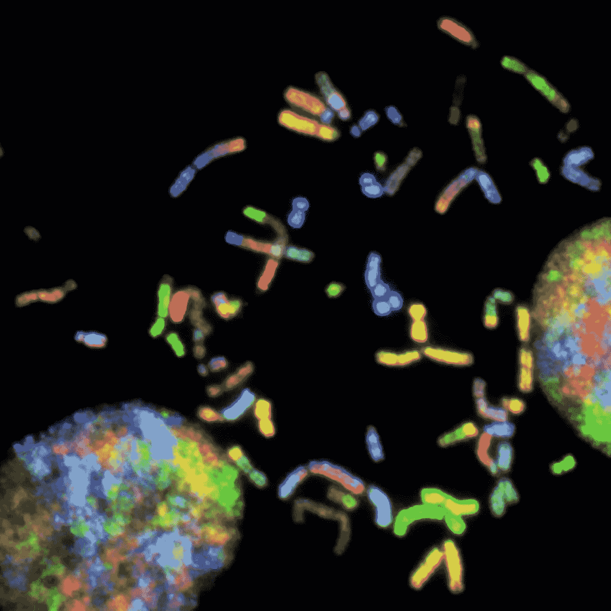
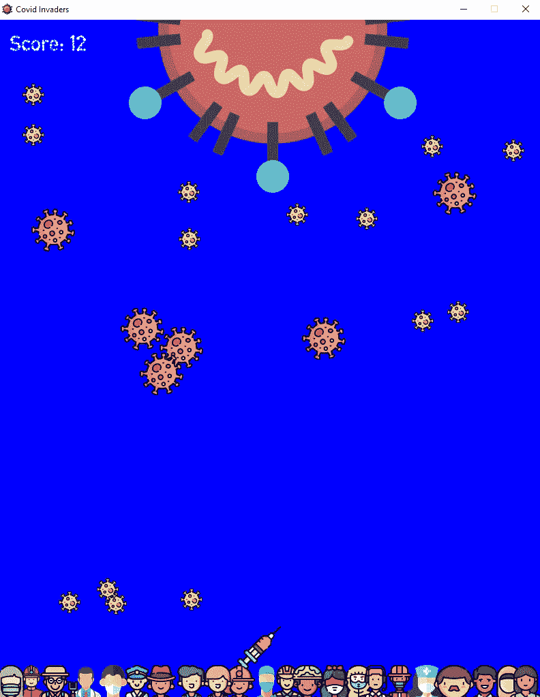

# 从生物学家的角度来看

> 原文：<https://towardsdatascience.com/from-the-perspective-of-a-biologist-85e68cac84a0?source=collection_archive---------55----------------------->

## 生物学家如何在数据革命中导航

这是我的第一篇媒体文章。首先，我想简单介绍一下我自己。我目前在加拿大阿尔伯塔大学学习分子、细胞和发育生物学，重点是生物信息学。我以前对计算机科学毫无背景。事实上，我现在正在大学二年级上我的第一堂计算机科学课。

[国家癌症研究所](https://unsplash.com/@nci?utm_source=unsplash&utm_medium=referral&utm_content=creditCopyText)在 [Unsplash](https://unsplash.com/s/photos/chromosome?utm_source=unsplash&utm_medium=referral&utm_content=creditCopyText) 上拍摄的照片

像大多数生物学家一样，我也缺乏计算机科学技能，也不擅长数学。我第一年上过微积分课，绩点 1.3。是的……但是这并不能准确的描述我的数学能力。那是大学第一年。我讨厌教授把大部分话题搞得过于复杂(我在高中接触微积分的前一年就自学了这些概念，并被它的优雅所折服)，嗯，我只是太鲁莽了。退一步说，这只是你大学第一学期的常规课程，你要尝试很多新的经验，微积分真的不是你的首要任务。我想这是合理的，因为你大学的第一学期是为有点鲁莽而准备的，因为你以后不能再这样了，或者至少我是这么认为的。

无论如何，我第一次探索编程是在疫情飓风来袭，我无处可去的时候。近一年来，我一直在窥视编程和生物信息学的整个领域，但从未真正有足够的动力去认真对待它。每次我尝试的时候，即使是设置 Python 和 IDE 的过程对我来说也是极其可怕的，不可避免地，我会立刻放弃。现在疫情将我关在里面，周围没有朋友或家人(那是大学的第一个暑假，我是一名国际学生，因为 Covid，我所有的朋友都回了家)，没有其他事情可做，我有足够的时间来玩这个我想了很久的新东西。所以我就一头扎进去了。

我打开 YouTube，搜索“python 教程”。Python 只是我想到的第一种语言。我很幸运找到了完美的[教程](https://youtu.be/8DvywoWv6fI)。这个教程真正让我印象深刻的是，老师是如何让概念变得真正相关和简化，而不是过于简单。

并不是我只跟着这个教程就精通 Python 了。事实上，直到今天，我只看了视频的前 60%左右。但这足以让我在 Python 的上下文中了解编程语言的基本思想。过了一段时间，我还看了一些基本的 Java 教程，其中一个特别适合我，这进一步使我理解了计算机语言，尤其是面向对象编程语言是如何根据它们的语法和结构创建的。

除了阅读本教程，我还寻找了有效学习编程语言的方法。作为一名程序员和一名独立学习者，其中一些技巧对我的发展非常重要。为了熟悉一个概念，我会看无数的其他视频。

每次我遇到一个新的概念，我都会在 YouTube 上看一些关于它的视频，这在开始时很有效。我会从各种不同的 YouTubers 上观看相同概念的视频，只是为了从不同的角度理解它们。这给了我很大的帮助，因为如果一个老师不能足够清楚地解释这个主题，或者以一种适合我的方式解释，我会准备另一个。这都是关于尝试和错误，看看谁最适合我的学习风格。

后来，当我学到更复杂的概念时，我不得不用笔记本记下我理解的内容。并不是说我以后会看这些笔记。在学习新东西后，从我的脑海中提取概念，用我自己的话写下来的行为足以将它们嵌入我的记忆中，至少在几周内。当然，随着时间的推移，这变得越来越容易。

我进行的另一个重要实践是在整个学习过程中混合使用自上而下和自下而上的方法。事实上，直到今天我还在学习。自下而上的方法是首先学习基础知识，然后学习稍微复杂一点的概念，最后应用这些概念。自顶向下是当你选择一个特定的应用或用例，然后尝试学习理解这个特定的概念或用例所需要的一切。我决定长期采用自下而上的方法，短期采用自上而下的方法。我来详细说明一下。我从相对简单的概念开始，如循环、数据类型、变量等。，然后慢慢上升到更复杂的概念。这个挺标准的。但是我所做的与众不同的是，我使用了特定的用例来试图理解它所需要的一切。

随着时间的推移，我对用例的选择变得越来越复杂，因为我遵循了长期的自底向上的策略。例如，我最初在生物学的背景下测试并应用了我从第一个教程中学到的东西，这个教程是在罗莎琳德网站上找到的。这是我最初感兴趣的地方；使用现代计算工具回答生物学问题。由于这些问题对我有限的知识来说太复杂了，我继续前进，决定创建一个以新冠肺炎为主题的太空入侵者游戏。我使用 Pygame 遵循了一个普通的太空入侵者[教程](https://youtu.be/FfWpgLFMI7w)，但是加入了我自己的修改，把它变成了一个新冠肺炎主题游戏。这很有趣，有共鸣，最重要的是，鉴于我当时的技能水平，我对这一点相当满意，可以应用我最初学到的基础知识，但当我完成它时，也有足够的机会教我新概念。在选择用例或项目时，取得这种平衡可能是独立学习最重要的部分。

作者创建的图像。目的是在病毒到达底部的关键工人之前，使用注射液滴(挤压空间)杀死病毒。 [GitHub](https://github.com/sahasukanta/covidInvaders-repo)

快进到今天，我现在精通许多 Python 数据科学库，自学机器学习，使用来自 Kaggle 的数据集，如新冠肺炎研究数据集或 FIFA 19 数据集，类似地结合了自下而上和自上而下的方法。我绝不是数据科学甚至编程方面的专家。我和你一样，是一名数据科学爱好者，试图利用互联网上的大量开源信息自学这个迷人的领域，坦率地说，这些信息有时会让人不知所措。但是到目前为止，我觉得我做得挺好的，如果我能做到，你也能。把我当成你的学习伙伴，而不是专家。我喜欢写和谈论我感兴趣的事情，这次媒介之旅对我来说只是一个创造性的出口，在那里我结合了我对生物学、数据科学和编程的热情。请关注我的更多文章，学习*如何*自学这些知识。

数据革命将在不久的将来改变许多基本的生活方式，我对它了解得越多，就越喜欢它。如果你想让我谈论它的任何特定方面，请在评论中告诉我。我喜欢开门见山，这可能是我所有文章的一贯特点。快乐学习！

> 附言:要获得更多关于数据科学、编程以及生物学家如何在数据革命中导航的简明扼要的文章，可以考虑关注我的[博客](https://sukanta-saha.medium.com/)。
> 
> 由于每分钟都有成千上万的视频被上传，所以过滤掉它们是很重要的，这样你就可以只使用高质量的数据。我亲自挑选的，我会把你感兴趣的主题的教育视频发邮件给你。报名[这里](https://docs.google.com/forms/d/e/1FAIpQLScO4RtaXjJjYDdnEFyI3l73tcj59OGdY_cRnPGV-wsAEMhVwg/viewform)。
> 
> 感谢您的阅读！