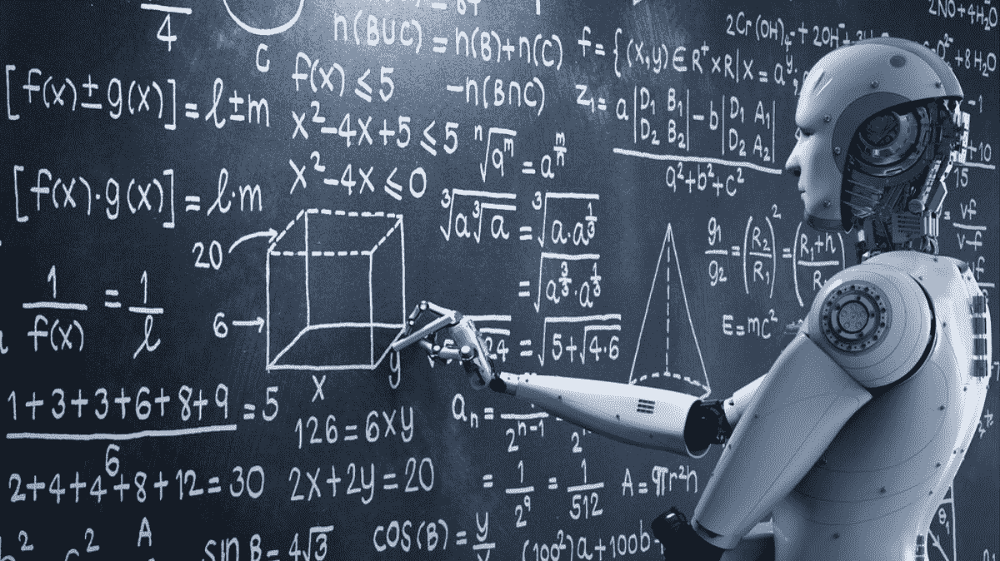

# 从理论物理学家到数据科学家

> 原文：<https://towardsdatascience.com/from-theoretical-physicist-to-data-scientist-d8b781462c9?source=collection_archive---------14----------------------->

## 我如何成为一名拥有理论物理博士学位的数据科学家

有很多人解释他们如何成为数据科学家的故事，但我发现当我进行转换时，很难找到一个符合我个人资料的故事。这就是为什么我想分享我的旅程，以防它可以激励其他人经历同样的事情。一年多前(2018 年秋季)，我决定从事数据科学职业，现在我是加拿大 Décathlon 的一名数据科学家，所以我实现了我的目标。我将描述我的旅程作为一个例子，但这并不意味着作为建议。我不是找工作的专家。

## 我的背景

我没有从事数据科学的人的典型背景，我指的是计算机科学或某种工程学位。我在蒙特利尔大学完成了数学和物理的本科学习，然后去了麦吉尔大学完成了理论物理的硕士和博士学位。在这些学位期间，我主要学习了高等数学以及如何利用它们解决问题。我主要做理论工作，但也做一点科学编程。我还积极参与组织每周的讲座和阅读课程，去小学和孩子们一起做科学活动，并志愿参加会议和活动。

在我博士学位快结束的时候，我开始考虑用我的学位能找到什么样的工作。我得告诉你，直接涉及理论物理的工作非常难找。他们中的大多数都在大学，他们需要至少一名博士后，所以我把他们排除了。我想过找一份教书的工作(在塞 GEP，给知道那是什么的人)，但我想找一份更有挑战性的工作。引起我注意的一个话题是人工智能。

## 学习人工智能

当然，人工智能现在是一个大趋势，作为一个住在蒙特利尔的学生，我听到了更多关于它的事情。我花了很多时间在网上试图了解在数据科学领域找到工作的要求，发现每个人都建议在 Coursera 上学习吴恩达的[机器学习](https://www.coursera.org/learn/machine-learning)课程。我听从了这个建议，发现这个课程非常棒，我从中学到了很多东西。然而，在完成它之后，我觉得我对人工智能的理论方面有了很好的理解，特别是从我的角度来看，它是基于简单的数学，但我不知道如何实现它。这就是为什么我在 Udemy 上参加了数据科学和机器学习训练营的 [Python。我学习了 python、numpy、pandas 和 scikit-learn，以便实际进行机器学习。](https://www.udemy.com/course/python-for-data-science-and-machine-learning-bootcamp/)

我经常在网上读到的下一个建议是，专注于通过个人项目学习，并在 Github 和你的简历中展示它们。这是我在参加网络课程后的几个月里所做的事情。你可以在这里看到我的第一个项目[。在做这些事情的时候，我总是在网上看招聘信息，看看有什么工作机会，他们需要什么技能，我认为最重要的是深度学习。这让我参加了 Coursera 上的](https://github.com/yangobeil/Pokemon-legendaries)[深度学习专业](https://www.coursera.org/specializations/deep-learning?utm_source=gg&utm_medium=sem&utm_content=17-DeepLearning-ROW&campaignid=6465471773&adgroupid=77415260637&device=c&keyword=coursera%20deep%20learning%20ai&matchtype=b&network=g&devicemodel=&adpostion=1t1&creativeid=379493352691&hide_mobile_promo&gclid=Cj0KCQiAjfvwBRCkARIsAIqSWlOMxay5aQ0LhQZ5rjKZbPVkp5K7fKBfi35l7jQlrJJUG_yj_UvwEYAaAlzsEALw_wcB)，我发现这非常有趣，并给了我新的个人项目的多个想法。

## 第一轮求职申请

当然，我要说明的是，这些都是我还在读博的时候兼职做的。上面提到的步骤花了我大约 6 个月的时间来完成我作为博士生的常规任务。我实际上有一点点额外的空闲时间，因为研究人员的任务之一是保持最新的新研究成果，为未来的项目做准备，但我快要毕业了，所以我不必这样做。我还有额外一年的奖学金，所以我不用急着找工作，所以我慢慢来。

大约在我完成深度学习专业化的时候，我开始申请提到我所拥有的技能的工作和实习。没有多少，但我仍然设法得到了实习和几份工作的面试机会。这些职位是为像我这样有良好科学背景和一些人工智能经验的人准备的。即使我很兴奋，我认为这有点为时过早，我是对的，因为我没有得到位置。

## 打磨我的技能

然后，我决定在开始认真申请工作之前，把重点放在增加技能和经验上。2019 年夏天，我的情况很好，我仍然有资金，但我的论文几乎完成了。然后我就可以集中精力找工作，并在工作完成后提交论文。我也考虑过在获得博士学位后留在麦吉尔大学进行 [Mitacs](https://www.mitacs.ca/en/programs/accelerate) 实习的选择，这是一个由一位教授和一家公司共同完成的研究项目。

我没有提到的一个细节是，我和人们交谈。我发现我周围和 linkedIn 上的人已经做了我想做的事情，我向他们征求建议。我通过电子邮件与他们中的一些人交谈，并与一些人一起喝咖啡，我收到了非常好的建议。

因为我有更多的时间学习新的东西，所以我看书(尤其是这本)和看很多 Youtube 视频(sentdex 的[频道](https://www.youtube.com/sentdex)非常鼓舞人心)。我开发了像这个[语言标识符](https://github.com/yangobeil/language-identifier)这样更复杂的项目，并写了关于我的项目的博文(见我的[简介](https://medium.com/@yan.gobeil))。我终于花了一些时间学习数据科学工作所需的更实际的技能，如 SQL、git、linux 和 flask。

毕竟，我对只申请我感兴趣的工作很有信心。我仍然对研究和商业工作感兴趣，所以我两个都找了。我每天都在寻找新的职位，并附上个性化的求职信。一些人回来找我，我设法得到了加拿大 Décathlon 的面试机会，我现在在那里从事计算机视觉和数据驱动项目的混合工作。我在开始工作前完成了论文，在开始论文答辩几个月后，我请了一周的假。

对感兴趣的人来说，这是我用来获得目前工作的简历: