# 从变形金刚到表演者:近似注意力

> 原文：<https://towardsdatascience.com/from-transformers-to-performers-approximating-attention-69c88af0b11f?source=collection_archive---------9----------------------->

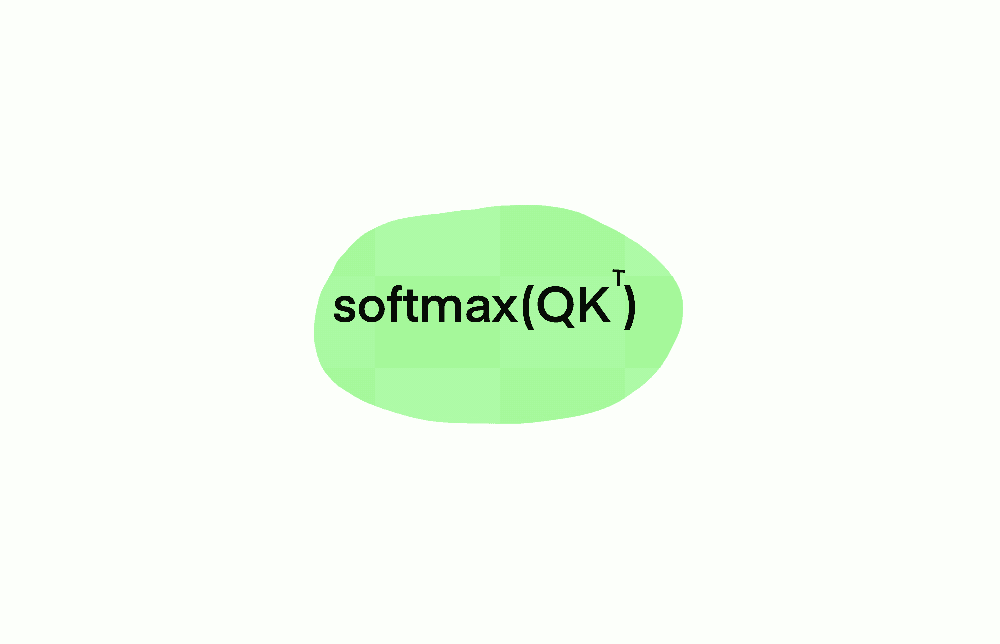

作者图片

## 加速变压器的数学技巧

几周前，来自谷歌、剑桥大学、DeepMind 和艾伦图灵研究所的研究人员发布了论文[反思表演者的注意力](https://arxiv.org/abs/2009.14794)，该论文旨在寻找解决变形金刚中 softmax 瓶颈问题的解决方案[1]。他们的方法利用了一个聪明的数学技巧，我将在本文中解释。

**先决条件:**

*   变压器的一些知识
*   核函数

**涵盖话题:**

*   为什么是变形金刚？
*   变压器的问题是
*   绕过 softmax 瓶颈

# 为什么是变形金刚？

从本质上讲，Transformer 是一个设计用来高效处理顺序数据的模型，实际上它在自然语言处理(NLP)任务中被大量使用，这些任务需要处理单词/字母序列。与其他顺序模型不同，transformer 利用[注意力机制](https://jalammar.github.io/visualizing-neural-machine-translation-mechanics-of-seq2seq-models-with-attention/)来并行处理顺序数据(即:不需要一次处理一个单词/输入)[2]。

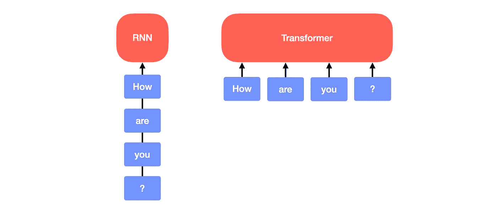

作者图片

如果你不熟悉变形金刚，我推荐你阅读[注意力是你所需要的全部](https://arxiv.org/abs/1706.03762)——2017 年介绍它们的论文，非常容易理解——或者[图解变形金刚](http://jalammar.github.io/illustrated-transformer/)以获得对初学者更友好的介绍。[3][4]

# 变压器的问题是

变形金刚基于注意力，计算如下:

其中 **Q，K，V** (维度 *L* x *d* )是查询、键和值矩阵， *L* 是序列的长度， *d* 是查询、键和值向量的(任意)维度。

注意:如果你不知道这是从哪里来的，我强烈推荐阅读前面提到的文章([注意力是你所需要的全部](https://arxiv.org/abs/1706.03762))，尽管对于本文的目的来说，并不严格需要知道什么是查询、键和值，以及为什么注意力是这样计算的(或者它是什么)。

transformer 的问题来自 softmax 函数，让我们看看为什么。

# 注意的时间复杂性

提醒一下，两个维数为 *n* x *m* 和 *m* x *p* 的矩阵相乘的时间复杂度为 O( *nmp* )。

如果我们看一下注意力的等式，我们会看到我们在乘以三个矩阵: **Q** (维度为 *L* x *d* )、**k**^t(*d*x*l*，以及**v**(*l*x*d*)。我们会得到不同的复杂度，取决于我们相乘的顺序。
暂且忽略 softmax 和分母 sqrt(d)(它只是一个标量)，我们可以看到，通过乘以 **Q K** ^T 我们首先获得复杂度 O( *L d* )，而如果我们乘以 **K** ^T **V** 我们首先获得复杂度
O( *d L* )。

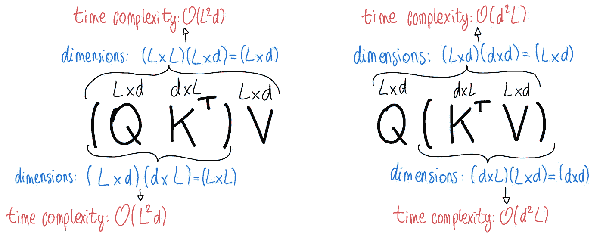

作者图片

我们更喜欢 O( *d L* )，因为 *d* 是我们可以选择的参数，通常我们可以有 *d < L* 。然而，我们实际上不能按照这个顺序执行乘法，因为 **Q K** ^T 被“卡”在了 softmax 里面，没有简单的方法把它取出来。这意味着我们不得不处理 O( *L d* )的时间复杂度，这是序列长度的二次方(因此处理更长的序列在计算上变得越来越昂贵)。
所以，softmax 是变形金刚的瓶颈，我们想找到一种方法来解决这个问题。

作者图片

# 绕过 softmax 瓶颈

从高层次来看，本文提出的方法非常简单。我们能否找到一种方法来近似 softmax，以允许我们选择矩阵的计算顺序？

本质上，我们能找到一些矩阵**Q’**和**K’**使得

目标很容易理解，但是如何实现的细节有点复杂。

首先，让我们回忆一下，softmax 是一个函数，它给定一个长度为 n 的向量 **z** ，将所有元素归一化为:

鉴于此，请注意，我们可以将注意力等式中的 softmax 改写为:

其中 **A** 中的指数是按元素应用的， **1** _L 是长度为 L 的全 1 向量， **D** 是具有元素 **A1** _L 的对角矩阵。 **D** 给出了 softmax 的分母(实际上， **A1** _L 只是通过对*的列求和而获得的长度为 *L* 的向量)*

**A** ，它的元素指数，是这里真正的问题，所以我们的目标是以某种方式分解它。我们可以忽略标量分母 sqrt(d ),因为这只是用于规范化，但我们可以等效地规范化查询和键。这意味着我们的目标是找到一些**Q’**和**K’**使得:

# 通过高斯核寻找 Softmax 核

这就是内核发挥作用的地方。我们知道核是等价于某个特征映射φ的点积的函数:

通常，给定某个高维特征图φ，我们感兴趣的是找到一个等价函数 K，它将允许我们避免在φ的高维空间中进行计算。然而，在我们的例子中，我们实际上要走相反的路:如果我们假设 **A** 是一个包含元素 **A** ( *i，j*)=**k**(**q**_ I，**k**_ j)= exp(**q _ I k**_j^t)(其中 **q_i** 和**k**

****

**现在，大多数核可以用以下形式的特征图来近似**

**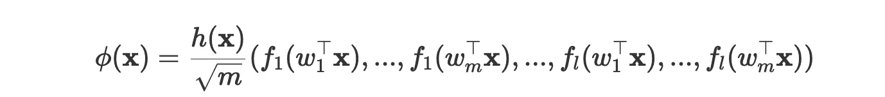**

**其中 *h* 和 *f₁,…,f_l* 是一些确定性函数， *w₁,…,w_m* 是从分布 *D* 中抽取的随机值(所以φ( **x** 是一个具有 *l* x *m* 元素的向量)。[【5】](https://arxiv.org/pdf/2004.11154.pdf)**

**一篇[以前的论文](https://people.eecs.berkeley.edu/~brecht/papers/07.rah.rec.nips.pdf)已经证明我们可以通过使用配置获得高斯核:**

****

**也就是说，如果我们从均值为 0 且单位方差的正态分布中画出 *w* ，我们可以通过使用特征图获得高斯核:**

**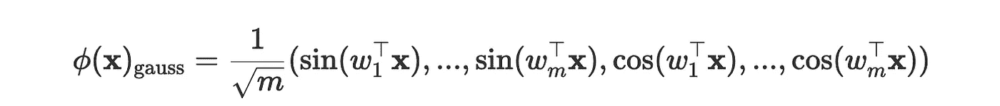**

**注意，具有单位方差的高斯核由下式给出:**

****

**现在请记住，我们希望找到一个 softmax 内核:**

****

**我们可以看到 Softmax 核的结构与高斯核相差不远。事实证明，我们可以利用这种相似性找到 softmax 内核。事实上，请注意**

**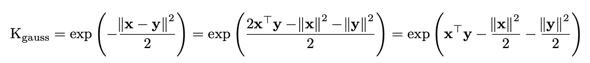**

**这意味着我们实际上可以将 softmax 内核重写为**

**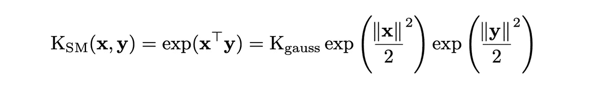**

**并且我们可以通过将 *h* 函数从 *h* ( **x** ) = 1 改为:**

****

**这是一个不错的近似值，但它有一些问题。softmax 函数总是输出正值，所以 **A** 的所有元素都应该是正的。然而，使用这个内核来近似 softmax 可能会给出一些负值。事实上，由于我们是从均值为 0 的正态分布中抽取 *w* ，这些值中的一些将是负的，这反过来意味着 **A** 的一些值将是负的。这会导致问题和异常行为。**

# **寻找更稳定的 Softmax 内核**

**研究人员发现，softmax 内核也可以重写为:**

**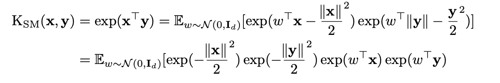**

**(这实际上是 softmax 内核的证明可以在论文的附录中找到。)**

**因此，我们可以简单地从前面的功能图形式，并设置**

****

**通过这样做，我们可以看到所有的值都是正的，因为我们使用了 exp，因此解决了我们之前的问题。**

**作者还建议了另一个导致相同内核的特性图，如果你感兴趣，我推荐你阅读这篇论文。**

# **使用 softmax 内核查找 Q '和 V '**

**让我们回顾一下。我们从注意力等式开始**

****

**发现我们可以把它改写成**

**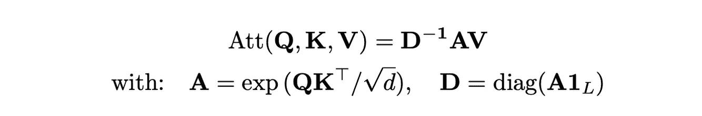**

**然后我们找到了 softmax 内核的特性图，我们可以用它来近似矩阵 **A** :**

**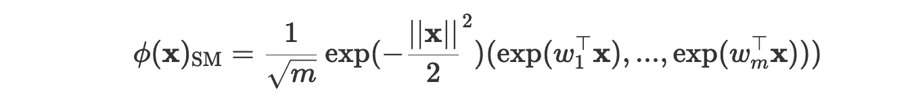**

**所以我们现在可以使用特征映射替换 **A** 中的元素:**

****

**注意，我们是从长度为 *L* 的向量 **q_k** 移动到长度为 *m* 的向量φ( **q** _i)和φ( **k** _j)。**

**我们现在可以分解 **Q'** 和 **K'** 中的 **A** ，其中 **Q'** 和 **K'** 的元素为φ( **q** _i)和φ( **k** _j)。最后，我们可以自由地改变矩阵乘法的顺序，并将时间复杂度从 O( *L d* )降低到 O( *Lmd* )，从而获得序列长度的线性复杂度，而不是二次复杂度。**

**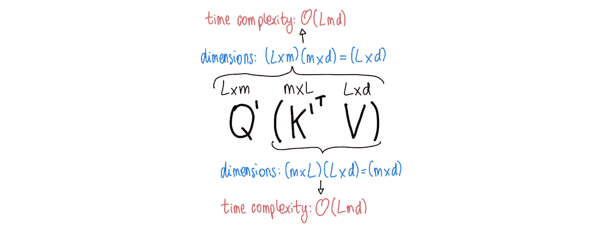**

**作者图片**

**我们完了。**

# **结论和一些结束语**

**本质上，在本文中，作者设法找到了一种使用特征图的点积来近似 softmax 函数的方法。由于这一点，在变压器中计算注意力的时间复杂度可以从序列长度的平方减少到线性。在处理长序列时，这将显著提高转换器的速度。**

**需要注意一些有趣的事情:**

*   **虽然这种方法是在考虑变形器的情况下开发的，但它实际上可以应用于任何需要 softmax 的模型。看看这在哪里会变得有用将会很有趣。**
*   **作者指出，这种方法不仅速度更快，而且内存效率更高。这可以通过查看需要存储的矩阵的维数来看出。**

# **参考**

**[1] [Choromanski 等人《与表演者重新思考注意力》，2020 年 9 月 30 日](https://arxiv.org/abs/2009.14794)
【2】[Jay alam mar。《可视化一个神经机器翻译模型(带注意力的 Seq2seq 模型的力学)》，2018 年 5 月 9 日](https://jalammar.github.io/visualizing-neural-machine-translation-mechanics-of-seq2seq-models-with-attention/)
【3】[瓦斯瓦尼等人《注意力就是你所需要的一切》，2017 年 12 月 6 日](https://arxiv.org/abs/1706.03762)
【4】[杰伊·阿拉姆马。《图解变压器》，2018 年 6 月 27 日](http://jalammar.github.io/illustrated-transformer/)
【5】[刘等，“核逼近的随机特征:算法、理论及超越的综述”，2020 年 7 月 4 日](https://arxiv.org/pdf/2004.11154.pdf)**

***觉得这个故事有帮助？考虑* [*订阅*](https://chiaracampagnola.medium.com/membership) *到媒体扶持写手！***