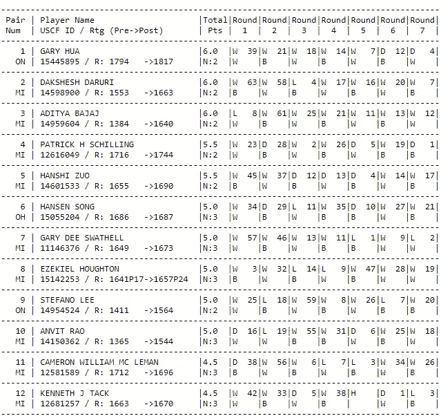
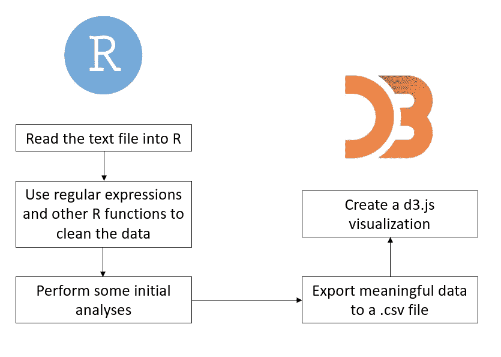
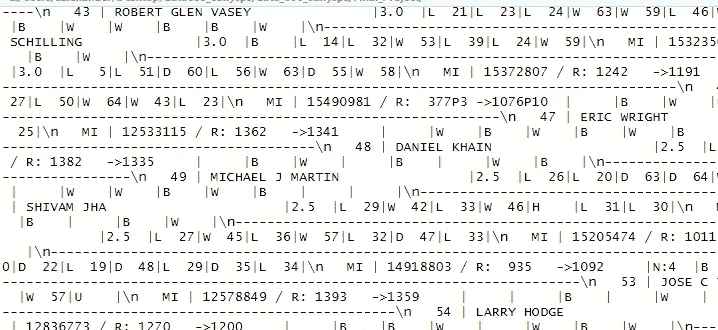
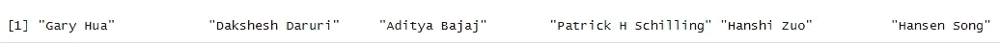
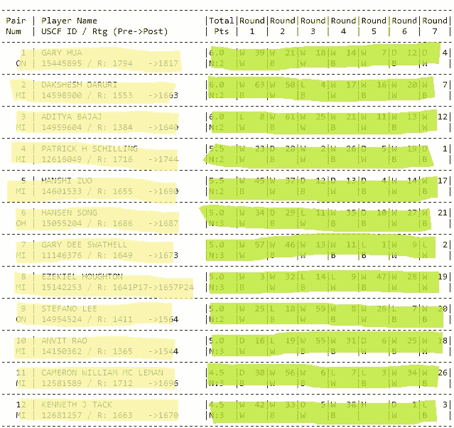
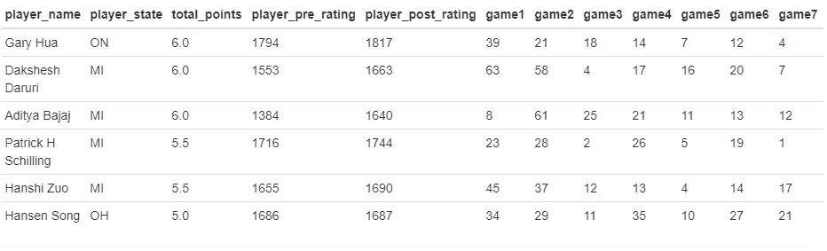
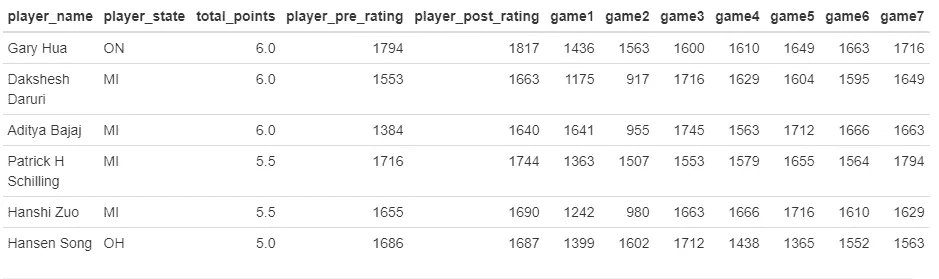
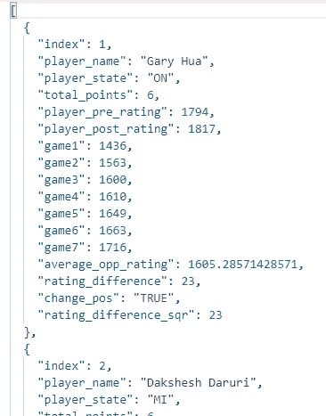
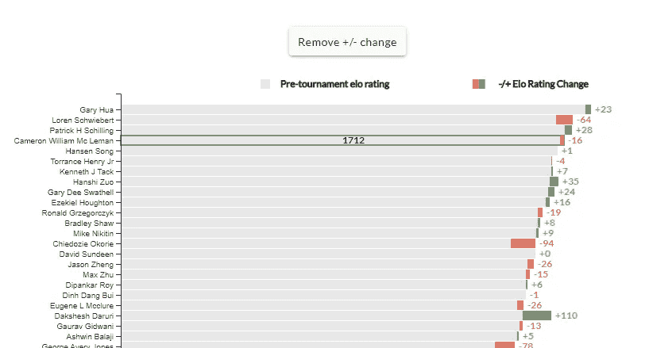

# 从。txt 文件到 d3.js 可视化

> 原文：<https://towardsdatascience.com/from-txt-file-to-d3-js-visualization-7070ef7af837?source=collection_archive---------21----------------------->

## 使用数据科学技术读取、清理非结构化数据，并将其转换为引人入胜的 web 可视化


照片由[兰迪·法特](https://unsplash.com/@randyfath?utm_source=unsplash&utm_medium=referral&utm_content=creditCopyText)在 [Unsplash](https://unsplash.com/s/photos/chess?utm_source=unsplash&utm_medium=referral&utm_content=creditCopyText) 上拍摄

几年前，IBM 指出，作为一名数据科学家，你可能必须经常遵守“80/20 法则”——你 80%的时间将用于简单地查找、清理和组织数据，只留下 20%的时间用于实际执行分析。

作为一名数据科学研究生，我的第一门课程只关注最初的 80%。有一项任务特别需要清理下面的文本文件，其中包含虚构国际象棋选手的“elo 评级”以及虚构国际象棋锦标赛的分数和点数:



模拟国际象棋“elo”评分和点数

太残忍了！我把这个文件的底部剪了下来，因为它很长，但是总共有 64 个玩家。

现在，你可能在想，**我们能用这个**做什么？这里有什么有趣的信息吗？我们将使用以下工作流程进行调查:

# 工作流程



从文本文件到 d3.js 可视化

# 将文本文件读入 R

我们要做的第一件事是。txt 文件并将其拉入 R。为此，我们可以使用基本的 R 函数`paste()`和`readLines()`:

```
library(stringr)
library(knitr)chess_data <- paste(readLines("https://raw.githubusercontent.com/zachalexander/data607_cunysps/master/Project1/chess_ratings.txt"), collapse = '\n')
```

正如您将从链接中看到的，我将文本文件保存在一个新的 GitHub 存储库中，并访问“Raw”选项，以便提取正确的文件。此外，我已经加载了用于处理文本的`stringr()`和`knitr()`包。

# 使用正则表达式处理文本文件

尽管我已经将文本文件放入 R 中，但是如果我检查我的变量“chess_data”并将其打印到控制台，您将会看到数据根本没有格式化:



将原始文本文件放入 R 中之后——处理之前。

幸运的是，如果您仔细观察，在这个文件中有一些微妙的模式，我们可以用它们通过正则表达式解析出关键信息。如果你需要温习正则表达式，我推荐[这个资源。](https://stringr.tidyverse.org/articles/regular-expressions.html)

首先，如果能得到玩家的名字就太好了。为此，我们可以结合使用`str_extract_all()`函数和定制的正则表达式来隔离这些数据。我们可以看到球员的名字全部用大写字母列出，因此，我们可以通过运行以下语法提取他们:

```
player_names <- unlist(str_extract_all(chess_data, '([:upper:]+\\s[:upper:]+(\\s[:upper:]+)?(\\s[:upper:]+)?)'))# change to 'proper' case
player_names <- str_to_title(player_names)
head(player_names)
```



在上面语法的第二部分，我简单地将所有大写字母的名字转换成“正确的”形式。你可以看到印在上面控制台上的最终产品。我们现在有 64 个玩家名字的向量！就这么简单！

查看原始文本文件，我认为将玩家的原籍州、每个玩家的赛前 elo 评级以及每个玩家的赛后 elo 评级分离出来会很有趣。下面的正则表达式解决了这个问题:

```
# found that each player's state could be extracted through this regular expression combination
location <- unlist(str_extract_all(chess_data, '(\n)\\s\\s\\s[:upper:]+'))
location <- unlist(str_replace_all(location, '^\\s+|\\s+$', ""))# found that each player's pre-rating could be extracted through this regular expression combination
pre_rating <- unlist(str_extract_all(chess_data, '(R:)\\s{1,}\\d+'))
pre_rating <- unlist(str_replace_all(pre_rating, '(R:)\\s', ""))# found that each player's post-rating could be extracted through this regular expression combination (used later in data visualization)
post_rating <- unlist(str_extract_all(chess_data, '(->)(\\s{1,})?\\d+'))
post_rating <- unlist(str_replace_all(post_rating, '(->)(\\s)?', ""))
```

类似于隔离玩家名字，由于原始文本文件中的某些模式，上面的每一项都可以被隔离。

# 玩家结果-其他 R 函数

这些信息安全地存储在有组织的向量中。让我们评估一下我们现在所处的位置，以及我们希望收集哪些额外的信息来进行分析。下面用**黄色**突出显示的所有数据都已提取，用**绿色**突出显示的所有数据都是从该文本文件中获取的有用值——我们将在下一步中关注这些值。



我们目前在工作流程中的位置。

最初，我们可以看到每个玩家在锦标赛中的总点数包含带小数位的数字。为了分离这些值，我们可以根据这个字符序列提取所有值(见下文)。

然后，由于用绿色突出显示的其余数据在每一轮之间用“|”字符格式化，我们可以做一些操作来获取这些分数，继续利用我们的正则表达式。

```
# found that each player's total points could be extracted through this regular expression combination
total_points <- unlist(str_extract_all(chess_data, '(\\d\\.\\d)'))results <- unlist(str_extract_all(chess_data, '(\\d\\.\\d\\s{2}(\\|[:upper:]\\s{2}(\\s)?(\\s)?(\\d+)?){1,})'))
results <- unlist(str_replace(results, '\\d\\.\\d\\s{2}\\|', ''))
```

最后，我能够将每个玩家的这些值转换成一个临时数据帧，方法是使用 for 循环去掉多余的符号，并确保它们与我的初始向量中的玩家匹配。您可以看到下面的 for 循环过程:

```
*# used a for loop here to iterate over V1, using strsplit and the comma to separate out the opponent numbers into the appropriate columns. This also stored N/As in columns where a player didn't play an opponent.*
**for**(i **in** 1:7){
  tempdf[, paste0('game', i)] <- sapply(strsplit(as.character(tempdf$V1),','), "[", i)
}
```

将这些数据与我的球员数据结合后，我们得到以下数据帧:



现在我们有所进展了！

如您所见，在 game1、game2…gameN 列中找到的数据对应于索引行号。既然我们已经有了这些信息，我想用与每个球员指数相对应的赛前评分来替换这些列中的指数会很有趣。如果我这样做是正确的，我就可以确定每个玩家的“时间表强度”！为此，我再次使用了 for 循环:

```
*# while iterating over the game columns, iterate over the player opponent number and match it with the opponent's pre-tournament elo rating. Then replace the opponent number with their elo rating.*
**for**(i **in** 6:12) {
  **for**(j **in** 1:64) {
    value <- chess_ratings_df[,i][j]
    chess_ratings_df[,i][j] <- chess_ratings_df$player_pre_rating[value]
  }
}
```

我们走吧！这是我们最后的数据帧，已经清理干净，可以进行分析了:



包含棋手信息的最终数据帧，从锦标赛中获得的总点数，以及他们面对的每个对手的预 elo 评级。

# 初步分析

给定这个数据框架，我感兴趣的是仅基于对手的赛前评级来确定哪个(哪些)玩家的锦标赛赛程最艰难。此外，从赛前到赛后，谁的 elo 评分上升幅度最大？

为了弄清楚这一点，我首先使用了`rowMeans()`函数来计算七场锦标赛的对手赛前 elo 评分的平均值。然后我创建了一个名为`average_opp_rating`的新列来存储每个玩家的计算结果。

```
chess_ratings_df$average_opp_rating <- round(rowMeans(chess_ratings_df[,6:12], na.rm = TRUE), digits = 0)
```

我还决定再创建几个专栏，以确定玩家赛前评级和赛后评级的差异(最终看谁的 elo 评级收益/损失最高)。此外，我还创建了一个专栏，讨论前后的评分差异是正还是负。

最后，我开发了一个相当全面的数据框架，可以回答我的许多问题。许多人会觉得这是令人满意的，大多数情况下确实如此。然而，如果我们把它可视化不是更有吸引力吗？

# 将数据导出到. csv 文件

准备好数据帧后，我可以用 R 中的以下语法将其导出为. csv 文件:

```
filename <- './../.../filepath'
write.csv(final_df, file = filename)
```

对于那些熟悉 d3.js 的人来说，有一个内置函数能够读取. csv 文件并遍历其中的行。然而，我更喜欢直接与。json 文件(只是我个人的喜好)。你可以快速使用免费的在线服务，如 csvjson.com 的来转换格式。

一旦准备好了，我就有一个可行的。json 文件:



我的 R 数据帧先转换成. csv 文件，然后转换成. json 文件的例子

# 使 d3.js 可视化

由于时间的原因，我将简单介绍一下制作 d3.js 可视化的大部分内容。然而，如果你对学习感兴趣，我会推荐这本书——[交互式数据可视化](https://doc.lagout.org/programmation/JavaScript/Interactive%20Data%20Visualization%20for%20the%20Web_%20An%20Introduction%20to%20Designing%20with%20D3%20%5BMurray%202013-04-05%5D.pdf)——这真的是开始接触 d3 和 Javascript 的好指南！

用我的。json 文件准备好了，我可以接着做下面的事情:

1.  使用 [angular-cli](https://cli.angular.io/) 创建一个角度 2+项目。
2.  创建一个 firebase 项目，并使用 firebase 部署我的 Angular 2+项目。[这是一个很好的指南。](https://medium.com/@treviergits/how-to-deploy-an-angular-7-app-on-firebase-hosting-30341f3bcb22)
3.  我创建一个组件，安装必要的模块，并开始构建我的可视化！

最后，我生成了一个条形图，显示每个玩家的赛前 elo 评级，然后您可以单击一个按钮来查看他们的 elo 评级根据赛后评级的变化。您也可以将鼠标指针置于初始栏上，查看赛前评级:



最终 d3.js 可视化——要查看最终产品，请前往[https://zach-alexander.com/chess-elo](https://zach-alexander.com/chess-elo)

要看到完整的、互动的可视化，你可以去 https://www.zach-alexander.com/chess-elo 的。希望你会发现它很吸引人。您还会注意到，我创建了一个与该数据相关的模拟报纸故事——只是为了好玩！

说到底，尽管大多数人抱怨“80/20 法则”，但我们可以看到它对这样的任务是多么重要。到处都有有用的数据，但前提是你愿意花时间去处理它们！