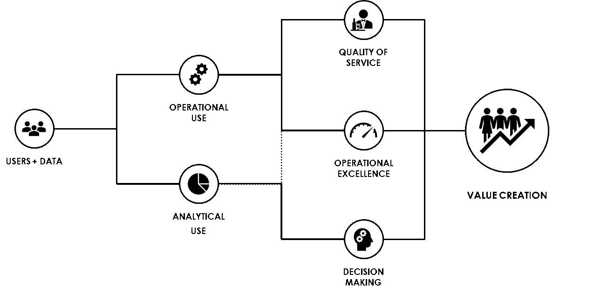

# 从用户到价值创造

> 原文：<https://towardsdatascience.com/from-users-to-value-creation-bb9b14c882f8?source=collection_archive---------55----------------------->

## [上的数据值](https://towardsdatascience.com/tagged/on-the-value-of-data)

## 数据的使用及其如何创造价值

T 何第一个“首席数据官”是在近二十年前的 2002 年被任命的(当时她还是一名女性)。从那时起，大数据革命开始了，今天首席数据官的头衔在某种程度上是公司内数据专业人员的最高荣誉。

这个新职位在公司最高管理层的出现至少意味着对数据创造价值潜力的某种认可。这种价值创造是围绕数据生产和使用的若干战略和政策以及为数据管理和治理实施的手段的结果。

在这一系列文章中，我将尝试解释这几个策略和政策的原因，以及如何将它们结合起来，以便从数据中创造商业价值。

第一部分是关于数据的价值是什么，谁使用它，用于什么目的。[第二部分将关注方法，以及如何通过数据管理和分析最大限度地创造价值](/quality-integrity-and-exploitability-of-data-9f75c39d384d)。[第三部分也是最后一部分将讨论谁做什么，以及 IT 业务团队在数据时代的角色变化&。](/in-the-era-of-data-the-it-2-0-and-the-data-citizens-9d4efe4fbcdd)

照片由 [Riccardo Annandale](https://unsplash.com/@pavement_special?utm_source=unsplash&utm_medium=referral&utm_content=creditCopyText) 在 [Unsplash](https://unsplash.com/s/photos/value?utm_source=unsplash&utm_medium=referral&utm_content=creditCopyText) 上拍摄

# 从数据中创造商业价值

当你让一个人描述数据的价值是什么时，对他们来说，你会自然而然地得到的第一个答案是数据有内在的市场价值，这意味着你实际上可以以给定的价格出售它。当数据是一家公司卖给其客户的产品时，情况确实如此。

但对于我们绝大多数人来说，对于核心业务不是卖数据的公司来说，数据的这种内在市场价值，只占从中要创造的潜在商业价值的一小部分。

对于这些公司来说，数据以某种方式“间接”创造了超出其市场价值的价值，这种价值创造可以以不同的方式转化，可以分为三类:

1.  **提高客户忠诚度**，通过使用数据来提高服务质量，以更好地了解客户，识别模式，预测客户流失，从而避免失去客户，实施新的高附加值数据或报告服务(此处数据或多或少会直接货币化)
2.  **增加市场份额**，通过增加与现有客户和新客户的活动，利用数据更好地了解市场及其演变，预测、预测甚至影响市场，从而改变市场
3.  **降低成本**，通过使用数据来优化运营、提高生产率、更好地理解和构建产品、提高效率、自动化某些活动

如果您想从业务的角度定义公司数据计划的目标，处理业务案例，评估项目投资回报，设置优先级并指导路线图，那么充分理解这一点是至关重要的。

在本文中，我将只讨论公司、产品和服务以及市场价值(直接或间接)。数据也代表了科学的巨大价值，让我们更好地了解我们生活的世界，让医学更好地了解我们自己以及如何治愈我们。但是，即使目的不同(赚钱与理解宇宙和帮助人类)，与数据的生产、使用和管理相关的实践和过程是相同的。

# 应用程序和用户是从数据中创造价值的基础

显然，我们没有等到计算机被发明出来才开始生产数据，并利用数据创造价值。然而今天，绝大多数数据都是通过计算机应用程序生成的。

事实上，计算机应用程序本质上是生成和处理数据的系统，其中数据被输入或摄取、存储、处理、可视化、分析等。

和/或分析，从而直接或间接参与从数据中创造价值。

# 从应用用户到价值创造

应用程序用户除了使用软件的功能外，还对其数据进行特定的使用。这种用法要么是操作性的(do)，要么是分析性的(decide)，有时两者都有(实际上越来越多)。

数据的运营使用与制造产品或提供服务有关，因此会对服务质量和卓越运营、效率和生产力产生影响。让我们看一个电子商务应用程序的例子:

*   “客户-用户”的数据操作用途是访问公司提供的不同产品或服务的数据、它们的特征、它们的价格等。
*   “操作员-用户”的数据操作用途是访问客户数据以处理订单。

数据的分析用途的主要目的是报告和/或分析以理解和预测，在从业务战略到员工日常决策的决策过程中起着至关重要的作用。可以是简单的报告或商业智能，以分析销售、客户(著名的 V360)，了解导致特定情况的模式，如客户流失等。

在两者之间的边界，分析也可以直接集成到运营中，在现场和实时进行。警报功能就是一个很好的例子，它监控过程并在出现问题时警告操作人员，以便他能够做出决定并采取行动。

# 服务质量、卓越运营和决策:价值创造的三个关键驱动因素

正确理解用户对数据的操作和/或分析使用对于正确理解相关的价值创造至关重要，因为数据的使用方式将影响这种价值创造的三个关键驱动因素:

1.  **服务质量**，满足客户并满足其需求的能力 **:** 在这里，数据及其使用方式会对客户满意度产生积极或消极的影响。例如，如果电子商务应用程序中的库存没有正确更新，客户下了订单，认为产品有库存，但他/她的订单因为实际上缺货而无法处理，他/她将不会满意。相反，对于电子商务网站来说，提供实时的库存可见性是客户满意度的一个重要标准。
2.  **卓越运营**，做好工作的能力:在这里，数据的使用方式可以通过效率和生产率来衡量。比如，当某些发货信息缺失或错误时，产品无法发货，不得不重新安排发货时间(从公司的角度来看这是效率的缺失)。
3.  **决策**，在正确的时间做出正确决定的能力:这里我们主要谈论的是对数据的“分析性”使用，即利用数据中的信息，做出符合事实的东西，通过分析相关性和因果关系来更好地了解情况，预测将会发生什么，从而决定要采取的行动。

卓越运营问题不一定会影响服务质量(效率损失会增加成本，但如果满足了要求，客户会很高兴)，反之亦然。然而，糟糕的服务质量将意味着某个地方更经常地存在潜在的运营卓越问题。

总之，如上图所示，运营商、分析师、客户等使用数据的方式。影响服务质量、卓越运营和决策，这是从数据中创造商业价值的三个关键驱动因素。因此，充分理解**数据的用途**和**为什么**至关重要，这样才能最大化从中创造的相关商业价值。

感谢您的阅读，请让我知道您的想法，并毫不犹豫地分享。