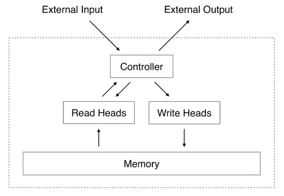
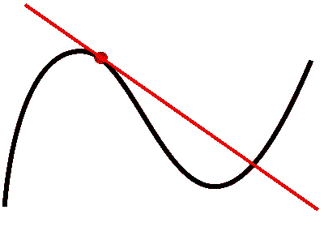
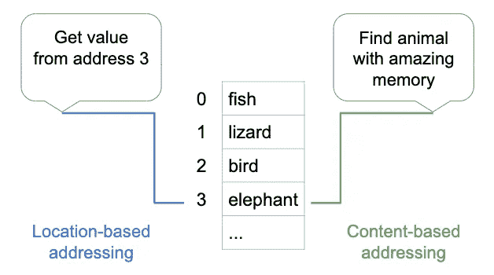

# 从冯·诺依曼到记忆增强神经网络

> 原文：<https://towardsdatascience.com/from-von-neumann-to-memory-augmented-neural-networks-11be0a13d9e4?source=collection_archive---------47----------------------->

## 直观的高层次概述

2014 年，两项并行的研究工作推出了记忆增强神经网络(MANNs):[神经图灵机](https://arxiv.org/pdf/1410.5401.pdf)和[记忆网络](https://arxiv.org/abs/1410.3916)从那时起，他们扩展到了一个更广泛的主题，跨越了这些最初的实现。然而，我将坚持高层次的直观概述。这篇文章旨在将过去 7 年的研究浓缩成一篇 7 分钟的文章，去掉那些没有通过时间考验的特定于论文的术语和实现细节。

> **记忆增强神经网络(MANNs)** 是冯诺依曼架构的可微分版本。n *通用存储器*与模型参数的其余部分分开，并且与 RAM 类似，存储长期信息。

大象有惊人的记忆力。在一个例子中，23 年后，两只在一起表演的马戏团大象相遇时欢欣鼓舞。大象也认出了曾与它们相处数十年的人类。Tobias Adam 在 [Unsplash](https://unsplash.com?utm_source=medium&utm_medium=referral) 上拍摄的照片

传统的[冯诺依曼架构](https://en.wikipedia.org/wiki/Von_Neumann_architecture)区分了 CPU(中央处理器)和三级内存:*寄存器* —非常快，但存储能力仅限于几个值；主存储器*(例如 RAM)——速度更快，有足够的存储空间来容纳运行程序的指令和数据，以及*外部存储器*(例如硬盘)——速度较慢，但有空间存储计算机使用的几乎所有数据。*

***记忆增强神经网络(MANNs)** 是冯诺依曼架构的*可微分*版本(下一节将详细介绍)。神经网络的主体可以被认为是 CPU。某些架构，如 RNNs(递归神经网络),具有类似于寄存器的内置存储器，存储短期信息。*神经存储器*与模型参数的其余部分分离，并且与 RAM 类似，存储长期信息。它由内存插槽阵列(即矩阵)组成，最常见的是存储信息的连续表示(文本、图像等)。)*

**

*神经记忆与外部世界的相互作用由控制器调节。图 1 中的 [Graves 等人](https://arxiv.org/pdf/1410.5401.pdf)【1】*

*通过读写操作直接与神经存储器交互的组件称为**控制器**。在早期的工作中，控制器与模型的其余部分(即记忆之外的所有参数)相吻合，因此它充当了记忆与“外部世界”之间的接口。它通常被实现为一个递归神经网络。最近，随着基于变压器的大规模架构的出现，控制器只是该模型的一个小子集，并协调存储器与网络其余部分之间的通信。*

## *什么是可区分的架构？*

*曼恩是可微分的，冯诺依曼架构不是——但这到底意味着什么？您可能还记得以下定义:*

> *实变量的**可微函数**是其导数存在于其定义域内每一点的函数——[维基百科](https://en.wikipedia.org/wiki/Differentiable_function)。*
> 
> *实变量的函数的**导数衡量函数值(输出值)对其自变量(输入值)变化的敏感度— [维基百科](https://en.wikipedia.org/wiki/Derivative)。***

**

*函数在特定点的导数。图片来自[维基百科](https://en.wikipedia.org/wiki/Derivative)。*

*冯·诺依曼体系结构执行不可微运算。例如，考虑一个*读*操作:当 CPU 从 RAM 中取出下一条指令时，它指定一个地址(输入)并接收回一条指令(输出)。因此，输入域是无符号整数，所以运算不是在*实数*变量上定义的。根据上面的定义，微分是不可能的。*

## *使操作可区分:*软*读取和写入*

*RAM 读取不可区分的核心原因是它们在离散的地址空间上操作。神经记忆提出了一种调整:*

> *不是从单个条目中读取，而是从所有条目中执行加权读取。*

*对于每个存储槽 *i* ，控制器指定一个实值权重 *wᵢ* ，使得所有权重总和为 1。这将读取操作的输入从单个*整数*值(地址)改变为一个*实数*值的向量(每个插槽的权重)，这是区分性的第一个要求。请注意，这个修改后的操作更加通用:当一个权重设置为 1.0，所有其他权重设置为 0.0 时，我们实际上是从一个条目中读取。同样的推理也适用于写操作:我们用一个加权值 *wᵢ * x.* 来更新每个条目 *i* ，而不是将值 *x* 写入单个内存槽*

*由于权重 *wᵢ.的连续性质，这些操作被称为 ***软*读和写***这与*硬*读写 RAM 形成对比，在硬读写 RAM 时，控制器会对要操作的内存插槽做出硬决定。*

## *计算软权重:基于内容与基于位置的寻址*

> *RAM 的访问基于位置—读操作指定要读取的确切地址。神经存储器通常是基于内容来访问的——查询指定要读取什么，而不是从哪里读取。*

*控制器如何计算每个插槽的重量 *wᵢ* ？*

*首先，关于术语的说明:计算权重的机制 *wᵢ* 通常被称为*内存寻址，*因为它决定了哪些内存插槽被*寻址*，以及对每个插槽的关注程度。可以基于内容或位置对神经存储器进行寻址。*

**

*作者插图。*

*利用**基于内容的寻址**，权重 *wᵢ* 反映了槽 *i* 的内容在解析传入查询时的相关程度。例如，对于问答任务，内存查询可以是实际问题的嵌入。然后，控制器必须向上移动作为候选答案的内存插槽。最常见的是， *wᵢ* 是槽 *i* 中的内容嵌入和查询之间的点积或余弦相似性。最后，通过 softmax 对所有权重进行归一化，使其总和为 1。*

*利用**基于位置的寻址*、*、**，权重*、*反映了应该对位置 *i* 给予多少关注，而不管其内容如何。这种技术不太常见；它是由谷歌 DeepMind 的神经图灵机[1]在 2014 年推出的，然后在他们的 2016 年迭代 MANNs [3]中放弃了。最初的理由是，对于某些需要算术运算的任务，如添加两个变量 *x* 和 *y* ，重要的是控制器能够从内存中检索操作数 *x* 和 *y* 而不管它们的确切值。*

## *降低计算成本:稀疏读写*

*使读取和写入可区分会带来计算成本。现在，每个查询都在线性时间 *O(N)* 内解决，其中 *N* 是内存槽的数量(相比之下，硬读取和写入需要常数 *O(1)* 时间)。当网络的输入是长度为 *L* 的序列(例如文本文档)时，通常对序列中的每个元素进行一次查询——这使得成本高达 *O(N*L)。*训练时，软读写也是内存低效的；计算整个内存的梯度需要复制一份。*

*后续研究集中在将 *O(N)* 成本降低到 *O(log N)* (Rae 等人【2】)或 *O(sqrt N)* (Lample 等人【4】)。虽然这两种方法非常不同，但它们的共同点是对内存的子集进行操作，而不是对所有条目进行操作。换句话说，他们将非零权重 *wᵢ* 的数量限制为一个小常数 k(介于 2 和 8 之间)，并且仅在非零权重的槽上应用梯度下降。*

# *当前事态*

*记忆增强的神经网络已经在人工任务(例如，它们学习将序列复制给定次数)、一些自然语言任务(问答、机器翻译)和一些计算机视觉任务(字符识别)中显示出有希望的结果。然而，它们尚未成为主流。在多个方向都有有趣的研究机会:降低它们的计算成本，加快训练速度，了解它们在什么情况下最有用，以及将它们与最先进的变压器集成。*

# *参考*

1.  *格雷夫斯等人，[神经图灵机](https://arxiv.org/pdf/1410.5401.pdf) (2014)*
2.  *Rae 等人，[利用稀疏读写扩展记忆增强神经网络](https://arxiv.org/pdf/1610.09027.pdf) (2016)*
3.  *桑托罗等人，[使用记忆增强神经网络的一次性学习](https://arxiv.org/pdf/1605.06065.pdf) (2016)*
4.  *Lample 等人，[带有产品密钥的大型存储层](https://arxiv.org/pdf/1907.05242.pdf) (2019)*