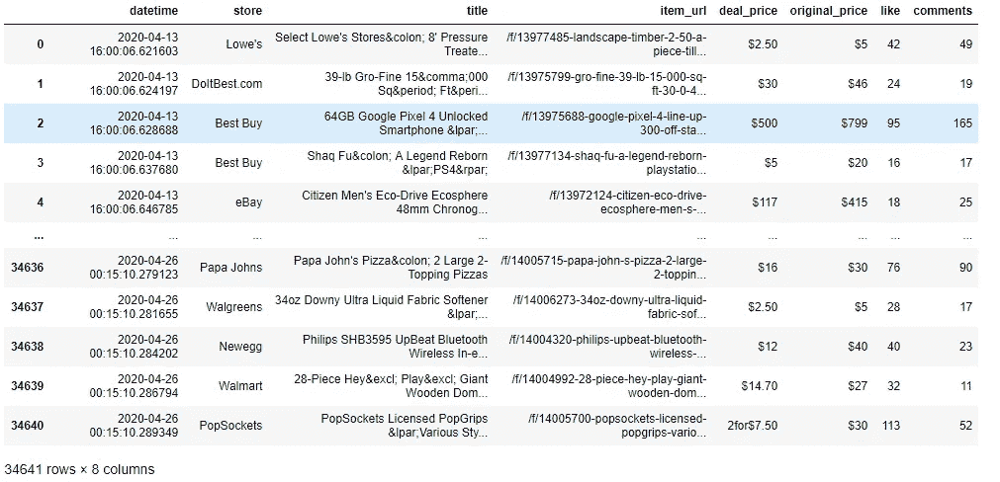
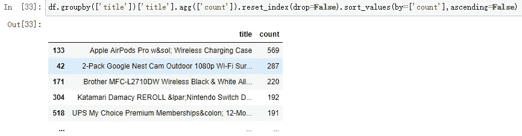
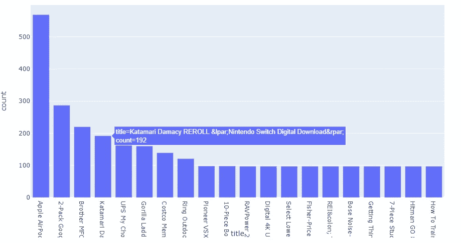
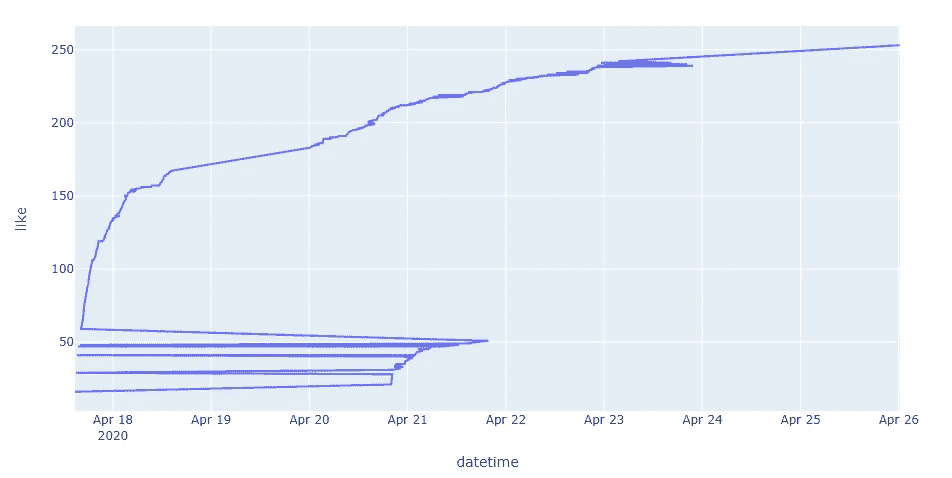
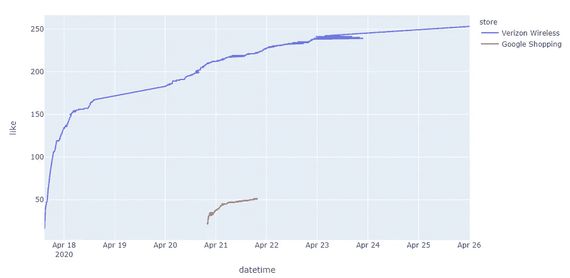
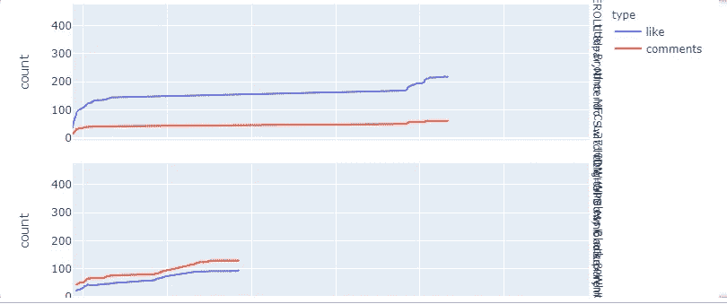

# Frontpage Slickdeals 与 Pandas 和 Plotly Express 进行数据分析

> 原文：<https://towardsdatascience.com/frontpage-slickdeals-analytics-with-pandas-and-plotly-express-b5e5bbdf072d?source=collection_archive---------66----------------------->

## Slickdeals.com 是一个受欢迎的交易和优惠券网站。我将展示 web 抓取并使用 Slickdeals 数据集执行数据分析


来自 [Pexels](https://www.pexels.com/photo/woman-holding-card-while-operating-silver-laptop-919436/?utm_content=attributionCopyText&utm_medium=referral&utm_source=pexels) 的 Andrea Piacquadio 的照片

人们喜欢在购物时省钱。这些交易信息是有价值的用户行为数据，从中可以检索出有趣的问题和答案。Slickdeals.com 是最受欢迎的交易和优惠券网站之一。Frontpage Slickdeals 是社区成员或 Slickdeals 的编辑在过去 24 小时内推荐的交易。交易范围涵盖各种类别，价格从免费到数千美元不等。

在本文中，我们将探索来自 Slickdeals 的数据集，并使用 [Pandas](https://pandas.pydata.org/) 和 [Plotly Express](https://plotly.com/python/plotly-express/) 执行数据分析。我希望这篇文章可以提供一些收集原始数据的有趣例子，以及如何使用 Pandas 和 Plotly Express 进行数据分析和可视化的一些见解。

## 数据收集

作为一名数据专家，我们需要与数据打交道。执行任何类型的 web 分析的挑战性任务之一是时间。由于任何网站的可用数据都是最新的，因此很难追溯之前发生的事情或进行任何类型的时间旅行分析。例如，在 Slickdeals 主页上，如果我们看到一个有 46 个赞的热门交易，我们不知道它会多快到达这里。在这种情况下，web 抓取工具非常有助于为此目的收集数据。详细内容见文章[中的一篇](https://medium.com/@chengzhizhao/how-to-detect-the-best-deals-with-web-scraping-c1af2d6f4ef7)如何发现网络抓取的最佳交易

为了收集足够的数据，我以 15 分钟的间隔运行了两周的网络抓取程序，这应该能够捕捉到不同日期和时间的变化。你可以在这里找到两周的数据[。](https://raw.githubusercontent.com/ChengzhiZhao/jupyter-notebooks/master/slickdeals_data_file.csv)

## 数据解析和清理

在从网络上收集数据一段时间后，我们处于解析和清理阶段。这里，我们添加了包含列名的原始数据，并将日期时间列的格式从字符串更改为日期格式。pandas 提供的一个便利功能是`read_csv`功能，我们可以直接从网络上获取数据，并将其转换为 CSV 文件。

```
url=”https://raw.githubusercontent.com/ChengzhiZhao/jupyter-notebooks/master/slickdeals_data_file.csv"df=pd.read_csv(url,header=None,names=['datetime','store','title','item_url','deal_price','original_price', ‘like’, ‘comments’])df[‘datetime’] = pd.to_datetime(df[‘datetime’])
```



数据解析和清理(按作者)

## 收集数据的数据分析

**顶级交易是什么？**

在这个 Slickdeals 数据集上可以提出一些有趣的问题。其中一个项目是"*在 frontpage 交易中最受欢迎的交易是什么？*”。为了找到答案，从 Slickdeal 数据集，我们可以比较一笔交易在 Slickdeals 主页上出现的次数。由于网络抓取每 15 分钟发生一次，显示的时间越长，该项目成为最受欢迎的项目的可能性就越大。

然后，我们可以使用下面的代码对所有的标题进行分组并执行计数，然后按降序对计数进行排序，这里的排序将确保 Plotly Express 按顺序显示行。

```
frequency_frontdeal = df.groupby(['title'])['title'].agg(['count']).reset_index(drop=False).sort_values(by=['count'],ascending=False)
```



苹果 AirPods Pro

为了形象化，我们可以使用 Plotly Express 为前 20 项交易创建一个漂亮的条形图。

```
fig = px.bar(frequency_frontdeal.head(20), x=’title’, y=’count’)
fig.show()
```



从上面的结果来看，“ [**苹果 AirPods Pro**](https://slickdeals.net/f/13988171-apple-airpods-pro-w-wireless-charging-case-225-free-shipping?src=sticky-missed) ”显然被认为是前两周头版头条中的最佳交易。但是我们算重复的了吗？接下来我们将揭晓答案。

顶级交易的趋势是什么样的？

由于“[苹果 AirPods Pro](https://slickdeals.net/f/13988171-apple-airpods-pro-w-wireless-charging-case-225-free-shipping?src=sticky-missed) ”是唯一的交易，我们选择这一个进行进一步分析，让我们深入研究并探索这种情况下的趋势。为了更好地了解这项交易的受欢迎程度，其中一个衡量标准是有多少人点击了“喜欢”按钮。Slickdeals 可能会使用“喜欢”按钮作为其推荐功能之一。探索“喜欢”的数量随着日期和时间的增加而增加可能是令人兴奋的。

```
airpod = df[df[‘title’]==’Apple AirPods Pro w&sol; Wireless Charging Case’].sort_values(by=[‘like’])
fig = px.line(airpod, x=’datetime’, y=’like’)
fig.show()
```



然而，在图表上绘制数据后，图表看起来很奇怪，我们原本预计会有一条完美的曲线表明增长，但上面的图表看起来像是数字跳回和强制。好像是在流行的起点，我们跟踪了两个数据点。那么问题来了，“*有没有重复数据？*


来源:网络来自 [knowyourmeme](https://knowyourmeme.com/photos/1369043-cats)

答案是“**是的**，原因是 Slickdeals 有两个来自不同商店但标题相同的交易。我们可以看到，威瑞森无线公司在 4 月 17 日第一次在头版刊登了这笔交易。几天后，Google Shopping 赶上来了，也在指定时间段内列在了首页。然后谷歌购物开始了。目前还不清楚 Slickdeal 执行重复数据删除流程的算法是为了优先处理第一笔交易，还是其中一笔交易刚刚输掉了竞争。但我们可以从下面的图表中看到，威瑞森的交易持续时间更长，也更受欢迎。为了验证我们的假设，我们可以在折线图中显示这两家商店，`color`是一个参数，我们可以设置它来拆分数据，以显示在不同的组中。

```
airpod.groupby('store')['store'].count()
# store
# Google Shopping 96
# Verizon Wireless 473# With store
fig = px.line(airpod, x='datetime', y='like',color='store')
fig.show()
```



两个商店一个交易标题(按作者)

**热门交易的点赞和评论之间有关联吗？**

在`frequency_frontdeal`中，我们可以获得前十行，并在图表中绘制它们。然后我们可以观察点赞数和评论数之间的关系。

```
fig = px.line(transformed_top10_df, x=’datetime’, y=’count’, color=’type’,facet_row=”title”)
fig.show()
```



喜欢和评论(按作者)

从上图中，我们可以看到评论和喜欢的两种情况都表现出相似的趋势。有些产品的评论甚至比赞还多，这可能是关于这些交易的多条讨论线索，也可能是这笔交易登上头版的另一个原因。

## **完整代码**

## 最终想法

我们可以执行更多的分析，并从 web 抓取程序中收集更多的字段。从网上收集数据进行分析既简单又便宜。然而，收集数据进行详细分析需要一些时间。我们可以设置一个运行在树莓 Pi 上的网页抓取工具，收集数据。这种解决方案比从第三方购买数据更加灵活。这篇文章展示了使用 Pandas 和 Plotly Express 来分析我们从 web 上获取的数据并执行分析是多么容易，我希望它展示了一种不同的数据收集和分析方法。

希望这个故事对你有帮助。本文是我的工程&数据科学系列的**部分，目前包括以下内容:**


[赵承志](https://chengzhizhao.medium.com/?source=post_page-----b5e5bbdf072d--------------------------------)

## 数据工程和数据科学故事

[View list](https://chengzhizhao.medium.com/list/data-engineering-data-science-stories-ddab37f718e7?source=post_page-----b5e5bbdf072d--------------------------------)47 stories

你也可以 [**订阅我的新文章**](https://chengzhizhao.medium.com/subscribe) 或者成为 [**推荐媒介会员**](https://chengzhizhao.medium.com/membership) 可以无限制访问媒介上的所有故事。

如果有问题/评论，**请不要犹豫，写下这个故事的评论**或者**通过 [Linkedin](https://www.linkedin.com/in/chengzhizhao/) 或 [Twitter](https://twitter.com/ChengzhiZhao) 直接联系我**。