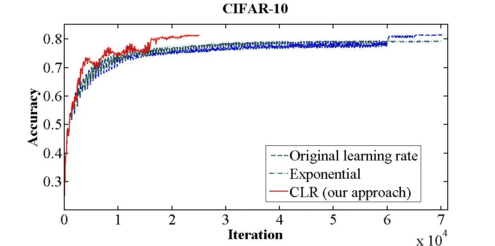
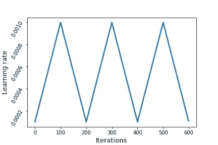
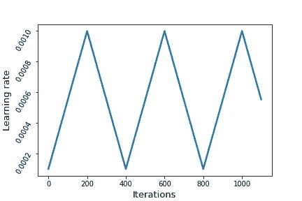
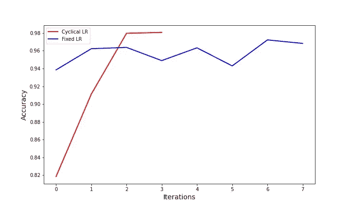
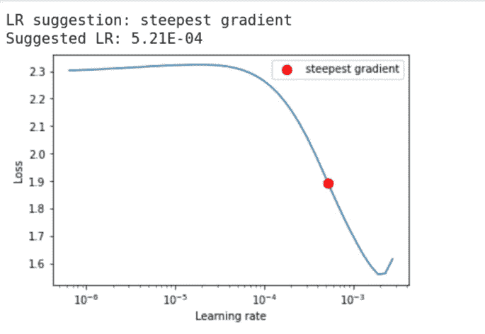
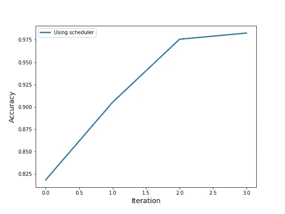

# 用循环学习率的力量给你的神经网络加油

> 原文：<https://towardsdatascience.com/fueling-up-neural-networks-with-the-power-of-cyclical-learning-rates-1b494eeaac42?source=collection_archive---------41----------------------->

## 永远不要限制你的神经网络的能力。让它探索自己的学习能力


来源:https://unsplash.com/photos/WE_Kv_ZB1l0

## 介绍

为训练神经网络选择最佳学习速率是一项单调乏味的任务，通常是通过反复试验来完成的。

但是，如果你能为你的神经网络提供一系列的学习率值呢？最好的部分是，有一种方法可以在甚至不开始实际训练你的神经网络的情况下，获得最佳的学习速率范围。

多酷啊。

这些很酷的技术是由 **Leslie N. Smith** 在他的论文 [**中介绍的，用于训练神经网络**](https://arxiv.org/abs/1506.01186) 的循环学习率。

通过使用本文中讨论的技术，我们可以在更少的迭代中获得更好的结果。

论文的摘要清楚地说明了这一点:

> 用循环学习率而不是固定值进行训练可以提高分类精度，而不需要调整，并且通常迭代次数更少

摘要中的陈述得到了针对自适应学习率等其他技术进行的几个实验的支持。

在 CIFAR-10 数据集上使用循环学习率进行训练时，获得了以下结果:



来源:[https://arxiv.org/abs/1506.01186](https://arxiv.org/abs/1506.01186)

通过循环学习率方法在大约 25，000 次迭代时实现了通过其他方法在 70，000 次迭代时获得的相同精度。

现在，让我们直接进入论文的细节。

## 这个所谓的循环学习率是什么？

大多数情况下，在传递学习率时，我们只是给神经网络一个固定的值。

但是在使用循环学习率时，我们传递的是最小学习率和最大学习率。

例如，考虑最小学习率为 0.001，最大学习率为 0.01。在训练过程中，学习率将从 0.001(最小学习率)变化到值 0.01(最大学习率)，然后再次从 0.01(最大学习率)变化到 0.001(最小学习率)，并且该过程继续，直到训练完成。

就像一个循环过程，从最小值开始到最大值，然后又回到最小值。就这么简单。

显然，你可能会有一个问题。

学习率从最小值到最大值需要多少次迭代或多少个时期，反之亦然？

这个问题的答案是步长。

如果步长为 100，那么学习率从最小值到最大值需要 100 次迭代，再需要 100 次迭代才能回到最小值。



作者图片

如上图所示，学习率从最小值 0.0001 开始，在 100 次迭代后达到最大值 0.001，并在接下来的 100 次迭代中再次返回到最小值。

一个完整的周期是返回最小值所需的时间。在上图中，等于 200 次迭代。

一个完整的周期= 2*(步长)

Torch7 代码中给出的实现循环学习的速率是:

Torch7 循环学习率代码

*epochCounter* —迭代次数

*被占领土。LR* —学习率的最小值

*maxLR* —学习率的最大值

但是让我们把上面的代码转换成 numpy:

循环学习率的数值实现

现在，让我们测试我们的 numpy 实现是否按预期工作。为此，让我们运行一个 For 循环，并检查学习率是否像前面讨论的那样从最小移动到最大。

测试我们功能的代码

通过运行上面的代码，我们得到一个如下所示的图:



作者图片

正如预期的那样，我们的学习率从最小值开始，在指定的步长内上下线性移动。

上述技术被称为三角策略。本文还介绍了另外两种技术:

1.  三角形 2 —三角形策略和三角形策略之间的唯一区别在于，在每个完整周期结束时，基本学习率和最大学习率之间的差值减半。
2.  *exp_range* —这里的学习率从最小值到最大值变化，但唯一的区别是每个边界值(最小值和最大值)以 gamma^iteration(gamma 的指数因子下降，直到迭代。

## 使用循环学习率训练模型

既然你对什么是循环学习率有一个确切的概念，让我们用循环学习率来训练一个模型，看看它是否比一个单一学习率的模型表现得更好。

为了使我们的实验更快，我们将使用来自 MNIST(改进的国家标准和技术研究所)数据集的一个小子集。让我们从实验开始:

1.  导入必要的模块。

导入必要的模块

2.下载 MNIST 数据集。

下载 mnist 数据集

正如我所说的，我们将只下载完整的 MNIST 数据集的一小部分。

3.现在，我们将创建一个自定义数据集类。

自定义数据集类

4.使用 PyTorch 数据加载器构建所需的转换并加载数据集。

加载数据

由于下载的 MNIST 数据集是张量形式的，PyTorch 数据类只接受 PIL(Python 图像库)图像，我们需要将数据集转换成 PIL 图像，并将其转换成张量，然后输入数据加载器。

数据集以这样的方式分割，8000 个数据点用于训练，其余的用于验证(大约 2000 个数据点)。

5.现在让我们创建一个验证函数来计算我们的模型在验证数据上的损失和准确性。

验证功能

6.现在，让我们创建我们的模型。

构建模型

我们将使用 resnet18(没有预训练的权重)作为具有交叉熵损失和 adam 优化器的模型。

7.现在我们都准备好训练我们的模型了。

使用循环学习率进行训练

在数据加载器的每次迭代中，我们将使用循环学习率函数来更新优化器中的学习率值，这个函数是我们之前使用 numpy 实现的。

在上面的代码中，我们使用的步长等于训练数据加载器的两倍，学习率边界在 1e-3 和 1e-2 之间。

我们还将在每次迭代后存储精度值，以便将结果与使用单一学习率训练的另一个模型进行比较。

9.现在，我们将快速创建和训练另一个模型，但只有一个学习率值。

我们将使用之前使用的相同数据集来训练模型。

8.现在，让我们比较我们的模型训练 4 个时期的结果和另一个模型训练 8 个时期的结果，但是具有单一学习率，即 0.001(Adam 优化器的默认值)。

用于比较结果的代码

在上述代码中，术语“acc1”是用单一学习率训练的模型的精度值，术语“acc”是用循环学习率训练的模型的精度值。

上面的代码给出了如下图:



作者图片

从上面的图中可以清楚地看出，使用循环学习率(红线)训练的模型比使用固定学习率(蓝线)训练的模型获得了更高的精度，即使迭代次数更少。

## 寻找最佳学习率范围

正如我之前说过的，有一种技术可以使用一种技术找到最佳的学习速度范围。这种技术被称为论文中提到的“LR 范围测试”。

> 有一种简单的方法来估计合理的最小和最大边界值，只需在几个时期内对网络进行一次训练。这是一个“LR 范围测试”。

这是通过将最小学习率设置为小值(如 1e-07)并将最大学习率设置为高值来实现的。然后对模型进行一些迭代训练，然后对每个学习率获得的损失进行绘图。

这在 fastai 库中很好地实现了，但是也有同样的 PyTorch 实现。

但是为此，我们需要使用 pip 安装一个名为 torch-lr-finder 的库，如下所示:

```
pip install torch-lr-finder
```

现在我们可以测试学习率的最佳范围，并将其传递到我们的模型中。

我们将通过我们的模型、损失函数、优化器和设备(cuda 或 cpu)来初始化学习率查找器。

我们通过训练数据加载器、验证数据加载器、最小学习率(非常低的值)和最大学习率(非常高的值)来开始学习率范围测试。

运行上面的代码后，我们得到一个带有学习率建议的图，如下所示:



作者图片

从图中，我们可以看到损失值从大约 3e-4 的值继续减小到 1e-3 的值，因此这些值可以用作我们的学习率的最小和最大值。学习率查找器建议的最佳学习率是 5.21e-04，也在此范围内，如果您希望以单一学习率训练模型，可以使用该学习率。

## 使用 PyTorch 的学习率计划程序

PyTorch 提供了一个学习率调度器来改变学习率，如上所述。

因此，让我们使用 PyTorch 的学习率调度程序来训练一个模型，该模型具有与我们之前使用的相同的架构、超参数、优化器和损失函数。

让我们从 PyTorch 导入学习率调度器，快速构建模型。

正在初始化 CyclicLR 计划程序

现在，我们将训练我们的模型，并使用学习率调度程序来更新学习率。

使用调度器训练模型并更新学习率

从上面的代码中可以看出，在数据加载器的每次迭代之后，学习率会使用调度器进行更新。

在 4 个时期之后，该模型给出了与使用我们构建的循环学习率函数训练的模型相同的准确度(98.2638)。



作者图片

📎需要记住的一些要点是:

1.  将学习率从最小值(低值)增加到最大值(高值)可能会有短期的负面影响，但从长期来看，它会产生更好的结果。
2.  循环学习率有助于在训练时摆脱鞍点。
3.  最好将步长设置为数据加载器在单个历元内迭代次数(或训练数据加载器的长度)的 2-10 倍。
4.  最好在周期结束时停止训练，也就是说，当学习率最低时。
5.  一个经验法则是将最小学习速率保持在最大学习速率的 1/3 或 1/4。
6.  无论何时开始一个新的数据集或架构，学习率范围测试都是获得最佳学习率值或最佳学习率范围的好方法。

## 结论

这是一个非常棒的技术，可以用在你日常的神经网络训练中。

如果你仍然怀疑循环学习率的能力，那么你一定要看看这篇论文的实验部分，你也应该尝试自己的循环学习率实验，以了解它的能力。

您可以将这种技术与其他方法(如自适应学习率技术)结合起来，以获得强大的模型。

有许多技术在深度学习爱好者中并不流行，这些技术可能会提高您的模型的泛化能力，或者减少训练模型的时间，从而节省您的大量宝贵时间。

如果您希望获得本文中讨论的完整代码，您可以在这个[资源库](https://github.com/bipinKrishnan/fastai_course)中找到它。