# fastText 和 Tensorflow 来执行 NLP 分类

> 原文：<https://towardsdatascience.com/full-nlp-use-case-with-fasttext-and-tensorflow-2-748381879e33?source=collection_archive---------41----------------------->

## www.camptocamp.org 登山路线分类

*fastText* 是脸书在 2017 年发布的最先进的开源库，用于计算单词嵌入或创建文本分类器。然而，嵌入和分类器只是数据科学工作中的构建模块。之前有许多准备任务，之后有许多验证任务，并且有许多基于这些工具的候选架构。让我们根据 CampToCamp.org、[、**、**、](http://www.camptocamp.org)的**登山运动社区站点的数据，制定一个完整的用例。作为深度学习引擎，我们将使用 Tensorflow 2 / Keras。至于验证，我们将使用 UMAP，一个从高维流形到 2D 平面的投影工具。**

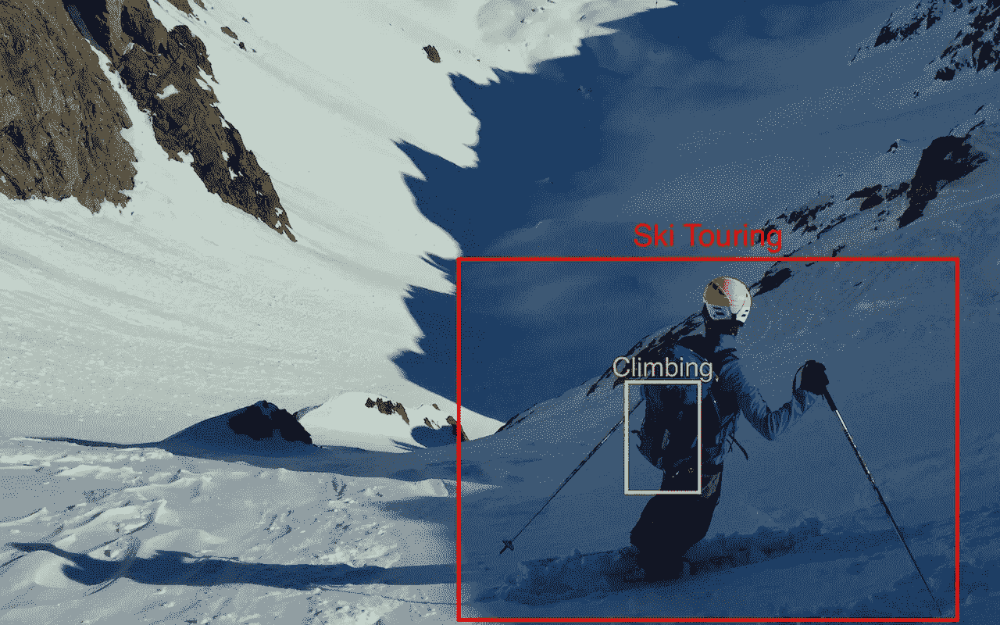

# 任务

www.camptocamp.org 是一个山地运动的社区网站。这是一个生动的信息来源，并已成为法国和瑞士阿尔卑斯山的参考。该网站有四个主要部分:一个关于路点和路线的知识库，一个郊游的实时反馈，事故报告和一个论坛。

我们的任务是基于路线数据:给定文本描述，设计并训练一个分类器来标记与十种可能性中的路线相关的活动类型:徒步旅行、山地自行车、滑雪旅行、雪鞋、四种类型的攀登(岩石、冰、山地和混合)、via-ferrata 和 slack-lining。所有与飞行相关的活动(滑翔伞、跳伞……)都没有被列为路线，滑降/度假滑雪也不是该网站的目的。

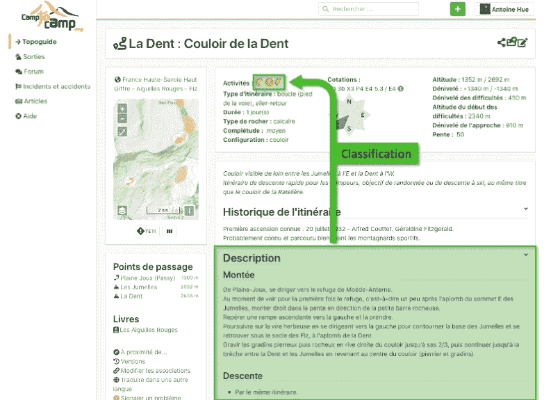

CampToCamp.org 用户界面中，突出显示了要执行的分类任务

如果每条路线是一个组合，或者如果它有一个冬季和一个夏季变量，则可以用多个活动来标记。每条路线最多有三个活动标签。随着标签的设置，这是一个监督下的训练。

# 数据

我们将使用从[www.camptocamp.org](http://www.camptocamp.org)到法国阿尔卑斯山中北部的路线描述(上阿尔卑斯省、伊泽尔省、萨瓦省、上萨瓦省的行政区域)。由于 Camp To Camp 是国际性的，我们希望将重点放在法语版本的描述可能较长且准确的地区。

[www.camptocamp.org](http://www.camptocamp.org)有一个开放的 Web API [5]，虽然没有文档说明，但是通过查看来自网页的 XHR 请求，很容易理解。

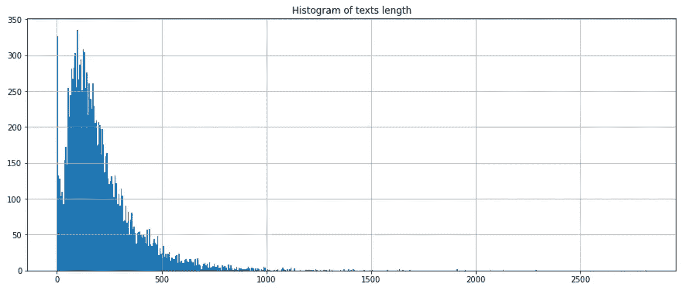

路线描述的字长直方图

总共提取了 14，074 条路线。富文本功能(HTML)被删除。610 被删除，因为它们没有法语描述。在用 *fastText* 或 Tensorflow 计算嵌入之前，标点符号被去掉。

可以进行更多的数据清理和清除，例如非常短的描述或英文描述(语言不匹配)，但这是一个*parti*推进这种数据质量。

# 预先计算的法语语言模型

文本的嵌入表示，也称为矢量化，在 Mikolov 等人于 2013 年发起的自然语言处理(NLP)中非常常见[3]。它已经在 Word2Vec 这个术语下普及了。有几个著名的实现和预训练模型，例如 GloVe [4]。 *fastText* 是最先进的算法之一，也是矢量器的实现，它利用了许多改进，比如 Skip-grams，或者连续词包(CBOW)和子词元语法[1]。

预计算嵌入在名称语言模型下交付。鉴于人类语言的复杂性，语言模型训练需要数 GB 的数据。对于 *fastText* ，提供了 157 种语言模型【2】，这与之前的其他库非常不同。

让我们从法语开始，观察在登山活动中使用的术语的结果。

例如， *corde* (绳子)被发现靠近:

*   *cordes* (复数形式)
*   *Corde* (首字母大写)
*   *科德*。(带标点)
*   *小绳*(小绳子)
*   *绳索*(绳索套装)
*   *菲塞尔*(小绳子的同义词)
*   *桑乐*(扁绳、扁带)
*   *记录者*(动词)
*   *菲林*(同义词)
*   *小母鸡*(小母鸡)

这个单独的观察给了我们一些关于什么是接近的线索(同义词，其他形式，密切相关的对象)，以及一些词汇的遗留问题:标点符号，大小写。这个案例没有简单的解决方法，因为一些常用词可能指某个特定的地点，如*勃朗峰*(即 w *白山*)。

*fastText* 也从三元组中计算类比:计算前两个单词之间的距离，并从第三个单词的相同距离处提取词汇。它并不总是导致有意义的联想，但仍然是相当准确的。例如，用单词*滑雪者*(去滑雪)*滑雪*(运动或物体) *vélo* (自行车)，类比输出为:

*   *佩达勒*(踩踏板，骑自行车)
*   *promener* ， *balader* (挂出)
*   *佩达兰特*(脚踏)
*   还有意义不大的那种带标点符号的同义词: *vélo。a，韦洛。、佩达勒、自行车、韦洛。-，velo*

# 嵌入的 2D 投影

关于嵌入的另一个观点是单词云从高维空间(对于法国模型是 300 维)到 2D 平面的投影。最常见的投影机制是主成分分析(PCA)，但还有更先进的技术，如 t-SNE [6]和 UMAP [7]保留项目之间的局部距离。请注意，t-SNE 或 UMAP 的预测是不稳定的:对相同数据的多次运行会导致不同的输出

下面是帆船、自行车和登山运动中一些词汇的嵌入情况。登山和帆船运动被很好地分开，骑自行车在它们之间传播，就像 *carte* (地图)和 *corde* (绳索)一样。

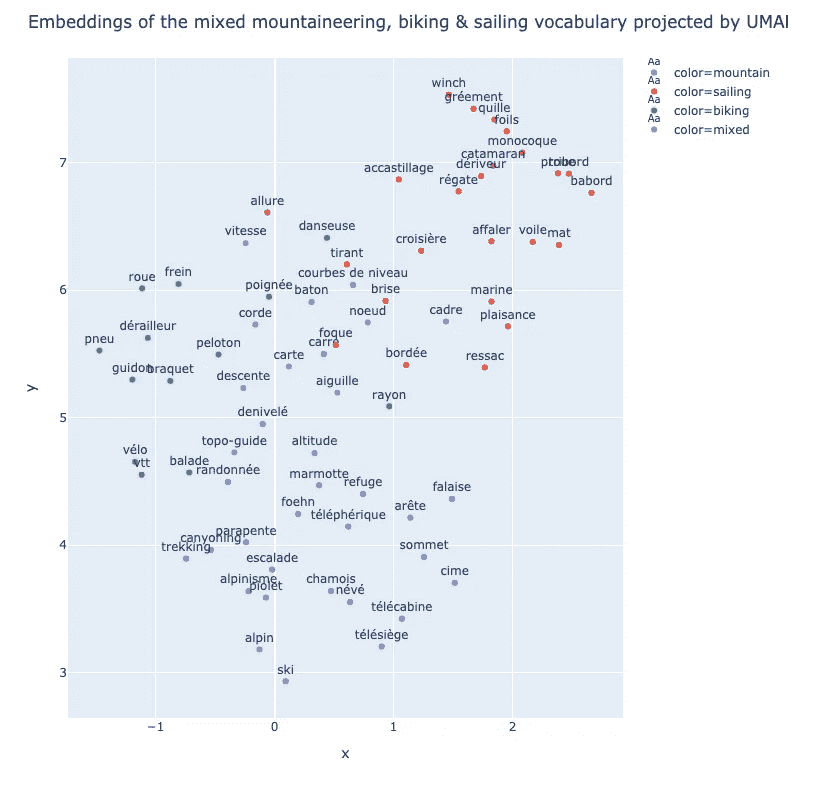

现在让我们来设计从攀岩到滑雪的更具体的登山活动词汇:

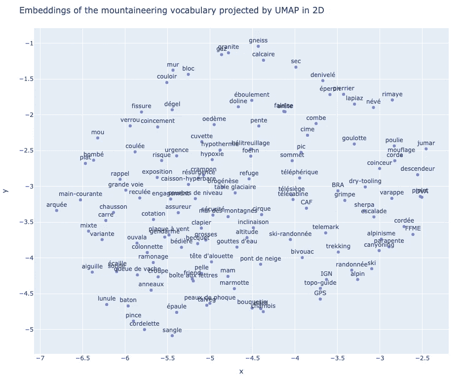

这幅图像几乎没有结构。即使是看起来很接近的事物，如缆车变体( *télésiège、téléski、télécabine* )也不总是聚集在一起。

# 分类

现在让我们执行一个更完整的机器学习任务:根据活动对来自 CampToCamp.org 的路线描述进行分类:徒步旅行、爬山(在岩石上、冰上、混合、在山上、via-ferrata)、滑雪、山地自行车和雪鞋。

每条路线都可以标记多个活动，问题是多类多标签。实际上，大多数路线有 1 个活动，最多有 3 个活动。

比较了四种分类器模型:

1. *fastText* 法国计算嵌入模型，然后是卷积神经网络(CNN)

2. *fastText* 建立在语料库上的分类器(多项式逻辑)

3. *fastText* 建立在语料库上的嵌入，用于向 CNN 提供信息

4.CNN 在第一阶段计算嵌入

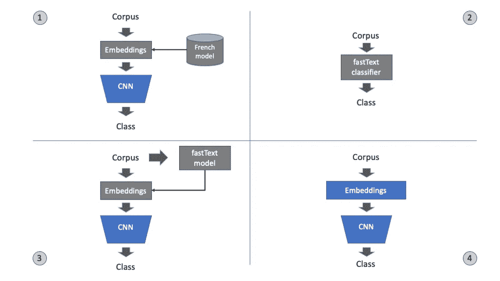

经过测试的分类器架构

# 实现提示

语料库序列(路线描述)在 300(超过 80%更短)或 600 个单词(超过 95%更短)处被填充和截断。

卷积在序列字和嵌入的二维平面上。该架构是经典的漏斗形状(特征空间在网络中越深越小)，初始计算层是卷积的，最终层是密集的。主要参数是:

*   层数
*   盘旋的宽度
*   汇集或步幅参数
*   正规化，主要利用辍学

损失是在 sigmoid 激活的输出处应用的分类交叉熵。在训练期间，还通过分类准确度来评估表现。

挑战之一是过度拟合，因为与样本数量相比，参数总数仍然相当高。另一个挑战是，1 类(滑雪旅游)比其他类(占总数的 40%)大得多，而 4 / 10 类低于 5%。如下图所示，除了与一个或多个主要活动相关的活动之外，模型很好地处理了这个问题。例如，雪鞋旅行介于滑雪旅行和夏季徒步旅行之间(大多数人实际上更喜欢滑雪旅行而不是雪鞋旅行)。

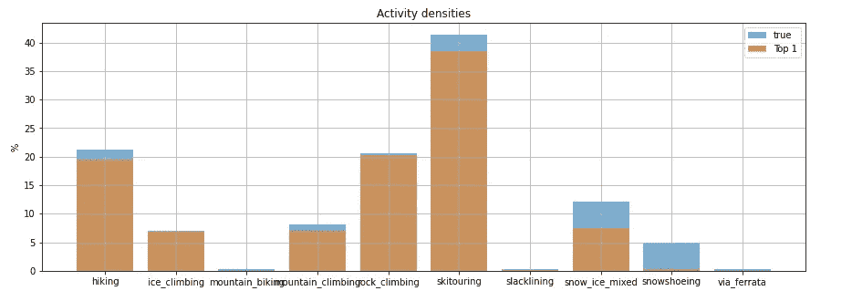

真实活动密度(多标签合计> 100%)和使用模型 2(快速文本分类器)的前 1 名预测

# 测试和验证

与训练数据集相比，测试数据集的验证精度略有不同。它根据以下规则计算前 1 名、前 2 名和前 3 名的准确度:

*   Top-1 基于具有最高概率的预测类别，并检查该类别是否在该序列的标签中
*   Top-2 基于两个最高的预测概率，并与标签进行比较。在应用于给定序列的标签号是 1 的情况下，由于应用了两个候选类别，所以前 2 个匹配比前 1 个更容易。在将 2 个或更多个标记应用于序列的情况下，与前 1 个统计量的差异不如前一种情况有利。
*   前 3 名与前 2 名相似，但概率最高

根据这一指标，第一个模型表现稍差，而所有其他模型表现相似。这 3 个模型之间的排序取决于初始化和训练测试数据集的划分。这意味着由 *fastText* 生成的简单高效的分类器的性能与更复杂的 DNN 一样好。

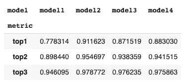

4 个调查模型的前 1 到前 3 名准确度

被错误分类的路径的描述长度直方图类似于所有路径的描述长度直方图。

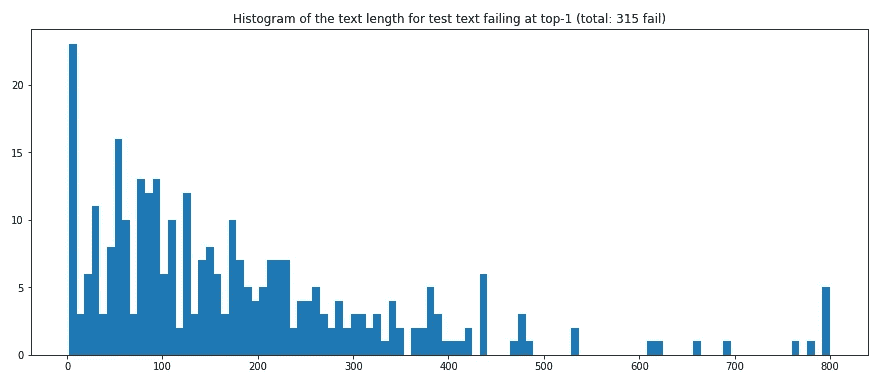

错误分类的路径描述长度的直方图

让我们检查模型 4 的最后一个 DNN 层输入端的估计值。维数是 64，与取出 10 个候选类的概率(sigmoid 激活)的最后一层的输出相比，它通常更有趣。

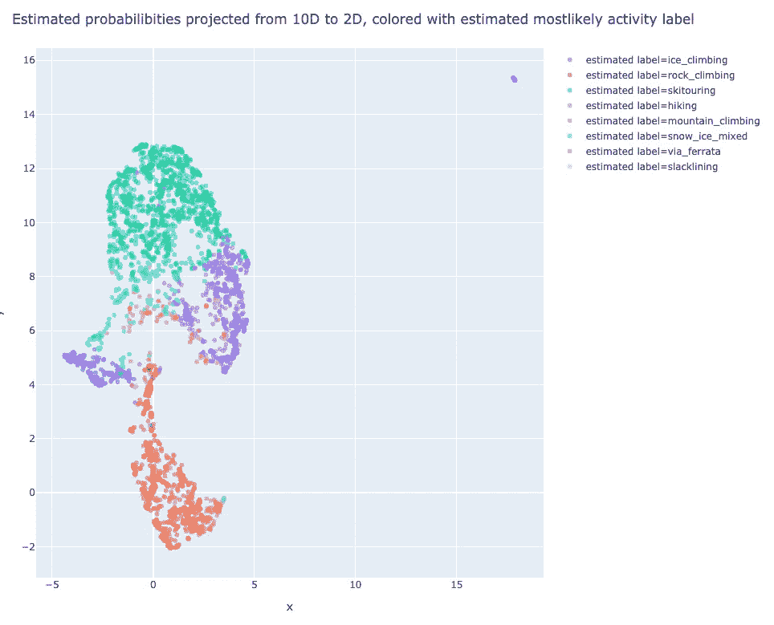

由预测的 top-1 活动着色的最后一个 CNN 图层输入投影

路线通常在对应于活动的群中被很好地分开。令人惊讶的是，有一个集群相当遥远，与“徒步旅行”有关。

将颜色编码改为最高精度的“通过”或“失败”,我们看到失败遍布各处，但在簇的薄连接处具有更高的浓度。

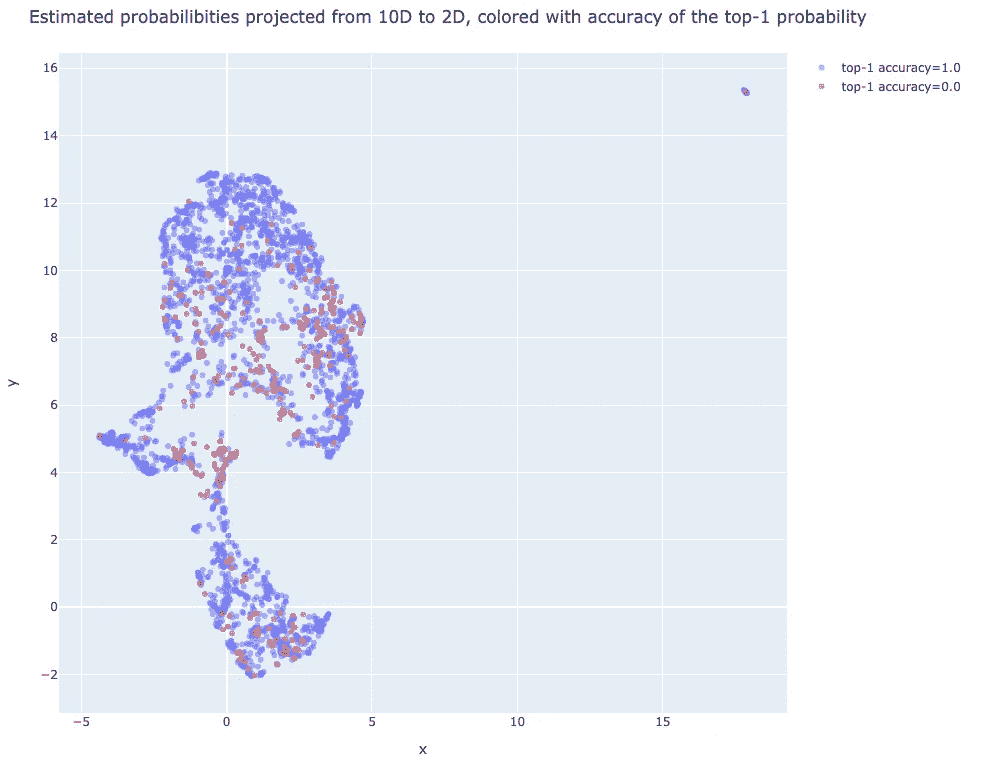

由预测的 top-1 活动的准确性着色的最后一个 CNN 图层输入投影

阅读路线描述的一些失败是显而易见的:它很短，不完整，不精确，分类器用纯粹的可能性分配活动。

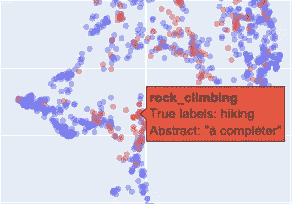

分类失败，路线描述设置为“完成”

这一点通过观察奇怪的偏远的徒步旅行路线群得到了验证。它由描述为“Info”的路由组成，这可以很容易地被规则检测到，但是分类器已经将它们困住了。

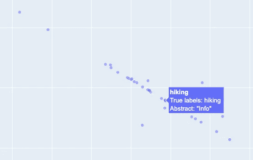

描述设置为“信息”的徒步旅行路线聚类

其他一些更令人不安，如下面的一个，其中活动在描述中被明确命名:

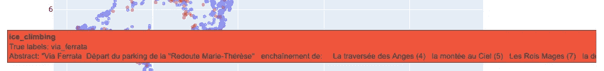

使用包含要预测的活动名称的描述进行分类失败

如果分类器能够更好地理解这种语言的微妙之处，它还可以改进，就像这个旅程描述一样:

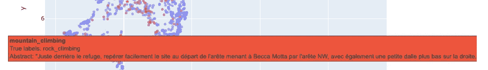

分类失败时，描述分析起来相当复杂，并且需要良好的语言模型

# 结论

对于这个中等复杂度的任务， *fastText* 简单分类器表现良好，并且计算成本远低于完整语言模型的训练、嵌入的计算和通过 CNN 的分类的关联。

如果任务更复杂，比如计算几个输出(例如:路线的活动和难度)，这个分类器可能不够灵活。

## 哪种嵌入？

我们已经评估了三种构建和使用嵌入的方法，并提供给神经网络:

1.模型 1:使用带有*快速文本*的预先计算的语言模型

2.模型 3:使用 *fastText* 从语料库中构建模型并计算嵌入

3.模型 4:直接拟合神经网络中的嵌入

如果语料库的语言不具体，或者如果像偏见这样的伦理问题很重要，第一种解决方案是最好的。

第二种解决方案是同时利用语料库的特定语言和对 *fastText* 的优化(例如:子词 Ngrams，其对于词汇表之外的词更健壮，因此具有更好的泛化能力)

第三种解决方案是利用嵌入和分类器的组合优化，但是并不比其他方案执行得更好。它还表明 Tensorflow 和类似的工具正在迅速成为执行机器学习的通用工具。没有太多的工程复杂性，定制的解决方案被创建。然而，它缺乏可解释性，如下图所示，这些嵌入是在登山词汇上生成的。

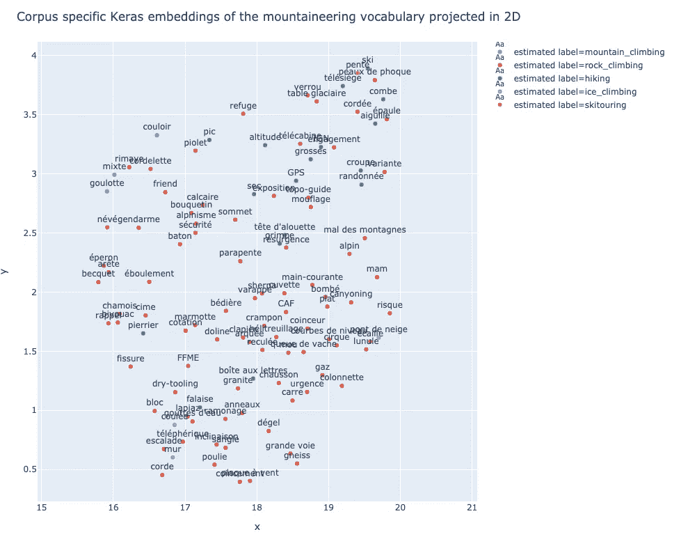

Keras 对登山词汇的嵌入

## 笔记本电脑

*   [CampToCamp.org 数据准备](https://nbviewer.ipython.org/github/tonio73/data-science/blob/master/nlp/DownloadC2cRoutes.ipynb)
*   [带有分类器评估的主笔记本](https://nbviewer.ipython.org/github/tonio73/data-science/blob/master/nlp/C2C_Fasttext-Tensorflow.ipynb)

## 参考

```
[1] Bag of Tricks for Efficient Text Classification, J. Armand, G. Edouard, B. Piotr, M. Tomas, 2017, Proceedings of the 15th Conference of the {E}uropean Chapter of the Association for Computational Linguistics: Volume 2, Short Papers ([https://www.aclweb.org/anthology/E17-2068/](https://www.aclweb.org/anthology/E17-2068/))[2] Learning Word Vectors for 157 Languages, G. Edouard, B. Piotr, G. Prakhar, J. Armand, M. Tomas, 2018, Proceedings of the International Conference on Language Resources and Evaluation (LREC 2018)} ([https://arxiv.org/abs/1802.06893](https://arxiv.org/abs/1802.06893), [https://fasttext.cc/docs/en/crawl-vectors.html](https://fasttext.cc/docs/en/crawl-vectors.html))[3] Efficient Estimation of Word Representations in Vector Space, T. Mikolov, K. Chen, G. Corrado, J. Dean, 2013 (https://arxiv.org/abs/1301.3781)[4] GloVe, Global Vectors for Word Representation , J. Pennington, R. Socher, C.D. Manning, 2014 ([http://www.aclweb.org/anthology/D14-1162](http://www.aclweb.org/anthology/D14-1162))[5] REST API for [www.camptocamp.org](http://www.camptocamp.org), Github ([https://github.com/c2corg/v6_api](https://github.com/c2corg/v6_api))[6] Visualizing Data using t-SNE, L. Van der Maaten, G. Hinton, Journal of Machine Learning Research, 2008 (http://www.jmlr.org/papers/volume9/vandermaaten08a/vandermaaten08a.pdf)[7] UMAP: Uniform Manifold Approximation and Projection for Dimension Reduction, McInnes, Healy, Melville, 2018, ([https://arxiv.org/abs/1802.03426](https://arxiv.org/abs/1802.03426))
```