# 用优化器优化神经网络训练综述

> 原文：<https://towardsdatascience.com/full-review-on-optimizing-neural-network-training-with-optimizer-9c1acc4dbe78?source=collection_archive---------35----------------------->

## 通过调整 Tensorflow 中的优化器来加速深度神经网络训练


图片由 [Greg Rosenke](https://unsplash.com/@greg_rosenke) 在 [Upsplash](https://unsplash.com/photos/0vXelw6zOow) 上拍摄

训练深度神经网络是一项极其耗时的任务，尤其是对于复杂的问题。对网络使用更快的优化器是加快训练速度的有效方法，而不是简单地使用常规的梯度下降优化器。下面，我将讨论并展示 5 种流行的优化器方法的训练结果/速度:**动量梯度下降和内斯特罗夫加速梯度、AdaGrad、RMSProp、Adam 和 Nadam 优化**。

使用不适当的优化器的一个危险是，模型需要很长时间才能收敛到全局最小值，否则它将停留在局部最小值，导致更差的模型。因此，知道哪个优化器最适合这个问题将会节省您大量的培训时间。

优化器调优的主要目的是加快训练速度，但它也有助于提高模型的性能。

## 1.梯度下降

计算关于每个θ的相关成本函数的梯度，并得到指向上坡的梯度向量，然后使用下面的等式在与向量方向相反的方向(下坡)前进:

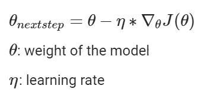

作者图片

因此，梯度下降优化器的速度仅取决于学习率参数(eta)。在一个小的学习率下，GD 会在一个平缓的表面上以小而不变的步伐向下，在一个陡峭的表面上以稍快的步伐向下。因此，在一个大型神经网络中，它会重复数百万个缓慢的步骤，直到达到全局最小值(或陷入局部最小值)。因此，运行时间变得非常慢。

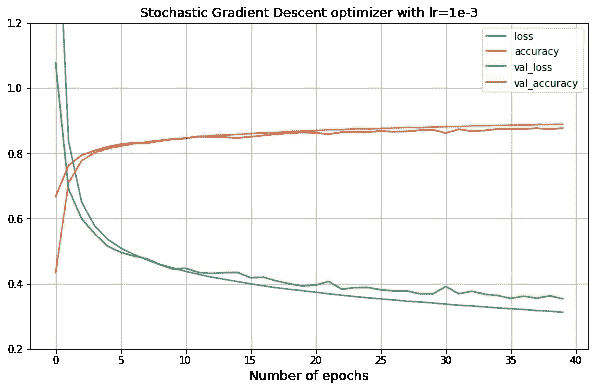

在每个历元之后，精确度慢慢增加

还有其他版本的梯度下降，如**批量梯度下降**(在完整数据集上运行)、**小批量梯度下降**(在数据集的随机子集上运行)、**随机梯度下降— SGD** (在每一步选择一个随机实例)，并且都有优点和缺点。**批量梯度下降**可以以非常慢的速度达到全局最小值。**小批量梯度下降**比 BGD 更快地到达全局最小值，但是更容易陷入局部最小值，并且与其他两个相比，SGD 通常更难到达全局最小值。

## 2.动量优化

让我们想象一下，当一个球从山顶滚下斜坡到山脚时，它会开始缓慢，然后随着动量的增加而增加速度，最终以很快的速度达到最小值。这就是**动量优化**的工作原理。这是通过添加一个*动量向量 m* 并用来自*动量向量(m)* 的这个新权重来更新θ参数来实现的

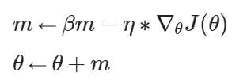

梯度下降不考虑以前的梯度。通过添加动量向量，它在每次迭代后更新权重 *m* 。动量β 是控制终端速度有多快的参数，通常设置为 0.9，但应该从 0.5 调整到 0.9。因此，*动量优化器*比 SGD 收敛得更好更快。

```
# Implement Momentum optimizer in Tensorflow
optimizer=keras.optimizers.SGD(lr=0.001, momentum=0.99)
```

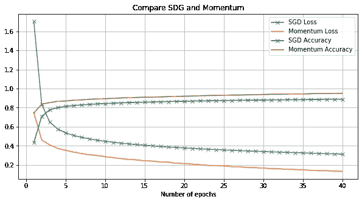

动量收敛更快，最终达到比 SGD 更好的结果

## 3.内斯特罗夫加速梯度

动量优化器的另一个变体是 NAG。

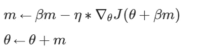

代价函数的梯度在位置θ+βm 处测量(而不是原始动量优化中的θ)。这背后的原因是动量优化已经指向了正确的方向，所以我们应该使用稍微靠前的位置(大约在θ的下一个位置)来适度加快收敛速度。

```
# Implement Nesterov Accelerated Gradient optimizer in Tensorflow
optimizer=keras.optimizers.SGD(lr=0.001, momentum=0.9,nesterov=True
```

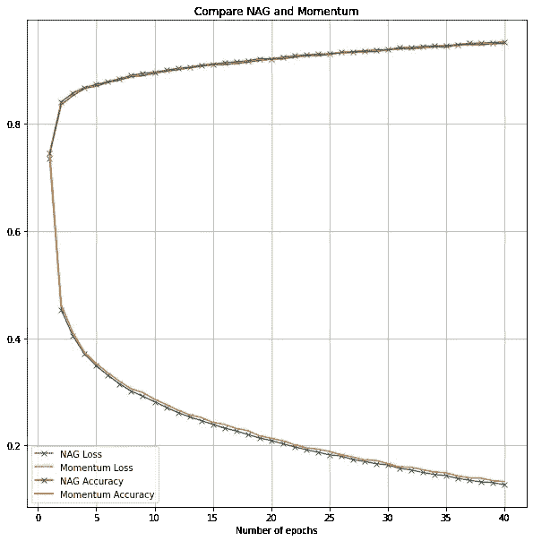

NAG 仅取得了比最初势头稍好的结果

## 4.阿达格拉德

一种自适应学习速率方法，在这种方法中，算法在陡坡上比在缓坡上走得更快。 *AdaGrad* 在简单的二次问题中表现良好，但在训练神经网络时表现不佳，因为它往往会变慢得太快，并在达到全局最小值之前停止。由于这个缺点，我通常不使用 *AdaGrad* 用于神经网络，而是使用 *RMSProp* ，这是 *AdaGrad* 的替代方案。

## 5.RMSProp —均方根 Prop

这是最常用的优化器之一，它延续了*阿达格拉德*的想法，试图最小化垂直移动，并在水平方向朝着全局最小值更新模型。

*Adagrad* 对第一次迭代的梯度求和，这就是为什么它通常不会收敛到全局最小值，而 RMSProp 会累加前一次迭代的梯度:

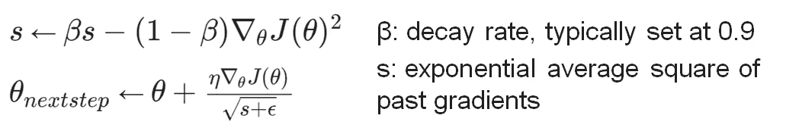

```
# Implement RMSProp optimizer in Tensorflow
optimizer=keras.optimizers.RMSprop(lr=0.001, rho=0.9)
```

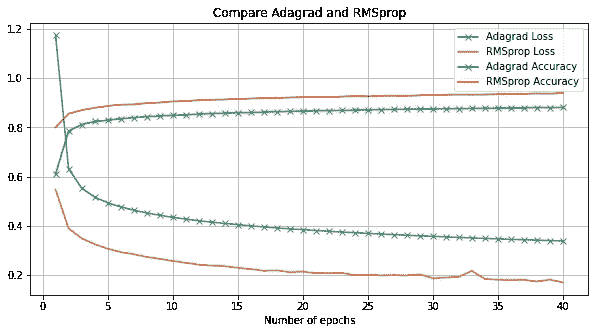

RMSProp 比 Adagrad 收敛得更好，Adagrad 在平稳状态下会丢失

## 6.圣经》和《古兰经》传统中）亚当（人类第一人的名字

Adam 优化器是 momentum 和 RMSProp 优化器的组合。换句话说，它考虑了过去梯度的指数衰减平均值和过去平方梯度的指数衰减平均值。

有了这些特性，Adam 适合处理具有复杂数据和大量特征的复杂问题上的稀疏梯度。

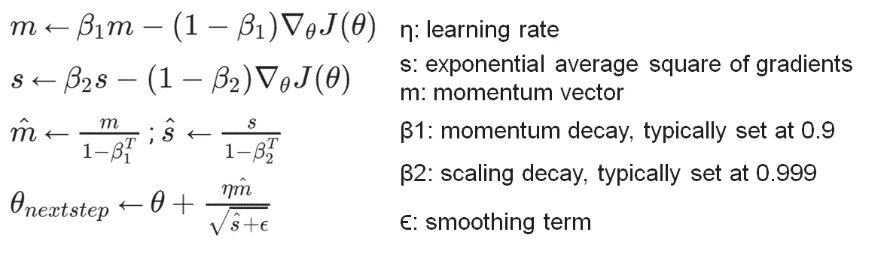

```
# Implement Adam optimizer in Tensorflow
optimizer=keras.optimizers.Adam(lr=0.001, beta_1=0.9, beta_2=0.999)
```

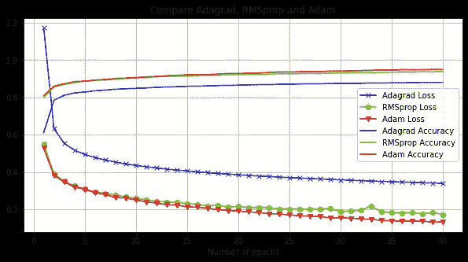

## 7.那达慕

亚当的另一个变化是那达慕(使用亚当优化与内斯特罗夫技术)，导致比亚当稍快的训练时间。

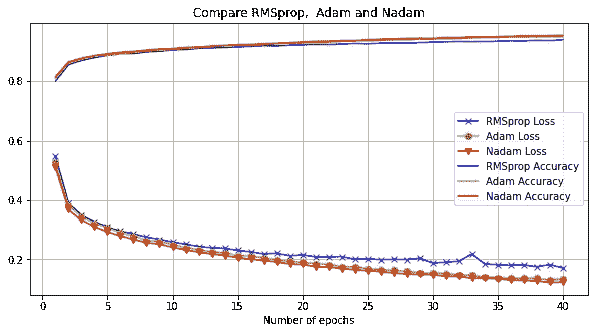

```
# Implement Nadam optimizer in Tensorflow
optimizer=keras.optimizers.Nadam(lr=0.001, beta_1=0.9, beta_2=0.999)
```

*Adagrad、RMSProp、Ada、Nadam* 和 *Adamax* 是*自适应学习率算法*，对超参数的调整要求较少。如果模型的性能没有达到您的预期，您可以尝试换回*动量*优化器或*内斯特罗夫加速梯度*

# 最后的话🖖

总之，大多数时候，*自适应学习速率算法*在速度方面优于梯度下降及其变体，尤其是在深度神经网络中。然而，*自适应学习率算法*不能确保绝对收敛到全局最小值。

如果您的模型不是太复杂，只有少量的特征，并且训练时间不是您的优先事项，使用动量、内斯特罗夫加速梯度或 SGD 是最佳起点，然后调整学习率、激活函数、改变初始化技术来改进模型，而不是使用*自适应学习率*优化器，因为后者会阻碍不收敛到全局最小值的风险。

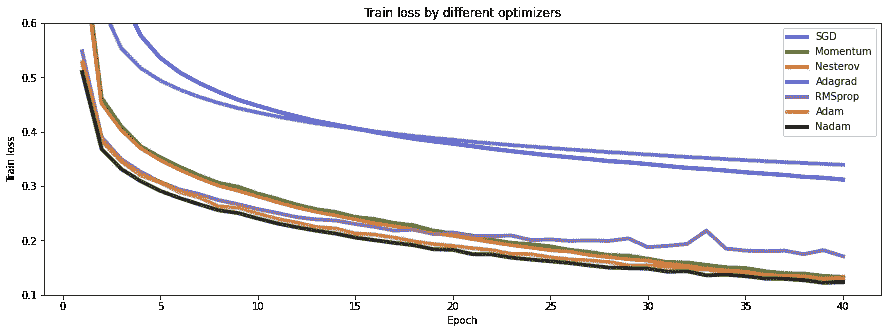

比较不同优化器模型的损失

*   常规 *SGD* 或常规*梯度下降*需要更多时间收敛到全局最小值。阿达格拉德经常在达到全局最小值之前过早停止，所以它最终成为最差的优化器。
*   利用[时尚 MNIST](https://github.com/zalandoresearch/fashion-mnist) 数据集，*亚当/那达慕*最终表现优于 *RMSProp* 和*动量/内斯特罗夫加速梯度*。这取决于型号，通常，*那达慕*比*亚当*表现更好，但有时 *RMSProp* 表现最好。
*   以我的经验，我发现 *Momentum，RMSProp* ，和 *Adam* (或 *Nadam* )应该是模型的初试。

## 摘要

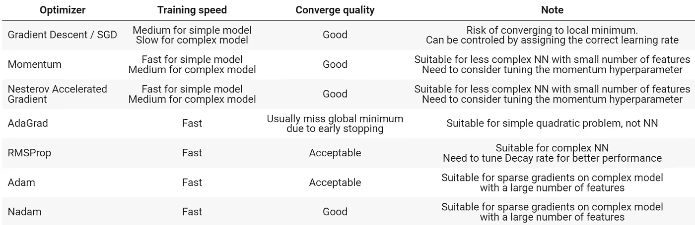

你可以在这里找到源代码。

通过调整**初始化、激活函数和批量归一化**来提高深度神经网络性能和训练速度的详细说明在这里是。