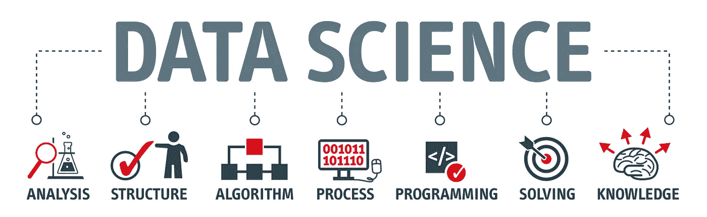

# 全栈数据科学:下一代数据科学家

> 原文：<https://towardsdatascience.com/full-stack-data-science-the-next-gen-of-data-scientists-cohort-82842399646e?source=collection_archive---------2----------------------->

## 这篇博客文章讲述了如何成为一名机器学习数据科学家，以跟上行业不断变化的需求。

多年来，数据科学一直是一个引人注目的领域，吸引了受过正规教育的年轻人，他们拥有计算机科学、统计学、商业分析、工程管理、物理、数学或数据科学方面的学士、硕士或博士学位。然而，人们对数据科学有很多误解。不再只是机器学习和统计。这些年来，我和很多数据科学的有志之士谈论过进入这个领域。为什么会有关于数据科学的大肆宣传？还是统计学和机器学习能帮你打入这个领域？还会是未来吗？即使我和你们都在同一条船上，但我现在正经历着对进入这一领域的下一代数据科学家的需求是如何塑造的。我不打算教你如何进入数据科学，因为互联网上的许多人已经在做了。

图片来自 Datanami 的 shutterstock

# **为什么有这么多关于数据科学的宣传？**

每个人都想进入数据科学领域。几年前，该领域存在一个供需问题:在 DJ Patil 博士和 Jeff Hammerbacher 提出**数据科学**这个术语后，数据科学家的供应减少了，需求增加了。但是现在，2020 年，情况有了转机。受过正式/mooc 教育的数据科学爱好者的流入量增加了，需求也增长了，但没有增长到那种程度。这个术语已经变得越来越宽泛，包含了从事数据科学所需的大多数支持功能。我想引用 KD nuggets 中我最喜欢的一句话:

> “数据科学就像青少年性行为:每个人都在谈论它，没有人真正知道如何做，每个人都认为其他人都在做，所以每个人都声称自己在做。”

玩笑归玩笑，以下是我认为数据科学接管了所有炒作的一些原因:

1.  数据科学家头衔背后的秘密
2.  高工作满意度
3.  巨大的业务影响
4.  许多工作网站将其评为最热门的工作(Glassdoor 评选的美国最近 3 年最热门的工作)
5.  前沿发展
6.  不断涌入的数据生成
7.  感谢许多优秀/不太优秀的学校和训练营提供数据科学学位
8.  数据很美！(不是字面意思:p)

# 自称数据科学家的人？

有人要说了，那我就来撒点目前行业情况的真相吧。由于对闪亮的**数据科学家**头衔的需求和声望的增加，许多公司已经开始将数据科学家头衔与产品分析师、商业智能分析师、商业分析师、供应链分析师、数据分析师和统计学家交换，因为人们正在离开他们的工作，以获得公司提供的数据科学家头衔。这完全是因为这个词语上的微小变化，许多角色都得到了尊重。因此，公司已经开始扭曲头衔，以同样的方式，使它更闪亮，更受欢迎，比如数据科学家-分析，产品数据科学家，数据科学家-增长，数据科学家-供应链，数据科学家-可视化，或数据科学家-等等。。

大多数追求教育/在线培训的人都有一个误解，即所有数据科学家都建立了花哨的机器学习模型，但这并不总是正确的。至少这是我开始攻读应用数据科学硕士学位时的情况，我认为大多数数据科学家都在进行机器学习，但当我进入美国的实习和就业市场时，我才知道真正的真相。推动人们追求数据科学的力量是由于围绕人工智能及其商业影响的炒作。

# 下一代数据科学家—机器学习

对于那些想在 2020 年以数据科学家的身份从事应用机器学习的人来说，ML(这是我如何命名这个头衔的，因为它不是数据科学家-分析:p)，没有博士学位，现在有更多的东西，而不仅仅是知道将机器学习应用于数据集，今天几乎任何人都可以做到这一点。根据我的经验，还有一些其他重要的事情，可以帮助你在面试过程中确定数据科学家的角色，甚至获得入围名单:

1.  **分布式数据处理/机器学习**:获得技术实践经验，如 [Apache Spark](https://spark.apache.org/) ，Apache Hadoop，Dask 等。可以帮助您证明您可以大规模创建数据/ML 管道。对它们中的任何一个都有经验应该是不错的，但是我推荐 Apache Spark(Python 或 Scala 版本)作为首选。
2.  **生产 ML/数据管道**:如果你能获得使用 [Apache Airflow](https://airflow.apache.org/) 的实践经验，这是一款用于创建数据和机器学习管道的标准开源作业编排工具。这是目前在行业中使用的，所以，建议学习并获得一些围绕它的项目。
3.  **DevOps/Cloud** : DevOps 被大多数数据科学有志者所忽视。如果你没有一个基础设施，你将如何构建 ML 管道？在你的本地机器上构建笔记本或运行代码并不像我们在课程中做的那样容易。您编写的代码应该可以跨您或您团队中的其他人可能创建的基础设施进行伸缩。许多公司可能还没有布局好 ML 基础设施，可能正在找人开始。熟悉 [Docker](https://www.docker.com/) 、 [Kubernetes](http://www.kubernetes.io) ，用 Flask 这样的框架构建 ML 应用程序应该是你的标准练习，即使是在你的课程中。我喜欢 Docker，因为它是可扩展的，你可以构建基础设施映像，并在 Kubernetes 集群上的服务器/云上复制相同的东西。
4.  数据库:了解数据库和查询语言是必须的。SQL 很容易被忽视，但它仍然是行业标准，无论是在任何云平台还是数据库上。开始在 [leetcode](https://leetcode.com/) 上练习复杂的 SQL，这将有助于您在 DS 概要文件中进行部分编码面试，因为您将负责从带有持续预处理的仓库中引入数据，这将减轻您在运行 ML 模型之前的预处理工作。大多数特征工程可以在使用 SQL 将数据导入模型的过程中完成，这是许多人忽略的一个方面。
5.  **编程语言**:数据科学推荐的编程语言有 Python、R、Scala、Java。认识他们中的任何一个都没问题，可以做到这一点。对于 ML 类的角色，面试过程中会有现场编码环节，所以你需要在任何你觉得舒服的地方练习——leet code、Hackerrank 或者任何你喜欢的东西。

所以，这个时候，只知道机器学习或统计是不会让你进入数据科学做 ML 的，除非你很幸运，在行业中有一些很好的关系(你显然应该做网络，这非常重要！)或者你名下已经有了一份出色的研究记录。商业应用和领域知识往往来自经验，除了在相关行业实习之外，无法事先学到。

# 我到底怎么了？

两个月前，我作为一名数据科学家从研究生院一毕业就加入了媒体巨头 ViacomCBS，除了研究助理和实习之外，我没有任何全职的行业经验。我在这里的职责包括从构思-开发-生产构建 ML 产品，我使用上面列出的大部分东西。希望这能对所有有志的数据科学家和试图打入这个领域的机器学习工程师有所帮助。

在 gmail dot com 的[我的名字][我的名字]上提问，或者在 [LinkedIn](https://www.linkedin.com/in/jkachhadia) 上联系。