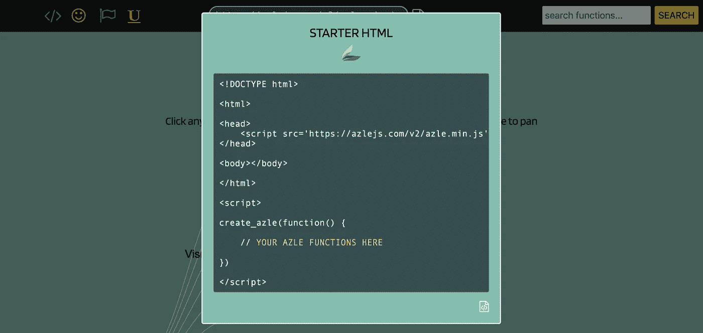
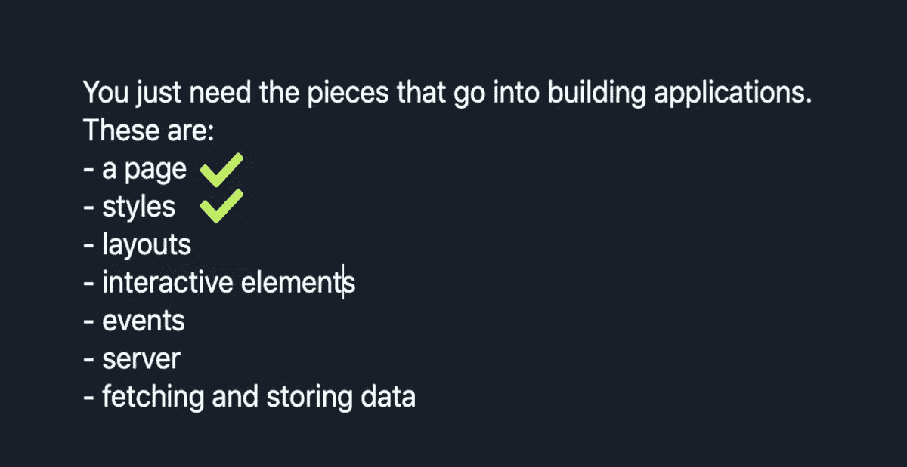
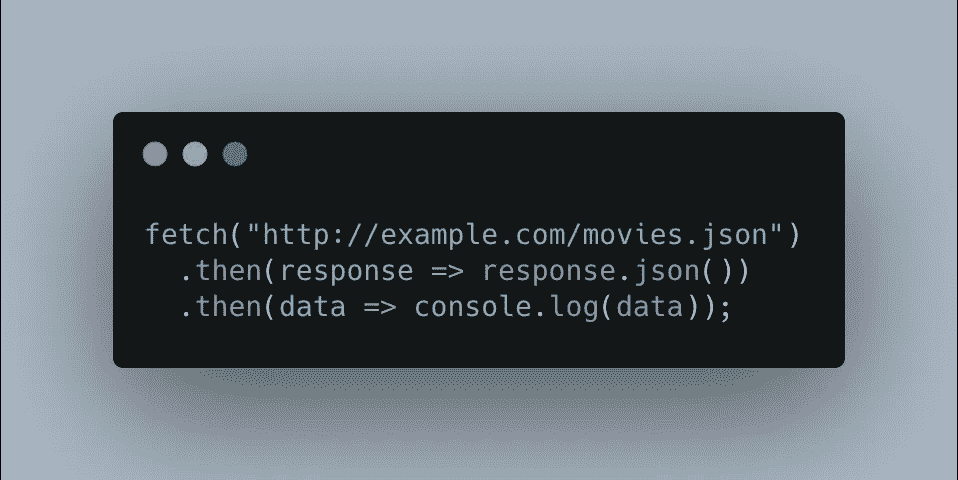
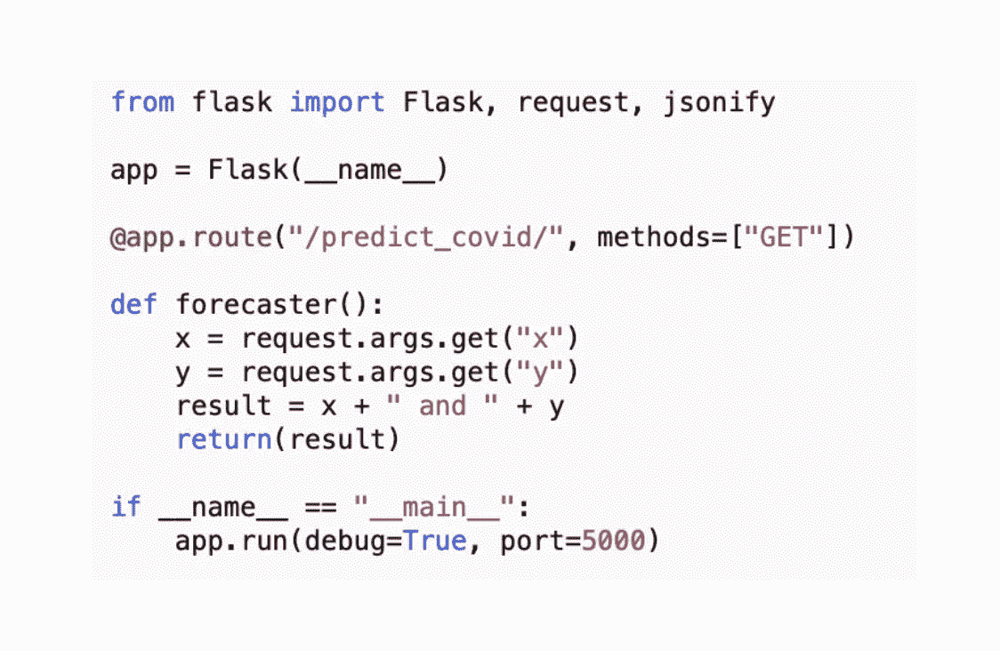

# 一个 Twitter 线程中的全栈开发

> 原文：<https://towardsdatascience.com/full-stack-development-in-1-twitter-thread-5a0cbce2e059?source=collection_archive---------31----------------------->

## 将你的想法变成现实的端到端步骤


你好，我是尼克🎞 on [Unsplash](https://unsplash.com/s/photos/builder?utm_source=unsplash&utm_medium=referral&utm_content=creditCopyText)

# 当形式追随功能

人有想法。很多想法。但是他们有多少次把这些想法变成现实呢？我们脑袋里的东西和*创造的东西*有明显的区别。

大部分人不做软件。这包括实际软件团队中的许多人。如果你现在不编码，你会认为创建工作软件是别人的工作。也许你想自己开始学习(或重新学习),但认为这需要太长时间，太具技术挑战性，或者只是你不感兴趣。

想法通常以图画、便利贴、模型和“可点击的应用程序”的形式存在，所有这些都可以捕捉想法，但很难验证可行的东西。在一个人的想法和自然允许发生的事情之间有一个过渡点，通过这个过渡，创新*实际上*发生了。在形式和功能之间有一个美丽的对应，只有一个真正的工作软件才能展示出来。

不做软件的人没有任何借口。不管你的兴趣是什么，如果你想看到你的想法变成现实，那么你需要开发软件。鉴于当今工具的抽象水平，完整的软件可以被快速地创建出来。

软件开发不是给计算机“编程”,而是制作一些真实的东西，与人互动，成为工作经济的一部分。

我最初在 Twitter 上用一个线程写了这篇文章，以展示任何人创建端到端的软件应用程序是多么容易。

有许多错误的机会守门人。你需要正规教育、在线课程或多年丰富经验的假设显然是错误的。每个人都有能力把他们的想法拼凑成实际可行的东西。

让我们开始吧。

# 这些碎片

你只需要一个浏览器，一个记事本，和你电脑的终端(PC 上的命令提示符)。构建所有应用程序需要几个高级步骤:

*   一页
*   风格
*   布局
*   互动元素
*   事件
*   计算机网络服务器
*   获取/存储数据

人们很少从头开始写程序了。那太慢了。今天我们使用图书馆。我们将使用 **JavaScript** 和 **Python** 库。我会用 [**Azle**](https://azlejs.com) 做前端的东西(`DISCLAIMER` : *我创建了 Azle，但是你可以用任何 JS 库*，后端的东西用 Flask。

让我们从我们的页面开始。

页面总是有一个`index.html`文件。进入 [Azle](https://azlejs.com) 主页，点击左上角的 **STARTER HTML** 图标。*复制*和*粘贴*这个到记事本或者任何你想要的编辑器(我会用 [TextWrangler](https://www.barebones.com/products/bbedit/TimetoSwitchFree.html?gclid=Cj0KCQiA-rj9BRCAARIsANB_4ACrnAhFW61USqgftoMWarqrPhY93mgSfnR_CxVenPMoBcg2i-RWUeoaAj2rEALw_wcB) )，然后保存文件为`index.html`(在你的桌面上)。



从 [Azle](https://azlejs.com) 中抓取启动 HTML 文件。

每个 web 应用程序都有一个`index.html`文件。它是当你加载一个网站或网络应用程序时，你的浏览器指向的页面。让我们把这个文件放在一个叫做`my_app`的文件夹中，然后把你的`index.html`文件拖到这个文件夹中:


如果右击`index.html`文件并选择您的浏览器，您可以查看该页面。这样做将弹出打开您的浏览器，并显示一个空白页。

让我们用*样式*页面。从 [Azle](https://azlejs.com) 中获取`style_body`代码，然后*将*粘贴到你的`index.html`文件中(在`create_azle`函数内):

不要像 Reddit 一样，因为自己丑就觉得自己很酷。去拿一些极简的十六进制代码，把你的页面设计成 2020 年的样子。没有什么比俄罗斯粉彩更能体现我的现代感:

[flatuicolors.com/palette/ru](https://t.co/urjIhvFRiz?amp=1)


点击*上的*选择你喜欢的颜色。*用新颜色替换`style_body`功能中的*背景颜色。我会选择比斯开。我们也不想使用标准的浏览器字体，因为唯一比看起来像 Reddit 更糟糕的是看起来像 Craigslist。

[**谷歌字体**](https://fonts.google.com) 救场。我会选择 Ubuntu。好看又现代。

当然，我们需要让我们的谷歌字体可用。让我们在调用我们的`style_body`函数之前*加载*。*在文档中搜索*中的“字体”找到`load_font`功能):

```
az.load_font("Ubuntu")
```

我还将`style_body`函数中的`min-width`属性设置为 1150px，这样当我调整浏览器大小时页面不会挤压。因为我们只是*原型制作*一个应用程序，所以我们不关心响应度。

我们的**代码**现在应该是这样的:

因为这些都在我们的`index.html`文件中，我们可以刷新浏览器并查看结果:


这里有 [**码笔**](https://codepen.io/cybertime/pen/vYKbxGB) 如果想玩代码的话。尝试更改背景的颜色。当然，改变字体不会有什么影响，因为我们没有显示任何文本。

> 每当你在本文中看到 **CodePen** 时，点击它打开一个标签，显示我们当前代码的实时交互版本。根据自己的喜好调整这些值。

我们正在取得进展…



当然，我们的页面上什么都没有。让我们改变这一点。我们将添加一个**部分**来保存我们的内容。使用`add_sections`功能添加 1 个部分:

…刷新您的浏览器:


Azle 的默认部分颜色是蓝色，但是当然，我们可以根据需要改变它。

[代码笔](https://codepen.io/cybertime/pen/NWrojaO)

尝试更改部分的数量。

让我们回到俄罗斯，看看我们是否能找到比蓝色更好的颜色。使用`style_sections`函数(位于`add_sections`函数的正下方)来设置新部分的样式。为了样式化一个元素，我们必须使用它的**类名**和**实例号**来定位它。我们知道我们的部分的类名叫做“my_sections ”,因为我们只创建了一个部分，所以它一定是第一个实例。我们的`style_sections`函数看起来像这样:

我将选择苹果谷作为我的部分背景色。我还加了一个`6px`的`border-radius`来圆角。我将`height`设置为`auto`，这允许 HTML 元素根据元素内部的内容进行增长和收缩。

因为我们想在页面上**安排**事情，我们将使用**布局**。这些只是网格；放置在页面上的框，我们用文本、按钮、滑块、输入等填充。我将*使用`add_layout`功能添加*一个 2 行 1 列的布局:

看起来是这样的:


我希望第一排能守住我的头衔。我将通过使用另一个`style_layout`函数将*定位到我的布局的第一行*来将第一行的高度更改为`60px`，该函数直接位于上一个函数的下方:

注意我是如何定位行“my_layout_rows”和第一个实例(行 1)的类名的。刷新浏览器以查看不同之处:


> 我们在样式函数的花括号中添加的所有内容都是标准的 CSS 样式。当你试图找出如何实现你想要的风格时，只需在网上搜索合适的 CSS。随着时间的推移，你会学到许多造型技巧。

让我们继续展示我们之前加载的 Ubuntu 字体，为我们的应用程序添加一个标题。我们瞄准布局的第一个单元格，使用`add_text`函数添加文本:


让*增加**标题**的字体大小*，并使*居中*对齐:


目前为止还不错。现在事情变得更有趣了，因为我们的下一步是向我们的应用程序添加交互元素。


让我们在第二个单元格中添加另一个布局来容纳我们的交互元素。*复制*我们之前使用的相同布局代码，*粘贴*在底部。*目标*我们最初布局的第二个单元格，使用 1 行 2 列，将背景涂成奶油色(或者任何你喜欢的颜色)。我们将`add_layout`和`style_layout`作为函数添加到前面代码的正下方，如下所示:


注意，我还使用了`style_layout`函数的`column_widths`属性在列宽之间进行 20/80 分割。

这款应用看起来太“线性”了。让我们通过将边框的`border`设置为`0`来从最近的布局中移除边框:


这样更干净。然而，我仍然希望我们内部布局的两个单元之间有某种分离。让我们从俄罗斯调色板中为第二个单元格“Squeaky”着色:


请注意，我们的应用程序不再需要任何边框，因为颜色单独划分了我们的布局单元格。让我们通过移除外部布局的(我们添加的第一个)边界来使它最小化和平滑。


这里是此时的[密码本](https://codepen.io/cybertime/pen/yLJZbEm)。

现在我们准备添加我们的交互元素。我们没有从我们想要创造的任何**模型**开始，这很好。但是现在可能是一个好时机去思考我们想要的是什么。

当今大多数有趣的应用程序都是数据驱动的。我们可以获取什么样的有趣数据，我们可以使用什么样的模型？当我写这篇文章时，每个人都在想着新冠肺炎。让我们获取新冠肺炎的数据，并使用一个模型来预测病例。

> ****通常的**免责声明*** * * * * *别傻了，用这个模型来做关于疫情的现实生活决策。这只是为了演示的目的。

我们想要公开可用的数据，理想情况下作为“ [RESTful 服务](https://en.wikipedia.org/wiki/Representational_state_transfer)”(“REST API”)交付。REST APIs 将数据和功能“通过网络”传递到我们的浏览器中，使得创建有趣的应用程序变得更加容易，而无需编写大量代码。

如果有人提供新冠肺炎数据作为 REST API，这意味着我们不必自己存储/管理数据；我们可以直接用它

我在这里找到了一个:[https://about-corona.net](https://t.co/CWGBGGIWXx?amp=1)它是免费的，不需要认证。


REST APIs 有“端点”，我们用浏览器指向这些端点来获取实际数据。查看文档后，我找到了我们将使用的端点:

`[https://corona-api.com/timeline](https://t.co/pvWimRKAi3?amp=1)`

这给出了全球死亡**、**、确诊和**痊愈**病例的总数。

任何时候你想看 REST API 的数据是什么样子，只需*打开你的浏览器*到端点:


为了在我们的应用程序中使用数据，我们不像上面那样访问它，而是使用 JavaScript*摄取*数据，并将结果解析成某种有用的形式。但首先，让我们回到我们的模型。现在我们已经看到了数据，我们可以考虑我们的应用程序可能的外观和行为。

一个肮脏的模型是我们锚定我们的方法所需要的。这是我用谷歌幻灯片创作的草图:


用户选择一种类型(死亡、已确认、已康复)，结果显示在右侧的图表中。然后，用户选择一个“地平线”(未来几天)，并单击 FORECAST 在后端运行一个模型，其结果在返回时也会可视化。

有了数据和模型，我们可以开始添加交互 UI 元素。我们需要一个**下拉菜单**，一个**滑块**，一个**按钮**，以及一个**线图**。先说前 3 个。我将在第一个内部布局单元格中添加一个新布局，以帮助定位我们的元素:

请注意，我将`border`设置为`1`，这样我就可以看到新的布局:


现在让我们*在这些新的单元格中添加*我们的 UI 元素。从 Azle 的文档中我们可以得到我们需要的代码。

*添加* **下拉菜单**、**滑块**和**按钮**代码到我们的应用程序中:

嘣，现在我们有了 UI 元素:


让我们*为我们的应用程序定制*这些元素。我们知道下拉列表中需要的选项(死亡、已确认、已康复)。现在添加:

让我们为预测留出最多`30`天的时间。将默认值设置为 1 周(`7`天)，最小值为`1`天，最大值为`30`天:

让我们*将*元素居中，*将*边框从最近的布局中移除。

我们将在新的`style_layout`函数前使用`all_`前缀，将中心对齐一次应用于所有 3 个单元格:

我还将布局上的边框设置为 `0`，因为我们不再需要它。

> 开发时在 1 和 0 之间切换边框。

`halign`和`center`确保所有 3 个单元格的内容水平对齐。


现在让我们将*添加*我们的**线图**可视化。

现在开始看起来像一个真正的应用程序。对于折线图，我们将使用另一个名为 [**的库。Plotly 构建在 **D3.js** 之上，这是一个用 Javascript 编写的行业标准可视化库。**](https://plotly.com/javascript/)

[](https://t.co/ROsNy5974s?amp=1) [## Plotly JavaScript 图形库

### Telsa Motors 和 Standard & Poors 等组织将 Plotly.js 开发与 Chart Studio Enterprise 配对，后者…

t.co](https://t.co/ROsNy5974s?amp=1) 

虽然您可以学习 D3.js 本身，但 Plotly 提供了一个抽象层，使开发(更)快速。*点击 Plotly 网站上的*折线图选项:

我们将*将折线图代码复制到我们的应用程序中。首先，我们需要使这个库可用。使 JS 库对应用程序可用的最简单的方法是通过 **CDN** (内容交付网络)。我们只需将适当的 URL 添加到我们的`index.html`文件的头中。我们从 Plotly 的[入门](https://plotly.com/javascript/getting-started/#plotlyjs-cdn)页面找到了这个 URL:*


现在我们可以在我们的应用程序中使用任何 Plotly 的视觉效果。*从 Plotly 的网站上抓取*的[折线图代码](https://plotly.com/javascript/line-charts/)并将其放入一个名为`draw_line_chart`的函数中，就像这样:

将它放在`index.html`文件中的任何地方，主`create_azle`函数之外(所以在底部的任何地方，但是仍然在`<script>`标签之内)。*看看下一个密码本就知道了。*

如果我们调用我们的`draw_line_chart`函数，它将在 id 为`my_div`的元素中绘制我们的折线图。当然，我们现在没有这样的元素，所以让我们创建一个 HTML 元素来存放我们的情节。

我们将使用 Azle 的`add_html`函数。我将给 div 一个名为“hold_chart”的 id:

让我们回过头来，将前面的`draw_line_chart`函数中的‘my div’改为’**hold _ chart**，这样它就能正确定位目标。

我们需要一种方法来调用我们的`draw_line_chart`函数。让我们点击预测按钮来绘制我们的折线图。

为了将**事件**添加到 Azle 的 UI 元素中，我们使用了`add_event`函数。让我们向预测按钮添加一个点击事件，如下所示:

如果我们现在单击“预测”按钮，我们将看到绘制的折线图:


看起来很棒。这是最新的[密码本](https://codepen.io/cybertime/pen/oNLVMWG?editors=1000)。

Plotly 提供了许多现成的东西。我们得到了**工具提示**、**缩放**、**平移**，以及一系列可定制的选项。在 raw D3 里自己做这些并不好玩。

折线图显示的数据只是 Plotly 提供的模拟数据。显然，我们想获得真实的数据。让我们现在做那件事。

我前面提到过，我们将使用 JavaScript 获取其余数据，并将结果解析成某种有用的形式。关于构建依赖提取数据的应用程序，一个重要的事实是数据必须在使用之前可用。

虽然这听起来很明显，但当一个人刚刚开始学习软件开发时，很容易忽略这一点。例如，当我们的用户第一次加载我们的应用程序时，我们希望显示折线图。但是这个线图依赖于可用的数据。

为了确保我们的应用程序的任何部分都可以使用数据，我们使用了所谓的“异步代码”异步代码在调用我们选择的函数之前会一直等待，直到发生了什么事情(例如，数据已经被获取)。

在我们的例子中，我们希望*获取*新冠肺炎数据，*等待*直到它在我们的应用程序中可用，然后绘制我们的折线图。JavaScript 通过它的“获取”API 使这一切成为可能。使用 fetch，我们只需指向 REST 服务提供的 URL，并告诉它一旦收到数据该做什么。

让我们使用 fetch 将我们的新冠肺炎数据引入我们的应用程序。我们如何使用它？一个简单的谷歌搜索把我带到了今年的，这很好地解释了这个问题。它告诉我们像这样使用 fetch:



让我们*将*粘贴到我们的代码中，使用我们在上面找到的新冠肺炎 URL(就在我们的 Plotly 代码之后):


刷新您的浏览器。应用程序本身看起来没有任何不同。但是如果我们打开“**浏览器控制台**，我们可以看到我们获取的新冠肺炎数据。通过在*屏幕上的任意位置右击*并点击**检查**，打开浏览器控制台。然后单击控制台。

你会看到一个**物体**坐在控制台上。这是我们获取的新冠肺炎数据(注意，我们在上面粘贴的获取 API 显示 console.log(data))。重复单击此对象以查看其结构:

这看起来比我们第一次指向新冠肺炎网址时出现在浏览器中的要好得多。现在我们可以*解析*这个数据对象，使用它的内容来填充我们的折线图。为此，我们需要对绘制折线图的方式做一点小小的改变。

检查我们之前添加的折线图代码，我们可以看到它使用“跟踪”将原始数据转换为线条。我们需要将获取结果中的数据放入跟踪对象的 x 和 y 属性中:


让我们编写一些 JavaScript 来解析获取的结果。我们需要:1。了解源结构；2.了解目的地结构。我们可以像前面一样，通过在浏览器控制台中检查数据来理解源结构。

目的结构是 Plotly 需要的 trace 对象。我编写了以下函数来获取从 fetch 检索的原始数据，并将其转换为 Plotly 所需的跟踪结构:

**函数**是我们在软件中对代码进行分组的方式。它们有一个名字，接受参数，并返回一些结果。函数有助于保持代码的模块化和可维护性。

这里重要的是理解这不是解析数据的*和*方式。这是一种方式。您必须尝试使用 JavaScript，直到找到合适的为止。在线搜索如何解析 JavaScript 对象、遍历对象并返回新的结构。

我的`get_dates_and_cases`函数接受提取的数据，一个选择(例如死亡)，循环遍历它的内容，提取我需要绘制的片段，并返回 Plotly 的对象。我将编写另一个函数，用我们准备好的数据绘制折线图。

我们可以删除我们添加的原始 Plotly 代码，并使用该函数来代替。它使用我们的第一个函数来准备跟踪数据，然后像往常一样绘制折线图。

请确保保留我们添加的“hold _ chart”div，以便绘图有地方可去。

回想一下，我们的获取代码只获取数据，但不处理数据。一旦数据到达，让我们的 fetch 函数绘制我们的折线图。将我们的原始获取代码更改为如下所示:

最后，移除对当前位于我们的`add_event`函数中的`draw_line_chart`的调用。我们一会儿再把它加回去。还有，现在还不用担心`az.hold_value.fetched_data = data`线。我们稍后再解释。

您当前的代码应该是这样的: [CodePen](https://codepen.io/cybertime/pen/BazEQaQ?editors=1000) 。


> 注意，在 CodePen 中，我在 fetch 函数周围包装了一个`setTimeout`。这只是增加了一点延迟，以确保绘制图形时元素在屏幕上。一旦我们在下一步将 fetch 函数移到我们的`add_event`内部，这就不是问题了。

我们的 covid 数据现在显示在折线图中。重要的是，只有从 REST API 中完全提取数据后，才会绘制折线图。概括地说，我们使用 JavaScript 中的异步代码从 API 获取数据，然后在数据准备好之后创建一个可视化。

我们还编写了两个函数来准备原始数据和绘制结果。我们越来越接近了:


…尽管我们还没有讨论数据存储。

我们的下一步是允许用户*选择*一个选择(**死亡**、**确诊**、**痊愈**)来相应地重新绘制折线图。让我们**存储**返回的数据，这样我们可以在需要时使用它，而不必每次都重新提取数据。

我将把返回的数据保存在一个 JavaScript 对象中。我将像这样使用 Azle 的名称空间:


*在浏览器控制台中键入* `az.hold_value.fetched_data`，然后*点击*回车。您可以看到，我们可以通过简单地使用这个对象随时访问我们的新冠肺炎数据。

首先，我们想在用户从下拉列表中做出选择时重新绘制折线图。让我们使用 Azle 的“`change`”事件来实现这一点。

为了*添加*一个事件到我们的元素中，我们使用 Azle 的`add_event`函数，就像我们之前对按钮所做的一样，目标是选择的元素，就像我们对样式所做的一样:

如果您刷新浏览器并从下拉列表中进行选择，您应该会看到提示选择。

现在我们只需要**重绘折线图**而不是调用 alert。我们之前写的`draw_line_chart`函数已经准备好了。它已经将数据和选择作为参数，并相应地重新绘制图形。所以我们需要做的就是将`draw_line_chart`添加到**下拉菜单**的`add_event`函数中:

注意，我们使用的是存储在`az.hold_value.fetched_data`中的数据。我们还使用了一个叫做`grab_value`的新 Azle 函数；这允许我们获取用户在元素上选择的任何值(像往常一样，用`class name`和`class instance`定位)。

让我们看看它是否有效:

太美了。

这是目前的[代号](https://codepen.io/cybertime/pen/rNLbXJz?editors=1000)。

向其他元素添加事件也是同样的方式。但是这些元素涉及到调用一些后端模型来使用我们的新冠肺炎数据进行预测。因此，在添加其他事件之前，让我们开始处理后端**模型**。

对于“后端”,我们需要一台服务器来支持计算我们的预测所需的繁重工作。我们可以使用云提供商，如[数字海洋](https://www.digitalocean.com/)或[亚马逊网络服务](https://aws.amazon.com/)，但是因为我们只是在原型制作想法，我们将使用我们自己的**本地**计算机。

让前端与后端通信需要一个 **web 服务**。web 服务将允许我们向服务器发送请求并接收一些回报。这就是我们所需要的，因为我们想从我们的前端给一个后端模型数据，并返回一个预测。

我们将使用一个名为 [**Flask**](https://flask.palletsprojects.com/en/1.1.x/) 的轻量级 web 框架来用 Python 构建我们的 web 服务。让我们现在做那件事。一开始，我们创建了我们的`index.html` 文件。让我们将另一个文件添加到同一个文件夹中，将其命名为`predict.py`:

我只是复制了 index.html 文件，并删除了内容，使一个空的`predict.py`文件。

现在我们将*添加*一些基本的 Flask 代码到我们当前空白的`predict.py` 文件中。Flask 的文档中有一个[快速入门](https://bit.ly/3c9pfct)指南，向我们展示了设置所需的最少代码:

我们将需要更多的东西，比如额外的库，以使我们的 web 服务适合我们的目的。下面是我们的`predict.py`文件的样子:



在 JavaScript 中，我们使用“cdn”向应用程序添加额外的库，而在 Python 中，我们使用`import`语句。上面我们正在导入 Flask，以及“request”和“jsonify”库，这将使我们能够从前端接收数据和向前端发送数据。

我们还设置了一个“路由”,它是我们服务的“端点”。回想一下我们在从 REST API 获取新冠肺炎数据时对端点的讨论。如果你认为我们正在开发自己的 REST API，那么你是对的:)

如今，企业软件中的许多后端机制都以服务的形式提供，作为 REST APIs 使用。这使得修补各种功能以及维护和扩展应用程序变得更加容易。

在我们的`predict.py`文件中的“route”下面，我们创建了一个函数。Python 函数看起来和 Javascript 函数不一样，但思想是一样的；一段可以接受参数并返回值的模块化代码。我给我们的函数预测员打了电话。

最后，我们在文件末尾指定“端口”。端口是一个编程的停靠点，它允许外界访问我们的本地系统。我选择了 5000 端口。如果您愿意，您可以选择不同的号码(如果它已经被使用，您的电脑会告诉您)

让我们启动我们的 web 服务，看看它是否工作。如果一切顺利，我们将添加我们的预测模型，并开始为我们的应用程序提供真实的预测，以进行消费和可视化。

到目前为止，我们只是使用浏览器和记事本来创建我们的应用程序。但是现在我们需要直接与我们的操作系统对话，为此我们必须使用**终端**(PC 上的命令提示符)。

我用的是苹果电脑，所以你在这里看到的一切都会在苹果电脑上。但是同样的一般步骤也适用于 PC。开放终端。在 Mac 中，最快的方法是通过键入“command +空格键”和键入“终端”来使用 Spotlight 搜索:

在终端打开的情况下，通过运行以下命令进入我们的`my_app`目录:

`cd Desktop/my_app/`

…然后按回车键。现在键入:

`ls`

…然后再次按回车键。

你应该可以看到 index.html 和`predict.py`文件。很难相信我们的整个应用程序只有 2 个文件。

> 由于当今工具中可用的抽象级别，我们只需要最少的代码来创建一个完整的应用程序。

现在，通过运行以下命令来启动我们的 web 服务:

`python predict.py`

…然后按回车键。

您现在正在运行一个 web 服务，将您的 Python 代码公开给任何能够与之通信的应用程序。考虑到现在 Python 中有这么多高性能的库，这很酷。想想你能创造什么！

我们的后端在" **localhost** "， **port** **5000** 上被服务，带有一个*端点*叫做" predict_covid "，接受*参数*叫做" x "和" y "。要“通过网络”传递所有这些信息，我们可以构建以下 URL:

`[http://localhost:5000/predict_covid/?x=100&y=400](http://localhost:5000/predict_covid/?x=100&y=400)`

这是在浏览器中使用 URL 时与 REST API 通信的标准方式。那个？标记在第一个参数名之前，而&在第二个参数名之前。在浏览器中打开一个新标签，将上面的 URL 添加到顶部，然后按回车键。您应该看到以下内容:


我们的 web 服务只是返回我们为“x”和“y”传递的值。不太令人兴奋，但它确实证明了我们的 web 服务是有效的。

让我们把它们端到端地连接起来，这样我们用 JavaScript (Azle)编写的前端应用程序就可以向我们的 web 服务(而不是浏览器)传递数据，并从其接收数据。如果我们成功了，剩下唯一要做的事情就是用 Python 构建一个好的预测模型。

我们需要将以下数据传递到我们的后端:

*   下拉选择
*   滑块值
*   日期和案件数量

> **注意**:我们可以在后端获取 covid 数据，而不是通过网络传递它，但是这样我们会获取数据两次。因为我们只预测几个日期和值，所以使用已经从前端获取的数据更有意义。

我们已经知道如何使用 Azle 的`grab_value`函数从 UI 元素中“获取”值。我们还在我们的`az.hold_value.fetched_data`对象中很好地构造了我们获取的数据。

要将它发送给我们的 web 服务，我们可以再次使用 JavaScript 的`fetch` API。相反，让我们在按钮的事件监听器中使用 Azle 的`call_api`函数:


下面是正在发生的事情的分类:


我们在按钮上添加了一个“事件监听器”，就像我们之前在下拉菜单上做的一样。我们还在事件的函数属性中添加了 Azle 的`call_api`,指定了 Flask 服务的 URL,“x”和“y”参数，以及数据返回时的警告。

刷新浏览器并点击预测按钮:

我们的应用程序正式与我们的后端服务进行交互，向我们的 Python 代码传递数据，并从它接收响应。让我们用我们需要发送的实际数据来替换参数“x”和“y ”,并从滑块值中添加预测范围。

在这里，我从现有的`get_dates_and_cases`函数中获取滑块值以及“x”和“y”数据。


我们现在已经安排好了我们的活动:


最后，我们来建立一个预测模型，根据用户选择的类型(**死亡**、**确诊**、**痊愈**)和层位进行预测。经过一番搜索，我找到了一个名为 [**Prophet**](https://facebook.github.io/prophet/) 的库，它是由脸书开源的。

> 脸书最近也发布了他们的[神经先知](https://github.com/ourownstory/neural_prophet?utm_source=hootsuite&utm_medium=&utm_term=&utm_content=&utm_campaign=)版本。

Prophet 是一个时间序列预测库，有一个针对 Python 的[快速入门](https://bit.ly/3d9ak36)指南，应该可以让我们开始运行。

我们最终的`predict.py`文件从前端接收数据(我们已经知道如何做)，准备 Prophet 库所需的数据(如他们的文档中所指定的)，训练预测模型，进行预测，并返回结果。

所有这些都在大约 10 行代码中。还不错！(这种抽象又为我们工作了)。

在我们的`index.html`文件中，我添加了两个新的函数来为第二次跟踪准备数据(显示预测)。您会看到它与我们为 trace 1 编写的非常相似。我还将新的`draw_forecast`函数添加到了我们的`call_api`函数的`done`属性中。

看看最后的`index.html`看看变化。您应该将最后的更改视为熟悉的代码。如果有什么东西看起来很陌生，在网上搜索一下，了解一下为什么它会被添加进来。

让我们最后一次刷新浏览器，看看完整的应用程序。

我们实现了最初清单上的所有目标:


在唱完之前，我想添加一个**微调器**，当用户点击预测时，他们就知道要*等待*结果。我还希望 Plotly 图表是透明的，这样我们就可以看到我们有漂亮的蓝色背景。最后，我要改变我们的应用程序的标题，因为它是真实的。

你可以在这里找到**最终代码**:

[](https://t.co/8xS6zvu9e3?amp=1) [## Sean-mcclure/开始构建软件

### 此时您不能执行该操作。您已使用另一个标签页或窗口登录。您已在另一个选项卡中注销，或者…

t.co](https://t.co/8xS6zvu9e3?amp=1) 

而这里是 [**决赛** **CodePen**](https://codepen.io/cybertime/pen/ZEOZgqJ?editors=1000) 。请注意，因为 CodePen 没有运行我们的后端 web 服务，所以您不会看到预测。但是在您的本地机器上一切都应该正常工作。

这些是构建任何应用程序的主要部分。有了这些技能，你就可以进入软件开发的世界(或者只是把它作为一种爱好来构建东西)。

就是这样。这篇文章可能看起来很长，但是考虑到你刚刚用*所有的*主要部分制作了一个*完整的*应用程序，还不算太糟糕。如果你遇到困难，可以在[推特](https://twitter.com/sean_a_mcclure)上联系我。我们将一起研究代码。不要停在这里。试试其他库。其他用例。其他任何东西。只是建造。

再说一次，机会的唯一看门人是你自己。