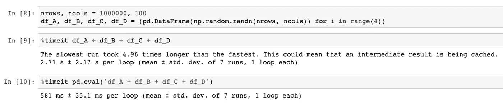
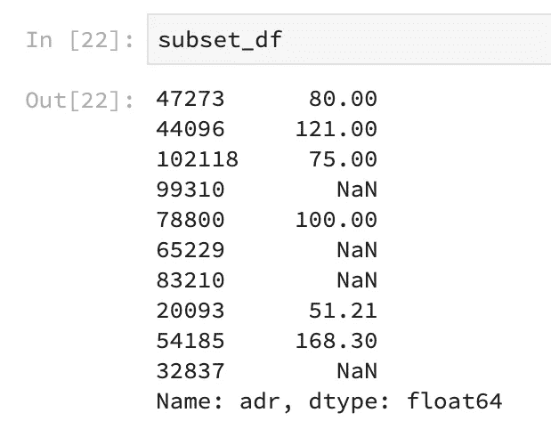
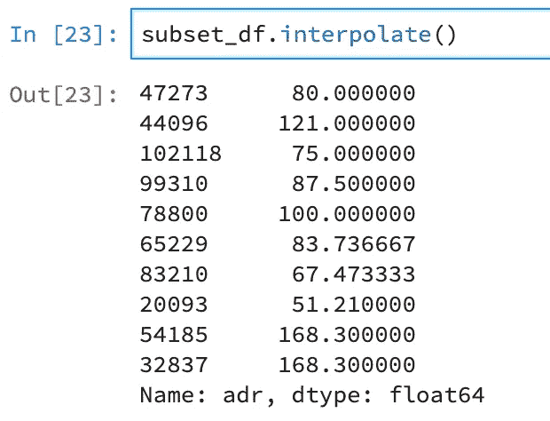

# 全栈熊猫

> 原文：<https://towardsdatascience.com/full-stack-pandas-625f134ce0f6?source=collection_archive---------19----------------------->

## Python 数据分析

## 流行数据分析库的鲜为人知的功能

查尔斯·雷在 [Unsplash](https://unsplash.com?utm_source=medium&utm_medium=referral) 上的照片

> 我所知道的最有价值的商品是信息——戈登·盖柯

我确信我的大多数读者都熟悉 Python 中流行的 Pandas 库。该库提供数据结构来帮助操作关系数据。

Pandas 是一个在数据科学从业者中非常受欢迎的库。Hackr.io 被评为十大数据科学库之一。我本人在工作和个人数据科学项目中广泛使用熊猫。

本文将展示这个库的一些鲜为人知的功能。

*注:如果你没有太多和熊猫相处的经历，我强烈推荐你阅读下面这本书:*

 [## 用于数据分析的 Python

### 获取在 Python 中操作、处理、清理和处理数据集的完整说明。针对 Python 进行了更新…

shop.oreilly.com](http://shop.oreilly.com/product/0636920050896.do) 

*用于数据分析的 Python*是入门熊猫和 Numpy 的绝佳入门读物。这本书是由熊猫图书馆的创建者韦斯·麦金尼写的。

我个人收藏的 Python 数据科学电子书

## 内存使用

熊猫图书馆提供两种类型的数据结构，即系列和数据帧。

这两个都有一个方法，分别叫做`[pandas.DataFrame.memory_usage(](https://pandas.pydata.org/pandas-docs/stable/reference/api/pandas.DataFrame.memory_usage.html?highlight=memory_usage#pandas.DataFrame.memory_usage))`和`[pandas.Series.memory_usage()](https://pandas.pydata.org/pandas-docs/stable/reference/api/pandas.Series.memory_usage.html?highlight=memory_usage#pandas.Series.memory_usage)`。这些方法提供了这些数据结构的内存使用度量。

请注意，当我们添加了`deep=True`选项时，这些数字是如何不同的。这是因为默认情况下，`memory_usage()`方法忽略了*对象*的数据类型。通过设置`deep=True`，我们为熊猫对象检索精确的内存占用度量。

在处理非常大的数据集时，跟踪内存使用情况非常关键。通常，机器学习研究人员会从事新型机器学习模型的原型制作。在这样的过程中，一个常见的错误是忽略硬件容量。跟踪内存消耗有助于压缩使用，从而确保顺利的原型开发周期。

## 表达式评估

Pandas 库支持对其数据结构进行非常快速的矢量化操作。通常，业余数据科学家会使用 Python 的标准运算符对大型数据集进行数值计算。

使用 Pandas 提供的`[pandas.eval()](https://pandas.pydata.org/pandas-docs/stable/reference/api/pandas.eval.html?highlight=eval#pandas.eval)`方法可以更有效地执行这样的计算。表达式是通过构造等效字符串来创建的。
为了说明这一点，让我们创建几个各有 100 万行 x 100 列的样本数据帧，并比较计算简单算术所需的时间。

如果我们观察使用 python 操作符与`pandas.eval()`计算简单加法运算所花费的时间，Pandas 方法花费的时间几乎少了 5 倍。

与标准 Python 操作符相比，`pandas.eval()`方法不仅耗时更少，而且执行计算时消耗的内存也更少。这是因为 Python 操作为每个中间子操作分配内存。例如，在上面的代码中，内存被分配给`df_A + df_B`的输出，然后被添加到`df_C`等等。

相反，在`pandas.eval()`中，整个表达式一次求值。这有助于加速计算，尤其是对于非常大的数据。除了算术运算，`pandas.eval()`还支持众多其他运算。

请随意尝试不同类型的操作，以加速您的数据分析项目。

## 询问

除了表达式求值器，Pandas dataframe 还有一个名为`pandas.DataFrame.query()`的查询方法。当使用这种方法时，从 SQL 背景过渡到 Python 的数据科学家将会特别激动。

`query()`方法为我们提供了过滤数据帧的非常有效的方法。类似于`eval()`方法，`query()`方法将字符串形式的表达式作为输入。

查询方法是一种极其简单但功能强大的处理数据的方法。它的好处与`eval()`相似，花费的时间更少，消耗的内存也更少。
在传统方法中，上面的查询用 Python 写成这样:

`df[(df[‘adults’] > 2) && (df[‘lead_time’] < 40)]`

我们可以清楚地看到，与 query 相比，传统方法看起来相当丑陋。因此，在代码审查期间，查询方法也使审查者的生活更加轻松。

## 插入文字

熊猫有很多方法来处理缺失值。一些比较流行的方法包括`isna()`、`dropna()`、`fillna()`法。

除了前面提到的方法，Pandas 还有一个`pandas.interpolate()`方法，在丢失的数据点执行[插值](https://en.wikipedia.org/wiki/Interpolation)。

当需要对数值缺失值进行快速[插补](https://en.wikipedia.org/wiki/Imputation_%28statistics%29)时，这种方法非常有用。此外，`interpolate()`还可以帮助估计数组中其他两个数值项之间的值。插值在输入法序列分析中有重要的应用，我们不会在这篇文章中讨论。

插值前与插值后

`interpolate()`拥有一套强大的数据插值方法。该方法充当流行的 Python 科学计算库 [SciPy](https://www.scipy.org/) 的插值方法的包装器。

我强烈推荐阅读这个方法的 API 参考，以便更好地理解它是如何工作的。

## 测试

通常情况下，数据科学博客(包括我的博客)包含的内容与花哨的算法、库、数学/统计有关，很少提及软件工程原理，如[设计](https://en.wikipedia.org/wiki/Software_design)和[单元测试](https://en.wikipedia.org/wiki/Unit_testing)。因此，我惊喜地发现 Pandas 拥有专注于软件测试的方法。

像`pandas.testing.assert_frame_equal`这样的单元测试方法可以形成数据分析的单元测试管道的一个组成部分。

在上面的例子中，我们得到一个断言错误作为输出，因为原始数据帧`df`的副本中的一列的数据类型发生了变化。
同样，我们可以使用`pandas.testing`方法来测试*维度、索引、列名*等。我们的数据。

下次你为你的个人/专业数据科学项目开发一个测试驱动的开发环境时，记得结合这些方法。😇

## 式样

Pandas 的另一个我直到最近才知道的特性是造型 API。对于涉及使用 html 笔记本渲染器(如 [Jupyter Notebooks](https://jupyter.org/) )交流发现(EDA)的数据科学项目，样式 API 尤其方便。Pandas 中的样式提供了一种创建演示就绪表格的方法，以有效地交流见解。

上表是从 Kaggle 上的 FIFA 19 数据库中随机抽取前 100 名足球运动员(基于“总体”栏)创建的。在这个子集上，我们应用`pandas.DataFrame.style`的方法来呈现上面显示的漂亮输出。

代码如下:

我们看到，使用 style 中的方法，我们能够使用很少几行代码创建数据表的直观表示。

例如，*值*和*工资*列在每个单元格中都有水平条形图，显示一名足球运动员相对于其他运动员的价值和工资。

让我惊讶的是，在保留数据集原始结构的同时，突出显示这些关键信息是多么容易。每个像素呈现更多的信息，而无需添加单独的可视化。

# 结论

Pandas 是 Python 在数据科学中受欢迎的最大因素之一。这个图书馆的能力真是令人难以置信。

尽管我已经虔诚地使用 Pandas 两年多了，但我并不知道它提供了许多隐藏的功能。希望以后能进一步探索，发现更多俏皮的功能。

本文中使用的其他数据集可以在 Kaggle [这里](https://www.kaggle.com/jessemostipak/hotel-booking-demand)找到。

代码发布在我的 Github [这里](https://github.com/Sayar1106/TowardsDataSciencecodefiles/tree/master/FullStackPandas)。

如果你喜欢这篇文章，请在 Medium 上关注我。另外，请随时在 [LinkedIn](https://www.linkedin.com/in/sayarbanerjee/) 上与我联系。最后，在这些困难时期保持安全。下次见。✋

# 参考资料:

[1][https://pandas . pydata . org/pandas-docs/stable/reference/index . html # API](https://pandas.pydata.org/pandas-docs/stable/reference/index.html#api)

[2][https://pandas . pydata . org/pandas-docs/stable/user _ guide/index . html](https://pandas.pydata.org/pandas-docs/stable/user_guide/index.html)

[3][https://www.kaggle.com/karangadiya/fifa19/data](https://www.kaggle.com/karangadiya/fifa19/data)

[https://www.kaggle.com/jessemostipak/hotel-booking-demand](https://www.kaggle.com/jessemostipak/hotel-booking-demand)

[https://pythonspeed.com/datascience/](https://pythonspeed.com/datascience/)