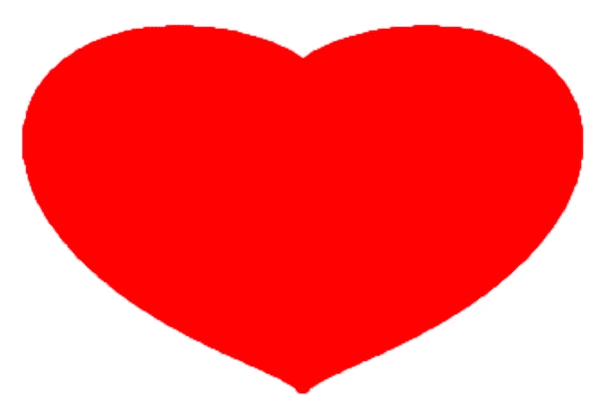
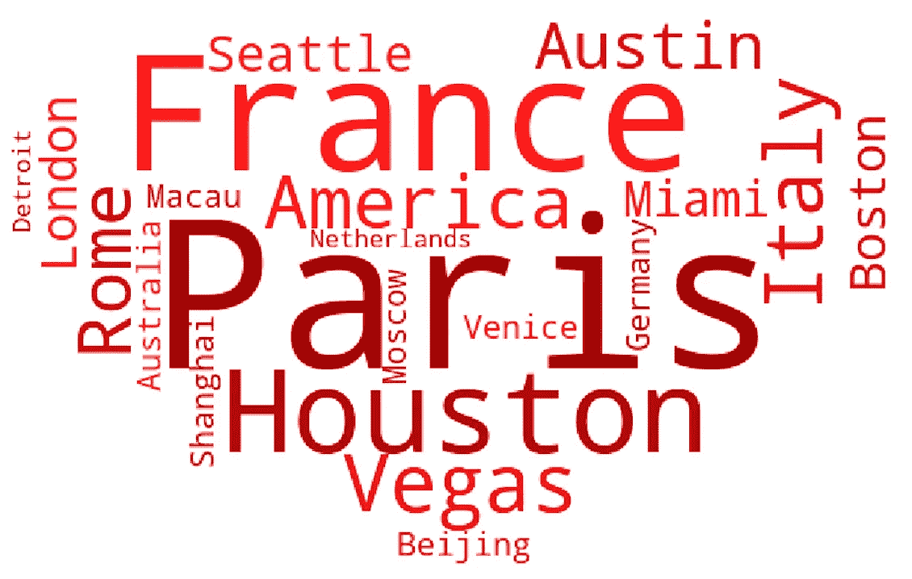

# 给 Python 程序员的有趣的情人节“礼物”创意

> 原文：<https://towardsdatascience.com/fun-valentines-day-gift-ideas-for-python-programmers-a27e87b9211b?source=collection_archive---------4----------------------->


杰西·戈尔在 [Unsplash](https://unsplash.com/s/photos/valentine's-day?utm_source=unsplash&utm_medium=referral&utm_content=creditCopyText) 上的照片

## 写一些代码为你的情人做些酷的东西。

情人节就要到了。我还没决定给我妻子买什么礼物。挑选合适的礼物对我来说通常是一项非常具有挑战性的任务，因为我在爱情领域不是一个有创造力的人。大多数时候，我只是用礼品卡送她一些花，因为我只是不想再次犯下送她体重秤的错误，这让她真的很生气，尽管我认为一个支持蓝牙的数字不锈钢智能秤真的很酷。

今年，我想我会做一些不同的事情。在过去的几年里，我开始比以前更多地使用 Python，并且发现一些有趣的项目只需要几行代码就可以完成。在这篇文章中，我想分享三个很酷的迷你项目，它们有可能成为礼物的创意。然而，只是一个快速的免责声明，使用它们的风险由你自己承担，因为这是一个所谓的“书呆子”或“极客”的建议:)

# 展示你的心

你要做的第一件简单的事情是使用`numpy`和`mtaplotlib`库画一个心形。因此，首先请确保你已经在你的电脑上安装了这两个软件，比如使用 `pip`工具安装它们。将以下代码复制并粘贴到您自己的 Python IDE 中。

如您所知，我们使用公式`(x**2+y**2–1)**3-x**2*y**3=0`，其中**表示符号后数字的幂，以生成一系列构成心形的点。

运行上面的代码，你会看到一个如下的红心。你可以用代码来改变尺寸，分辨率，甚至颜色！如果你足够大胆地使用这个礼物的想法，我会把这些任务留给你:)



# 创建动画图像

另一件有趣的事情是使用`imageio`库创建动画图像，它可以从单个静态图像生成动画图像。如上所述，您的计算机需要安装`imageio`库。

在你的相册中，找到 10 张或更多适合情人节的图片，放在一个名为“source_images”的文件夹中。在您的 IDE 中运行以下代码。

实际上，您也可以从视频剪辑中创建动画图像。更详细的说明可以参考我的[上一篇文章](https://medium.com/swlh/python-animated-images-6a85b9b68f86)。

# 创建单词云

我想分享的最后一个想法是，你可以为你爱的人创建一个单词云。为此，我们将使用`wordcloud`、`imageio`和`matplotlib`库。

我编写了一个函数，它接收一个字符串、一个为单词云提供蒙版的图像文件以及所创建的单词云的目标图像文件。此外，我还编写了另一个函数，可以生成色调、饱和度相同但亮度不同的随机红色。我选择了红色，因为这是情人节的主题颜色。

下面提供了完整代码。

就我个人而言，对于字符串，我只是列出了一堆我们已经访问过或计划在不久的将来访问的城市和国家，我创建了一个名为`words`的变量来存储这些名称。为了验证概念，我选择了我们从第一个想法中创建的心形图像，保存图像名为`plt.savefig(‘heart.png’)`。

```
>>> words = 'Paris, France, Houston, Vegas, Italy, America, Rome, Austin, Seattle, Miami, London, Boston, Beijing, Shanghai, Macau, Moscow, Venice, Germany, Australia, Netherlands, Detroit'
>>> generate_word_cloud(words, 'heart.png', 'word_cloud.png')
```

运行上述代码后，创建了如下图。



# 外卖食品

上述迷你项目只是向你展示了一些有趣的想法，这些想法可能会被用于你的情人节。请通过尝试不同的参数组合来探索这些选项。另外，你可以把这些想法结合在一起，就像我在第三个想法中做的那样。比如你可以制作多个字云，和一些真实的图像混合在一起，创造一些更加个性化的动画形象。

情人节快乐！

# 参考

[](http://mathworld.wolfram.com/HeartCurve.html) [## 心脏曲线

### 有许多数学曲线可以产生心形，其中一些已经在上面说明过了。第一个…

mathworld.wolfram.com](http://mathworld.wolfram.com/HeartCurve.html) [](https://medium.com/swlh/python-animated-images-6a85b9b68f86) [## 使用 Python 创建动画图像

### 没有 Photoshop？没问题！了解如何从静态图像列表或视频中轻松创建动画图像…

medium.com](https://medium.com/swlh/python-animated-images-6a85b9b68f86)  [## 使用自定义颜色-word cloud 1 . 6 . 0 . post 16+gf E0 b 6 ff 文档

### 编辑描述

amueller.github.io](https://amueller.github.io/word_cloud/auto_examples/a_new_hope.html)