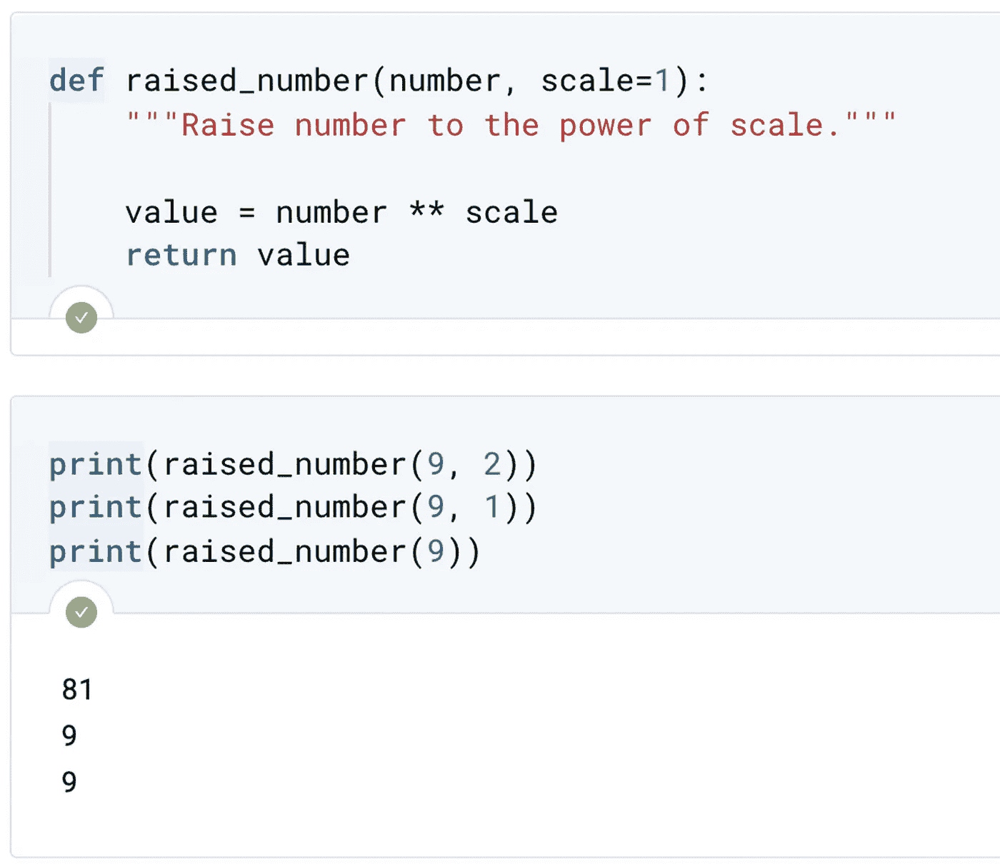
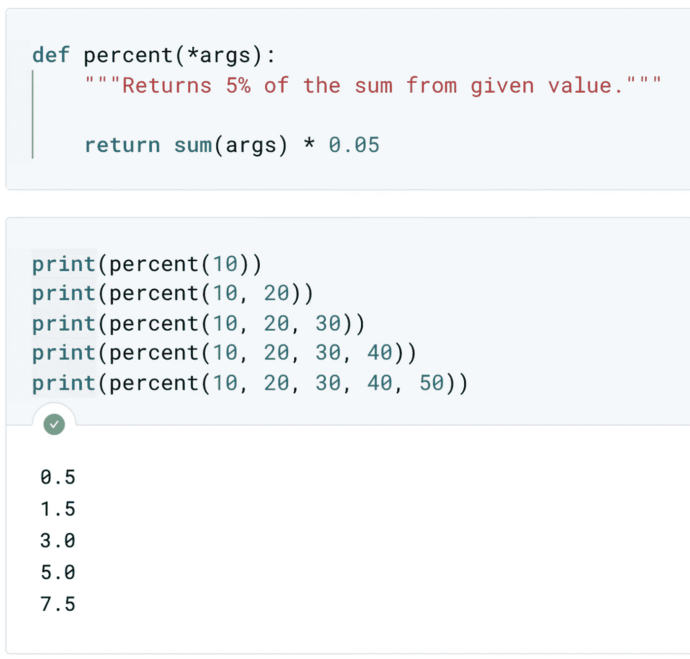
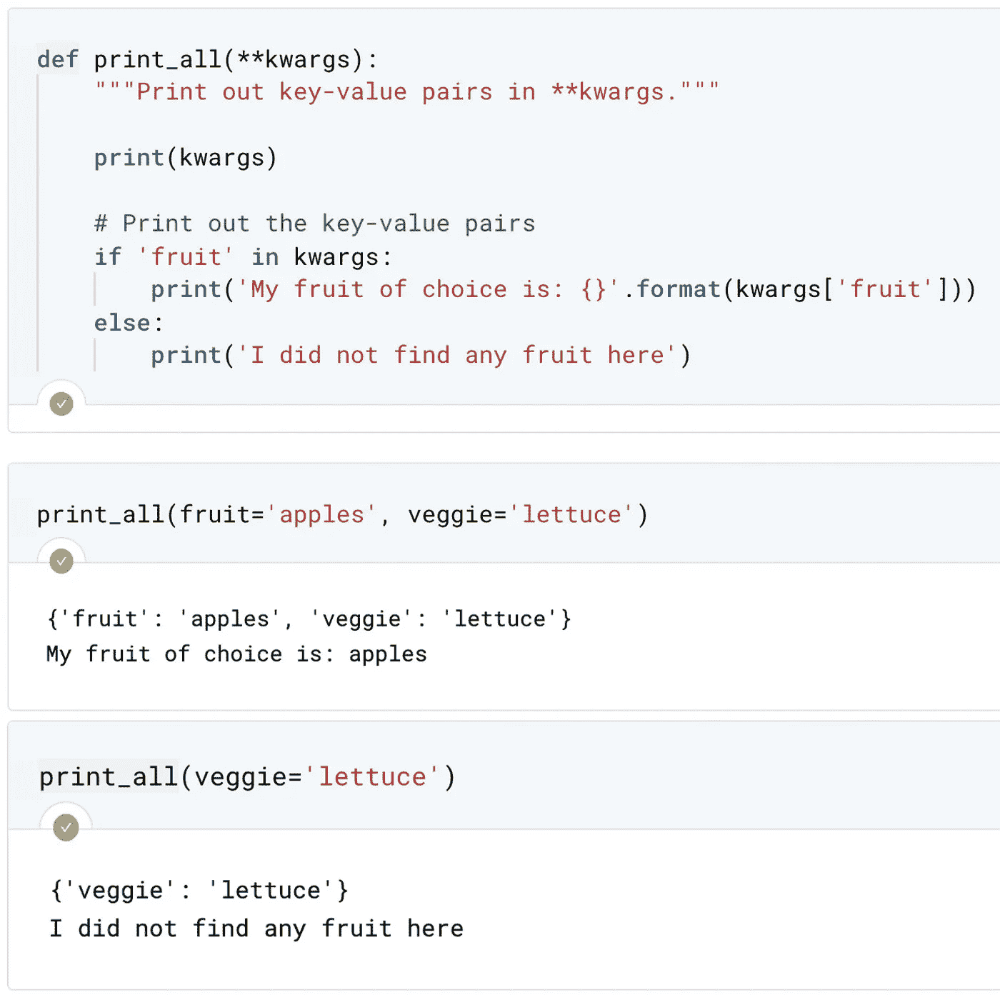
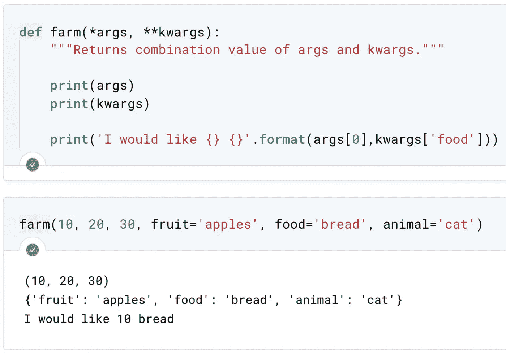

# 函数参数:默认值、关键字和任意值

> 原文：<https://towardsdatascience.com/function-arguments-default-keyword-and-arbitrary-9588b5eaaef3?source=collection_archive---------25----------------------->


函数参数。图片由[作者](https://medium.com/@wiekiang)

## 给 PYTHON 开发者的提示

## 定义一个接受可变数量参数的函数

假设您正在编写一个接受多个参数的函数，其中一些参数通常有一个公共值。例如，您希望能够在不显式定义每个参数的情况下调用函数。换句话说，您希望一些参数有默认参数。

接下来，将向您介绍如何编写一个带有默认参数和灵活参数的函数，它允许您向函数传递任意数量的参数。

## 先决条件

如果你不熟悉定义自己的函数，下面的文章会给你更多的信息。

[](/writing-your-own-functions-40d381bd679) [## 编写自己的函数

### 数据科学家需要具有特定功能的函数

towardsdatascience.com](/writing-your-own-functions-40d381bd679) [](/scope-of-variable-and-legb-rule-4d44d4576df5) [## 变量范围和 LEGB 规则

### 变量的作用域指的是你可以看到或访问变量的地方

towardsdatascience.com](/scope-of-variable-and-legb-rule-4d44d4576df5) 

具有默认参数值的函数。图片由[作者](https://medium.com/@wiekiang)

首先，定义一个带有默认参数值的函数。在函数头中，我们给感兴趣的参数加上一个等号和默认的参数值。请注意，此函数计算第一个参数的第二个参数的幂，默认的第二个参数值是 1。这意味着我们可以像你所期望的那样用两个参数来调用这个函数。但是，如果只使用一个参数，函数调用将使用默认参数 1 作为第二个参数。

通过本文，您将获得编写带有单个和多个默认参数的函数的专业知识。

现在让我们看看灵活的论点。假设您想编写一个函数，但是不确定用户想要传递多少个参数。例如，一个函数接受浮点数或整型数，并将它们相加。这就是所谓的灵活的论点。



带有可变参数(args)的函数。图片作者[作者](https://medium.com/@wiekiang)

在这个例子中，我们编写了一个函数，它总结了传递给它的所有参数。在函数定义中，我们使用参数`*args`，然后将传递给函数调用的所有参数转换成函数体中的元组。如果我们使用这个方法，`*args`调用函数时，参数没有最大值。



带有任意关键字参数(kwargs)的函数。图片作者[作者](https://medium.com/@wiekiang)

您还可以使用一个`**`来传递任意数量的名为`kwargs`的关键字参数。也就是说，前面有标识符的参数。我们将编写一个名为`print_all`的函数，打印出标识符和传递给它们的参数。为了编写这样一个函数，我们使用前面带一个`**`的参数`kwargs`。这将标识符-关键字对转化为函数体内的字典。然后，在函数体中，我们需要打印字典`kwargs`中存储的所有键值对。

供大家参考，我们可以组合使用 args 和 kwargs。让我们看看下面的例子。



args 和 kwargs 的组合。图片由[作者](https://medium.com/@wiekiang)

使用灵活参数时，名称`args`和`kwargs`并不重要。你可以定义任何你想要的变量名。但是，它们前面必须分别有一个`*`和`**`。我知道这很难接受，所以是时候自己解决了。

```
**Other Interesting Articles**#1 [Writing Your Own Functions](/writing-your-own-functions-40d381bd679)#2 [Scope of Variable and LEGB Rule](/scope-of-variable-and-legb-rule-4d44d4576df5)#3 [Python: Procedural or Object-Oriented Programming?](/python-procedural-or-object-oriented-programming-42c66a008676)#4 [Data Science with Python: How to Use NumPy Library](/data-science-with-python-how-to-use-numpy-library-5885aa83be6b)#5 [Do you have the Software Engineer and Data Scientist skills?](/do-you-have-the-software-engineer-and-data-scientist-skills-probably-not-7e8fb069e067)
```

## 关于作者

**Wie Kiang** 是一名研究人员，负责收集、组织和分析意见和数据，以解决问题、探索问题和预测趋势。

他几乎在机器学习和深度学习的每个领域工作。他正在一系列领域进行实验和研究，包括卷积神经网络、自然语言处理和递归神经网络。

*连接上*[*LinkedIn*](https://linkedin.com/in/wiekiang)