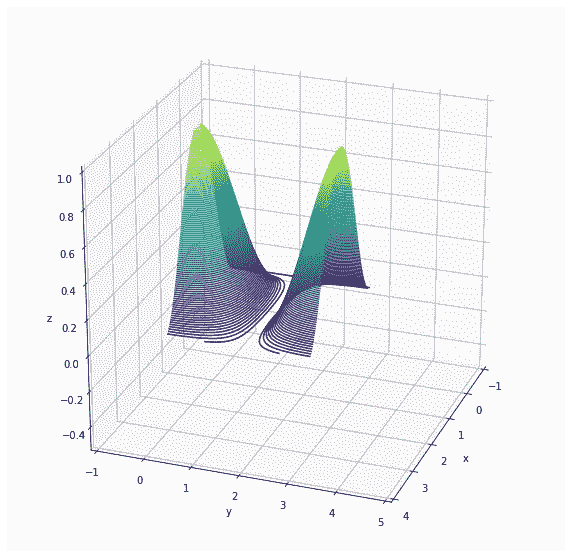

# 张量流函数估计

> 原文：<https://towardsdatascience.com/function-estimation-with-tensorflow-2b2beea142b?source=collection_archive---------30----------------------->

## 使用优化器来估计函数变量和回归

梯度下降是微积分中的一种数学方法，它考虑空间中变量的导数，以实现值的最佳组合来最小化函数。在机器学习中，我们通常使用定义为 ***预测-实际*** 的损失函数来最小化，从而给出预测问题的一组变量。有兴趣可以看这里的。

在本文中，我们将看到如何在 Tensorflow 中使用梯度下降来估计我们在日常研究生活中碰巧看到的函数变量。此外，我将展示一个例子，说明如何使用张量流优化器来寻找函数的最小值及其参数的最小值。

# 函数估计的示例曲线

让我们考虑以下三种情况。前两个场景用于函数估计，最后一个场景将演示评估函数最小值的能力。我将使用下面的代码来生成数据。

```
# imports
import tensorflow as tf
import numpy as np
import seaborn as sns
import matplotlib.pyplot as plt
from mpl_toolkits import mplot3d
np.random.seed(50) # For reproducability
```

## 集合 1

```
x = np.arange(10)
y = 4 * x + 3
noise = np.random.normal(0,1,10)
y = y + noisefig = plt.figure(figsize=(5,5))
ax = sns.lineplot(x, y)
plt.xlabel("X")
plt.ylabel("Y")
```


带噪声的线性函数

## 集合 2

```
x = np.arange(-10, 10)
y = x**3 + x**2 + 5
noise = np.random.normal(0,20,20)
y = y + noisefig = plt.figure(figsize=(5,5))
ax = sns.lineplot(x, y)
plt.xlabel("X")
plt.ylabel("Y")
```


带噪声的 3 次多项式

## 第三组

在这种情况下，我们将尝试在函数最小时估计 X 和 Y 的值。

```
def f(x, y):
    return (np.sin(x) * np.cos(y)) ** 2x = np.linspace(0, 3, 100)
y = np.linspace(0, 3, 100)X, Y = np.meshgrid(x, y)
Z = f(X, Y)fig = plt.figure(figsize=(10, 10))
ax = plt.axes(projection='3d')
ax.contour3D(X, Y, Z, 100)
# ax.scatter(0,0,0, color='r', marker='^')
ax.set_xlabel('x')
ax.set_ylabel('y')
ax.set_zlabel('z');
plt.xlim(-1, 4)
plt.ylim(-1, 5)
ax.set_zlim(-0.5,1)
ax.view_init(25, 20)
```



三维绘图

# 使用张量流优化器

根据[文档](https://www.tensorflow.org/api_docs/python/tf/keras/optimizers/)，有几个优化器供我们使用。让我们来看看如何为**集合 1** 估计变量。

```
def init():
    M = tf.Variable(5.0) 
    C = tf.Variable(0.0) 

    return M, CM, C = init()
opt = tf.keras.optimizers.Adam(learning_rate=0.001)for epoch in range(1000):
    opt.minimize(lambda: sum(abs(y - M*x - C)), var_list=[M, C])
    print(sum((y - M*x - C)**2).numpy(), M.numpy(), C.numpy(), end="\r")
print()print(M.numpy())
print(C.numpy())
```

在上面的代码中，我将尝试估计函数`Y = Mx + C`的`M`和`C`参数。因此，作为第一步，我创建初始化函数来返回`M`和`C`作为张量流变量。这意味着优化器将计算 GRAD(多变量梯度),并使用提供的学习率将其应用于张量流变量。

注意损失函数是`lambda: sum(abs(y — M*x — C))`。这转化为平均绝对误差，与使用均方误差的回归模型非常相似。经过 1000 次迭代后，对于 **M** 和 **C** ，我们得到值 ***4.4131455*** 和 ***0.29607454*** 。同一平面上的两个图如下所示。


原始和估计

请注意，我们有一个非常类似于原始数据集的估计。接下来，我们将看看如何解决第二个问题。

```
def init():
    A = tf.Variable(1.0) 
    B = tf.Variable(1.0) 
    C = tf.Variable(1.0) 
    D = tf.Variable(1.0) 

    return A, B, C, DA, B, C, D = init()
opt = tf.keras.optimizers.Adam(learning_rate=0.01)for epoch in range(1000):
    opt.minimize(lambda: sum(abs(y - (A*x**3+ B*x**2+C*x+D))), var_list=[A, B, C, D])
    print(sum(abs(y - (A*x**3+ B*x**2+C*x+D))).numpy(), A.numpy(), B.numpy(), C.numpy(), D.numpy(), end="\r")
print()print(A.numpy())
print(B.numpy())
print(C.numpy())
print(D.numpy())
```

我们使用估计量`Y = Ax^3 + Bx^2 + Cx + D`作为目标函数。因此，我们将有四个张量变量。与前面的场景类似，我们将使用平均绝对误差进行函数估计。我们分别得到 **A，B，C** 和 **D** 的系数 ***1.0356606，1.1082488，-2.7969947*** 和 ***8.258981*** 。我们的图如下所示。


原始和估计

# 计算最小值

```
def init():
    X = tf.Variable(1.0) 
    Y = tf.Variable(1.0) 

    return X, YX, Y = init()
opt = tf.keras.optimizers.Adam(learning_rate=0.001)for epoch in range(1000):
    opt.minimize(lambda: (tf.math.sin(X) * tf.math.cos(Y)) ** 2, var_list=[X, Y])
    print(((tf.math.sin(X) * tf.math.cos(Y)) ** 2).numpy(), X.numpy(), Y.numpy(), end="\r")
print()print(X.numpy())
print(Y.numpy())minX = X.numpy()
minY = Y.numpy()
```

这里我们直接使用优化器的函数值，并要求它最小化。经过 1000 次迭代后，我们分别得到 **X** 和 **Y** 的值 ***0.5938998*** 和 ***1.5066066*** 。再次绘图给了我们下面标有最小值的图。

```
def f(x, y):
    return (np.sin(x) * np.cos(y)) ** 2x = np.linspace(0, 3, 100)
y = np.linspace(0, 3, 100)X, Y = np.meshgrid(x, y)
Z = f(X, Y)fig = plt.figure(figsize=(10, 10))
ax = plt.axes(projection='3d')
ax.contour3D(X, Y, Z, 100)
ax.scatter(minX, minY, f(minX, minY), color='r', marker='o', s=100)
ax.set_xlabel('x')
ax.set_ylabel('y')
ax.set_zlabel('z');
plt.xlim(-1, 4)
plt.ylim(-1, 5)
ax.set_zlim(-0.5,1)
ax.view_init(25, 150) # Rotate to see minima better
```


标有最小值的图

注意，这个图的最小值实际上是一个平面。然而，我们只计算点，因此，我们不能指望找到一个平面。一个数学上更合理的方法将为这项任务建立一个更好的近似模型。

## 笔记

*   可能存在多个最小值，尽管梯度下降法只报告一个最小值/最大值，该值在起始点附近。随机梯度下降试图减轻这种影响。
*   同样可以使用神经网络进行建模。参见[文档](https://www.tensorflow.org/api_docs/python/tf/keras/optimizers/SGD)。

我希望你喜欢阅读这篇关于梯度下降的实际应用的文章。这里，我们使用函数来获取数据进行演示。然而，这同样适用于只存在具有多个参数的数据的情况。

干杯！