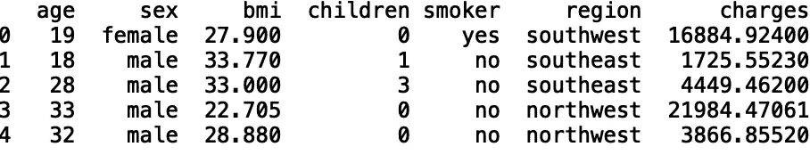
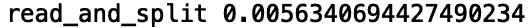
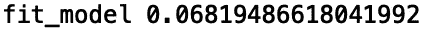
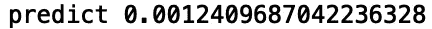

# Python 中的函数包装器

> 原文：<https://towardsdatascience.com/function-wrappers-in-python-5146f3ad0601?source=collection_archive---------8----------------------->

## 将包装器放在函数周围


[来源](https://www.pexels.com/search/wrap/)

软件编程的一个重要原则是 DRY 原则。DRY 是“不要重复自己”的缩写。DRY 的目标是避免软件编程中不必要的重复。DRY 的应用包括通过函数、类、装饰器、类装饰器和元类实现抽象。在这篇文章中，我们将使用一个函数装饰器来包装和添加额外的处理到现有的用于模型构建的函数中。

我们开始吧！

对于我们的例子，我们将定义一个装饰函数来报告输入函数的执行时间。作为一名数据科学家，我经常需要考虑 fit 的执行时间，并预测生产中的调用。让我们考虑这个用例。

我们将使用来自*医疗费用个人数据集*的合成医疗数据，可以在[这里](https://www.kaggle.com/mirichoi0218/insurance)找到。我们将定义读取数据、拟合数据和进行预测的函数。然后我们将定义一个装饰函数，它将报告每个函数调用的执行时间。

首先，让我们将数据读入熊猫数据框:

```
import pandas as pd 
df = pd.read_csv("insurance.csv")
```

让我们打印前五行数据:

```
print(df.head())
```



现在让我们来构思一下我们的预测问题。让我们使用“年龄”、“bmi”和“儿童”列作为输入特征，使用“费用”作为目标。让我们也拆分我们的数据用于训练和测试。首先，让我们导入一些必要的包:

```
import numpy as np 
from sklearn.model_selection import train_test_split
```

接下来，让我们定义我们的输入和输出。让我们将数据分成训练集和测试集:

```
X = np.array(df[['children', 'bmi', 'age' ]])
y = np.array(df['charges'])
X_train, X_test, y_train, y_test = train_test_split(X, y, test_size = 0.2, random_state = 42)
```

这里，我们选择一个测试大小，对应于 20%数据的随机样本。现在，让我们将所有这些放入一个函数中:

```
def read_and_split(self, test_size):
    df = pd.read_csv("insurance.csv")
    print(df.head())
    X = np.array(df[['children', 'bmi', 'age' ]])
    y = np.array(df['charges'])
    X_train, X_test, y_train, y_test = train_test_split(X, y, test_size = 0.2, random_state = 42)
    return X_train, X_test, y_train, y_test
```

接下来，让我们定义一个函数“fit_model”，我们将使用它来使我们的模型符合我们的训练数据。让我们导入“线性回归”模块:

```
from sklearn.linear_models import LinearRegression
```

在我们的“fit_model”函数中，让我们定义一个“LinearRegression”对象，并根据训练数据拟合我们的模型:

```
def fit_model():
    model = LinearRegression()
    model = model.fit(X_train, y_train)
    return model
```

最后，让我们定义一个对测试集进行预测的函数:

```
def predict(input_value):
    result = model.predict(X_test)
    return result
```

现在我们已经定义了函数，让我们定义将报告执行时间的装饰函数。我们的装饰函数将是一个计时器函数，称为“timethis ”,它将接受一个函数作为输入:

```
def timethis(func):
    ...
```

接下来，我们将在“timethis”函数中定义一个“wrapper”函数:

```
def timethis(func):

    def wrapper(*args, **kwargs):
        ...
```

在我们的“包装器”函数中，我们将定义“开始”和“结束”变量，我们将使用它们来记录运行的开始和结束。在定义“开始”和“结束”变量之间，我们将调用输入函数，并将其存储在一个名为“结果”的变量中:

```
def timethis(func):

    def wrapper(*args, **kwargs):
        start = time.time()
        result = func(*args, **kwargs)
        end = time.time()
```

我们需要做的最后一件事是将“@ wraps”装饰符放在“wrapper”函数之前的行中:

```
def timethis(func):
    [@wraps](http://twitter.com/wraps)(func)
    def wrapper(*args, **kwargs):
        start = time.time()
        result = func(*args, **kwargs)
        end = time.time()
        return result
```

“@ wraps”装饰器获取传递给“@timethis”的函数，并复制函数名、文档字符串、参数列表等…

然后，我们将打印函数的名称和运行时间(' end' — 'start ')。我们还返回输入函数，它存储在“结果”变量中:

```
def timethis(func):
    [@wraps](http://twitter.com/wraps)(func)
    def wrapper(*args, **kwargs):
        start = time.time()
        result = func(*args, **kwargs)
        end = time.time()
        print(func.__name__, end-start)
        return result
```

最后，“timethis”函数返回“包装器”:

```
def timethis(func):
    [@wraps](http://twitter.com/wraps)(func)
    def wrapper(*args, **kwargs):
        start = time.time()
        result = func(*args, **kwargs)
        end = time.time()
        print(func.__name__, end-start)
        return result
    return wrapper
```

现在我们可以在任何函数上使用“@timethis”装饰器。让我们将“@timethis”应用于我们的“read_split”方法。我们只需在我们想要包装的函数前面的行中放上“@timethis ”:

```
@timethis
def read_and_split(self, test_size):
    df = pd.read_csv("insurance.csv")
    X = np.array(df[['children', 'bmi', 'age' ]])
    y = np.array(df['charges'])
    X_train, X_test, y_train, y_test = train_test_split(X, y, test_size = 0.2, random_state = 42)
    return X_train, X_test, y_train, y_test
```

现在，如果我们调用我们的“read_split”方法，我们的装饰器“@timethis”应该打印执行时间:

```
X_train, X_test, y_train, y_test = read_and_split(0.2)
```



让我们对我们的 fit 方法做同样的事情:

```
[@timethis](http://twitter.com/timethis)
def fit_model():
    model = LinearRegression()
    model = model.fit(X_train, y_train)
    return modelmodel = fit_model()
```



对于我们预测方法:

```
[@timethis](http://twitter.com/timethis)
def predict():
    result = model.predict(X_test)
    return resultprediction =  predict()
```



我将在这里停下来，但是您可以自己随意摆弄代码和数据。我鼓励您分析一些其他回归模型的执行时间，您可以使用这些数据构建这些模型，如随机森林或支持向量回归。

## 结论

总之，在这篇文章中，我们讨论了 python 中的函数包装器。首先，我们定义了三个函数来构建线性回归模型。我们定义了一些函数，用于读取和拆分我们的数据以进行训练，使我们的模型适合训练数据，并对我们的测试集进行预测。然后我们定义了一个函数包装器，允许我们报告每个函数调用的执行时间。我希望你觉得这篇文章有用/有趣。这篇文章中的代码可以在 [GitHub](https://github.com/spierre91/medium_code/blob/master/metaprogramming/function_wrapping.py) 上找到。感谢您的阅读！