# Power BI 中的函数

> 原文：<https://towardsdatascience.com/functions-in-power-bi-56e9e11e4669?source=collection_archive---------32----------------------->

## 这是什么？我们什么时候使用它？我们如何制造一个？


埃里克·克鲁尔在 [Unsplash](https://unsplash.com?utm_source=medium&utm_medium=referral) 上的照片

清洗，扯皮，总结。我不知道你怎么想，但是我喜欢这个数据分析的过程。Power Query 是我在这方面使用的主要工具。以后我会写更多关于权力查询的内容。

我清理是因为数据不干净。我打扫卫生是因为我需要好的数据来分析。我努力为连接找到正确的“形状”。如果您必须手动清理数据，那就太可怕了，而且很容易出现清理错误。想象错误之上的错误？你真正要分析的是什么？

别担心。功能——就像上面那些可爱的小机器人可以来救援一样。


作者图片

究竟什么是函数？谷歌快速搜索给出了这个定义。

> “功能是一组有组织的、可重复使用的代码，用于执行单个相关的动作。…不同的编程语言对它们的命名不同，例如，函数、方法、子例程、过程等。”

这里的关键词是**可重用。**要成为一个功能，它必须是可重用的。这意味着您可以使用这段代码，并将其应用于不止一个文件，还可以应用于其他文件。我认为函数就是**接受输入，执行一组定制的过程，然后给出输出**。

你今天用的很多东西，比如，BI 中的 sum 函数到 joins 都是函数。

例如，看看 M(超级查询语言)中的这个函数

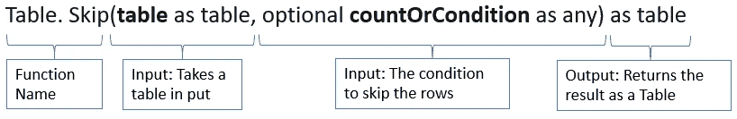

图片来自作者

问题是…有时我们没有可以满足我们需求的功能。我们希望对各种文件应用一组自定义的过程。这就是我们必须使用它的原因和时间。

让我们在 Power Query 中过一遍如何在 Power BI 中创建函数。生活中有那么多清洁和争吵，我相信这对我们会很有用。

正如简笔画所提到的，这些年来我们有几个不同的文件。我们需要对所有文件执行相同的操作。

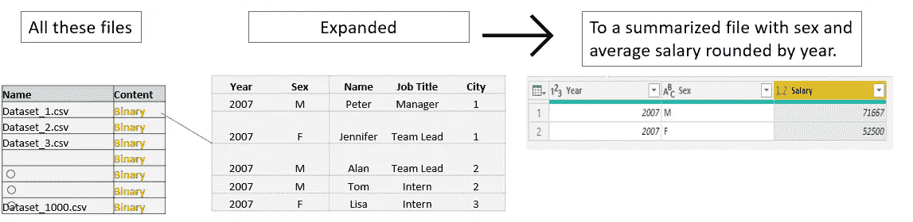

作者图片

我们不想对每个文件都执行这个过程，但是我们希望函数为我们执行这个过程。

首先，让我们将所有文件放入一个文件夹中。

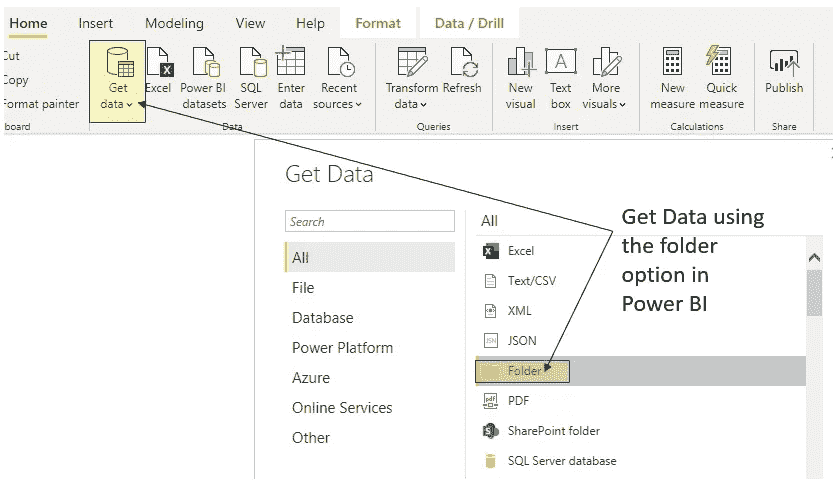

作者图片

加载完所有文件后，您应该会看到它们如下所示。

让我们从创建主文件的“副本”开始——我们想从这个副本构建一个函数。

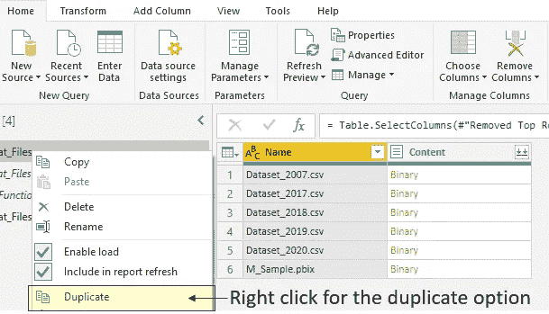

作者图片

现在有了一个副本，我们只保留第一行来构建函数。

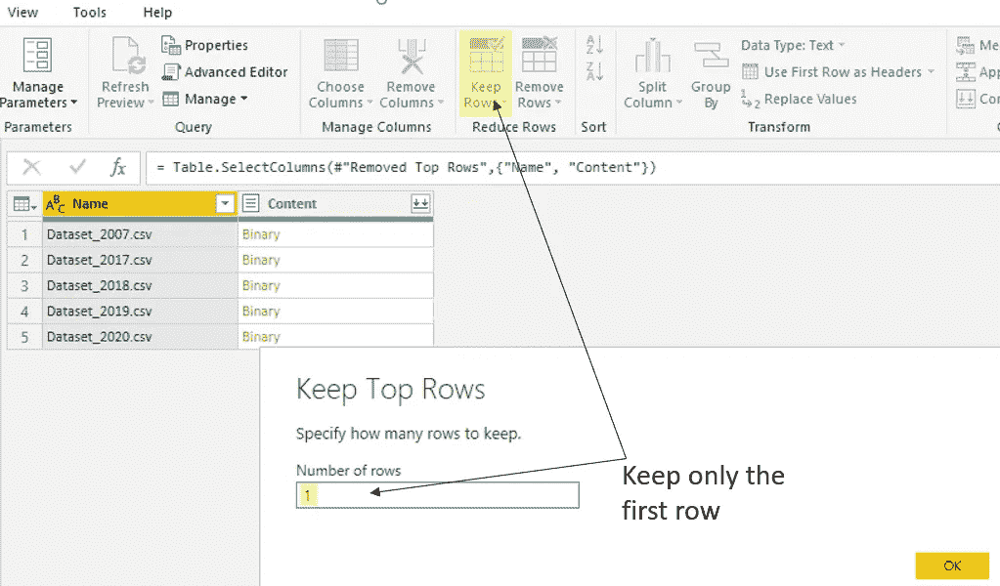

作者图片

Power BI 只保留第一排。很好。

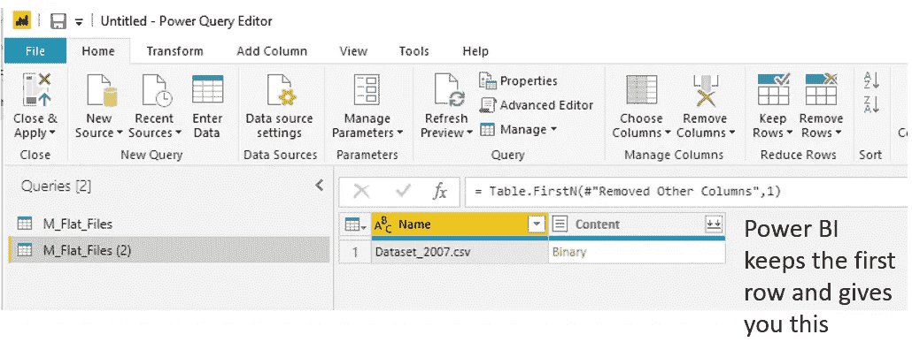

作者图片

这里有一个巧妙而重要的技巧——您可以键入引用该列的[Content]和引用实际“单元格”本身的{0}。如果你有更多的技术理解，我引用列并返回一个列表，然后引用列表值 0 返回二进制文件。

如果你不喜欢打字，你也可以点击二进制文件本身的“向下钻取”。

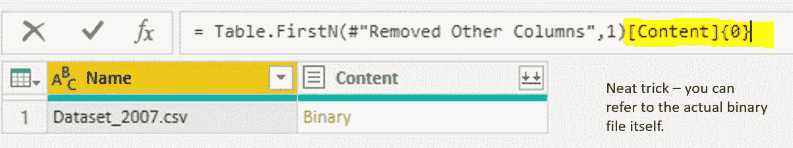

作者图片

Power BI 干净利落地加载文件，不需要那些自动转换。

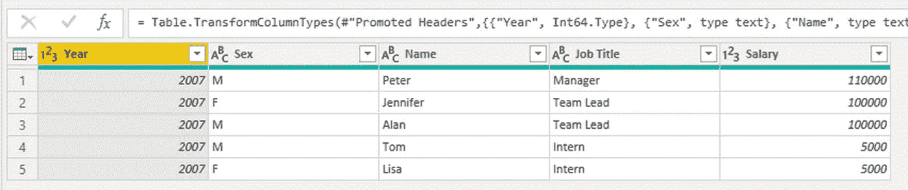

作者图片

现在，让我们使用分组方式进行快速总结。您可以在面板顶部的“变换”功能区下找到“分组依据”。

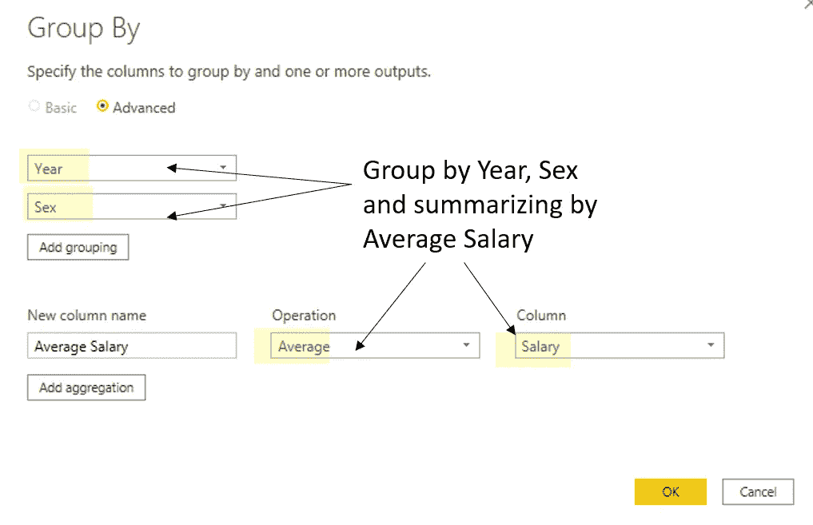

作者图片

这是我们对其中一个文件的结果。

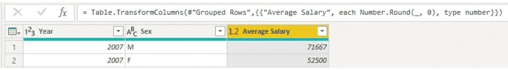

作者图片

这正是我们所需要的。

嗯…简笔画。


作者图片

还没做，让我们把它做成一个实际的函数。

你可以通过转换功能区下的高级编辑器选项来实现。

Power BI 把所有的步骤都记录下来，变成 M 脚本给我们看。如果你熟悉 Excel，它就像一个录制的宏。我们只需要更改引用，以便它可以应用于其他文件。

你不需要知道如何把下面的 M 代码全部打出来。Power BI 的妙处在于，它为你记录了所有这些步骤。在不久的将来，我会写更多关于如何阅读 M 脚本的内容。

这是当前的脚本。

```
let
    Source = Folder.Files("MY_DRIVE"),
    #"Removed Top Rows" = Table.Skip(Source,1),
    #"Removed Other Columns" = Table.SelectColumns(#"Removed Top Rows",{"Name", "Content"}),
    #"Kept First Rows" = Table.FirstN(#"Removed Other Columns",1)[Content]{0},
    #"Imported CSV" = Csv.Document(#"Kept First Rows",[Delimiter=",", Columns=5, Encoding=65001, QuoteStyle=QuoteStyle.None]),
    #"Promoted Headers" = Table.PromoteHeaders(#"Imported CSV", [PromoteAllScalars=true]),
    #"Changed Type" = Table.TransformColumnTypes(#"Promoted Headers",{{"Year", Int64.Type}, {"Sex", type text}, {"Name", type text}, {"Job Title", type text}, {"Salary", Int64.Type}}),
    #"Grouped Rows" = Table.Group(#"Changed Type", {"Year", "Sex"}, {{"Average Salary", each List.Average([Salary]), type nullable number}}),
    #"Rounded Off" = Table.TransformColumns(#"Grouped Rows",{{"Average Salary", each Number.Round(_, 0), type number}})
in
    #"Rounded Off"
```

不要让这个压倒你，我们唯一关心的是 Csv。文档部分。

让我们删除 Csv 上面的所有内容。文档部分并声明我们的变量。我选择(X 为二进制)是因为我们希望这个函数有一个二进制输入。

还记得文件夹里的那些 csv 文件吗？它们是二进制文件。

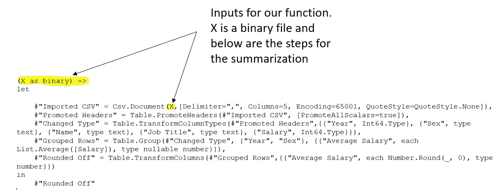

作者图片

这是我们的功能！

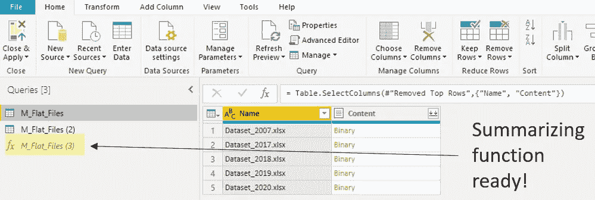

作者图片

现在让我们将它应用到我们的文件中。让我们“调用”我们的自定义函数。您可以在“添加列”功能区下找到“调用”。

听起来像是《哈利·波特》里的情节，对吗？

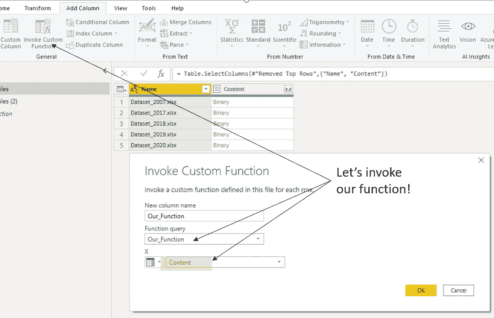

作者图片

在这里！

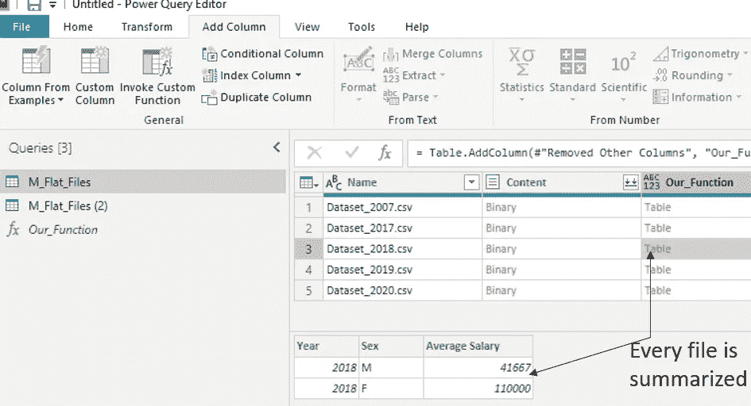

作者图片

让我们点击“扩展”进入决赛桌。

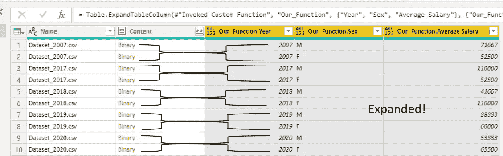

作者图片

哒哒！

按年平均工资分列的男性和女性。

现在，这是一个简单的数据集，但你也可以将连接和其他更复杂的转换构建到一个函数中，并将其应用于所有文件。

**TL:DR** ？我为你做了这个。

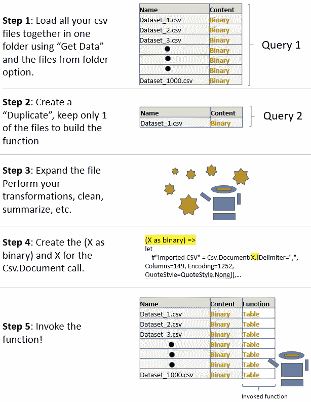

作者图片

希望你喜欢这篇文章。

如果你想看视频——Curbal 是一个真正教会我很多关于[功能](https://youtu.be/Ar_fV_oXSNs)的频道，当然还有 Power BI。

注意安全，希望这能帮助您的数据之旅！