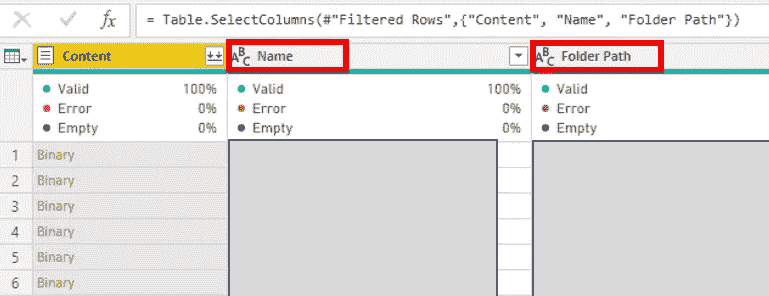
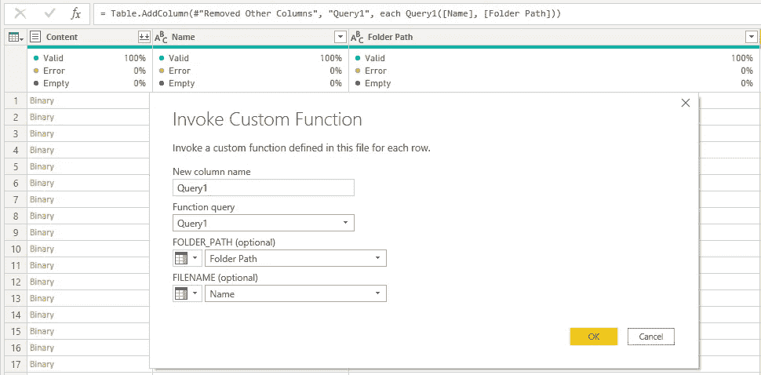
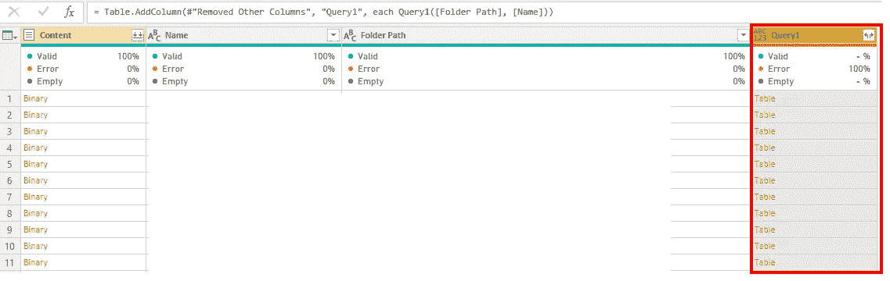
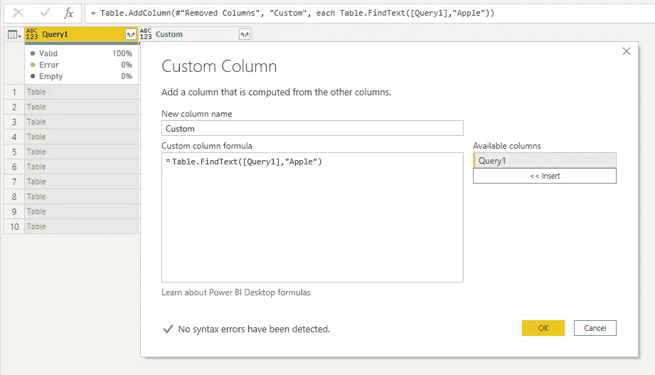
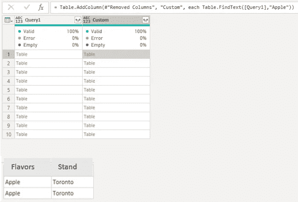
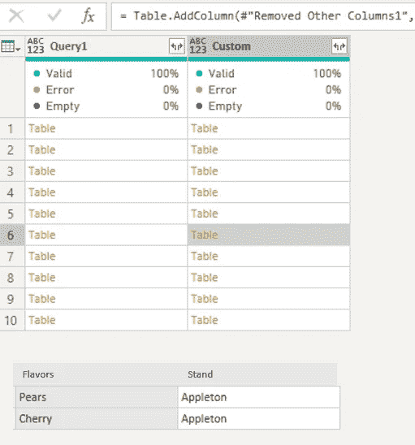

# 幂 BI 中的函数—(表。FindText)

> 原文：<https://towardsdatascience.com/functions-in-power-bi-table-findtext-176709853957?source=collection_archive---------36----------------------->

## …使用表格。FindText 可在文件中的任意位置搜索任何内容。


Rabie Madaci 在 [Unsplash](https://unsplash.com?utm_source=medium&utm_medium=referral) 上拍摄的照片

我一直对简单的查找功能感到惊讶。您可以找到任何符合条件的内容，即使您的搜索项目隐藏在不同的工作表、打开的文本或表格中。

**想象一下，你可以搜索原始数据中出现的任何内容。即使它隐藏在打开的文本字段中的某个地方。相当神奇！**

这有什么帮助？如果你正在寻找一个关键词或一组重要的数字，但你不知道去哪里找，这将非常有帮助。该号码可以在开放文本字段中，也可以在名称字段中，等等。

一旦找到，你就可以把这些搜索结果结合起来，用它讲一个故事。有时，做一个发现只是出于好奇，但有时你可能会对你的发现感到惊讶。

我用过这张桌子。FindText 功能是一个欺诈检测练习，它非常方便，因为我的表很大，而我只是在寻找一个人。这个简单的函数还有其他用处。您可以使用它作为帐户记录的历史搜索，并回答您可能有的一些问题。

我们开始吧！

我们来看看[表。微软的 FindText](https://docs.microsoft.com/en-us/powerquery-m/table-findtext) 函数。


作者图片

简单地说，这个函数使用一个表作为输入，并在该表中搜索一个条目。然后，它返回一个表，其中包含与您的条件匹配的行。

让我们试试这个。

# 拿桌子

第一步很棘手——也许你很幸运，已经为你设置了一列表格，但是我必须将文件夹中的二进制文件转换成表格格式。

这并不困难，我使用这个功能。

```
(FOLDER_PATH , FILENAME ) =>
let
    Source = Csv.Document(File.Contents(FOLDER_PATH&FILENAME)),
    #"Promoted Headers" = Table.PromoteHeaders(Source, [PromoteAllScalars=true])
in
   #"Promoted Headers"
```

如果您使用 folders 选项连接 Power BI 并有一个二进制文件列表，您可以使用上述函数将这些二进制文件转换成表格。

要添加新功能，只需进入**电力查询** > **新建空白查询** > **高级编辑** > **粘贴到脚本**

这个查询中的 **FOLDER_PATH** 和 **FILENAME** 参数是 Power Query 在您连接到它时为您准备的列。

这里有一个例子。



作者图片

现在，我将使用调用函数选项来应用该函数。如果你对如何使用函数感到困惑，[这里有一篇文章](/functions-in-power-bi-56e9e11e4669?sk=32f65f6e5196dbd96ed43a53584ad2fc)给你，帮助你入门。功能很棒！



在我应用这个函数之后，我得到了这个输出。



作者图片

太好了！现在我有一列表来应用我的表。FindText()。

# 应用函数

我将删除不需要的列，只反映表格列。

我们现在需要做的就是通过创建一个新列来应用我们的函数。我想看看“Apple”这个词是否出现在我的表中。



作者图片

现在，当你向下钻取时，你可以看到“苹果”出现在“口味”列下的表格中。



作者图片

如果我将它移动到另一个选项，您可以看到“Apple”也出现在“Appleton”下的“Stand”列中。



作者图片

现在，为了分析您的结果，您可以将所有文件组合起来，这些文件将包含只包含单词“Apple”的行。

是的，我的例子很简单，我只有 10 个表，但是这样想，如果你能够理解如何构建一个简单的原型，你可以在你的日常工作中使用任何数量的表:)

# 带走:

1.  桌子。FindText()是一个简洁的函数。发挥你的想象力，你可以在任何列和表格中找到你的搜索选项。

2.删除一些开始时不需要的列，这样运行起来会快很多！

3.棘手的部分不是使用搜索功能，而是将二进制文件转换成表格。

你可能会发现还有其他有用的功能。

如果你已经知道你要找的关键词或数字，并且**你知道要找哪一栏**，这些功能将会很有用。他们是[的表。包含()](https://docs.microsoft.com/en-us/powerquery-m/table-contains)，[表。ContainsAll()](https://docs.microsoft.com/en-us/powerquery-m/table-containsall) 表。ContainsAny() 。

我将来也会写一篇关于这些的文章。

注意安全，感谢您的阅读！