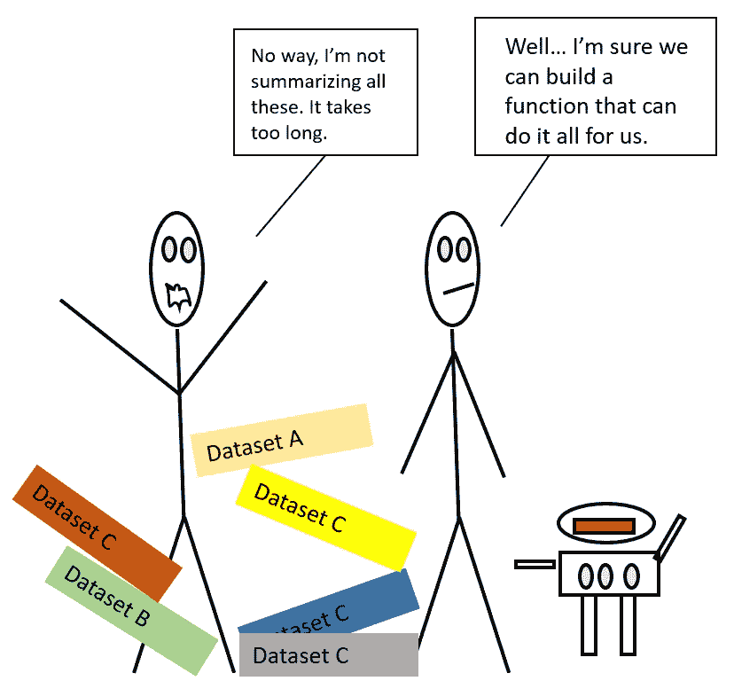
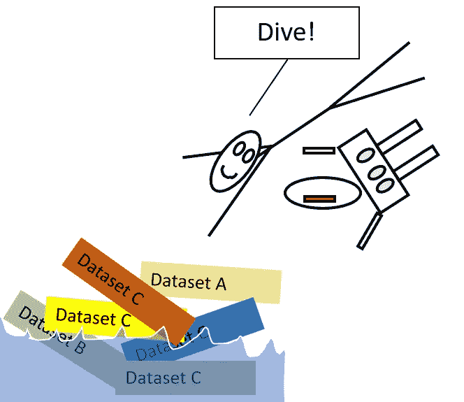
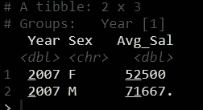
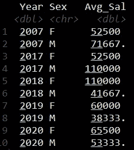

# 创建和使用 R 函数

> 原文：<https://towardsdatascience.com/functions-in-r-3648eec4bcf9?source=collection_archive---------39----------------------->

## 关于如何使用它们的基础知识


照片由 [Unsplash](https://unsplash.com?utm_source=medium&utm_medium=referral) 上的[米娜 FC](https://unsplash.com/@mina_fc?utm_source=medium&utm_medium=referral) 拍摄

你经历过下面这种情况吗？



作者图片

我似乎总是碰到它。也许只是我的运气…

我喜欢函数。我喜欢建造它们，和它们一起工作，创造它们。没有什么比有人说一项任务需要一周时间更好的了，但是实际上，你知道它可能在 10 分钟内就能完成。

功能很棒。就像小机器人一样，它们可以把你从错误和重复的工作中拯救出来。如果你还没有看过我写的关于在 Power BI 中使用函数的文章，[在这里。](/functions-in-power-bi-56e9e11e4669?source=friends_link&sk=32f65f6e5196dbd96ed43a53584ad2fc)它将为你提供使用函数的基本知识，如果你使用平面文件，它很可能会节省你大量的时间。

我们用的很多东西已经是函数了。我们只是不去想它。

以 R 中的均值函数为例，它先取函数名，然后取输入。所以 mean()是一个函数。与 Power BI 非常相似，AVERAGE([列名])是一个函数。

在这篇文章中，我希望我能向你展示如何用 r 中的函数做一些工作。

让我们开始吧！



作者图片

我主要处理大量平面文件(如果有一天我可以连接到数据仓库，那就太好了，但那是另一回事了)。

我想在 r 中对一组平面文件执行一组转换，我们该怎么做呢？

不难。这非常类似于我们如何创建 Power BI 函数。关键是我们需要对一个文件执行一组转换，并将其设置为构建我们功能的原型。

首先，让我们使用 *setwd* 设置我们的工作目录并加载我们的包。我们将使用 **tidyverse** 和 **rlist** 。

需要设置工作目录，因为 R 需要知道它正在工作的文件夹。r 需要知道将文件导出到哪里，以及从哪里读取文件。我们将把我们的工作目录分配给一个变量调用 **File_Directory**

```
library(tidyverse) #loading packages
library(rlist)File_Directory = setwd("Your folder containing your files") 
#setting up the work directory
```

现在，让我们使用 rlist 的 package *list.filter* 函数和 *str_detect* 来过滤。csv”平面文件。我们将把它赋给变量 **All_Files** 。

```
library(tidyverse) #loading packages
library(rlist)File_Directory = setwd("Your folder containing your files") 
#setting up the work directory All_Files = File_Directory %>% 
  list.files() %>% 
  list.filter(str_detect(., ".csv")) //just want the csv files and the "." here is a place holder for the output in the list.files.
```

*list.files* 返回 File_Directory 变量中所有文件的名称。然后 *list.filter* 用 *str_detect* 对 csv 文件进行过滤。此外，如果您不熟悉% > %,它被称为“管道”，它将结果从一行传输到另一行。

All_Files 的结果是我们想要清除的文件名的列表。

这是关键——我们需要手动加载其中一个文件，并应用我们的转换步骤。

我想按年份和性别分组，按平均工资汇总。这些是我想应用于所有文件的转换步骤。

```
Dataset_2007 %>% # I manually loaded this file from Import Dataset on R Studio
  group_by(Year,Sex) %>% 
  summarize(Avg_Sal = mean(Salary, na.rm = T))
```

让我们检查它是否工作。您必须选择脚本并按下 cntrl+R 来运行脚本。



作者图片

它工作了。

既然原型起作用了，那就把它变成函数吧。

```
My_Function = function(X) {
  read_csv(X) %>% 
    group_by(Year, Sex) %>% 
    summarize(Avg_Sal = mean(Salary))
} 
```

这里我们添加了 read_csv ,因为我们希望我们的函数读取目录中的文件并应用转换。

这样做比把每个文件都加载到 R Studio 中更有效率。我们可以把这个函数叫做 **My_Function** 。我对函数名没什么想象力。

在这里，该函数采用“X”作为我们的输入，使用 *read_csv* 读取文件，然后将表传递到下一行，即 *group_by、*，然后*根据平均工资汇总*。

这里它读取 X，这是我们所有文件中的第一个文件，并执行集合转换，等等。

现在让我们使用这个函数并应用到 All_Files 变量中的所有文件。记住变量 All_Files 在一个列表中保存我们的文件名。

在 R 中，有一个简洁的小东西叫做 *map* ，基本上， *map* 接受你的函数并把它映射到你所有的输入，你也可以选择返回一个数据框、一个列表或其他东西中的所有结果。使用 map 超出了本文的范围，但是让我们在这里使用 *map_df* 。 *map_df* 代表地图数据帧。

```
map_df(All_Files, My_Function)
```

以下是数据框中的结果。



作者图片

现在您可以选择使用 r 中的 *write.csv* 调用将结果导出到 csv 格式的同事。

```
map_df(All_Files, My_Function) %>%
write.csv("My_Results.csv", row.names = F)
```

这是所有的一切。

```
library(tidyverse) #loading packages
library(rlist)File_Directory = setwd("Your folder containing your files") 
#setting up the work directoryAll_Files = File_Directory %>% 
  list.files() %>% 
  list.filter(str_detect(., ".csv")) #filtering for csvDataset_2007 %>% # function prototype
  group_by(Year,Sex) %>% 
  summarize(Avg_Sal = mean(Salary, na.rm = T))My_Function = function(X) {
  read_csv(X) %>% 
    group_by(Year, Sex) %>% 
    summarize(Avg_Sal = mean(Salary))
} #creating the functionmap_df(All_Files, My_Function) %>%
write.csv("My_Results.csv", row.names = F) #mapping it exporting to a csv file call My_Results
```

这只是在 r 中使用函数的一个非常简单的例子。

老实说，生活中的事情从来不会这样发展。总会在某个地方打嗝。您今天可能会尝试这样做，并意识到您的数据集都在不同的列中，您必须首先清理它。也许一个包不会为你加载。可能是电脑的问题。

总会有问题需要解决。

我希望你保持鼓励，保持安全，并在你的旅程中继续前进！