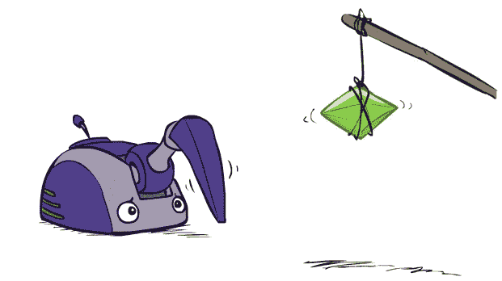
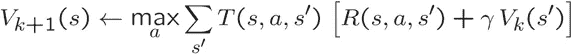
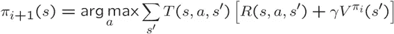
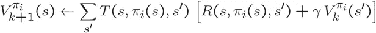
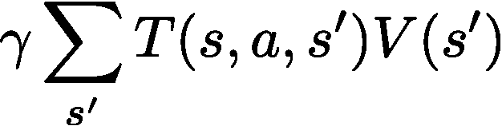
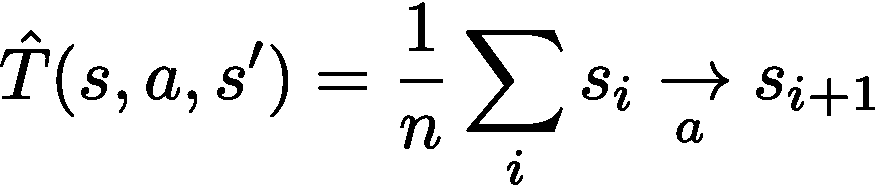
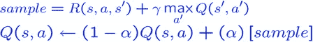

# 强化学习的基本迭代方法

> 原文：<https://towardsdatascience.com/fundamental-iterative-methods-of-reinforcement-learning-df8ff078652a?source=collection_archive---------19----------------------->

## 学习价值和策略迭代能掌握多少强化学习？很多。

本文着重于理解基本的 MDP(在这里简单回顾一下),并将其应用于与基本强化学习方法的关系。我将重点介绍的方法是**值迭代**和**策略迭代**。这两种方法支撑了 **Q 值迭代**，直接导致 **Q 学习**。

来源——加州大学伯克利分校 CS188。

可以在这之前，或者之后看的我的一些相关文章(有意独立):

1.  什么是马尔可夫决策过程？
2.  [强化学习的隐藏线性代数。](/the-hidden-linear-algebra-of-reinforcement-learning-406efdf066a)

> Q-Learning 开启了我们正在进行的深度强化学习浪潮，因此它是强化学习学生手册中的一个重要部分。

# 回顾马尔可夫决策过程

马尔可夫决策过程是支持强化学习的随机模型。如果你熟悉，你可以跳过这一部分，但是我增加了解释为什么每个元素在*强化学习环境*中都很重要。

## 定义(对 RL 有影响)

*   一组状态 **s ∈ S** ，动作 **a ∈ A** 。状态和动作是代理所有可能的位置和动作的集合。 ***在高级强化学习*** *中，状态和动作变得连续，这就需要我们重新思考算法。*
*   一个转移函数 **T(s，a，s’)**。给定当前位置和提供的动作，*决定下一个状态跟随的频率。 ***在强化学习*** *中，我们不再能够访问这个函数，所以这些方法试图近似它或者在采样数据上学习隐含。**
*   *一个奖励函数 **R(s，a，s’)。**这个函数表示每一步获得多少奖励。 ***在强化学习*** *中，我们不再能访问这个函数，所以我们从采样值* ***r*** *中学习，引导算法探索环境，然后利用最优轨迹。**
*   *[0，1]中的折扣因子 **γ (gamma)** ，将当前(下一步)的价值调整为未来奖励。 ***在强化学习*** *中，我们不再能够访问这个函数，****γ(gamma)****通过类似贝尔曼的更新来控制大多数所有学习算法和规划优化器的收敛。**
*   *起始状态 **s0** ，也可能是终止状态。*

**

*MDP 就是一个例子。来源——我在 CS188 做的一个[讲座](https://inst.eecs.berkeley.edu/~cs188/sp20/assets/lecture/lec10.pdf)。*

## *重要的价值观*

*MDP 有两个重要的特征效用-状态值和机会节点的 q 值。任何 MDP 或 RL 值中的 ***** 表示一个 ***最优量*** 。*

*   ***一个状态的价值**:一个状态的价值是从一个状态出发的奖励的最优递归和。*
*   *一个状态、行动对的 Q 值:Q 值是与一个状态-行动对相关的折扣奖励的最优和。*

**

*最佳值与最佳动作条件 q 值相关。然后值和 q 值更新规则非常相似(加权转换、奖励和折扣因子)。顶部)值与 q 值的耦合；mid) Q 值递归，bot)值迭代。加州大学伯克利分校的 cs188。*

**

*来源—作者。*

# *走向强化学习*

## *价值迭代*

*了解所有状态的值，然后我们可以根据梯度采取行动。值迭代直接从贝尔曼更新中学习状态的值。在一些非限制性条件下，贝尔曼更新保证收敛到最优值。*

**

***学习一个政策可能比学习一个价值观更直接**。学习一个值可能需要无限长的时间才能收敛到 64 位浮点数的数值精度(想想每次迭代中常数的移动平均，从估计值 0 开始，它将永远添加越来越小的非零值)。*

## *策略迭代*

*学习与价值观一致的政策。策略学习递增地查看当前值并提取策略。因为**动作空间是有限的**，所以希望能比值迭代收敛得更快。从概念上讲，动作的最后一次改变将在小的滚动平均更新结束之前发生。策略迭代有两个步骤。*

*第一个称为**策略提取**，这是如何从一个值到一个策略——通过采取最大化超过期望值的策略。*

**

*策略提取步骤。*

*第二步是**政策评估**。策略评估采用一个策略，并根据策略运行价值迭代*。样本永远与策略联系在一起，但是我们知道*我们必须运行迭代算法来减少提取相关* ***动作*** *信息*的步骤。**

**

*政策评估步骤。*

*像值迭代一样，由于底层的贝尔曼更新，策略迭代保证收敛到最合理的 MDP。*

## *q 值迭代*

*知道最优值的问题是很难从中提炼出政策。`argmax`操作符明显是非线性的，难以优化，因此 Q 值迭代向**直接策略提取**迈进了一步。每个状态下的最优策略就是该状态下的最大 q 值。*

**

*MDP 的 q 学习。*

*大多数指令以值迭代开始的原因是，它更自然地嵌入到贝尔曼更新中。 **Q 值迭代需要将两个关键 MDP 值关系替换在一起**。这样做了之后，离 Q-learning 就差一步了，这个我们会了解的。*

# *这些迭代算法是怎么回事？*

*让我们确保你理解所有的条款。本质上，每次更新由求和后的两项组成(可能还有一个选择动作的`max`项)。让我们把括号去掉，并讨论它们与 MDP 的关系。*

**

*状态空间奖励映射。*

*第一项是对乘积 *T(s，a，s’)R(s，a，s’)的求和。*该术语代表给定状态和转换的潜在价值和可能性。 ***T*** 术语或转换，支配从转换中获得给定奖励的可能性(回忆，***a***tuple***，a，s’***确定一个元组，其中一个动作*将一个代理从状态*带到状态***s’【T42 这将做一些事情，比如用高回报来衡量低概率状态，用低回报来衡量频繁状态。******

****

**来自**数据的递归更新。****

**下一项决定了这些算法的**、**。它是迭代算法最后一步数据的一个加权— ***V*** ，上面有项。这从邻近的州提取了关于价值的信息，这样我们就可以理解长期的转变。*将这一项视为大多数递归更新发生的地方，第一项是由环境决定的加权先验。***

## **收敛条件**

**所有的迭代算法都被告知“在某些条件下收敛到最优值或策略。”你问的那些条件是什么？**

1.  ****总状态空间覆盖率**。条件是在有条件的策略下达到所有状态、动作、next_state 元组。否则，来自 MDP 的一些信息将会丢失，值可能会停留在初始值。**
2.  ****贴现因子γ < 1。**这是因为任何可以重复的循环的值都可以并且将趋向于无穷大。**

**谢天谢地，在实践中，**这些条件很容易满足**。大多数探索都有一个ε贪婪性，包括随机行动的机会，总是(因此任何行动都是可行的)，非 1 折扣因子导致更有利的性能。最终，这些算法可以在很多环境下工作，所以它们绝对值得一试。**

# **强化学习**

**我们如何把我们所看到的变成一个强化学习的问题？我们需要使用样本，而不是真正的 T(s，a，s ')和 R(s，a，s ')函数。**

## **基于样本的学习——如何解决隐藏的 MDP**

**MDPs 中的迭代方法与解决强化学习问题的基本方法之间的唯一区别是 **RL 从 MDP** 的底层转移和奖励函数中采样，而不是将其包含在更新规则中。我们需要更新两个东西，一个是对 ***T(s，a，s')*** 的替换，另一个是对 ***R(s，a，s')*** 的替换。**

**首先，让我们将转换函数近似为每个观察到的元组的**平均动作条件转换。所有我们没见过的值都用随机值初始化。这是**基于模型的强化学习**(我的研究领域)最简单的形式。****

****

**转移函数的近似。基于高级模型的强化学习研究的基础。**

**现在，剩下的就是记住如何处理奖励，对吗？但是，我们实际上对每一步都有奖励，所以我们可以侥幸逃脱(方法通过许多样本平均出正确的值)。考虑用一个采样奖励来近似 Q 值迭代方程，如下所示。**

****

**基于样本的 Q 学习(实际 RL)。**

****上式为 Q-learning** 。我们从一些填充了随机值的向量 Q(s，a)开始，然后我们收集与世界的交互并调整 alpha。α是一个学习率，所以当我们认为我们的算法收敛时，我们会降低它。**

**结果表明，Q 学习的收敛与 Q 值迭代非常相似，但我们只是在用不完整的世界观运行算法。**

***机器人和游戏中使用的 Q 学习是在更复杂的特征空间中，用神经网络逼近所有状态-动作对的大表。关于深度 Q-Learning 如何震惊世界的总结，这里有一个很棒的视频，直到我写下自己的相关文章！***

**这些是如何融合的？**

** [## 强化学习算法的收敛性

### 有什么简单的收敛界限吗？

towardsdatascience.com](/convergence-of-reinforcement-learning-algorithms-3d917f66b3b7) 

更多？订阅我关于机器人、人工智能和社会的时事通讯！

 [## 自动化大众化

### 一个关于机器人和人工智能的博客，让它们对每个人都有益，以及即将到来的自动化浪潮…

robotic.substack.com](https://robotic.substack.com/)**